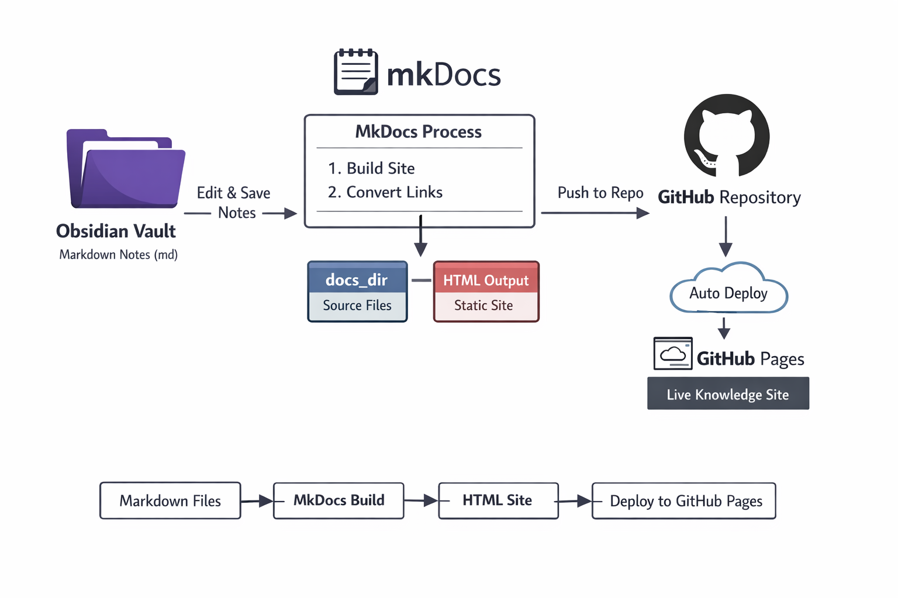

# Integrate GIT MKdocs and Obsidian

## Decide where your “source” files live
- Obsidian vault is just a folder with `.md` files.    
- MkDocs uses a `docs/` folder for the Markdown files that will become your site.    
- **Best practice:** Point MkDocs to your Obsidian vault (or a subfolder) as the `docs_dir` in `mkdocs.yml`.
Example `mkdocs.yml`:
```yaml
site_name: My Knowledge Base
docs_dir: obsidian_vault  # <-- your Obsidian vault folder
site_dir: site            # <-- where the static HTML will be generated
theme:
  name: material
```

This way, **everything you edit in Obsidian automatically updates your MkDocs site** when you run `mkdocs build` or `mkdocs serve`.
- MkDocs will mirror this folder structure as **site navigation**.    
- You can configure `mkdocs.yml` to order pages explicitly.




