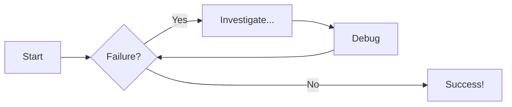
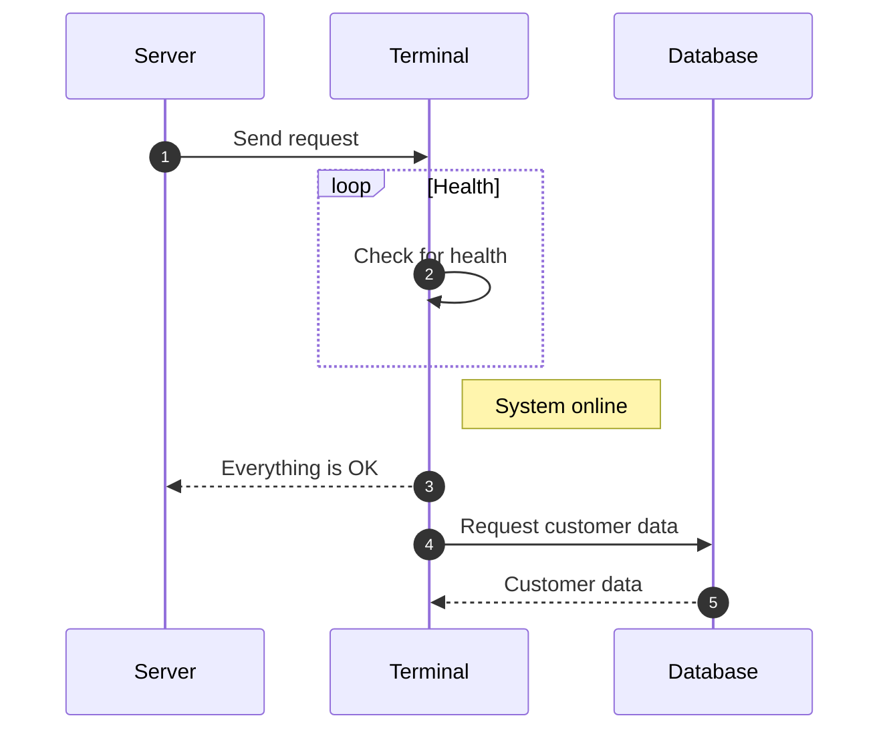

# Diagram Examples

??? note "How to enable this"

    Install the plugin and add the following to `mkdocs.yml`:

    ```bash
    pip install mkdocs-mermaid2-plugin
    ```

    ```yaml
    plugins:
      - mermaid2

    markdown_extensions:
      - pymdownx.superfences:
          custom_fences:
            - name: mermaid
              class: mermaid
              format: !!python/name:pymdownx.superfences.fence_code_format
    ```

    Then wrap diagram code in a fenced block with the `mermaid` language tag.

## Flowcharts




## Sequence Diagrams



[diagrams documentation](https://squidfunk.github.io/mkdocs-material/reference/diagrams/#using-state-diagrams)
