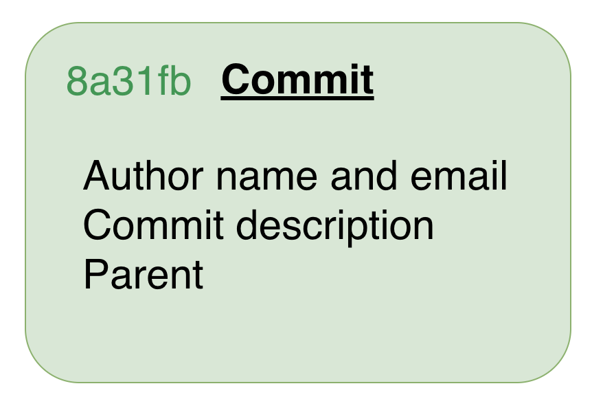
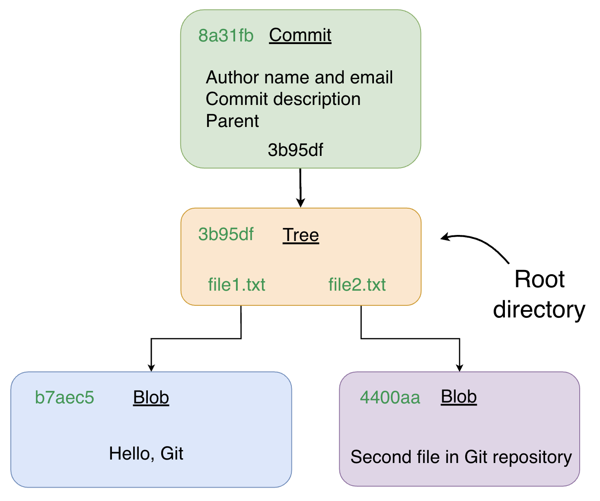
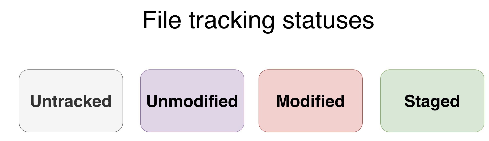
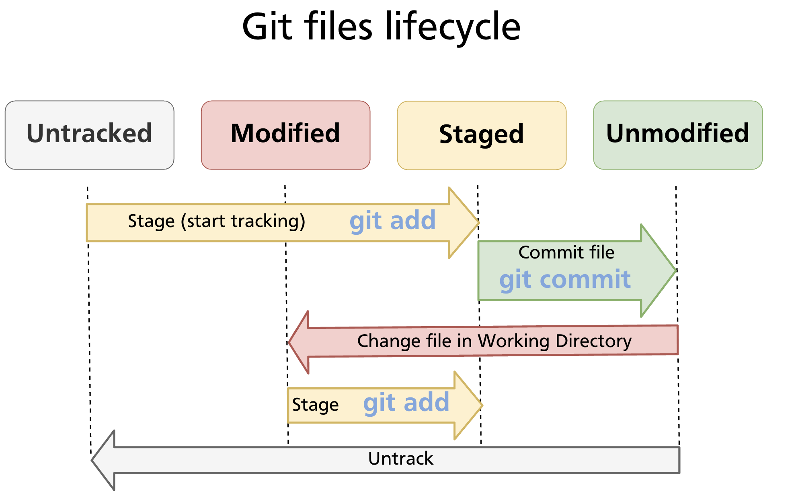
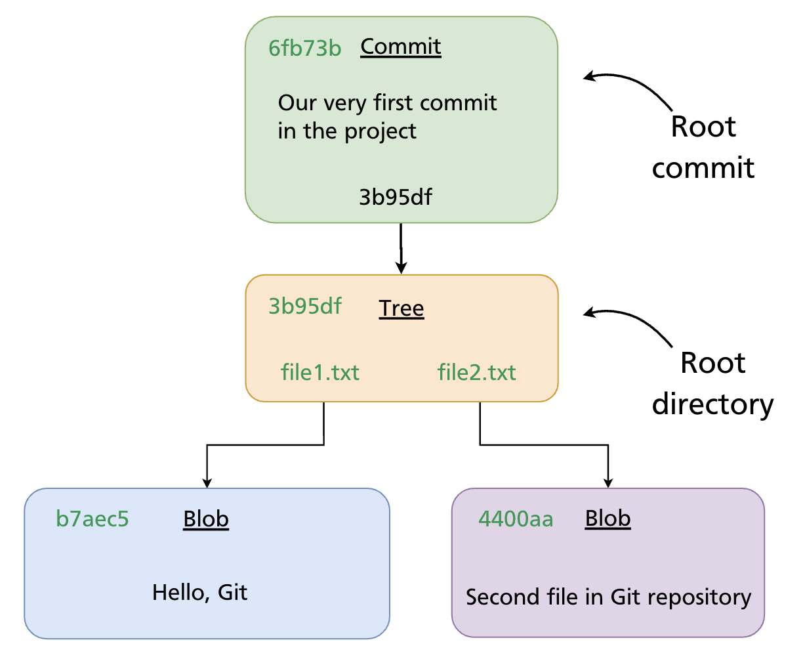
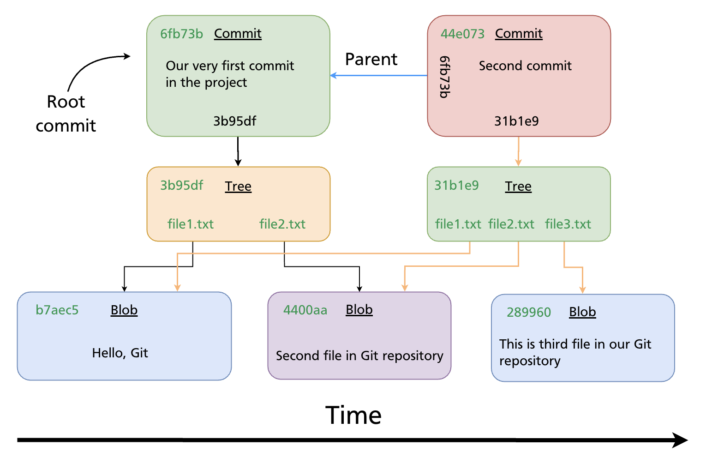

# Chapter 05 — Creating a Repository & Basic Operations

Git organises work around **repositories** and **commits**. This chapter explains what those are, shows you how to create a repository from scratch or clone an existing one, introduces the five commands you will use on every working day, and walks through making your first two commits step by step.

---

## The Three Areas

Before issuing any commands it helps to have a clear mental model of where your files live at any given moment. Git works with three distinct areas:

- **Working directory** — the folder on your filesystem where you read and edit files normally. Git watches this area but does not automatically record changes.
- **Staging area** (also called the *index*) — a preparation zone where you assemble exactly the changes you want to include in the next commit. Files must be explicitly added here before they can be committed.
- **Git repository** (the `.git` folder) — the permanent record store. Every commit you make is written here as a compressed snapshot.

A typical change moves through all three areas: you edit a file in the working directory, stage it with `git add`, and then permanently record it with `git commit`.

---

## Creating a Repository

### Initialising a New Repository

To turn any folder into a Git repository, run `git init` inside it:

```bash
mkdir my-project
cd my-project
git init
# Initialized empty Git repository in /path/to/my-project/.git/
```

Git creates a hidden `.git/` subdirectory that holds the entire history and configuration for the project. You never need to edit files inside `.git/` directly.

```bash
# Confirm Git recognises the repository
git status
# On branch main
# No commits yet
# nothing to commit (create/copy files and use "git add" to track)
```

> **Note:** On older Git installations the default branch may be called `master` rather than `main`. To set `main` as the default for all new repositories, run:
> ```bash
> git config --global init.defaultBranch main
> ```

### Cloning an Existing Repository

If you want a local copy of a repository that already exists — on GitHub or elsewhere — use `git clone`:

```bash
# Clone over HTTPS
git clone https://github.com/user/repo.git

# Clone over SSH (requires SSH key set up — see Chapter 04)
git clone git@github.com:user/repo.git

# Clone into a specific folder name
git clone https://github.com/user/repo.git my-folder
```

`git clone` creates a new directory, initialises a `.git/` folder inside it, copies the entire history, and checks out the default branch. The remote is automatically registered as `origin`.

> **Further reading:** [`git init` documentation](https://git-scm.com/docs/git-init) · [`git clone` documentation](https://git-scm.com/docs/git-clone)

---

## The Commit Object

Every time you run `git commit`, Git creates a **commit object** and stores it in the repository. A commit object contains:

- **Author** — name and email of the person who wrote the change
- **Committer** — name and email of the person who recorded it (often the same as the author)
- **Timestamp** — when the commit was made
- **Commit message** — a description of the change
- **Parent** — the SHA of the previous commit (empty for the very first, or *root*, commit)
- **Tree pointer** — a SHA referencing a tree object that represents the project snapshot



### Commit → Tree → Blobs

A **tree object** is Git's representation of a directory: it lists filenames alongside the SHA of each **blob object** (file content). This three-level structure means Git stores the full state of every file in the project at the time of the commit.



Because every object is identified by a SHA computed from its content, identical files across different commits share the same blob — Git never stores the same content twice.

> **Further reading:** [Git Objects — Pro Git book](https://git-scm.com/book/en/v2/Git-Internals-Git-Objects)

---

## Core Commands at a Glance

| Command | What it does |
|---|---|
| `git status` | Shows the current state of the working directory and staging area |
| `git add` | Moves changes from the working directory into the staging area |
| `git commit` | Writes a snapshot of the staging area into the repository |
| `git log` | Displays the commit history for the current branch |
| `git checkout` | Switches to a different branch or restores files from a commit |

You will use these five commands in every working session. The sections below show each one in context.

---

## File States & the Lifecycle

Every file in a Git repository is always in one of four states:

| State | Meaning |
|---|---|
| **Untracked** | Git has never seen this file — it exists in the working directory only |
| **Unmodified** | The file matches its last committed version |
| **Modified** | The file has been changed since the last commit, but not yet staged |
| **Staged** | The change has been added to the staging area and is ready to commit |



### State Transitions

Files move between states in response to your commands:

- **Untracked → Staged:** `git add <file>` — starts tracking the file and stages it.
- **Staged → Unmodified:** `git commit` — writes the staged snapshot; the working copy now matches the repository.
- **Unmodified → Modified:** edit the file in your editor or terminal — Git detects the change automatically.
- **Modified → Staged:** `git add <file>` again — stages the updated version.
- **Any state → Untracked:** `git rm --cached <file>` — removes the file from tracking without deleting it from the working directory.



> **Tip:** Run `git status` at any point to see exactly which files are in which state.

---

## Practical Walkthrough: From Empty Folder to Two Commits

The following example builds on an empty repository and shows the full loop from creating files to viewing history.

### Step 1 — Initialise and create the first files

```bash
mkdir demo-project && cd demo-project
git init

# Create two files
echo "Hello, Git" > file1.txt
echo "Second file in Git repository" > file2.txt

git status
# Untracked files:
#   file1.txt
#   file2.txt
```

### Step 2 — Stage and make the root commit

```bash
git add file1.txt file2.txt
git status
# Changes to be committed:
#   new file: file1.txt
#   new file: file2.txt

git commit -m "Our very first commit in the project"
# [main (root-commit) 6fb73b] Our very first commit in the project
#  2 files changed, 2 insertions(+)
```

After this commit Git has recorded a **root commit** — the starting point of the history. It contains no parent reference.



### Step 3 — Add a third file and make a second commit

```bash
echo "This is the third file in our Git repository" > file3.txt

git status
# Untracked files:
#   file3.txt

git add file3.txt
git commit -m "Second commit"
# [main 44e073] Second commit
#  1 file changed, 1 insertion(+)
```

The second commit records `file3.txt` alongside the unchanged `file1.txt` and `file2.txt`. Its parent field points to the root commit SHA.



### Step 4 — View the history

```bash
git log
# commit 44e073... (HEAD -> main)
# Author: Your Name <you@example.com>
# Date:   ...
#
#     Second commit
#
# commit 6fb73b...
# Author: Your Name <you@example.com>
# Date:   ...
#
#     Our very first commit in the project
```

For a compact view:

```bash
git log --oneline
# 44e073 Second commit
# 6fb73b Our very first commit in the project
```

---

## Summary

- A Git repository has three areas: the **working directory**, the **staging area**, and the **repository** itself.
- `git init` creates a new repository; `git clone` copies an existing one.
- Every commit is an object storing author, message, parent SHA, and a pointer to a tree of file snapshots.
- Files cycle through four states — Untracked, Unmodified, Modified, Staged — driven by `git add` and `git commit`.
- The core daily loop is: edit → `git add` → `git commit` → repeat.

> **Further reading:** [Git Basics — Pro Git book](https://git-scm.com/book/en/v2/Git-Basics-Getting-a-Git-Repository)

---

*Previous: [Chapter 04 — GitHub Authentication (SSH, PATs, gh CLI)](../part1/ch04-github-authentication.md)* · *Next: [Chapter 06 — Tracking Files & File States](ch06-file-states.md)*
