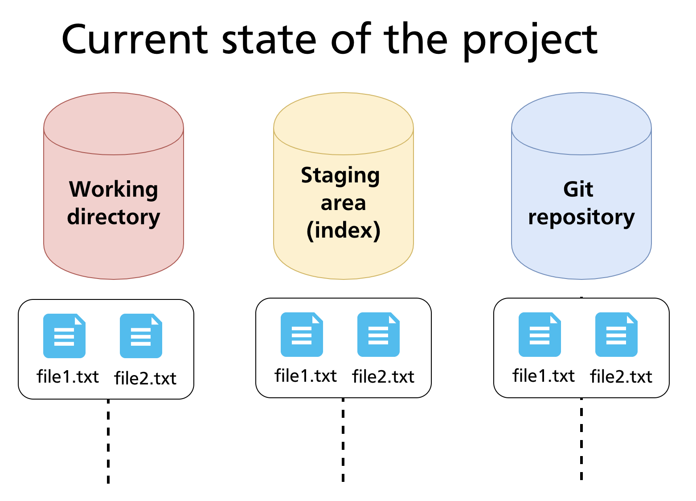
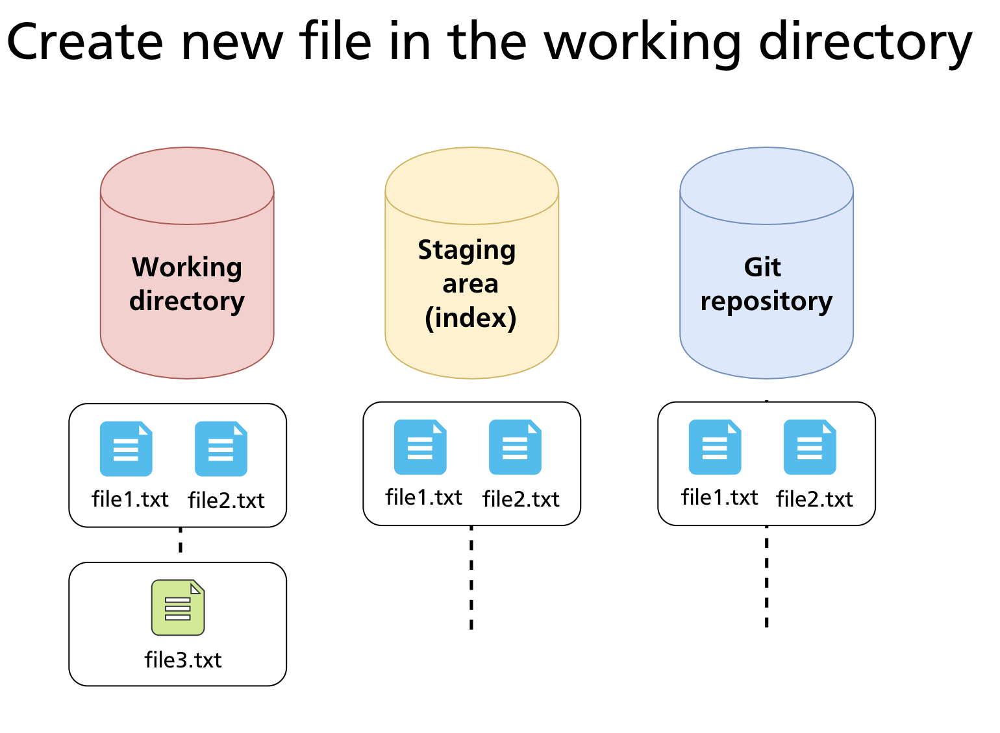

# Chapter 06 — Tracking Files & File States

Chapter 05 introduced the four file states — Untracked, Unmodified, Modified, Staged — and the commands that drive the basic loop. This chapter goes deeper: it explains how to read Git's status output in detail, how to stage exactly the changes you want, how to inspect differences before committing, and how to undo staging or discard working-directory changes safely.

---

## Reading `git status` Output

`git status` is the most frequently used Git command. It shows the current state of every file in the repository relative to the last commit and the staging area.

A typical output has up to three sections:

```bash
git status
# On branch main
# Changes to be committed:
#   (use "git restore --staged <file>..." to unstage)
#         modified:   README.md
#
# Changes not staged for commit:
#   (use "git add <file>..." to update what will be committed)
#   (use "git restore <file>..." to discard changes in working directory)
#         modified:   src/app.js
#
# Untracked files:
#   (use "git add <file>..." to include in what will be committed)
#         notes.txt
```

| Section | Meaning |
|---|---|
| **Changes to be committed** | Files in the staging area — will be included in the next `git commit` |
| **Changes not staged for commit** | Files that are tracked and have been modified, but not yet staged |
| **Untracked files** | Files Git has never seen before; not included in commits until staged |

When all three areas are in sync — every tracked file is committed and nothing is staged — `git status` reports:

```bash
nothing to commit, working tree clean
```

### Short-Form Status

For a compact view, use `-s` (short):

```bash
git status -s
#  M src/app.js    # modified in working dir, not staged
# M  README.md     # staged
# ?? notes.txt     # untracked
# A  newfile.py    # new file, staged
```

The two-character code works as two columns: the **left column** reflects the staging area; the **right column** reflects the working directory. Common codes:

| Code | Meaning |
|---|---|
| `M` (left) | Staged modification |
| `M` (right) | Unstaged modification |
| `A` | Staged new file |
| `D` | Deleted |
| `??` | Untracked |
| `R` | Renamed |

---

## The Three-Area Model in Practice

At any moment, files exist across the three areas. The diagram below shows a repository after two commits where `file1.txt` and `file2.txt` are fully committed and consistent across all three areas.



When a new file is created in the working directory, it starts as **Untracked** — visible to the filesystem but invisible to Git until explicitly staged.



---

## Staging Files

### Stage a specific file

```bash
git add README.md
```

### Stage all changes in a directory

```bash
git add src/
```

### Stage all changes in the current directory tree

```bash
git add .
```

This stages new files, modifications, and deletions within the current directory and its subdirectories. It does **not** stage changes outside the current directory.

### Stage all changes in the entire repository

```bash
git add -A
# equivalent: git add --all
```

Unlike `git add .`, this operates from the repository root regardless of where you run it.

### Stage individual hunks interactively

```bash
git add -p
# equivalent: git add --patch
```

This walks you through each changed block (hunk) in your working directory and lets you decide whether to stage it. Options at each hunk:

| Key | Action |
|---|---|
| `y` | Stage this hunk |
| `n` | Skip this hunk |
| `s` | Split into smaller hunks |
| `e` | Edit the hunk manually |
| `q` | Quit; stop reviewing |
| `?` | Show help |

`git add -p` is particularly useful when a file contains two unrelated changes and you want to commit them separately — keeping each commit focused on a single concern.

> **Further reading:** [`git add` documentation](https://git-scm.com/docs/git-add)

---

## Inspecting Differences

Before committing, it is good practice to review exactly what is changing. Git provides three comparison modes:

### Working directory vs staging area

```bash
git diff
```

Shows what has changed in tracked files that are *not yet staged*. If all changes are staged, this produces no output.

### Staging area vs last commit

```bash
git diff --staged
# equivalent: git diff --cached
```

Shows what *is* staged and will be included in the next commit. This is the most useful command to run immediately before `git commit`.

### All changes since last commit

```bash
git diff HEAD
```

Shows the combined diff of staged and unstaged changes relative to the last commit.

### Diff for a specific file

```bash
git diff src/app.js
git diff --staged README.md
```

### Diff between two commits

```bash
git diff abc123 def456
git diff main feature-branch
```

> **Further reading:** [`git diff` documentation](https://git-scm.com/docs/git-diff)

---

## Unstaging Changes

If you staged a file by mistake, move it back to the working directory without losing your edits:

### Modern syntax (Git 2.23+)

```bash
git restore --staged <file>
```

### Legacy syntax (still widely documented)

```bash
git reset HEAD <file>
```

Both commands move the file from **Staged → Modified** — the changes remain in your working directory, they are simply no longer queued for the next commit.

---

## Discarding Working Directory Changes

To throw away uncommitted changes in the working directory and revert a file to its last committed state:

### Modern syntax (Git 2.23+)

```bash
git restore <file>
```

### Legacy syntax

```bash
git checkout -- <file>
```

> **Warning:** This operation is **irreversible**. Changes discarded this way are not recoverable via Git — they were never committed, so there is no snapshot to restore from. Only use this when you are certain you do not need the changes.

To discard all working-directory changes at once:

```bash
git restore .
```

---

## Removing and Renaming Files

### Remove a tracked file

```bash
git rm notes.txt
```

This deletes `notes.txt` from the working directory *and* stages the deletion. The file will be absent from the repository after the next commit.

### Stop tracking without deleting from disk

```bash
git rm --cached notes.txt
```

Removes `notes.txt` from Git's tracking (and from the staging area) but leaves the file on disk. This is the correct approach when you realise a file should have been in `.gitignore` from the start. After running this, add the file to `.gitignore` so it does not reappear as untracked.

### Rename or move a file

```bash
git mv old-name.txt new-name.txt
git mv src/utils.js lib/utils.js
```

`git mv` renames the file on disk and stages the rename in a single step. It is equivalent to:

```bash
mv old-name.txt new-name.txt
git rm old-name.txt
git add new-name.txt
```

Git detects renames automatically by comparing file content, so the history of `old-name.txt` remains accessible under the new name.

> **Further reading:** [`git rm` documentation](https://git-scm.com/docs/git-rm) · [`git mv` documentation](https://git-scm.com/docs/git-mv)

---

## Practical Walkthrough

The following example starts from a clean repository with two committed files and works through staging, inspection, and committing a new file alongside an edit to an existing one.

### Setup — committed state

```bash
# Assume file1.txt and file2.txt are committed
git status
# nothing to commit, working tree clean
```

### Step 1 — create a new file and edit an existing one

```bash
echo "Third file content" > file3.txt
echo "Updated content" >> file1.txt

git status
# Changes not staged for commit:
#         modified:   file1.txt
# Untracked files:
#         file3.txt
```

### Step 2 — inspect what changed

```bash
git diff
# diff --git a/file1.txt b/file1.txt
# ...
# +Updated content
```

`file3.txt` does not appear in `git diff` — it is untracked, so there is no previous version to compare against.

### Step 3 — stage selectively

```bash
# Stage only file3.txt for now
git add file3.txt

git status -s
# AM file3.txt     # staged (A), but also modified? No — new file fully staged
#  M file1.txt     # modified but not staged
```

### Step 4 — review what will be committed

```bash
git diff --staged
# diff --git a/file3.txt b/file3.txt
# new file mode 100644
# +Third file content
```

Only `file3.txt` is staged — `file1.txt`'s changes are not yet included.

### Step 5 — commit the staged file only

```bash
git commit -m "Add file3.txt"
# [main 7a3c1f] Add file3.txt
#  1 file changed, 1 insertion(+)
```

`file1.txt` remains modified but unstaged, ready to be included in a future commit.

### Step 6 — stage and commit the edit

```bash
git add file1.txt
git diff --staged
# shows the file1.txt changes
git commit -m "Update file1.txt"
```

---

## Summary

- `git status` shows which files are staged, unstaged, or untracked; use `-s` for a compact view.
- `git add` has multiple forms: by file, by directory, `.` (current tree), `-A` (whole repo), `-p` (interactive hunks).
- `git diff` compares the working directory to the staging area; `git diff --staged` compares the staging area to the last commit.
- `git restore --staged` unstages without losing changes; `git restore` discards working-directory changes irreversibly.
- `git rm --cached` stops tracking a file without deleting it from disk; `git mv` renames and stages in one step.

---

*Previous: [Chapter 05 — Creating a Repository & Basic Operations](ch05-basic-operations.md)* · *Next: [Chapter 07 — Ignoring Files (.gitignore)](ch07-gitignore.md)*
