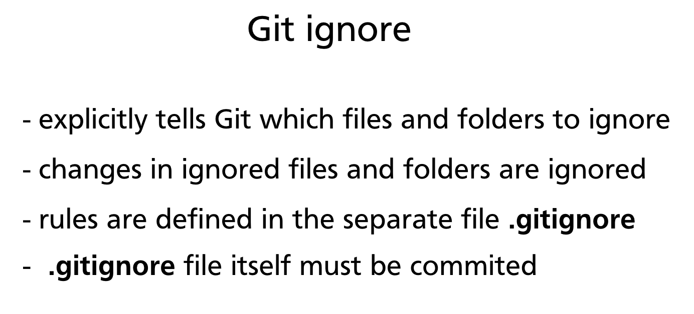
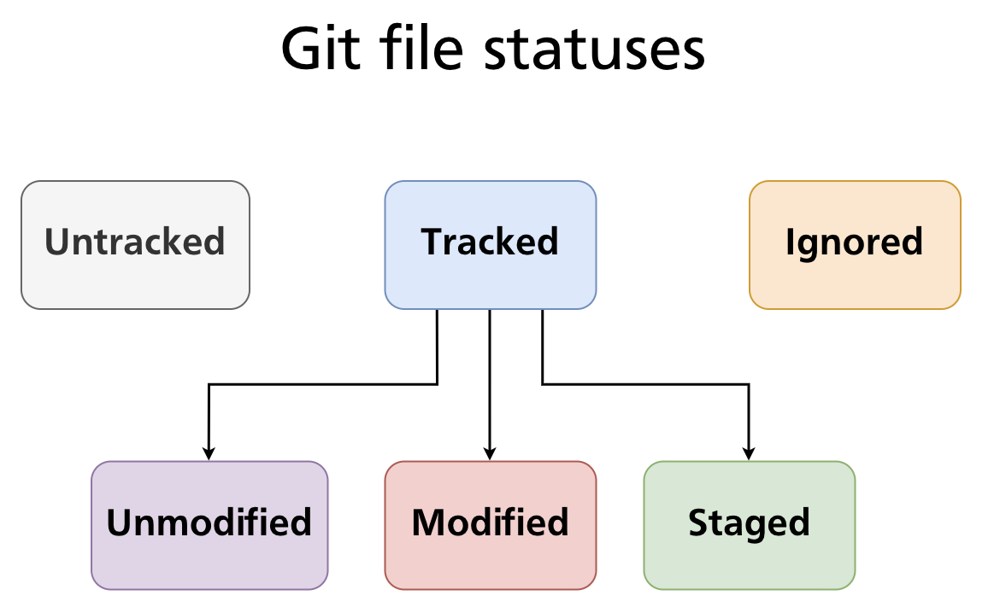
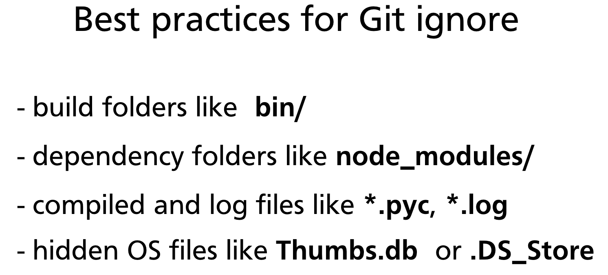

# Chapter 07 — Ignoring Files (.gitignore)

Not every file in a project folder belongs in version control. Build artefacts, dependency trees, compiled outputs, log files, and secrets should stay out of the repository — they are either reproducible, too large, or dangerous to share. Git provides a simple, powerful mechanism for this: the `.gitignore` file.



---

## What .gitignore Does

A `.gitignore` file explicitly tells Git which files and directories to ignore. Files matching patterns in `.gitignore` are treated as if they do not exist from Git's perspective:

- They will not appear as **Untracked** in `git status`.
- They cannot be staged with `git add`.
- They will never be included in a commit.

The `.gitignore` file itself is a plain text file that must be **committed to the repository** so the same rules apply to every contributor on every machine.



---

## Creating a .gitignore File

Create the file at the root of your repository:

```bash
touch .gitignore
```

Then open it in any text editor and add your patterns — one per line. Stage and commit it like any other file:

```bash
git add .gitignore
git commit -m "Add .gitignore"
```

---

## Pattern Syntax

`.gitignore` uses a glob-style pattern language. Understanding it fully prevents surprises.

### Literal filenames

Matches any file with exactly that name, anywhere in the repository tree:

```gitignore
secrets.env
debug.log
```

### Wildcards

| Pattern | Matches |
|---|---|
| `*` | Any sequence of characters, not including `/` |
| `?` | Any single character, not including `/` |
| `**` | Any path component, including `/` (matches across directories) |

```gitignore
*.log          # all .log files anywhere
*.py[cod]      # .pyc, .pyo, .pyd files
**/logs/       # any folder named logs at any depth
doc/**/*.txt   # all .txt files under doc/ at any depth
```

### Directory patterns

A trailing slash restricts the pattern to directories only:

```gitignore
build/         # ignore the build/ directory and everything inside it
node_modules/  # ignore Node.js dependencies
.venv/         # ignore Python virtual environment
```

Without the trailing slash, `build` would also match a file literally named `build`.

### Negation

A leading `!` re-includes a file that was excluded by an earlier pattern:

```gitignore
*.log          # ignore all log files
!important.log # …except this one
```

Negation patterns must appear **after** the pattern they override — order matters. Note that you cannot re-include a file inside an ignored directory; once a directory is ignored, its contents cannot be un-ignored.

### Anchoring to the repository root

A leading `/` anchors the pattern to the repository root, preventing it from matching in subdirectories:

```gitignore
/TODO          # ignores only /TODO at the root, not src/TODO
*.env          # ignores .env anywhere in the tree
/.env          # ignores only /.env at the root
```

### Comments

Lines beginning with `#` are comments:

```gitignore
# OS metadata
.DS_Store
Thumbs.db
```

### Pattern precedence

Within a single `.gitignore` file, later rules override earlier ones. Across multiple `.gitignore` files at different directory levels, the file closest to the matched path takes precedence.

> **Further reading:** [gitignore pattern format — Git documentation](https://git-scm.com/docs/gitignore#_pattern_format)

---

## Common Ignore Categories

These categories cover the vast majority of what should be excluded from most projects.



### Build output

```gitignore
bin/
dist/
build/
out/
target/       # Java/Rust build output
*.class       # Java compiled bytecode
*.o           # C/C++ object files
*.a           # static libraries
```

### Dependency folders

```gitignore
node_modules/  # Node.js
vendor/        # Go, PHP (Composer)
.venv/         # Python virtual environments
venv/
__pycache__/
*.pyc
*.pyo
```

### Log and temporary files

```gitignore
*.log
logs/
*.tmp
*.swp          # Vim swap files
*~             # Emacs backup files
```

### Operating system metadata

```gitignore
# macOS
.DS_Store
.AppleDouble
.LSOverride

# Windows
Thumbs.db
desktop.ini
ehthumbs.db
```

### Editor and IDE files

```gitignore
# JetBrains (IntelliJ, PyCharm, WebStorm, etc.)
.idea/

# Visual Studio Code
.vscode/

# Eclipse
.project
.classpath
.settings/

# Xcode
*.xcworkspace
```

### Secrets and local configuration

```gitignore
.env
.env.local
.env.*.local
*.pem
*.key
config.local.*
secrets.yaml
```

> **Important:** Once a secret is committed to a repository — even briefly — it should be considered compromised. Rotate the credential immediately. `.gitignore` only prevents *future* commits; it does not erase history.

---

## gitignore Scopes

There are four places Git looks for ignore rules, evaluated in order:

| Scope | File location | Tracked? | Applies to |
|---|---|---|---|
| **Repository** | `<repo-root>/.gitignore` | Yes | All contributors |
| **Subdirectory** | `<subdir>/.gitignore` | Yes | Files within that subtree only |
| **Global** | `~/.gitignore_global` (configurable) | No | All repos on your machine |
| **Local** | `<repo-root>/.git/info/exclude` | No | Your machine only, this repo |

### Setting up a global .gitignore

Use this for personal IDE files or OS metadata that you do not want to commit to every repository:

```bash
# Create the file
touch ~/.gitignore_global

# Tell Git where it is
git config --global core.excludesFile ~/.gitignore_global
```

Then add your machine-specific patterns to `~/.gitignore_global`. Your team's repositories stay clean without those rules appearing in the project's tracked `.gitignore`.

---

## Ignoring an Already-Tracked File

Adding a pattern to `.gitignore` does **not** retroactively ignore files that Git is already tracking. If a file was committed before the ignore rule was added, Git will continue to track and show changes to it.

The correct process to stop tracking a file:

```bash
# Step 1 — remove from tracking (keeps the file on disk)
git rm --cached secrets.env

# Step 2 — add the pattern to .gitignore
echo "secrets.env" >> .gitignore

# Step 3 — commit both changes together
git add .gitignore
git commit -m "Stop tracking secrets.env; add to .gitignore"
```

After this commit, `secrets.env` remains on disk but Git ignores all future changes to it.

> **Cross-reference:** `git rm --cached` is covered in detail in [Chapter 06 — Tracking Files & File States](ch06-file-states.md).

---

## Using gitignore Templates

Starting from scratch is rarely necessary. GitHub maintains a curated collection of `.gitignore` templates for hundreds of languages, frameworks, and tools:

- **[github.com/github/gitignore](https://github.com/github/gitignore)** — the authoritative template repository
- When creating a new repository on GitHub, you can select a `.gitignore` template from a dropdown — it is pre-populated for your chosen language

Many code editors also generate an appropriate `.gitignore` automatically when you create a new project (e.g., `create-react-app`, `dotnet new`, `cargo new`).

---

## Practical Example

The following example sets up a Node.js project and applies an appropriate `.gitignore`.

### Project structure after `npm install`

```
my-app/
├── src/
│   └── index.js
├── node_modules/    ← should be ignored (hundreds of MB)
├── .env             ← should be ignored (secrets)
├── package.json
└── package-lock.json
```

### Create the .gitignore

```bash
cat > .gitignore << 'EOF'
# Dependencies
node_modules/

# Environment variables
.env
.env.local

# Build output
dist/
build/

# Logs
*.log
npm-debug.log*

# OS metadata
.DS_Store
Thumbs.db
EOF
```

### Verify with git status

```bash
git status
# On branch main
# Untracked files:
#   .gitignore
#   package.json
#   package-lock.json
#   src/
#
# nothing added to commit but untracked files present
```

`node_modules/` and `.env` no longer appear — Git is ignoring them. Stage and commit the relevant files:

```bash
git add .gitignore package.json package-lock.json src/
git commit -m "Initial project setup"
```

### Check whether a specific file is ignored

```bash
git check-ignore -v node_modules/lodash/index.js
# .gitignore:2:node_modules/   node_modules/lodash/index.js
```

`git check-ignore -v` shows which rule in which file caused the match — invaluable for debugging unexpected ignore behaviour.

---

## Summary

- `.gitignore` tells Git which files and directories to exclude from tracking, staging, and committing.
- The file uses glob patterns: `*`, `?`, `**`, trailing `/` for directories, `!` for negation, leading `/` to anchor to the repo root.
- Commit `.gitignore` to the repository so all contributors share the same rules.
- Use a global `.gitignore` (`~/.gitignore_global`) for personal machine-specific exclusions.
- `.gitignore` only affects untracked files — use `git rm --cached` to stop tracking a file that was already committed.
- Start from a template at [github.com/github/gitignore](https://github.com/github/gitignore) rather than writing rules from scratch.

---

*Previous: [Chapter 06 — Tracking Files & File States](ch06-file-states.md)* · *Next: [Chapter 08 — Undoing Changes](ch08-undoing-changes.md)*
