# Chapter 11 — Branches and HEAD

Branching is one of Git's most powerful features and one of its most misunderstood. In many older version control systems, creating a branch meant copying the entire project — an expensive, slow operation. In Git, a branch costs almost nothing. Understanding *why* requires looking at what a branch actually is under the hood.

---

## Commits as a Chain

Every commit (except the first) points to its parent. This forms an immutable chain of history stretching back to the root commit.

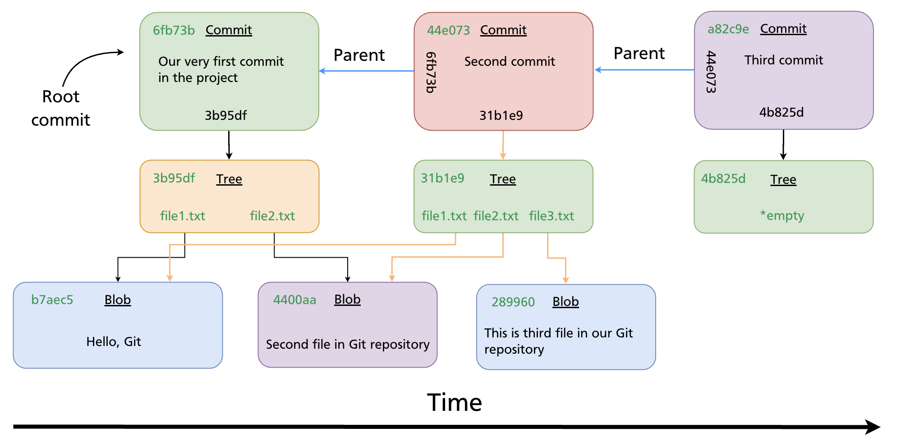

Each commit stores:
- A pointer to a **tree** (the project snapshot)
- A pointer to its **parent commit** (or two parents, in a merge)
- Author, committer, message, and timestamp

This chain is the repository's history. Branches and HEAD are simply names that point into this chain.

---

## What a Branch Is

A **branch** is nothing more than a text file containing a 40-character commit SHA. That is all.

When the `main` branch points to commit `44e073`, Git's `.git/refs/heads/main` file contains:

```
44e073...
```

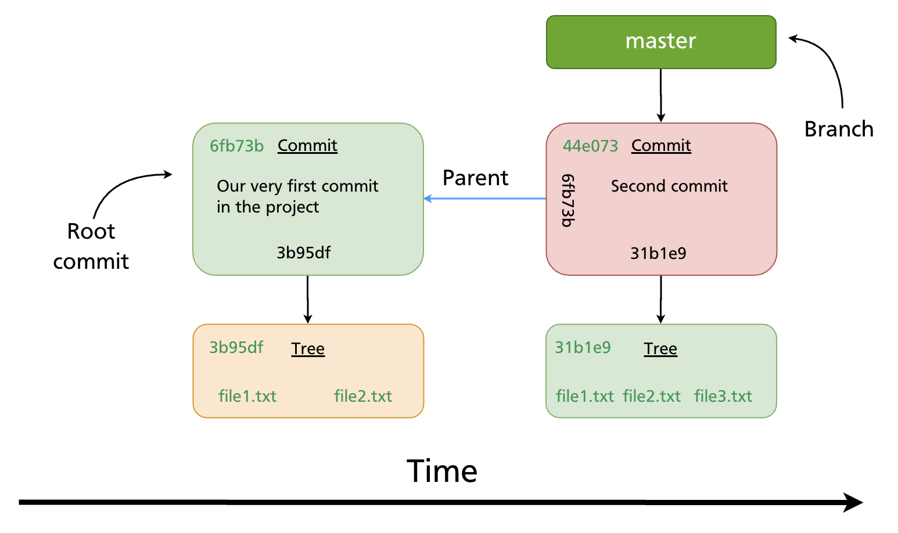

Key properties of branches (from the vault source):

1. The default branch is `main` (or `master` in older repositories)
2. Multiple branches can exist in the same repository simultaneously
3. All branch pointers are stored in `.git/refs/heads/`
4. The **current branch** tracks new commits automatically — when you commit, the branch pointer advances to the new commit
5. You switch branches with `git checkout <branch>` or `git switch <branch>`

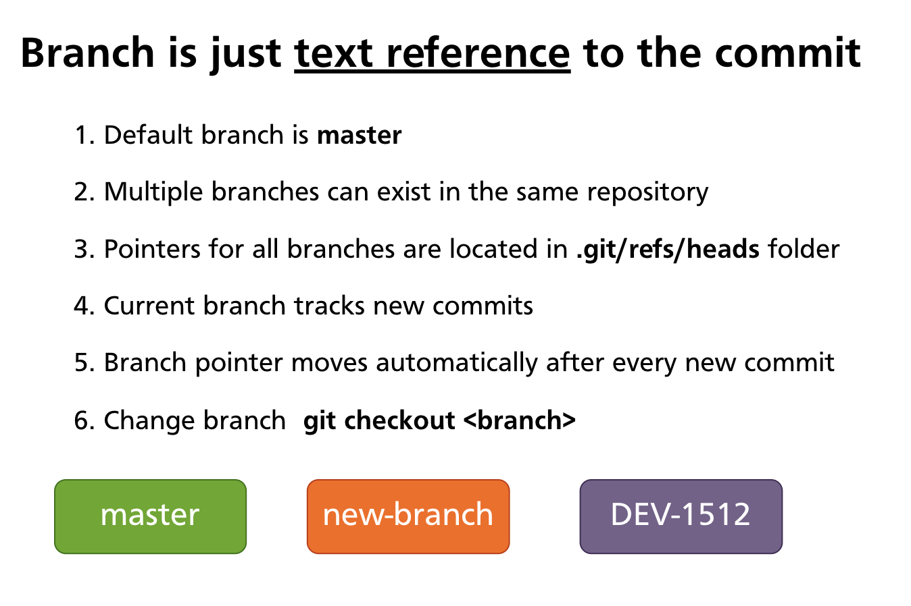

Because a branch is just a pointer, **creating a branch is instantaneous and uses almost no storage** — Git writes a single small file. This is why Git encourages frequent branching; there is no meaningful cost to it.

---

## HEAD — Your Current Position

**HEAD** is a special reference that tells Git where you are right now. It is stored in `.git/HEAD`.

Most of the time, HEAD points to a branch name (not directly to a commit). The chain is:

```
HEAD → branch → commit
```

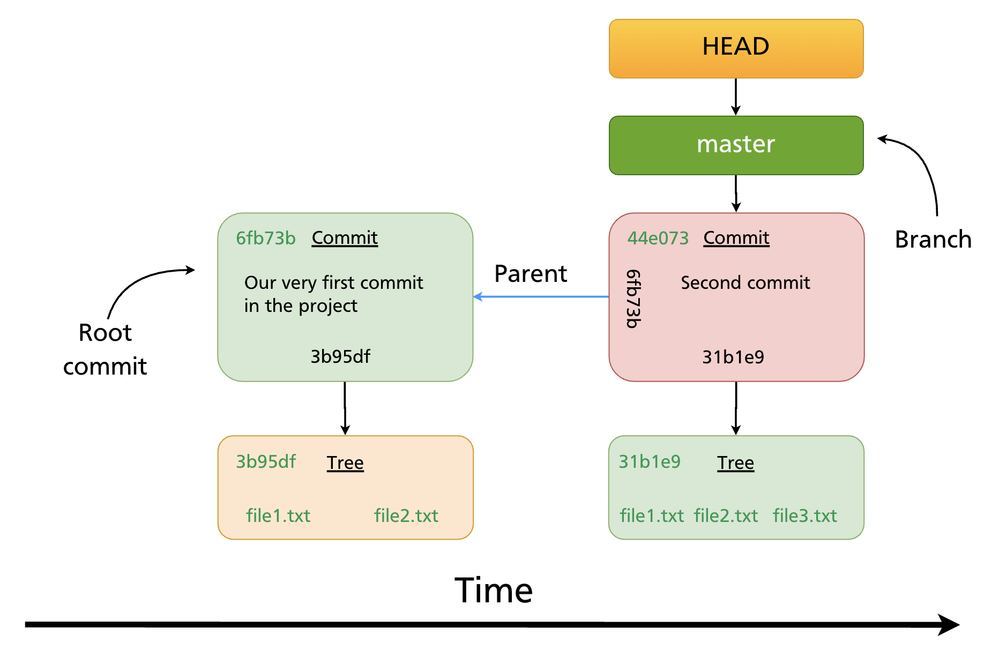

Five things to know about HEAD:

1. HEAD is **locally significant** — it only exists on your machine
2. The pointer is stored in `.git/HEAD`
3. By default its content is `ref: refs/heads/main` (or `master`)
4. `git checkout <branch>` changes HEAD to point to that branch
5. `git checkout <sha>` points HEAD directly at a commit (this is *detached HEAD* — covered in Chapter 16)

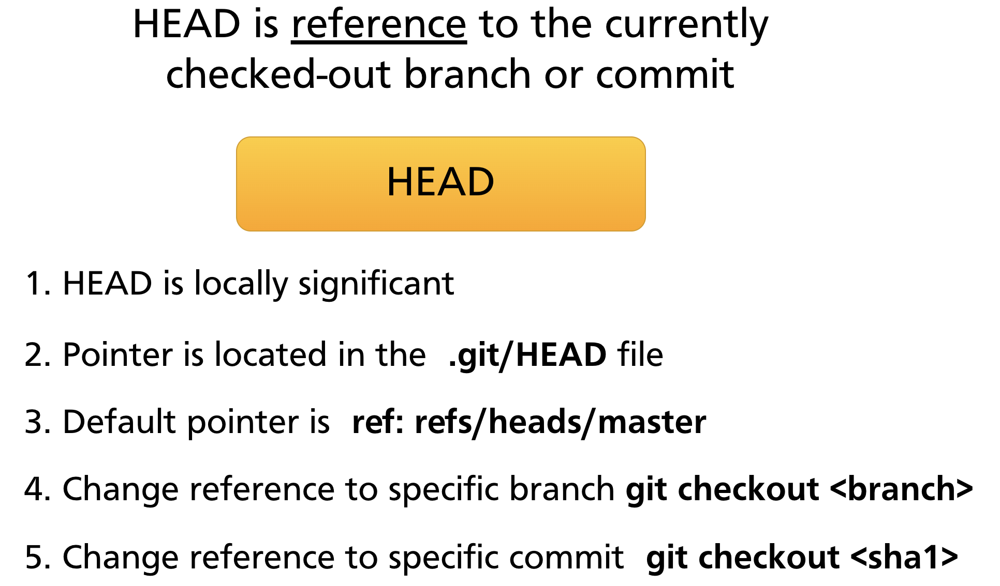

### HEAD follows commits automatically

When you make a new commit, the branch HEAD points to advances to the new commit. HEAD itself does not change — it still points to the same branch, but that branch now points further forward.

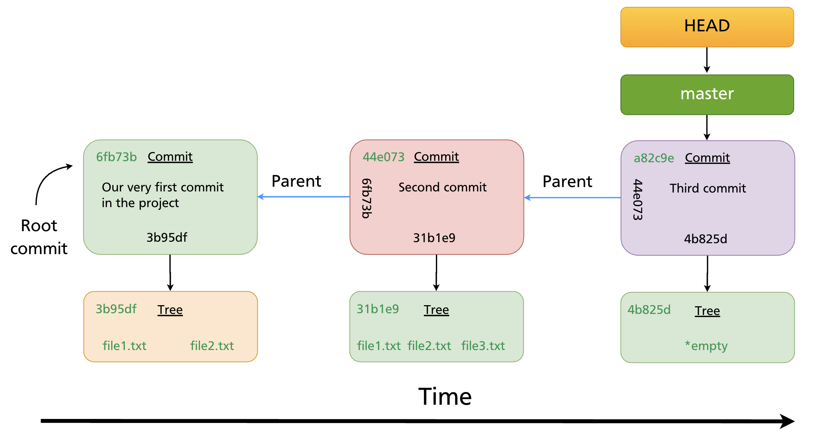

---

## Multiple Branches

A repository can have as many branches as you need, each pointing to a different commit. HEAD determines which one is active.

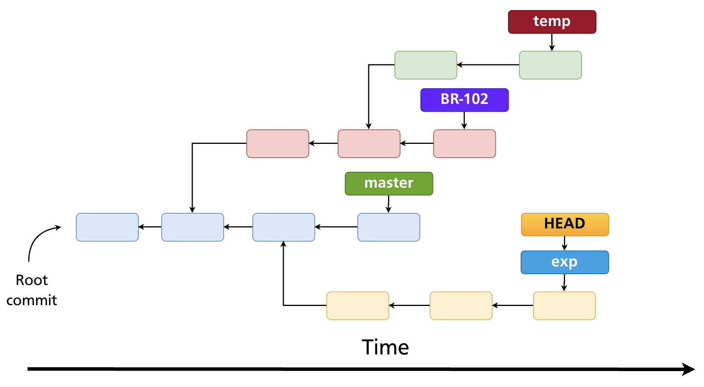

In this diagram, HEAD is pointing to `exp` — that is the active branch. New commits will advance `exp`; all other branch pointers stay fixed.

---

## Branch Management Commands

### List branches

```bash
git branch               # list local branches; current branch marked with *
git branch -a            # list local + remote-tracking branches
git branch -v            # list with last commit SHA and message
```

### Create a branch

```bash
git branch feature-x     # create at current HEAD (does not switch)
```

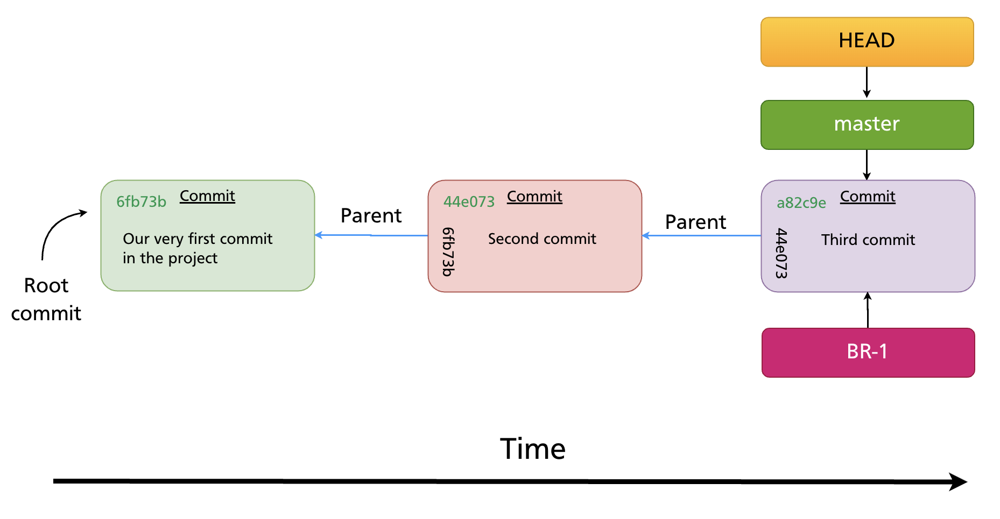

The new branch starts at the same commit as the current branch — the two pointers are identical at creation time.

### Switch to a branch

```bash
git checkout feature-x   # classic syntax (Git all versions)
git switch feature-x     # modern syntax (Git 2.23+)
```

Both update HEAD to point to `feature-x` and update the working directory to match that branch's commit.

### Create and switch in one step

```bash
git checkout -b feature-x    # classic syntax
git switch -c feature-x      # modern syntax
```


This is the most common way to start new work.

### Rename a branch

```bash
git branch -m old-name new-name      # rename any branch
git branch -m new-name               # rename the current branch
```

### Delete a branch

```bash
git branch -d feature-x      # delete a fully merged branch (safe)
git branch -D feature-x      # force-delete even if unmerged (data loss risk)
```

> **Tip:** `-d` refuses to delete a branch whose commits are not reachable from any other branch. Use `-D` only when you are sure you no longer need that work.

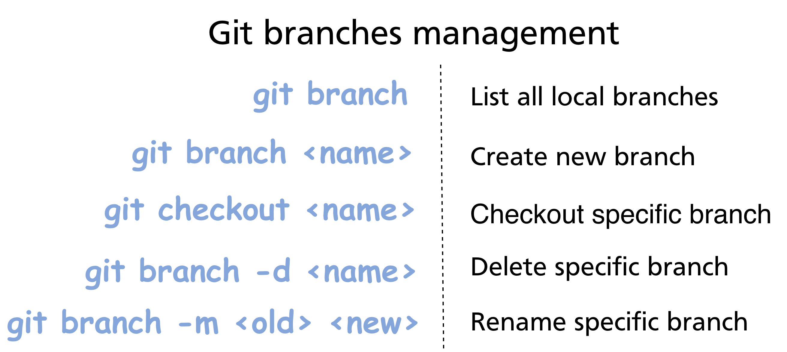

---

## How Branches Diverge

Once you commit on a branch, its pointer advances while all other branch pointers stay put. This is how parallel development works.

Starting point: `main` and `BR-1` both point to commit `a82c9e`.

After one commit on `BR-1`:

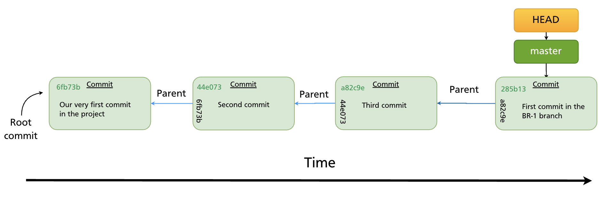

`BR-1` now points to the new commit `285b13`. `main` still points to `a82c9e`. The two branches have **diverged**. Future commits on either branch will continue diverging until the branches are merged (Chapter 12) or rebased (Chapter 13).

---

## Git's Efficiency: Blob Reuse

Because branches are just pointers, switching branches does not duplicate files. Git also reuses **blob objects** (file content) across branches wherever the content is identical.

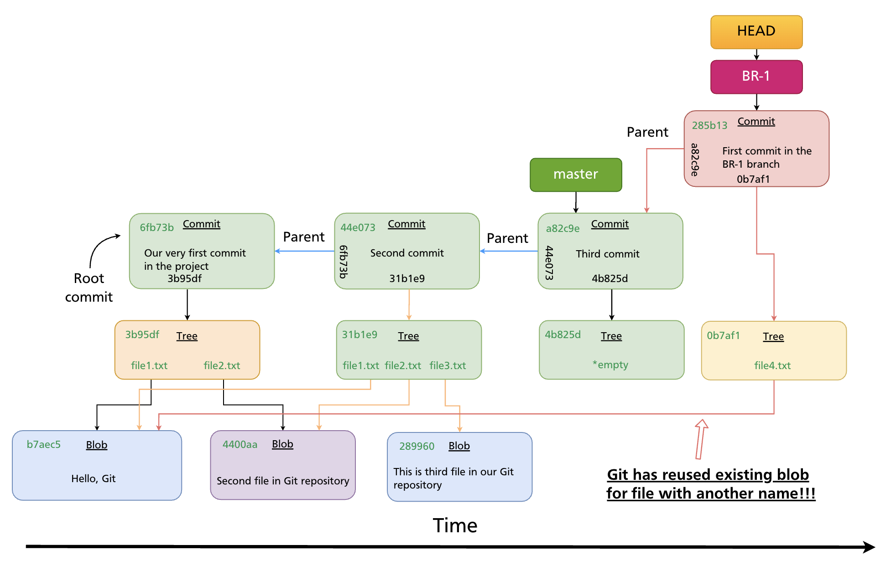

If two branches contain a file with identical content — even under different names — they share the same blob object in the object store. Git only stores each unique piece of content once. This is why repositories with many branches do not balloon in size.

---

## `git switch` vs `git checkout`

Git 2.23 (released 2019) introduced `git switch` and `git restore` to split the responsibilities of `git checkout`, which had accumulated too many unrelated functions:

| Task | Modern syntax | Classic syntax |
|---|---|---|
| Switch to a branch | `git switch <branch>` | `git checkout <branch>` |
| Create and switch | `git switch -c <branch>` | `git checkout -b <branch>` |
| Restore a file | `git restore <file>` | `git checkout -- <file>` |
| Detach HEAD at a commit | `git switch --detach <sha>` | `git checkout <sha>` |

Both forms work in all modern Git versions. This manual uses the modern syntax going forward, with the classic equivalent noted where relevant.

> **Further reading:** [Git Branching — Branches in a Nutshell (Pro Git)](https://git-scm.com/book/en/v2/Git-Branching-Branches-in-a-Nutshell)

---

## Summary

- A branch is a lightweight text pointer to a commit SHA, stored in `.git/refs/heads/`.
- HEAD points to the current branch (or directly to a commit in detached state).
- When you commit, the active branch pointer advances automatically; HEAD stays on the same branch.
- Creating a branch is instant and costs almost no storage.
- `git switch -c <name>` (or `git checkout -b <name>`) creates and switches in one step.
- Use `git branch -d` to safely delete merged branches; `-D` to force-delete.
- Git reuses blob objects across branches — identical file content is never stored twice.

---

*Previous: [Chapter 10 — Inspecting History](../part2/ch10-inspecting-history.md)* · *Next: [Chapter 12 — Merging Branches](ch12-merging.md)*
