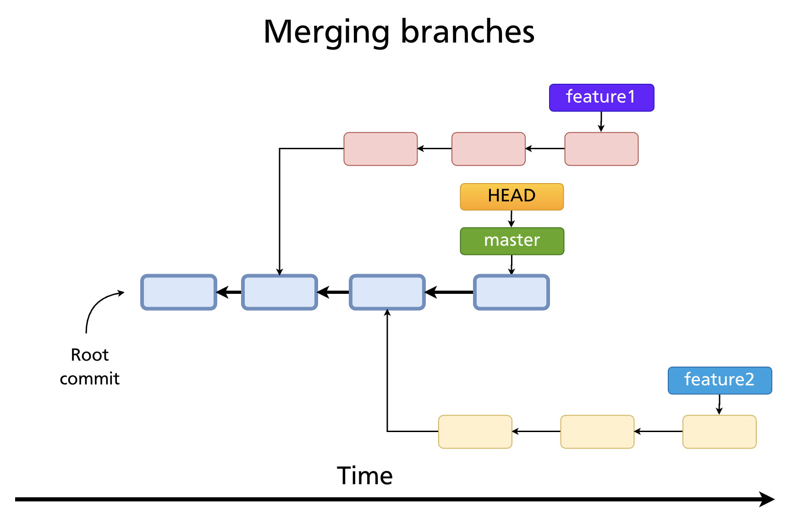
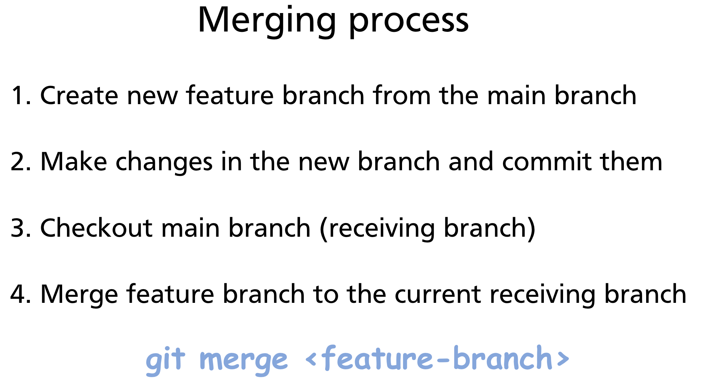
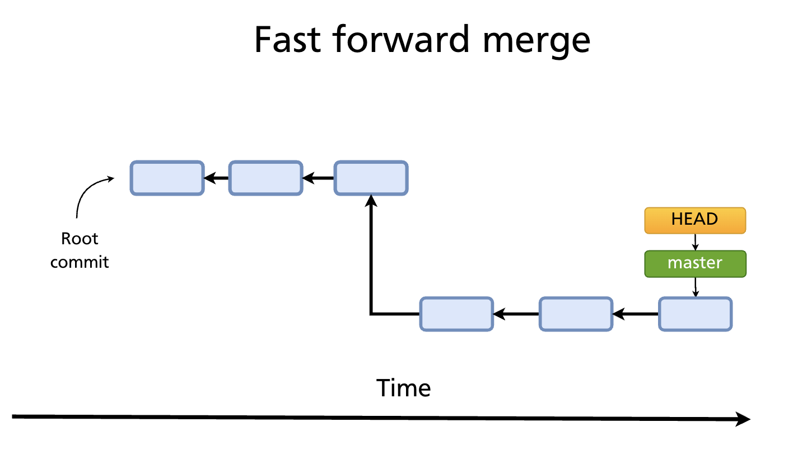
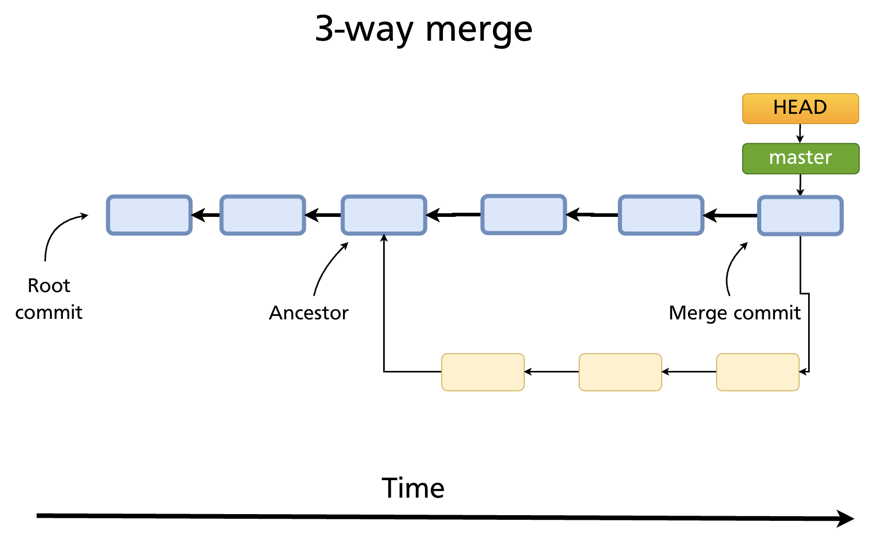
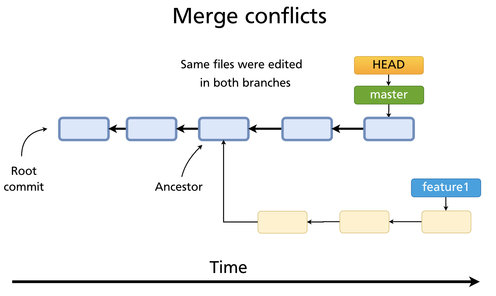
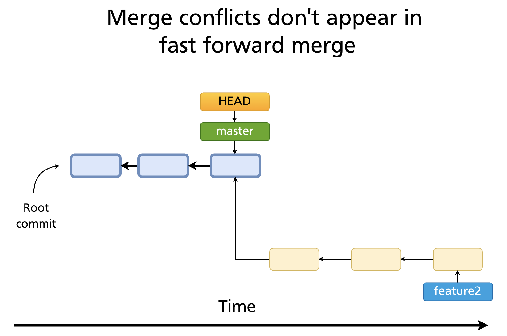

# Chapter 12 — Merging Branches

Once parallel work on separate branches is complete, the changes need to be combined. **Merging** is Git's primary mechanism for integrating one branch's history into another. This chapter covers the two merge strategies Git uses, how to run a merge, how to resolve conflicts, and the options that control how merge history is recorded.

---

## The Starting Point: Diverged Branches

Merging makes sense when two branches have diverged from a common point. In the diagram below, `feature1` and `feature2` both branch off from an earlier commit on `main`.



The goal is to bring the work from a feature branch back into `main` (the **receiving branch**).

---

## The Merge Process

The standard four-step workflow:

1. Create a feature branch from `main`
2. Make commits on the feature branch
3. Check out `main` (the branch that will receive the changes)
4. Run `git merge <feature-branch>`

```bash
git switch main
git merge feature1
```



Git automatically chooses between two strategies based on the history.

---

## Fast-Forward Merge

A **fast-forward merge** happens when the receiving branch has not diverged from the feature branch — that is, every commit on `main` is also an ancestor of the feature branch tip. In this case, Git simply moves the `main` pointer forward to the tip of the feature branch.



No merge commit is created. The history is perfectly linear.

```bash
git switch main
git merge feature2
# Updating 7b4c91e..a3f8c21
# Fast-forward
#  src/feature.js | 24 ++++++++++++++++++++++++
#  1 file changed, 24 insertions(+)
```

### Preventing a fast-forward

Sometimes you want to preserve the fact that a branch existed, even when a fast-forward is possible. Use `--no-ff`:

```bash
git merge --no-ff feature2
```

This forces Git to create a merge commit, keeping the feature branch visible in the history graph. Many teams require this for all feature branches to make the history easier to audit.

---

## 3-Way Merge

A **3-way merge** happens when both branches have diverged — `main` has new commits that the feature branch does not, and vice versa. Git cannot simply move a pointer; it must reconcile two different lines of history.

Git finds the **common ancestor** — the last commit that both branches share — and compares it against the tips of both branches. Using these three snapshots (ancestor, branch A tip, branch B tip — hence "3-way"), Git computes a combined result.



The result is a **merge commit** with two parents:

```bash
git switch main
git merge feature1
# Merge made by the 'ort' strategy.
#  src/auth.js | 15 +++++++++++++++
#  1 file changed, 15 insertions(+)
```

The merge commit appears in `git log` with two parent SHAs and a message like `Merge branch 'feature1'`.

---

## Merge Conflicts

A merge conflict occurs when the same region of the same file was modified differently on both branches since the common ancestor. Git cannot automatically decide which version to keep.



> **Fast-forward merges cannot produce conflicts.** Because a fast-forward simply advances a pointer — there is no parallel editing — there is nothing to reconcile.



### What happens when a conflict occurs

```bash
git merge feature1
# Auto-merging src/auth.js
# CONFLICT (content): Merge conflict in src/auth.js
# Automatic merge failed; fix conflicts and then commit the result.
```

Git pauses the merge and marks conflicting files. `git status` shows them:

```bash
git status
# On branch main
# You have unmerged paths.
#
# Unmerged paths:
#   (use "git add <file>..." to mark resolution)
#         both modified:   src/auth.js
```

### Conflict markers

Inside the conflicted file, Git inserts markers:

```
<<<<<<< HEAD
function login(user) {
  return authenticate(user, 'session');
}
=======
function login(user, token) {
  return authenticate(user, token);
}
>>>>>>> feature1
```

| Section | Meaning |
|---|---|
| `<<<<<<< HEAD` to `=======` | The version from the receiving branch (main) |
| `=======` to `>>>>>>> feature1` | The version from the incoming branch (feature1) |

### Resolving conflicts

1. Open each conflicted file and edit it to the correct final state — remove the markers and combine the content as appropriate.
2. Stage the resolved file:
   ```bash
   git add src/auth.js
   ```
3. Repeat for every conflicted file, then complete the merge:
   ```bash
   git commit
   # Git pre-fills a merge commit message — save and close
   ```

### Using a merge tool

```bash
git mergetool
```

Opens the configured diff/merge tool (e.g. VS Code, vimdiff, meld) for each conflicted file, presenting a three-panel view: ours, base (ancestor), and theirs.

Configure VS Code as the merge tool:

```bash
git config --global merge.tool vscode
git config --global mergetool.vscode.cmd 'code --wait $MERGED'
```

### Aborting a merge

If you want to abandon the merge entirely and return to the pre-merge state:

```bash
git merge --abort
```

This is safe to run at any point before the final `git commit`.

> **Further reading:** [Basic Merging — Pro Git book](https://git-scm.com/book/en/v2/Git-Branching-Basic-Branching-and-Merging)

---

## Merge Options

### `--squash` — collapse branch commits into one

```bash
git merge --squash feature1
git commit -m "Add feature1"
```

Collects all commits from the feature branch into a single staged change on the receiving branch. Useful for keeping `main`'s history clean when the feature branch has many small, messy commits. Note: this does **not** create a merge commit — the relationship between the branches is not recorded in history.

### `--no-commit` — stage the merge without committing

```bash
git merge --no-commit feature1
# inspect the result, make adjustments
git commit
```

Pauses after the merge is prepared so you can review or adjust the combined result before it is committed.

---

## Viewing Merge History

```bash
git log --merges              # show only merge commits
git log --no-merges           # exclude merge commits
git log --oneline --graph     # visualise the branch and merge structure
```

---

## Summary

- **Fast-forward merge**: receiving branch has not diverged; Git moves the pointer forward. No merge commit, no conflicts possible.
- **3-way merge**: both branches have diverged; Git creates a merge commit with two parents using the common ancestor as a base.
- Merge conflicts occur when the same region of a file was changed in both branches; resolve by editing conflict markers, staging, and committing.
- `git merge --abort` abandons an in-progress conflicted merge.
- `--no-ff` forces a merge commit even when a fast-forward is possible.
- `--squash` collapses branch commits into one staged change without recording the branch relationship.

---

*Previous: [Chapter 11 — Branches and HEAD](ch11-branches-head.md)* · *Next: [Chapter 13 — Rebasing](ch13-rebasing.md)*
