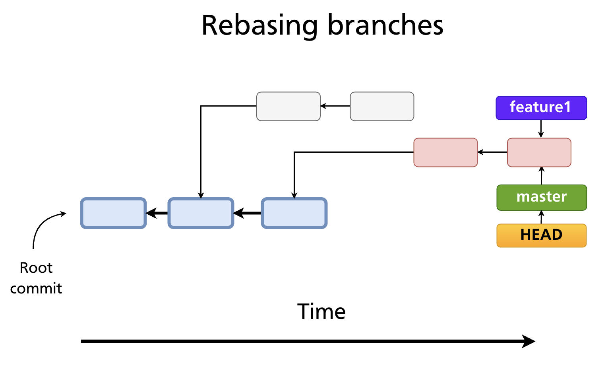
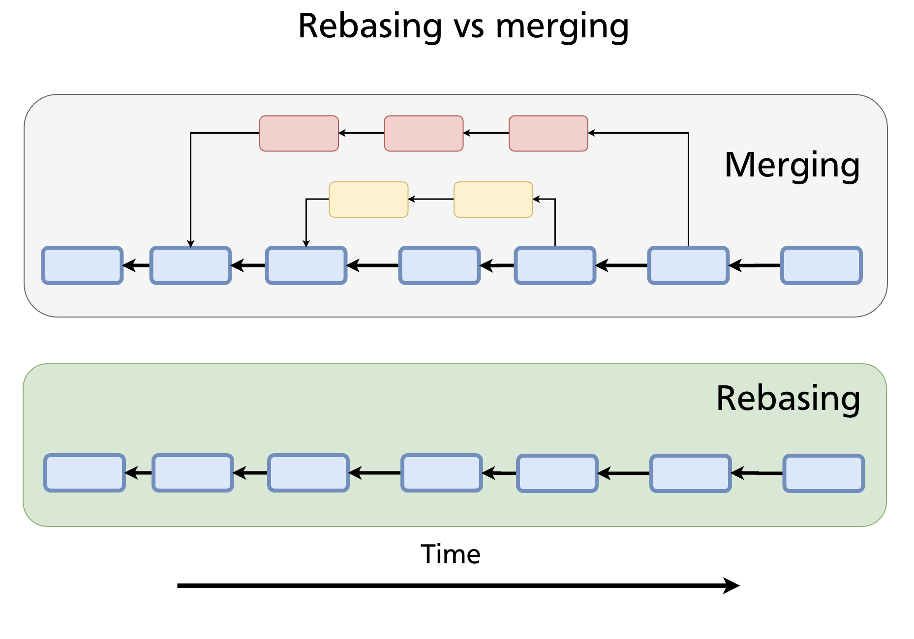
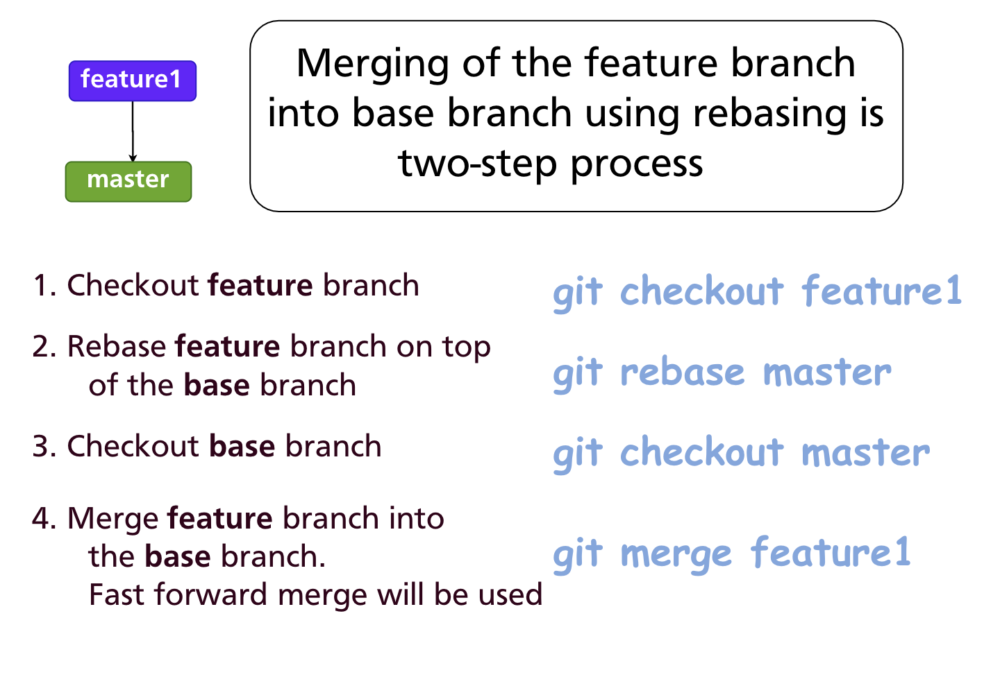
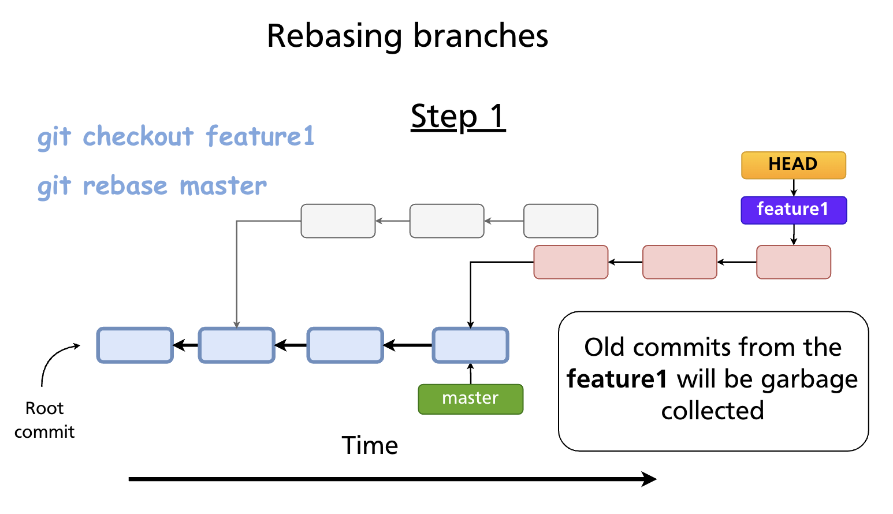
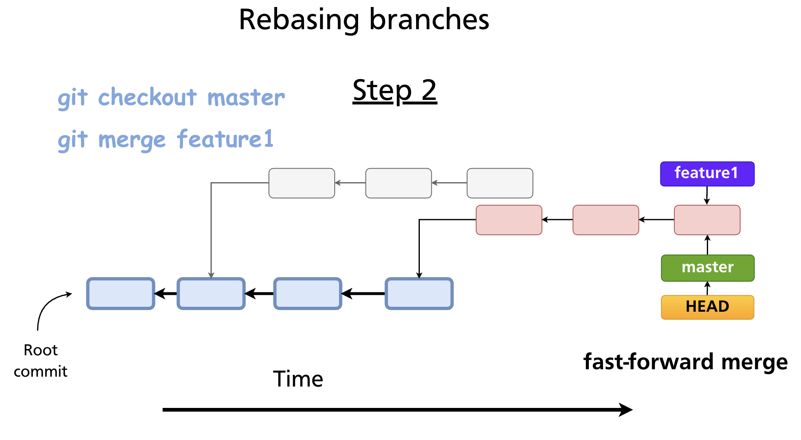

# Chapter 13 — Rebasing

Merging and rebasing both integrate changes from one branch into another, but they do it differently and produce different histories. Where a merge preserves the full record of parallel development (Chapter 12), **rebasing** rewrites history to produce a clean, linear sequence of commits. Understanding when — and when *not* — to use it is one of the more important judgement calls in Git.

---

## What Rebasing Does

When you rebase a branch onto another, Git:

1. Finds the common ancestor of the two branches
2. Takes each commit on the current branch that is not on the target branch
3. Replays those commits, one by one, on top of the target branch's tip
4. Each replayed commit becomes a **new commit object** with a new SHA

The original commits are abandoned (and eventually garbage-collected). The result looks as if you had started your feature branch from the current tip of the target branch — even if that was not how the work actually happened.

Three key properties:
- **Rewrites history** — commit SHAs change
- **History becomes linear** — no merge commits, no fork in the graph
- **Does not keep the full parallel history** — the branch's divergence point is erased

---

## Rebase vs Merge: The Visual Difference

Consider a feature branch that diverged from `master` at some earlier commit. After more work has been done on `master`:



**Merge** creates a merge commit that joins the two lines of history. The full parallel record is preserved.

**Rebase** moves the feature commits so they sit on top of the current `master` tip. The history looks as if the feature was developed linearly, after all of `master`'s changes.



Neither approach is universally better. The choice depends on the team's preferred history style:

| | Merge | Rebase |
|---|---|---|
| History shape | Non-linear (fork + join) | Linear |
| Original commit SHAs | Preserved | Replaced with new SHAs |
| Shows parallel work | Yes | No |
| Introduces merge commits | Yes (for 3-way) | No |
| Safe on shared branches | Yes | **No** |

---

## The Two-Step Rebase Workflow

Integrating a feature branch into `master` via rebasing is a two-step process:



### Step 1 — Rebase the feature branch onto master

```bash
git switch feature1
git rebase master
```

Git replays the commits from `feature1` on top of the current tip of `master`. The old `feature1` commits become unreachable and are eventually garbage-collected.



### Step 2 — Fast-forward merge into master

Because `feature1` is now a direct descendent of `master`'s tip, a merge is a simple fast-forward — no merge commit:

```bash
git switch master
git merge feature1
```



The result: `master` has a perfectly linear history containing all commits from both lines of development, in order.

> **Further reading:** [`git rebase` documentation](https://git-scm.com/docs/git-rebase) · [Rebasing — Pro Git book](https://git-scm.com/book/en/v2/Git-Branching-Rebasing)

---

## Resolving Rebase Conflicts

Because rebasing replays commits one at a time, a conflict can occur at any replayed commit. When it does, Git pauses and asks you to resolve it before continuing.

```bash
git rebase master
# CONFLICT (content): Merge conflict in src/auth.js
# error: could not apply a3f8c21... Add login validation
# hint: Resolve all conflicts manually, ...
# hint: After resolving the conflicts, run "git rebase --continue"
```

The conflict markers are identical to those in a merge conflict (see Chapter 12). Once you have resolved them:

```bash
# 1. Edit the conflicted file(s) to the correct state
# 2. Stage the resolved file(s)
git add src/auth.js

# 3. Continue replaying the remaining commits
git rebase --continue
```

If a particular commit becomes empty after resolution (its changes are already in the target), skip it:

```bash
git rebase --skip
```

To abandon the rebase entirely and return to the pre-rebase state:

```bash
git rebase --abort
```

---

## `git rebase --onto`

The standard `git rebase <target>` moves all commits on the current branch that are not on `<target>`. `--onto` gives you more surgical control: move only a specific range of commits onto a different base.

```bash
git rebase --onto <newbase> <upstream> <branch>
```

**Example:** You accidentally branched `feature` off `hotfix` instead of `main`. Move only the `feature` commits to sit on top of `main`:

```bash
git rebase --onto main hotfix feature
```

This replays the commits reachable from `feature` but not from `hotfix` onto `main`.

---

## The Golden Rule: Never Rebase Public Commits

> **Do not rebase commits that have been pushed to a shared branch.**

When you rebase, every affected commit gets a new SHA. If teammates have already fetched or pulled those commits, their local histories diverge from yours. Pushing the rebased branch would require a force-push (`git push --force`), and anyone who has the old SHAs would face a confusing, broken history.

Safe uses of rebase:
- Rebasing a **local** feature branch before opening a pull request
- Cleaning up commits on a branch that exists only on your machine
- Using interactive rebase (Chapter 14) to polish commits before sharing

Unsafe uses of rebase:
- Rebasing `main`, `develop`, or any branch others have fetched
- Force-pushing a rebased branch to a shared remote without team agreement

---

## Interactive Rebase

`git rebase -i` (interactive rebase) lets you rewrite, reorder, squash, and edit commits in a branch before sharing. It is covered in depth in Chapter 14.

---

## Summary

- Rebasing replays commits onto a new base, producing a linear history with new commit SHAs.
- The two-step workflow: `git rebase <target>` on the feature branch, then `git merge` (fast-forward) on the base branch.
- Rebase conflicts are resolved file-by-file; use `--continue`, `--skip`, or `--abort`.
- `git rebase --onto` moves a specific range of commits to a different base.
- **Never rebase commits that have already been pushed to a shared branch** — it rewrites history and forces others to reconcile.

---

*Previous: [Chapter 12 — Merging Branches](ch12-merging.md)* · *Next: [Chapter 14 — Interactive Rebase](ch14-interactive-rebase.md)*
