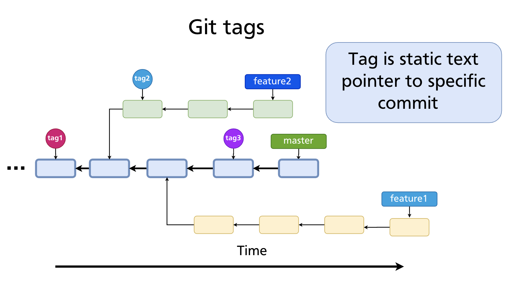
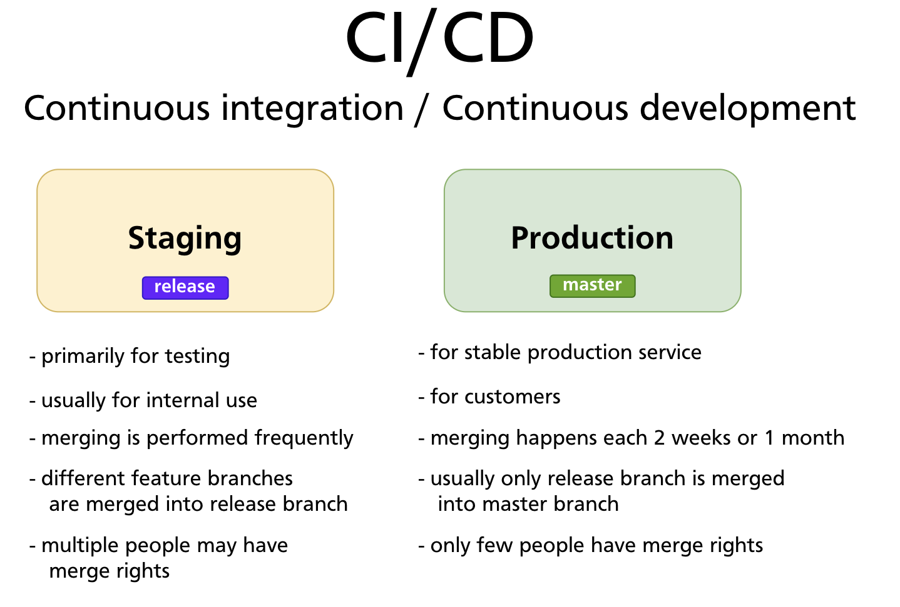
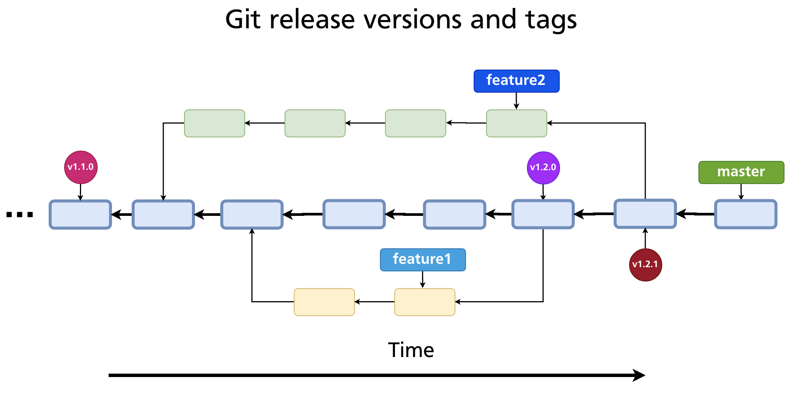
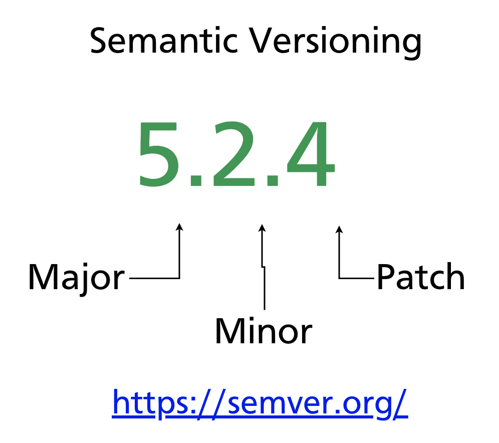
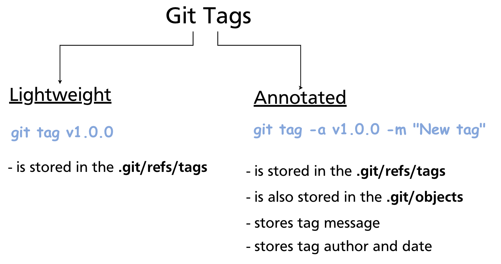

# Chapter 15 — Tags & Semantic Versioning

Branches move. Every new commit on a branch advances its pointer forward, leaving earlier commits reachable only through history. **Tags** are different: a tag is a fixed label that points permanently to a specific commit and never moves. This makes tags the natural tool for marking release points — version numbers, milestones, and any commit that needs to be reliably identified long after the branch has moved on.

---

## What a Tag Is

A tag is a named reference stored in `.git/refs/tags/`. Unlike a branch pointer, a tag is never updated automatically. Once created, it always points to the same commit.



Tags are most commonly used to mark release versions: `v1.0.0`, `v2.3.1`, `v3.0.0-beta`. The tagged commit becomes the authoritative snapshot for that release — reproducible, referenceable, and permanent.

---

## Tags in a Release Workflow

Tags fit naturally into CI/CD pipelines, where different branches serve different purposes:



- The **staging / release branch** receives frequent merges from feature branches and is used primarily for internal testing.
- The **production / master branch** receives stable merges on a cadence (e.g. every two weeks) and is the version customers use.

When a commit on the production branch is approved for release, it is tagged. That tag becomes the identifier used by CI/CD systems to build, deploy, and distribute the release artefact.



---

## Semantic Versioning

Most software projects version their releases using **Semantic Versioning** (semver). A semver version number has three components:

```
MAJOR.MINOR.PATCH
```

For example: `5.2.4`



| Component | When to increment | Example |
|---|---|---|
| **MAJOR** | Breaking change — existing users must update their code | `4.0.0` → `5.0.0` |
| **MINOR** | New feature, backwards-compatible | `5.1.0` → `5.2.0` |
| **PATCH** | Bug fix, backwards-compatible | `5.2.3` → `5.2.4` |

Additional labels can be appended for pre-release versions:

```
v1.0.0-alpha
v1.0.0-beta.1
v1.0.0-rc.2
```

And build metadata after a `+`:

```
v1.0.0+20260324
```

> **Further reading:** [semver.org](https://semver.org/) — the full semver 2.0.0 specification.

---

## Two Types of Tags

Git has two tag types with different storage structures and use cases:



### Lightweight tags

A lightweight tag is nothing more than a pointer to a commit SHA — identical in structure to a branch, but it never moves. It is stored only in `.git/refs/tags/`.

```bash
git tag v1.0.0
```

Lightweight tags carry no metadata beyond the commit they point to. They are quick to create and useful for local or temporary markers.

### Annotated tags

An annotated tag is a full Git object stored in `.git/objects/` (as well as `.git/refs/tags/`). It records:

- Tag message
- Tagger name and email
- Tagging date
- (Optionally) a GPG signature

```bash
git tag -a v1.0.0 -m "Release version 1.0.0"
```

**Annotated tags are recommended for public releases.** They carry the context of who tagged and why, they can be signed for authenticity, and they are the ones `git describe` and many CI/CD tools prefer.

---

## Tag Commands

### Create a tag

```bash
# Lightweight — tag the current commit (HEAD)
git tag v1.0.0

# Annotated — tag HEAD with a message
git tag -a v1.0.0 -m "First stable release"

# Tag a specific past commit
git tag -a v0.9.0 a3f8c21 -m "Beta release"
```

### List tags

```bash
git tag                  # list all tags alphabetically
git tag -l "v1.*"        # list tags matching a pattern
git tag -n               # list tags with their messages (one line each)
```

### Inspect a tag

```bash
git show v1.0.0          # show tag metadata + the tagged commit
```

For a lightweight tag, `git show` shows only the commit. For an annotated tag, it shows the tag object (message, author, date) followed by the commit.

### Delete a tag

```bash
git tag -d v1.0.0        # delete tag locally
```

### Rename a tag

Git has no rename command for tags. The standard approach is to create a new tag and delete the old one:

```bash
git tag v1.0.1 v1.0.0    # create v1.0.1 pointing to the same commit as v1.0.0
git tag -d v1.0.0         # delete the old tag
```

---

## Pushing Tags to a Remote

By default, `git push` does **not** push tags. Tags must be pushed explicitly.

```bash
# Push a single tag
git push origin v1.0.0

# Push all tags at once
git push origin --tags

# Push only annotated tags (skip lightweight)
git push origin --follow-tags
```

> **Tip:** `--follow-tags` is the safest option for release workflows — it pushes only annotated tags that are reachable from pushed commits, avoiding accidental publication of local/temporary lightweight tags.

### Deleting a remote tag

```bash
git push origin --delete v1.0.0
# or equivalently:
git push origin :refs/tags/v1.0.0
```

---

## Checking Out a Tag

You can check out any tag to inspect the code at that release point:

```bash
git checkout v1.0.0
```

This puts Git in **detached HEAD** state — HEAD points directly to the tagged commit rather than to a branch. Any new commits you make will not be on any branch. If you want to work from a tagged release (e.g. to apply a hotfix), create a branch first:

```bash
git checkout -b hotfix/1.0.1 v1.0.0
```

Detached HEAD is covered in depth in Chapter 16.

---

## `git describe`

`git describe` generates a human-readable name for any commit based on the nearest tag:

```bash
git describe
# v1.0.0-3-ga3f8c21
```

The format is `<tag>-<commits-since-tag>-g<short-sha>`. If HEAD is exactly on a tag, it outputs just the tag name. This is commonly used in build scripts to embed a version string in build artefacts.

```bash
git describe --tags         # include lightweight tags
git describe --always       # fall back to short SHA if no tag is reachable
```

---

## Summary

- A tag is a **static pointer** to a commit — it never moves, unlike a branch.
- **Lightweight tags** are simple SHA references with no extra metadata.
- **Annotated tags** are full Git objects with a message, author, date, and optional GPG signature — preferred for public releases.
- Semver (`MAJOR.MINOR.PATCH`) is the standard versioning scheme: increment MAJOR for breaking changes, MINOR for backwards-compatible features, PATCH for bug fixes.
- Tags must be pushed explicitly: `git push origin v1.0.0` or `git push origin --follow-tags`.
- `git checkout <tag>` enters detached HEAD state; create a branch first if you need to commit from that point.
- `git describe` generates a version string from the nearest reachable tag.

---

*Previous: [Chapter 14 — Interactive Rebase](ch14-interactive-rebase.md)* · *Next: [Chapter 16 — Detached HEAD](ch16-detached-head.md)*

