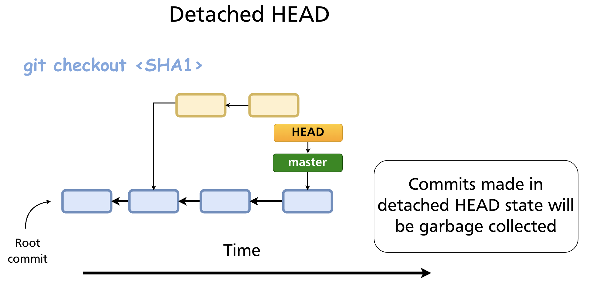

# Chapter 16 — Detached HEAD

In normal operation, HEAD points to a branch name, and that branch points to a commit. When you commit, the branch advances and HEAD follows along automatically. **Detached HEAD** is what happens when HEAD points directly to a commit SHA rather than to a branch. It is a valid and useful state — but it comes with a trap you need to understand before you use it.

---

## Normal HEAD vs Detached HEAD

Normally the chain is:

```
HEAD → refs/heads/main → commit sha
```

In detached HEAD state:

```
HEAD → commit sha   (no branch in between)
```



Git signals this immediately when you enter the state:

```
Note: switching to 'a3f8c21'.

You are in 'detached HEAD' state. You can look around, make experimental
changes and commit them, and you can discard any commits you make in this
state without impacting any branches by switching back to a branch.

If you want to create a new branch to retain commits you create, you may
do so (now or later) by using -c with the switch command. Example:

  git switch -c <new-branch-name>

Or undo this operation with:

  git switch -
```

---

## How to Enter Detached HEAD

### Check out a specific commit

```bash
git checkout a3f8c21
git switch --detach a3f8c21    # modern syntax
```

### Check out a tag

```bash
git checkout v1.0.0
git switch --detach v1.0.0
```

This is the most common real-world use: inspecting what the codebase looked like at a specific release.

### During a rebase

Git temporarily enters detached HEAD while replaying each commit during `git rebase`. This is handled internally and resolves automatically when the rebase completes (or is aborted).

---

## What You Can Do in Detached HEAD

You can do anything you normally do: read files, run code, create new commits. The working tree and staging area behave identically.

```bash
# Look at the state of a file at this commit
cat src/auth.js

# Run the project
npm test

# Make an experimental change and commit it
git add src/experiment.js
git commit -m "Experimental change"
```

The danger is that commits you make in detached HEAD state are **not tracked by any branch**. They are reachable only through HEAD itself (and through the reflog, temporarily). As soon as you switch to a branch, HEAD moves away from those commits — and without a branch pointing to them, Git's garbage collector will eventually discard them.

---

## The Trap: Losing Commits

Suppose you are in detached HEAD at `a3f8c21` and you make two commits — `b1c2d3e` and `f4e5d6c`. Then you run:

```bash
git switch main
```

HEAD now points to `main`. Your two commits (`b1c2d3e`, `f4e5d6c`) are no longer reachable from any branch or tag. Git will warn you:

```
Warning: 1 commit(s) left to be garbage collected; use --force with prune if you want to remove them now.
```

If you do nothing, those commits will be garbage collected after the default grace period (typically 30 days for unreachable objects, though the `gc.pruneExpire` config controls this).

---

## Saving Work from Detached HEAD

### Before switching away — create a branch immediately

This is the clean path. While HEAD is still on the commit you want to keep:

```bash
git switch -c experiment/new-feature
# or classic syntax:
git checkout -b experiment/new-feature
```

This creates a new branch pointing to the current detached HEAD commit. HEAD now points to the new branch — you are no longer in detached state, and your commits are safe.

### After switching away — recover via reflog

If you have already switched away, `git reflog` still has the SHA:

```bash
git reflog
# HEAD@{0}: checkout: moving from f4e5d6c to main
# HEAD@{1}: commit: Experimental change
# HEAD@{2}: commit: First experiment
# HEAD@{3}: checkout: moving from main to a3f8c21
```

Find the SHA of the last commit you made in detached HEAD (`f4e5d6c` in this example), then create a branch pointing to it:

```bash
git branch experiment/new-feature f4e5d6c
```

Or check it out directly and create the branch:

```bash
git checkout f4e5d6c
git switch -c experiment/new-feature
```

Reflog entries are retained for 90 days by default (`gc.reflogExpire`), so recovery is generally possible as long as you act before the next garbage collection.

---

## Legitimate Uses of Detached HEAD

Detached HEAD is not just an accident to avoid — it has genuine, common uses:

| Use case | How |
|---|---|
| Inspect code at an old commit | `git checkout <sha>` — browse, run, read without affecting any branch |
| Inspect code at a release | `git checkout v2.1.0` — see exactly what shipped |
| Bisect | `git bisect` manages detached HEAD internally while walking the commit range |
| Rebase internals | Git uses detached HEAD to replay each commit; handled automatically |
| Test a hotfix starting from a tag | `git checkout v1.0.0`, test, then `git switch -c hotfix/1.0.1` if needed |

For any of these, the rule is the same: if you commit anything you want to keep, create a branch before moving away.

---

## `git switch -` — Return to the Previous Branch

A quick way to leave detached HEAD and return to wherever you were before:

```bash
git switch -
```

This is the equivalent of `cd -` in the shell — it switches to the previously checked-out branch. If you made no commits in detached HEAD, there is nothing to lose.

---

## Checking Whether You Are in Detached HEAD

```bash
git status
# HEAD detached at a3f8c21
# nothing to commit, working tree clean

git branch
# * (HEAD detached at a3f8c21)
#   main
#   feature-x
```

The `*` in `git branch` output shows `(HEAD detached at <sha>)` rather than a branch name.

---

## Summary

- Detached HEAD means HEAD points directly to a commit SHA rather than to a branch.
- It is entered via `git checkout <sha>`, `git checkout <tag>`, or `git switch --detach <sha>`.
- You can make commits in detached HEAD, but they are not tracked by any branch and will be garbage-collected after you move away.
- **To save work:** create a branch with `git switch -c <name>` before switching away.
- **To recover lost commits:** use `git reflog` to find the SHA, then `git branch <name> <sha>`.
- Legitimate uses include inspecting old code, checking out release tags, and serving as the internal mechanism for `git rebase` and `git bisect`.

---

*Previous: [Chapter 15 — Tags & Semantic Versioning](ch15-tags.md)* · *Next: [Chapter 17 — GitHub Overview & Remote Repositories](../part4/ch17-github-remotes.md)*
