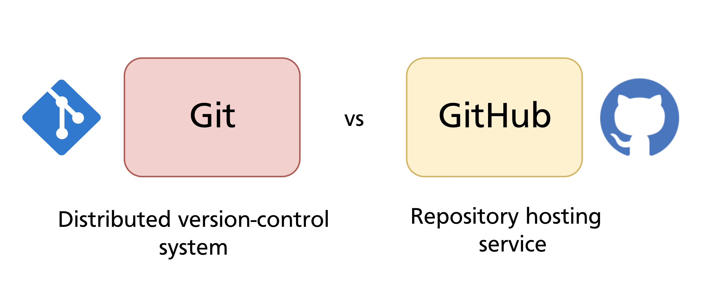
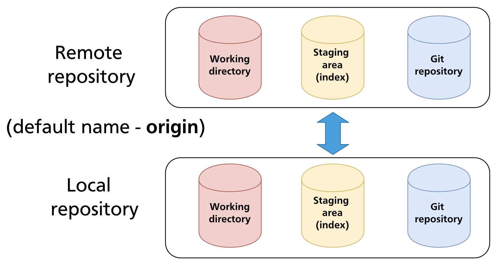
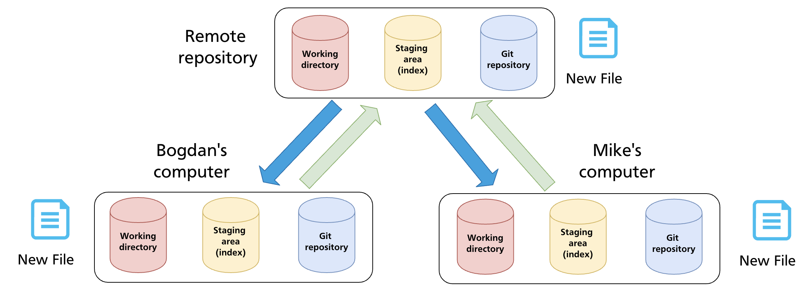

# Chapter 17 — GitHub Overview & Remote Repositories

Every chapter up to this point has worked entirely locally — one machine, one `.git` directory, no network involved. This chapter introduces the other half of the picture: **remote repositories** and GitHub, the platform that hosts them for most teams and open-source projects.

---

## Git vs GitHub

These two are frequently confused but are entirely separate things:



| | |
|---|---|
| **Git** | A distributed version control system. A command-line tool you install locally. Manages your repository history entirely on your machine. |
| **GitHub** | A web-based hosting service for Git repositories. Adds collaboration features — pull requests, issues, project boards, Actions — on top of Git. |

Git does not require GitHub. You can use Git locally forever, or host repositories on GitLab, Bitbucket, Gitea, a private server, or any other service. GitHub is simply the most widely used hosting platform and the one this manual focuses on.

---

## What a Remote Repository Is

A **remote repository** is a copy of a Git repository hosted elsewhere — on a server, a cloud platform, or another machine on the same network.



Both the local and remote repositories are full Git repositories: each has a working directory (when applicable), a staging area, and the complete object store. They are kept in sync by explicitly **pushing** changes from local to remote, and **pulling** changes from remote to local.

The default name Git gives to the primary remote is **`origin`**. This is just a convention — you can rename it or add remotes with any name. When you clone a repository, Git sets up `origin` automatically pointing to the URL you cloned from.

---

## Distributed Version Control

GitHub's model is **distributed**: every contributor holds a complete copy of the repository. There is no central server that everyone depends on to do work — each local clone is a fully functional repository.



In practice, teams use a shared remote (on GitHub) as the **integration point** — the authoritative copy that everyone pushes to and pulls from. But if GitHub went offline, every developer's local clone would still contain the full history and they could continue working.

This is the fundamental difference from older centralised systems (like SVN), where all history lived on a single server and developers only kept working copies.

---

## GitHub Account and Repository Concepts

Before working with GitHub, it helps to understand the key concepts:

### Account types

- **Personal account** — belongs to an individual; `github.com/<username>`
- **Organisation** — belongs to a team or company; `github.com/<org-name>`; members can be assigned roles and permissions

### Repository visibility

| Visibility | Who can see it |
|---|---|
| **Public** | Anyone on the internet — can clone and read without an account |
| **Private** | Only you and collaborators you explicitly invite |

### Repository URL formats

GitHub provides two URL formats for every repository:

```
# HTTPS
https://github.com/<username>/<repo>.git

# SSH
git@github.com:<username>/<repo>.git
```

HTTPS uses your GitHub credentials (or a PAT — see Chapter 4). SSH uses a key pair and is the recommended approach for everyday use once your SSH key is configured. The mechanics of both are covered in Chapter 4.

---

## Creating a Repository on GitHub

### Starting fresh on GitHub

1. Click **New repository** on github.com
2. Choose a name, visibility (public/private), and optionally initialise with a README, `.gitignore`, and licence
3. Copy the repository URL

If you initialised the repository with files on GitHub, clone it to your machine:

```bash
git clone https://github.com/<username>/<repo>.git
# or SSH:
git clone git@github.com:<username>/<repo>.git
```

`git clone` creates a local directory, initialises a Git repository inside it, downloads all objects and refs, and sets up `origin` pointing to the URL.

### Connecting an existing local repository

If you already have a local repository and want to push it to a new GitHub repository:

1. Create an **empty** repository on GitHub (do not initialise with any files)
2. Link your local repository to the remote:

```bash
git remote add origin git@github.com:<username>/<repo>.git
```

3. Push your local history up:

```bash
git push -u origin main
```

The `-u` flag (short for `--set-upstream`) links the local `main` branch to `origin/main`, so future `git push` and `git pull` commands on that branch need no further arguments.

---

## Managing Remotes

### List remotes

```bash
git remote          # list remote names
git remote -v       # list remotes with their fetch and push URLs
```

### Add a remote

```bash
git remote add <name> <url>
git remote add origin git@github.com:alice/myrepo.git
```

### Rename a remote

```bash
git remote rename origin upstream
```

### Change a remote's URL

Useful when a repository is moved or when switching between HTTPS and SSH:

```bash
git remote set-url origin git@github.com:alice/myrepo.git
```

### Remove a remote

```bash
git remote remove origin
```

---

## Remote-Tracking Branches

When Git fetches from a remote, it stores what it learned about the remote's branches as **remote-tracking branches** — read-only local references named `<remote>/<branch>`:

```
origin/main
origin/feature-x
origin/develop
```

These are snapshots of where the remote's branches were the last time you fetched. They are not local branches you work on directly; they are updated by `git fetch`, `git pull`, and `git push`.

```bash
git branch -a           # list local and remote-tracking branches
git branch -r           # list remote-tracking branches only
```

To see the relationship between a local branch and its remote-tracking counterpart:

```bash
git branch -vv
# * main  a3f8c21 [origin/main] Add login form
#   dev   7b9d344 [origin/dev: ahead 2] Work in progress
```

The `[origin/main]` annotation shows the tracking relationship. `ahead 2` means the local branch has 2 commits the remote does not yet have.

---

## The `origin/main` vs `main` Distinction

A common source of confusion: your local `main` and `origin/main` are two different references.

- **`main`** — your local branch pointer; advances when you commit locally
- **`origin/main`** — a remote-tracking branch; advances only when you fetch/pull

After fetching, if the remote has new commits, `origin/main` will be ahead of your local `main`. `git merge origin/main` (or `git pull`) integrates those commits into your local branch.

---

## Summary

- **Git** is the version control system; **GitHub** is a hosting platform built on top of Git.
- A remote repository is a full Git repository accessible over a network, used as a shared integration point.
- The default remote name is `origin`, created automatically by `git clone` or manually with `git remote add`.
- Git's distributed model means every clone has the full history — contributors are never dependent on the remote to do local work.
- Remote-tracking branches (`origin/main`, etc.) are local read-only snapshots of the remote's branches, updated by fetch/pull/push.
- `git remote -v` lists remotes; `git branch -vv` shows local branches with their tracking relationships and ahead/behind counts.

---

*Previous: [Chapter 16 — Detached HEAD](../part3/ch16-detached-head.md)* · *Next: [Chapter 18 — Push, Fetch & Pull](ch18-push-fetch-pull.md)*

