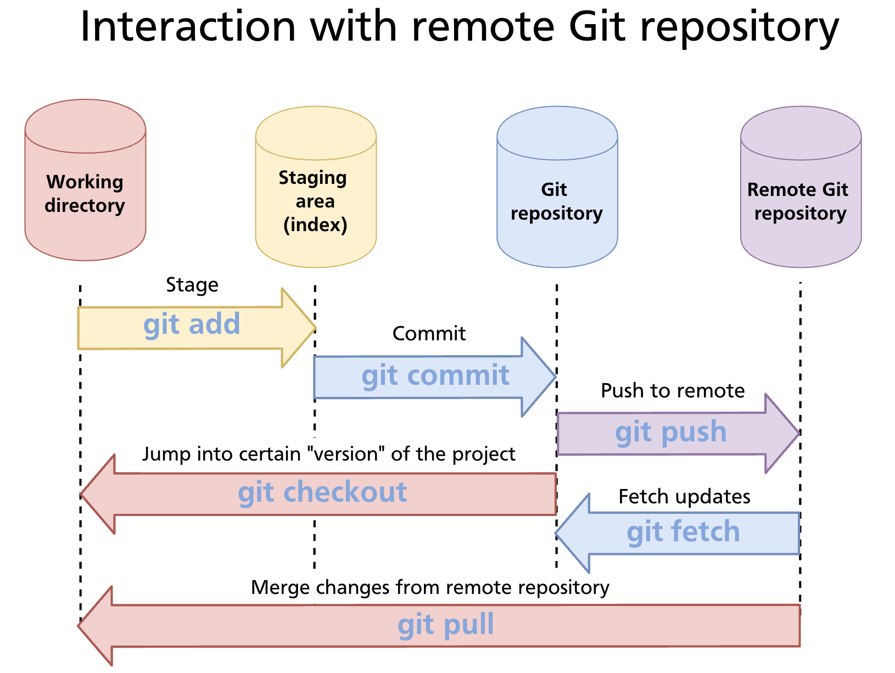
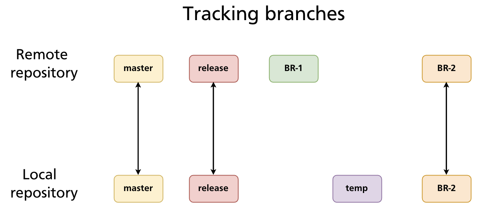
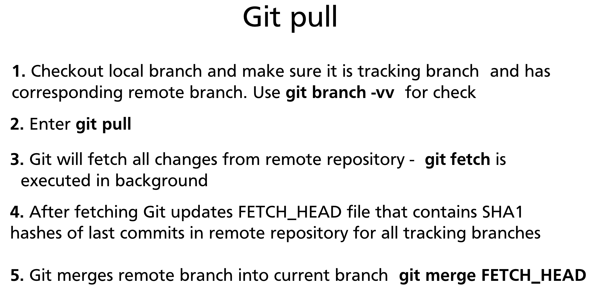
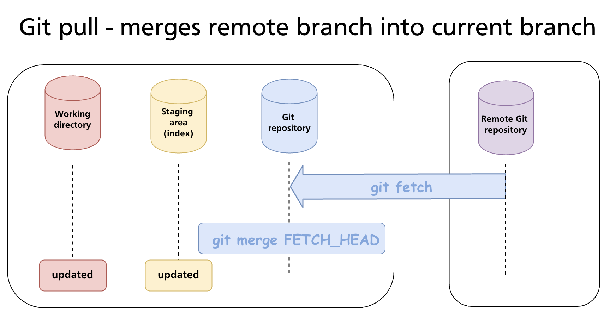
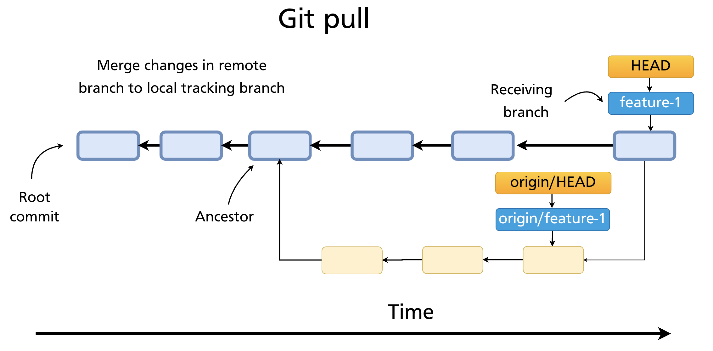
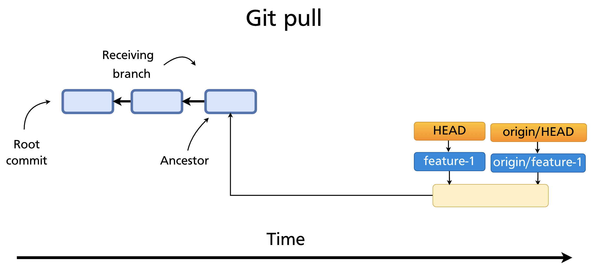
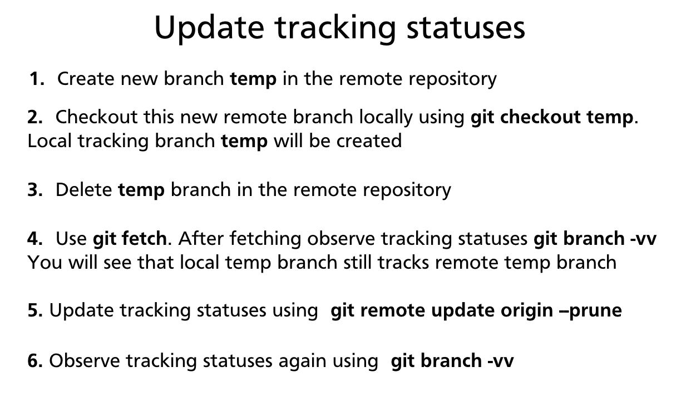

# Chapter 18 — Push, Fetch & Pull

With a remote repository set up (Chapter 17), three commands handle all synchronisation between local and remote: **`git push`** sends your commits up, **`git fetch`** downloads remote changes without touching your working directory, and **`git pull`** downloads and integrates them in one step. Understanding the difference between fetch and pull — and when to prefer one over the other — is essential for working safely on shared repositories.

---

## The Three Sync Commands at a Glance



| Command | Direction | Integrates into working branch? |
|---|---|---|
| `git push` | Local → Remote | N/A (sends your commits out) |
| `git fetch` | Remote → Local | No — updates remote-tracking branches only |
| `git pull` | Remote → Local | Yes — fetch + merge (or rebase) |

---

## `git push` — Sending Commits to the Remote

`git push` uploads your local commits to the remote repository, advancing the remote branch pointer to match your local branch.

```bash
git push origin main
```

This pushes the local `main` branch to `origin`. If the remote branch does not exist yet, Git creates it.

### Setting an upstream tracking relationship

The first time you push a new branch, use `-u` (`--set-upstream`) to link the local branch to its remote counterpart:

```bash
git push -u origin feature-auth
```

After that, `git push` and `git pull` on that branch need no arguments — Git knows where to send and receive.

### Pushing all branches / all tags

```bash
git push --all origin       # push every local branch
git push --follow-tags      # push commits + reachable annotated tags (recommended)
git push --tags             # push all tags (use sparingly — includes lightweight tags)
```

### When a push is rejected

If the remote branch has commits your local branch does not have, Git refuses the push:

```
 ! [rejected]  main -> main (fetch first)
error: failed to push some refs to 'git@github.com:alice/repo.git'
hint: Updates were rejected because the remote contains work that you do
hint: not have locally. Merge the remote changes (e.g. 'git pull') before pushing again.
```

The fix is to fetch the remote work, integrate it, and then push:

```bash
git pull            # fetch + merge (or rebase) remote changes
git push origin main
```

### Force push — when history has been rewritten

After an interactive rebase or `git commit --amend` on a pushed branch, the local and remote histories diverge. A normal push is rejected. You can override with `--force`:

```bash
git push --force origin feature-auth
```

> **Warning:** `--force` overwrites the remote branch with your local history. Any commits on the remote that aren't in your local history are discarded. Never force-push to `main`, `master`, or any shared branch without explicit team agreement.

A safer alternative is `--force-with-lease`, which refuses the force-push if the remote has been updated by someone else since you last fetched:

```bash
git push --force-with-lease origin feature-auth
```

This prevents accidentally overwriting a teammate's commits.

---

## `git fetch` — Downloading Without Integrating

`git fetch` contacts the remote and downloads any new commits, branches, and tags — but it only updates **remote-tracking branches** (`origin/main`, `origin/feature-x`, etc.). Your local branches and working directory are untouched.

```bash
git fetch origin        # fetch from the named remote
git fetch               # fetch from the default remote (origin)
git fetch --all         # fetch from all configured remotes
```



After fetching, you can inspect what changed before deciding whether to merge:

```bash
git log origin/main --oneline       # see commits on the remote not yet local
git diff main origin/main           # diff between your branch and the remote
git log main..origin/main           # commits in origin/main that aren't in main
```

To integrate after inspecting:

```bash
git merge origin/main               # merge the remote changes into local main
# or
git rebase origin/main              # rebase local main on top of remote changes
```

**`git fetch` is the safer daily habit** on shared branches — you see what's coming before it lands in your working branch.

---

## Tracking Branches

A **tracking branch** (also called an upstream branch) is a local branch that has a configured relationship with a remote branch. Git uses this relationship to know where to push and pull without you having to specify the remote and branch name every time.



Set the upstream when pushing:

```bash
git push -u origin main
```

Or set it explicitly without pushing:

```bash
git branch --set-upstream-to=origin/main main
# shorthand:
git branch -u origin/main main
```

Check tracking relationships:

```bash
git branch -vv
# * main          a3f8c21 [origin/main] Add login form
#   feature-auth  7b9d344 [origin/feature-auth: ahead 2] Add token refresh
#   dev           c1e0f52 [origin/dev: behind 3] Merge hotfix
```

- `ahead N` — your local branch has N commits not yet pushed
- `behind N` — the remote has N commits you haven't pulled yet
- `ahead M, behind N` — branches have diverged; you need to pull before pushing

---

## `git pull` — Fetch and Integrate in One Step

`git pull` is a shortcut that runs `git fetch` followed by `git merge FETCH_HEAD` — fetching the remote branch and immediately merging it into the current local branch.



```bash
git pull                    # pull from tracked remote branch (upstream must be set)
git pull origin main        # explicit: fetch origin, merge origin/main into current branch
```

### What `git pull` actually does internally

1. Checks out the local branch and verifies it has a tracking relationship (`git branch -vv`)
2. Runs `git fetch` — downloads new objects and updates `origin/<branch>`
3. Updates `FETCH_HEAD` with the SHA of the latest remote commit
4. Runs `git merge FETCH_HEAD` — merges the remote branch into the current local branch





### Pull with rebase

Instead of creating a merge commit, you can rebase your local commits on top of the remote's changes:

```bash
git pull --rebase
git pull --rebase origin main
```

This produces a cleaner linear history when you have local commits that haven't been pushed yet. Many teams configure this as the default:

```bash
git config --global pull.rebase true
```

### Pull conflicts

If the incoming remote changes conflict with your local uncommitted work, Git will stop and ask you to resolve them — the same conflict-marker workflow as `git merge` (Chapter 12).

If you have uncommitted local changes that conflict, Git may refuse to pull at all:

```
error: Your local changes to the following files would be overwritten by merge:
        src/auth.js
Please commit your changes or stash them before you merge.
```

Stash first (Chapter 9), then pull:

```bash
git stash
git pull
git stash pop
```

---

## Pruning Stale Remote-Tracking Branches

When a remote branch is deleted (e.g. after a pull request is merged), your local remote-tracking reference (`origin/<branch>`) is not automatically removed. Over time these accumulate as stale entries.



Prune during a fetch:

```bash
git fetch --prune           # fetch and remove stale remote-tracking branches
git fetch -p                # shorthand
```

Prune without fetching:

```bash
git remote prune origin
git remote update origin --prune
```

Make pruning automatic on every fetch:

```bash
git config --global fetch.prune true
```

> **Note:** Pruning only removes remote-tracking references (`origin/branch-name`). Your local branches are never deleted automatically — you must delete them manually with `git branch -d`.

---

## Summary

- **`git push`** sends local commits to the remote. Use `-u` on first push to set the upstream. Use `--force-with-lease` instead of `--force` when rewriting pushed history.
- **`git fetch`** downloads remote changes and updates remote-tracking branches without touching your local branches or working directory — safe to run at any time.
- **`git pull`** = `git fetch` + `git merge`. Use `--rebase` to avoid merge commits when integrating remote changes into a local branch with unpushed commits.
- A **tracking branch** links a local branch to a remote branch so `git push`/`git pull` need no arguments. Set with `git push -u` or `git branch -u`.
- `git branch -vv` shows tracking relationships and ahead/behind counts.
- Prune stale remote-tracking branches with `git fetch --prune` or `git config --global fetch.prune true`.

---

*Previous: [Chapter 17 — GitHub Overview & Remote Repositories](ch17-github-remotes.md)* · *Next: [Chapter 19 — Forks & Contributing to Open Source](ch19-forks.md)*

