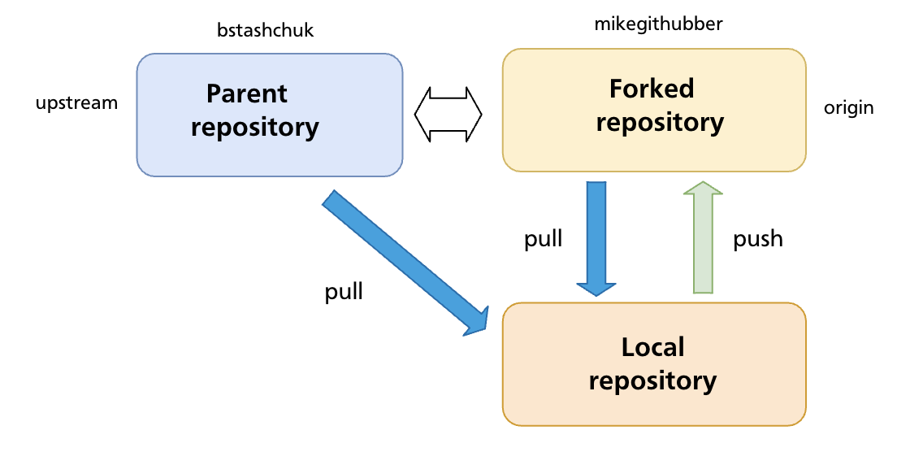

# Chapter 19 — Forks & Contributing to Open Source

The chapters so far assumed you have push access to the repository you're working in. Most open-source projects on GitHub work differently: the canonical repository is owned by someone else, and contributors don't have permission to push branches or commits to it directly. **Forking** is GitHub's mechanism for enabling this kind of contribution — a server-side copy of a repository under your own account that you control completely.

---

## What a Fork Is

A **fork** is a complete copy of a repository created under your own GitHub account. It is a GitHub-level concept (not a Git concept) — the copy lives on GitHub's servers, not on your machine.



Key properties of a fork:

- You own it — you can push to it freely without needing permission from the original project.
- It starts as an exact copy of the original at the moment of forking, including all branches, commits, and tags.
- It stays connected to the original repository (called **upstream**) — GitHub tracks the relationship and makes it easy to open pull requests back to it.
- Changes you make in your fork do not appear in the original until a pull request is opened and merged by the upstream maintainers.

---

## Fork vs Clone

These are frequently confused:

| | Fork | Clone |
|---|---|---|
| What it is | Server-side copy on GitHub (under your account) | Local copy on your machine |
| Created by | GitHub UI or `gh repo fork` | `git clone <url>` |
| Push access | You always have it (it's your repo) | Depends on whether you have permission on the remote |
| Relationship to original | GitHub tracks it; PRs can be opened | No formal relationship unless you add a remote |

In the typical open-source workflow you do **both**: fork the repository on GitHub, then clone your fork to your machine.

---

## The Standard Fork Contribution Workflow

### Step 1 — Fork on GitHub

Navigate to the repository you want to contribute to and click **Fork**. GitHub creates a copy at `github.com/<your-username>/<repo-name>`.

Using the GitHub CLI:

```bash
gh repo fork <owner>/<repo>          # fork and optionally clone in one step
gh repo fork <owner>/<repo> --clone  # fork and clone immediately
```

### Step 2 — Clone your fork locally

```bash
git clone git@github.com:<your-username>/<repo-name>.git
cd <repo-name>
```

Your fork is automatically set as `origin`.

### Step 3 — Add the upstream remote

Your fork's `origin` points to your copy. You also need a remote pointing to the original repository so you can pull in future changes:

```bash
git remote add upstream git@github.com:<original-owner>/<repo-name>.git
git remote -v
# origin    git@github.com:you/repo.git (fetch)
# origin    git@github.com:you/repo.git (push)
# upstream  git@github.com:original-owner/repo.git (fetch)
# upstream  git@github.com:original-owner/repo.git (push)
```

The convention is to name this remote `upstream`, though any name works.

### Step 4 — Create a feature branch

**Never commit directly to `main` in your fork.** Always create a branch for your work:

```bash
git switch -c fix/login-timeout
```

Working on a branch keeps your `main` clean so you can always sync it with upstream without conflicts, and lets you work on multiple contributions simultaneously.

### Step 5 — Make your changes and commit

Write code, run tests, follow the project's contribution guidelines. Commit your work:

```bash
git add src/auth.js tests/auth.test.js
git commit -m "Fix login timeout not respecting remember-me flag"
```

Keep commits focused and messages descriptive. Some projects require conventional commit format — check the project's `CONTRIBUTING.md`.

### Step 6 — Push the branch to your fork

```bash
git push -u origin fix/login-timeout
```

### Step 7 — Open a pull request

On GitHub, navigate to your fork. GitHub will usually display a banner prompting you to open a pull request for the recently pushed branch. Click **Compare & pull request**, or go to the original repository and open a PR from `your-username:fix/login-timeout` → `original-owner:main`.

A good pull request:

- Has a clear title summarising the change
- Explains what was changed and why in the description
- References any related issues (`Closes #123`)
- Is focused — one logical change per PR

Pull requests are covered in depth in Chapter 20.

---

## Keeping Your Fork Up to Date

The upstream repository continues to receive commits after you forked it. Over time your fork's `main` falls behind. Before starting new work — and especially before opening a PR — sync your fork with upstream.

### Sync via the command line

```bash
# Fetch the latest commits from upstream
git fetch upstream

# Switch to your local main
git switch main

# Merge (or rebase) upstream/main into your local main
git merge upstream/main
# or for a linear history:
git rebase upstream/main

# Push the updated main to your fork
git push origin main
```

### Sync via GitHub UI

GitHub provides a **Sync fork** button on your fork's main page. Click it to pull in upstream changes directly on GitHub without using the command line. After syncing on GitHub, pull the updated `main` locally:

```bash
git pull origin main
```

### Rebasing your feature branch onto updated upstream

After syncing `main`, update your feature branch to include the latest upstream changes:

```bash
git switch fix/login-timeout
git rebase main
```

This replays your feature branch commits on top of the now-updated `main`, keeping the PR diff clean and merge-conflict-free.

---

## Handling Upstream Changes While a PR Is Open

If the upstream `main` advances while your pull request is awaiting review, maintainers may ask you to rebase or update your branch:

```bash
git fetch upstream
git switch fix/login-timeout
git rebase upstream/main
git push --force-with-lease origin fix/login-timeout
```

Use `--force-with-lease` (not `--force`) to avoid overwriting any changes a collaborator may have pushed to your branch.

---

## Contribution Etiquette

Most active open-source projects document their expectations in a `CONTRIBUTING.md` file at the repository root. Read it before opening a PR. Common conventions:

- **Sign a CLA** (Contributor Licence Agreement) — many projects require this before accepting a PR
- **One concern per PR** — a PR that fixes a bug and adds a feature is harder to review and easier to reject
- **Tests** — add or update tests to cover your change; a PR that breaks the test suite is unlikely to be merged
- **Small diffs** — smaller PRs get reviewed faster; prefer several small PRs to one enormous one
- **Respond to feedback** — review comments are a conversation, not a rejection; address them and push updated commits

---

## Summary

- A **fork** is a server-side copy of a repository under your own GitHub account; a **clone** is a local copy on your machine. In the open-source workflow you do both.
- The standard flow: fork → clone → add `upstream` remote → feature branch → commit → push to fork → open PR.
- Never commit directly to `main` in your fork — keep it clean for syncing with upstream.
- Keep your fork current with `git fetch upstream` + `git merge upstream/main` (or GitHub's **Sync fork** button), then push to `origin`.
- Use `git rebase upstream/main` on your feature branch before opening or updating a PR to keep the diff clean.
- Read the project's `CONTRIBUTING.md` before contributing.

---

*Previous: [Chapter 18 — Push, Fetch & Pull](ch18-push-fetch-pull.md)* · *Next: [Chapter 20 — Pull Requests](ch20-pull-requests.md)*

