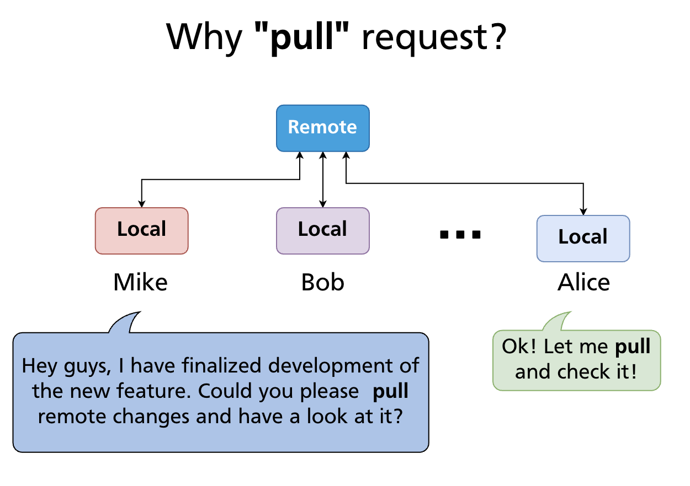
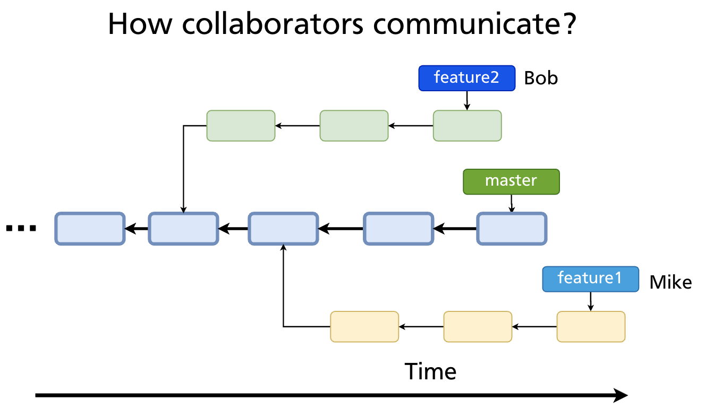
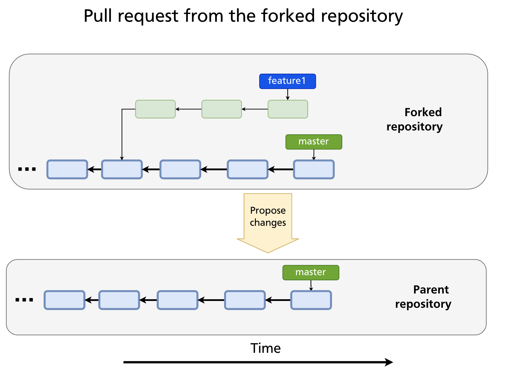
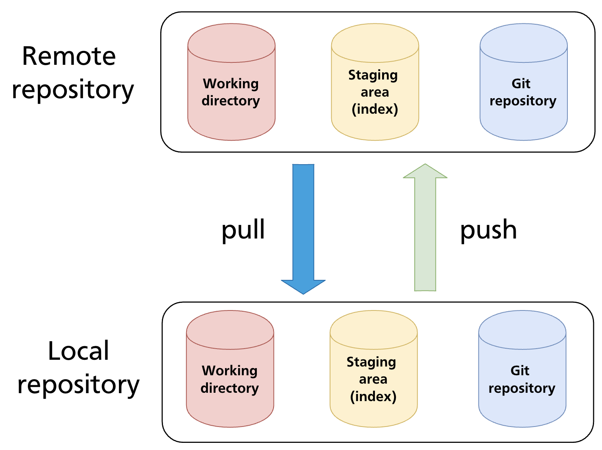
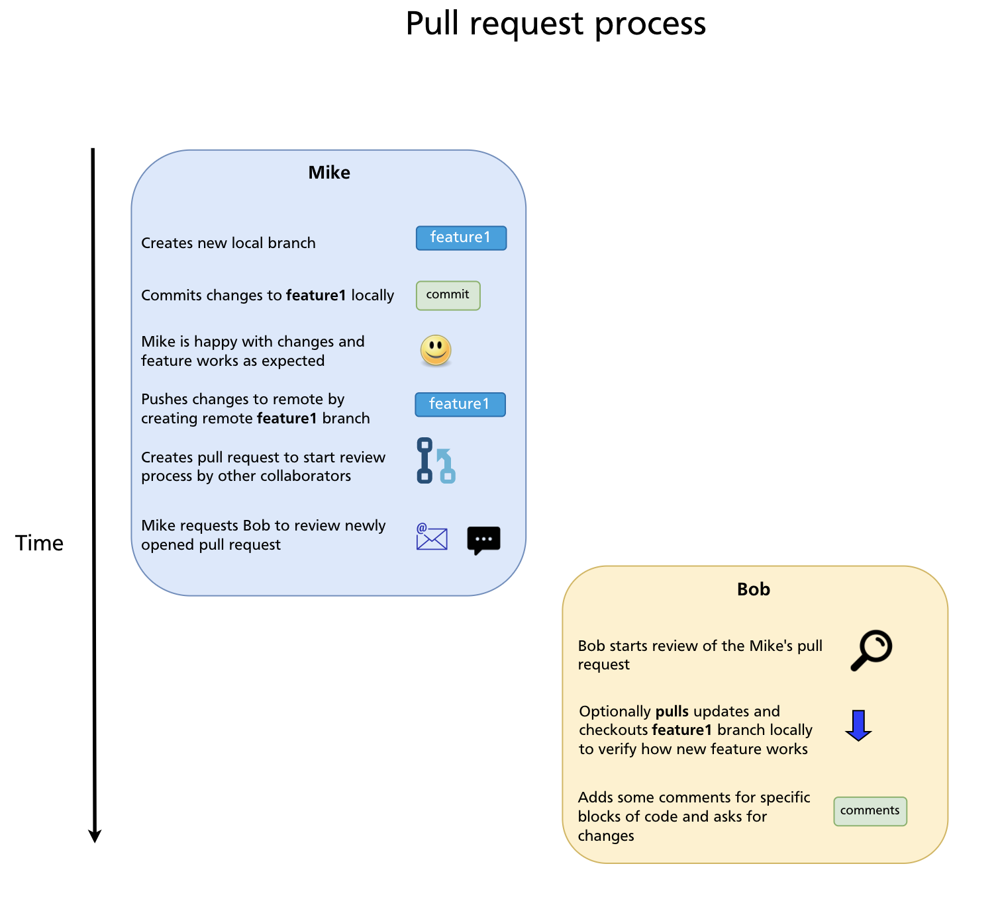
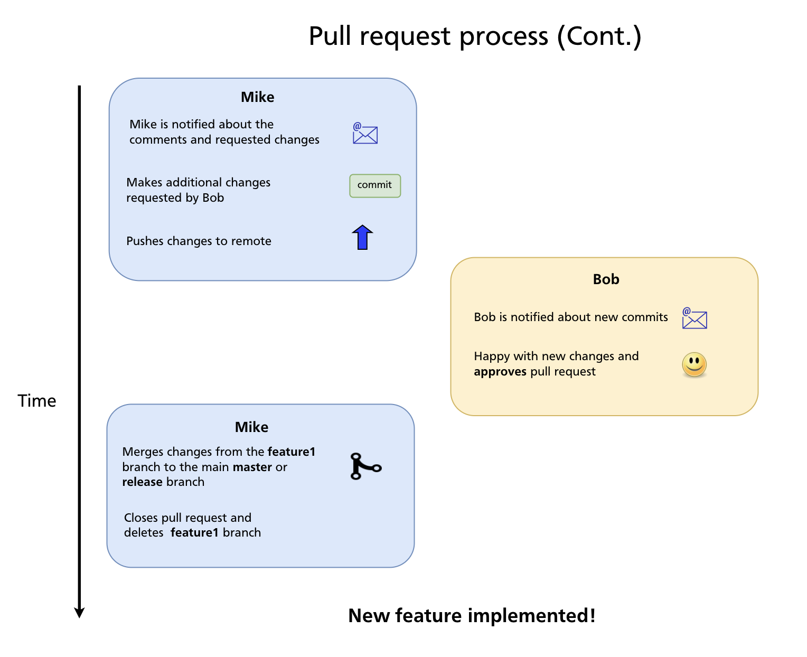

# Chapter 20 — Pull Requests

A **pull request** (PR) is a GitHub feature that lets you propose changes and ask maintainers or teammates to review and merge them. It is not a Git concept — there is no `git pull-request` command — but it is the central collaboration mechanism on GitHub and similar platforms, and understanding how to use it well is as important as any Git command.

---

## Why "Pull" Request?

The name comes from the action you're requesting: you're asking the repository owner to **pull** your changes into their branch.



In the open-source model (Chapter 19), you can't push directly to the upstream repository. Instead, you push to your fork and then open a pull request — a formal request saying "please pull these commits from my branch into yours."

---

## How Collaborators Use Pull Requests

Pull requests are the primary way collaborators communicate about proposed code changes on GitHub. Rather than committing directly to `main`, contributors push work to a separate branch and open a PR. This gives the team a structured place to:



- See a diff of exactly what would change
- Discuss the approach before it lands in the main branch
- Leave line-by-line code review comments
- Run automated checks (CI/CD)
- Approve the change formally before it is merged

---

## Two PR Models

### Within the same repository (team workflow)

For teams with direct access to a repository, the workflow is:

1. Create a feature branch from `main`
2. Push the branch to `origin`
3. Open a PR from `feature-branch` → `main`
4. Get review and approval from teammates
5. Merge the PR

This is the standard workflow for private repositories and teams.

### From a fork (open-source workflow)

For contributors who don't have push access to the original repository:



1. Fork the repository
2. Clone the fork
3. Create a feature branch
4. Push to the fork
5. Open a PR from `your-fork:feature-branch` → `original-repo:main`

The fork-based workflow is covered in detail in Chapter 19. From the reviewer's perspective, both models look identical — a PR is a PR regardless of whether the source branch lives in the same repo or a fork.

---

## Opening a Pull Request

### Via the GitHub UI

After pushing a branch, GitHub displays a yellow banner: *"Your recently pushed branch — Compare & pull request."* Click it, or go to the repository's **Pull requests** tab and click **New pull request**.

Select the **base branch** (where changes will land, e.g. `main`) and the **compare branch** (your feature branch). GitHub shows a diff of all commits and file changes.



Fill in the PR form:

| Field | Purpose |
|---|---|
| **Title** | Short summary of the change (imperative mood: "Add login timeout", not "Added") |
| **Description** | What changed, why, how to test it; link related issues with `Closes #123` |
| **Reviewers** | Team members you want to review the PR |
| **Assignees** | Who is responsible for the PR (usually the author) |
| **Labels** | Categorise the PR (bug, enhancement, documentation, etc.) |
| **Milestone** | Associate with a release or sprint goal |
| **Draft** | Mark as a draft to signal the PR is not ready for review yet |

### Via the GitHub CLI

```bash
gh pr create --title "Add login timeout" --body "Closes #42" --base main
```

### Closing issues automatically

If your PR description contains any of the following keywords followed by an issue number, GitHub closes the issue automatically when the PR is merged:

```
Closes #42
Fixes #42
Resolves #42
```

---

## The Review Process

### Requesting and performing a review

Add reviewers when opening the PR (or afterwards under the **Reviewers** sidebar). Reviewers receive a notification and can:

- Leave **general comments** on the PR
- Leave **line comments** on specific lines of the diff
- Start a **review** that accumulates multiple comments, then submit it as one of three outcomes:
  - **Approve** — the changes look good; ready to merge
  - **Request changes** — changes are required before merging
  - **Comment** — feedback without a formal approve/reject

### Responding to review comments

PR authors receive notifications for each comment. The standard flow:

1. Read the comment and understand the feedback
2. Make the change locally (or explain in the thread why you disagree)
3. Commit the fix to the same branch and push — the PR updates automatically
4. Mark the conversation as **Resolved** when addressed

### Viewing the PR locally

To check out a PR's branch locally for testing:

```bash
gh pr checkout 42          # check out PR #42 using the GitHub CLI
```

---

## CI Checks

Most repositories configure CI/CD pipelines (GitHub Actions, or external services) that run automatically on every PR. Common checks include:

- Unit and integration tests
- Linting and formatting
- Type checking
- Security scanning
- Build verification

A PR with failing checks is marked with a red ✗. Most teams configure branch protection rules (Chapter 21) to prevent merging until all required checks pass.

---

## Merge Options

When a PR is approved and checks pass, GitHub offers three merge strategies:





| Strategy | What it does | When to use |
|---|---|---|
| **Merge commit** | Creates a merge commit with two parents; preserves full branch history | Teams that want a record of every branch in history |
| **Squash and merge** | Combines all PR commits into a single commit on the base branch | Keeps `main` history clean; good for branches with many small/messy commits |
| **Rebase and merge** | Replays each PR commit individually on top of the base branch; no merge commit | Teams preferring linear history without a single squash |

The right choice depends on team preference and is often enforced by repository settings. Squash and merge is popular for feature branches; rebase and merge for clean, single-commit PRs.

### After merging

GitHub offers to delete the merged branch — accept this to keep the repository tidy. If the PR referenced an issue with `Closes #N`, the issue is closed automatically.

Locally, clean up:

```bash
git switch main
git pull                          # bring down the merged commits
git branch -d feature-auth        # delete the local feature branch
```

---

## Draft Pull Requests

A **draft PR** signals that the branch is still in progress and not ready for review. It is visible to the team (useful for early feedback, sharing progress, or running CI) but GitHub prevents accidental merging.

```bash
gh pr create --draft --title "WIP: Add auth module"
```

Convert to ready for review when done:

```bash
gh pr ready
```

Or click **Ready for review** in the GitHub UI.

---

## Updating a PR

If the base branch (`main`) has advanced since you opened the PR, GitHub may show a warning that the branch is out of date. Two ways to update:

**Update with merge** (GitHub UI button — creates a merge commit):

```bash
git fetch origin
git merge origin/main
git push origin feature-auth
```

**Update with rebase** (cleaner, preferred for linear history):

```bash
git fetch origin
git rebase origin/main
git push --force-with-lease origin feature-auth
```

Always use `--force-with-lease` when force-pushing to a PR branch — it refuses the push if a collaborator has added commits to your branch since you last fetched.

---

## Closing a PR Without Merging

To reject a PR without merging it, use the **Close pull request** button at the bottom of the PR page. The branch is not deleted automatically. Use this when:

- The approach was superseded by a different PR
- The feature is no longer needed
- You want to start over with a cleaner branch

You can always reopen a closed PR.

---

## Summary

- A pull request is a GitHub feature for proposing changes and requesting review; it is not a Git command.
- The two models: branch-to-branch within a repo (team workflow) and fork-to-upstream (open-source workflow).
- A good PR has a clear title, a description that explains the why, and links any related issues with `Closes #N`.
- Reviews can Approve, Request changes, or Comment; address feedback by pushing new commits to the same branch.
- Three merge strategies: merge commit (preserves history), squash and merge (clean single commit), rebase and merge (linear, no merge commit).
- After merging, delete the remote branch and pull locally: `git pull` + `git branch -d`.
- Draft PRs signal work-in-progress; convert to ready when reviewable.
- Use `git push --force-with-lease` when rebasing and force-pushing a PR branch.

---

*Previous: [Chapter 19 — Forks & Contributing to Open Source](ch19-forks.md)* · *Next: [Chapter 21 — Branch Protection & Code Review Workflows](ch21-branch-protection.md)*

