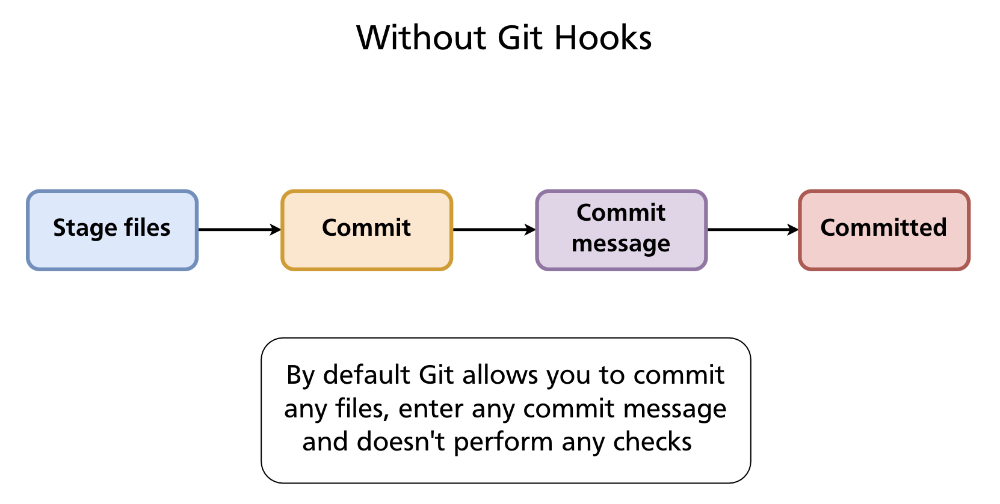
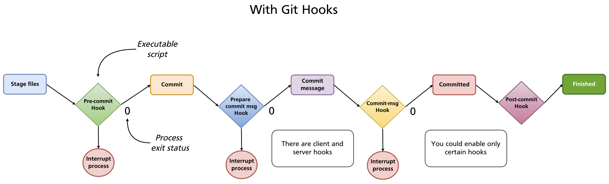
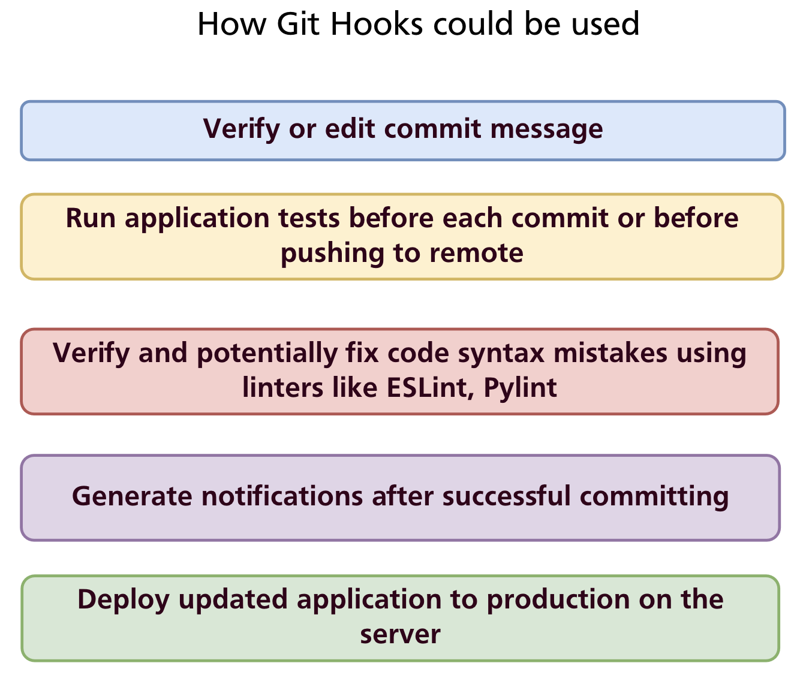

# Chapter 23 — Git Hooks

Every Git operation — committing, merging, pushing, rebasing — is a program that runs to completion and exits. **Git hooks** are scripts that Git runs automatically at specific points in those operations. They let you enforce rules, automate quality checks, and trigger external actions without anyone having to remember to do them manually.

---

## Without Hooks

By default Git accepts anything: any file content, any commit message, any sequence of operations. Nothing stops a developer from committing with trailing whitespace, a vague message, failing tests, or a hardcoded secret.



---

## With Hooks

A hook is an executable script placed in `.git/hooks/`. Git calls it at the appropriate moment and checks its exit status:

- **Exit 0** — success; Git continues the operation
- **Exit non-zero** — failure; Git aborts the operation (for hooks that can abort)



Hooks can be written in any language the system can execute — shell, Python, Node.js, Ruby, or any other. The shebang line (`#!/bin/sh`, `#!/usr/bin/env python3`, etc.) determines the interpreter.

---

## How Hooks Are Stored

Hooks live in `.git/hooks/`. When you initialise a repository, Git creates this directory with a set of `.sample` files — disabled examples you can read for reference:

```
.git/hooks/
├── commit-msg.sample
├── pre-commit.sample
├── pre-push.sample
├── prepare-commit-msg.sample
├── post-commit.sample
├── pre-rebase.sample
└── ...
```

To enable a hook, create (or rename) a file with the exact hook name — no extension — and make it executable:

```bash
# Create a pre-commit hook
touch .git/hooks/pre-commit
chmod +x .git/hooks/pre-commit
```

The filename must match exactly. `pre-commit` works; `pre-commit.sh` does not.

---

## Hook Types

Git hooks fall into two categories: **client-side** (run on your machine during local operations) and **server-side** (run on the remote when pushes arrive).

### Client-side hooks

| Hook | When it runs | Can abort? | Common use |
|---|---|---|---|
| `pre-commit` | Before the commit is created (after staging, before message) | Yes | Run linter, tests, check for secrets |
| `prepare-commit-msg` | After default message is created, before editor opens | Yes | Pre-populate message template |
| `commit-msg` | After message is entered, before commit is saved | Yes | Validate message format |
| `post-commit` | After commit is complete | No | Notifications, logging |
| `pre-rebase` | Before a rebase starts | Yes | Prevent rebasing published branches |
| `post-checkout` | After `git checkout` or `git switch` | No | Set up environment, update dependencies |
| `post-merge` | After a successful merge | No | Install new dependencies, rebuild |
| `pre-push` | Before push sends data to remote | Yes | Run full test suite before sharing |
| `pre-auto-gc` | Before automatic garbage collection | Yes | Pause or skip garbage collection |

### Server-side hooks

Server-side hooks run on the remote repository when it receives a push. They are configured by the server administrator, not individual developers.

| Hook | When it runs | Can abort? | Common use |
|---|---|---|---|
| `pre-receive` | Before any refs are updated | Yes | Enforce policies on all incoming commits |
| `update` | Once per branch being updated | Yes | Per-branch policies (e.g. protect main) |
| `post-receive` | After all refs are updated | No | Trigger CI, send notifications, deploy |

`post-receive` is the classic deployment hook: when a push lands on the production server, the hook checks out the new code and restarts the application.

---

## Common Use Cases



- **Validate commit messages** — enforce conventional commits or Jira ticket references
- **Run tests before committing** — catch failures before they enter history
- **Lint and auto-fix code** — run ESLint, Pylint, or `gofmt` and reject commits with errors
- **Prevent secrets from being committed** — scan staged files for API keys and passwords
- **Notify teammates** — send a Slack or email message after a commit or push
- **Deploy automatically** — on `post-receive`, pull the latest code and restart the service

---

## Writing Hooks: Examples

### `post-commit` — simple notification

The `post-commit` hook cannot abort a commit, making it safe for side effects:

```bash
#!/bin/sh
echo "Thanks for committing, $GIT_AUTHOR_NAME"
```

Save to `.git/hooks/post-commit` and make it executable. Git sets `GIT_AUTHOR_NAME` (and several other `GIT_*` environment variables) before calling hooks.

### `pre-commit` — whitespace check

A minimal `pre-commit` hook that rejects commits with trailing whitespace or mixed indentation:

```bash
#!/bin/sh

# Determine what to diff against (handle initial commit)
if git rev-parse --verify HEAD >/dev/null 2>&1; then
    against=HEAD
else
    against=$(git hash-object -t tree /dev/null)
fi

# Redirect output to stderr so it appears in the terminal
exec 1>&2

# Fail if the diff introduces whitespace errors
exec git diff-index --check --cached $against --
```

If `git diff-index --check` finds whitespace issues it exits non-zero and the commit is aborted with an error message listing the offending lines.

### `commit-msg` — enforce conventional commits format

The `commit-msg` hook receives the path to the file containing the commit message as `$1`:

```bash
#!/bin/sh

commit_msg=$(cat "$1")
pattern="^(feat|fix|docs|style|refactor|test|chore|build|ci)(\(.+\))?: .{1,72}"

if ! echo "$commit_msg" | grep -qE "$pattern"; then
    echo "ERROR: Commit message does not follow Conventional Commits format."
    echo "Expected: type(scope): description"
    echo "Example:  feat(auth): add remember-me option"
    exit 1
fi
```

### `pre-push` — run tests before pushing

```bash
#!/bin/sh

echo "Running tests before push..."
npm test

if [ $? -ne 0 ]; then
    echo "Tests failed. Push aborted."
    exit 1
fi
```

---

## Sharing Hooks Across a Team

`.git/hooks/` is **not committed to the repository** — it is inside the `.git/` directory which Git never tracks. This means hooks installed locally stay local; they are not shared automatically when someone clones the repository.

Three approaches to share hooks:

### 1. `core.hooksPath` — point Git at a tracked directory

Store hooks in a committed directory (e.g. `.githooks/`) and configure Git to look there instead of `.git/hooks/`:

```bash
# In the repository root
mkdir .githooks

# Configure Git (per-repo, committed to the repo via a setup script)
git config core.hooksPath .githooks
```

Team members run the one-time setup command after cloning. The hooks themselves live in `.githooks/` and are version-controlled. This is the simplest team-friendly approach for non-Node.js projects.

### 2. Setup script

Provide a `scripts/install-hooks.sh` that copies or symlinks hook files into `.git/hooks/`. Document it in the README and `CONTRIBUTING.md`.

```bash
#!/bin/sh
cp .githooks/pre-commit .git/hooks/pre-commit
chmod +x .git/hooks/pre-commit
```

### 3. Husky (Node.js projects)

[Husky](https://typicode.github.io/husky/) is the standard hook manager for Node.js projects. It stores hooks in a `.husky/` directory (committed to the repo) and installs them automatically via npm's `prepare` lifecycle script.

**Setup:**

```bash
npm install --save-dev husky
npx husky install          # creates .husky/ directory
```

Add the `prepare` script to `package.json` so hooks install automatically after `npm install`:

```json
{
  "scripts": {
    "prepare": "husky install"
  }
}
```

**Create a hook:**

```bash
npx husky add .husky/pre-commit "npm run lint && npm test"
```

This creates `.husky/pre-commit`:

```bash
#!/usr/bin/env sh
. "$(dirname -- "$0")/_/husky.sh"

npm run lint && npm test
```

Every developer who runs `npm install` automatically gets the hooks — no manual setup required.

**Combine with commitlint** to enforce commit message format:

```bash
npm install --save-dev @commitlint/cli @commitlint/config-conventional
npx husky add .husky/commit-msg 'npx --no -- commitlint --edit "$1"'
```

Add `commitlint.config.js`:

```js
module.exports = { extends: ['@commitlint/config-conventional'] };
```

Now every commit message is validated against the Conventional Commits specification automatically.

---

## Bypassing Hooks

Hooks can be bypassed with `--no-verify` (`-n`):

```bash
git commit --no-verify -m "WIP: skip hooks for now"
git push --no-verify
```

> **Warning:** `--no-verify` skips all client-side hooks, including those that prevent bad commits. Use it sparingly and deliberately — never as a habit to avoid fixing lint errors or test failures.

---

## Summary

- Git hooks are executable scripts in `.git/hooks/` that run automatically at points in Git operations; exit 0 continues, non-zero aborts.
- **Client-side hooks**: `pre-commit`, `commit-msg`, `pre-push`, `post-commit`, and others run locally.
- **Server-side hooks**: `pre-receive`, `update`, `post-receive` run on the remote and enforce server-side policies or trigger deployment.
- Hooks are not committed — share them via `core.hooksPath` (point to a tracked directory), a setup script, or a tool like Husky.
- **Husky** is the standard Node.js solution: hooks live in `.husky/`, install via `npm install`, and integrate with commitlint for message validation.
- `git commit --no-verify` bypasses hooks — use only when necessary.

> **Further reading:** [Git Hooks — Pro Git book](https://git-scm.com/book/en/v2/Customizing-Git-Git-Hooks) · [Husky documentation](https://typicode.github.io/husky/)

---

*Previous: [Chapter 22 — GitHub Issues & Project Management](../part4/ch22-issues-projects.md)* · *Next: [Chapter 24 — GitHub Actions & CI/CD](ch24-github-actions.md)*

