# Chapter 28 — Git Object Model: Blobs, Trees & Commits

Every high-level Git command — `git add`, `git commit`, `git checkout` — is ultimately a thin wrapper over a small set of operations on a content-addressable object store. Understanding what lives in `.git/objects/` and how the four object types relate to each other explains *why* Git behaves the way it does: why branching is free, why identical files are never stored twice, why history is immutable, and why a corrupt object is instantly detectable.

---

## The `.git` Directory

When you run `git init`, Git creates a `.git/` directory at the repository root:

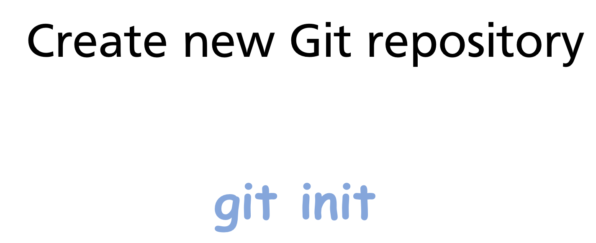

Key subdirectories:

```
.git/
├── objects/       ← the object store — all content lives here
├── refs/          ← branch and tag pointers (SHA references)
├── HEAD           ← pointer to the current branch
├── index          ← the staging area (binary file)
└── config         ← repository-local configuration
```

Everything Git knows about your project's history, content, and current state is in this directory.

---

## The Four Object Types

Git stores everything as one of four object types:

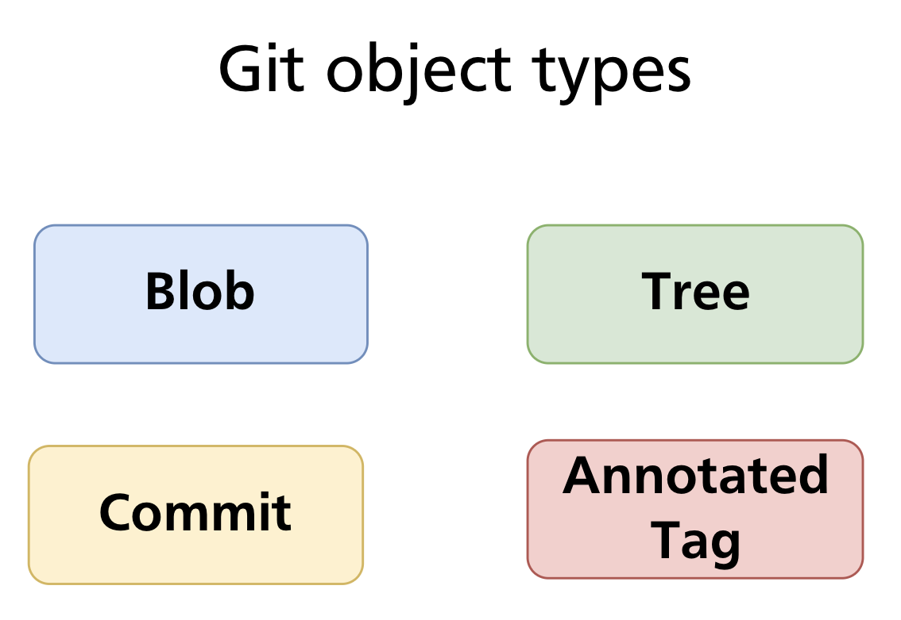

| Type | Stores | Analogous to |
|---|---|---|
| **Blob** | Raw file content | A file |
| **Tree** | A directory listing (names, modes, blob/tree SHAs) | A directory |
| **Commit** | A snapshot pointer + metadata | A version of the project |
| **Annotated tag** | A named, signed pointer to any object | A labelled release |

Every object is identified by the SHA-1 hash of its content (covered in depth in Chapter 29). The objects are immutable — once written, they never change.

---

## Blobs — File Content

A **blob** (Binary Large Object) stores the raw contents of a single file — nothing else. No filename, no permissions, no path.


Two files with identical content — regardless of their names or locations — produce the same blob SHA and are stored as a single object. Git never stores duplicate content.

### Creating a blob manually

The low-level command `git hash-object` computes the SHA-1 of content and optionally writes it to the object store:

```bash
echo "Hello, Git" | git hash-object --stdin -w
# 8ab686eafeb1f44702738c8b0f24f2567c36da6d
```

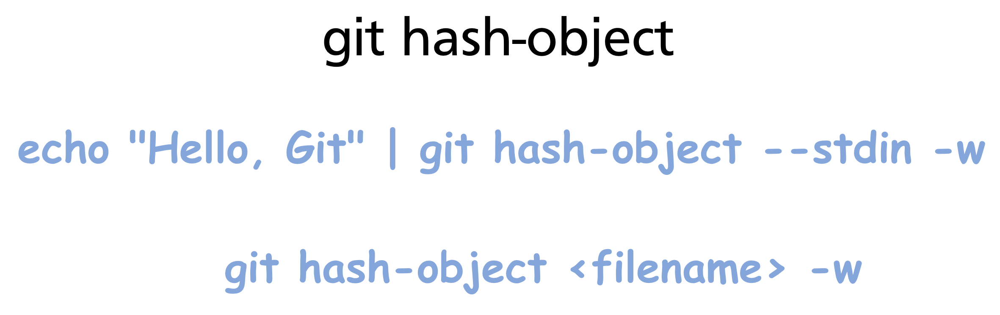

The `-w` flag writes the object; without it, `hash-object` only computes and prints the SHA.

### Inspecting objects with `git cat-file`

`git cat-file` is the low-level command for reading objects from the store:

```bash
git cat-file -p 8ab686e   # print content
# Hello, Git

git cat-file -t 8ab686e   # print type
# blob

git cat-file -s 8ab686e   # print size in bytes
# 11
```

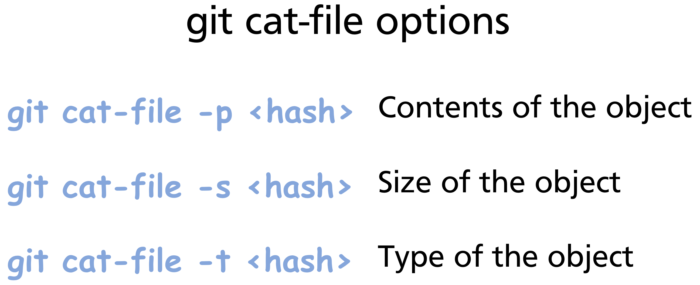

### Object storage format

Every object stores its type and size as a header, followed by a null byte delimiter, followed by the content:

```
blob 11\0Hello, Git
```

This is why `git cat-file -t` knows the type without consulting any external index — the type is embedded inside the object itself.

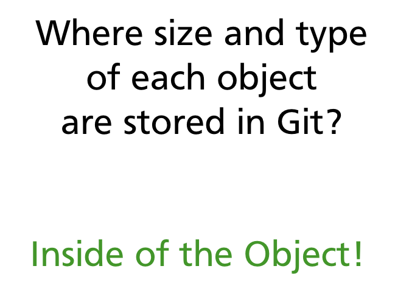

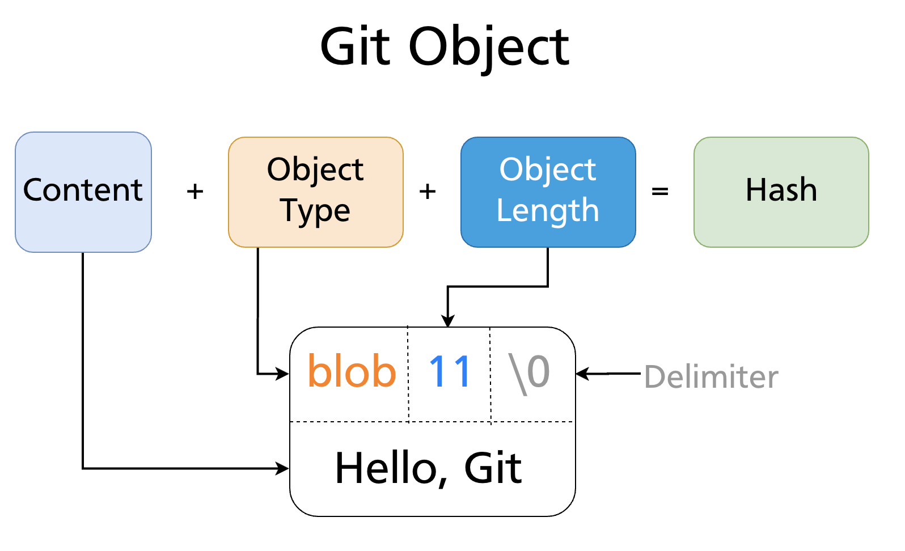

The entire bundle is then zlib-compressed and written to `.git/objects/<first-two-hex-chars>/<remaining-38-chars>`.

---

## Trees — Directories

A **tree** object represents a directory. It contains a list of entries, where each entry records:

- A **mode** (file permissions / object type)
- A **type** (`blob` or `tree`)
- A **SHA-1** (pointing to the blob or subtree)
- A **name** (filename or directory name)

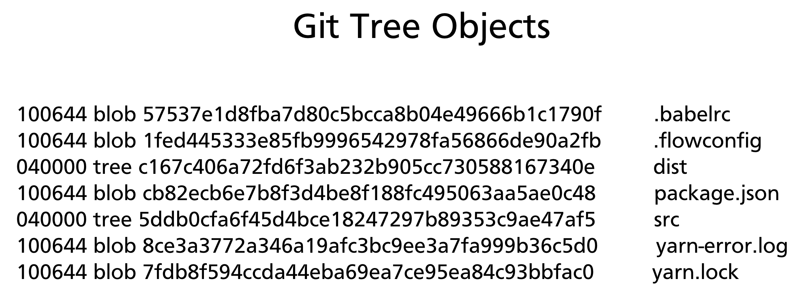

Blobs have no filenames — names live in tree entries. This is why renaming a file without changing its content produces no new blob: the blob is reused; only the tree entry changes.

### Object permission modes

| Mode | Meaning |
|---|---|
| `040000` | Directory (subtree) |
| `100644` | Regular non-executable file |
| `100755` | Regular executable file |
| `120000` | Symbolic link |
| `160000` | Gitlink (submodule) |

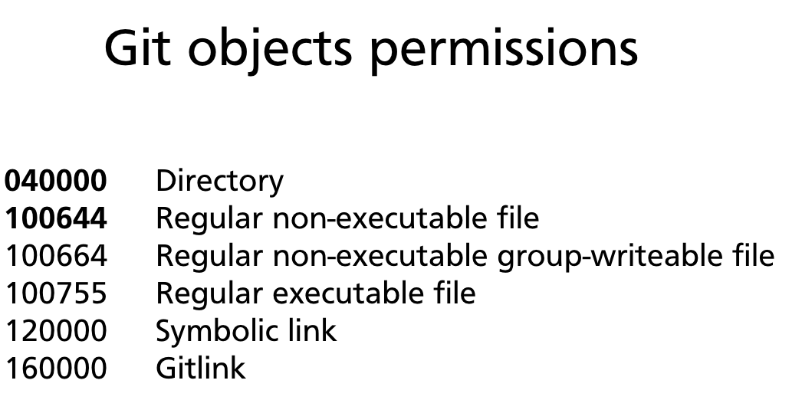

### A tree in practice

Inspecting a tree with `git cat-file -p`:

```bash
git cat-file -p HEAD^{tree}
# 100644 blob b7aec520dec0a7516c18eb4c68b64ae1eb9b5a5e    file1.txt
# 100644 blob 4400aae52a27341314f423095846b1f215a7cf08    file2.txt
```

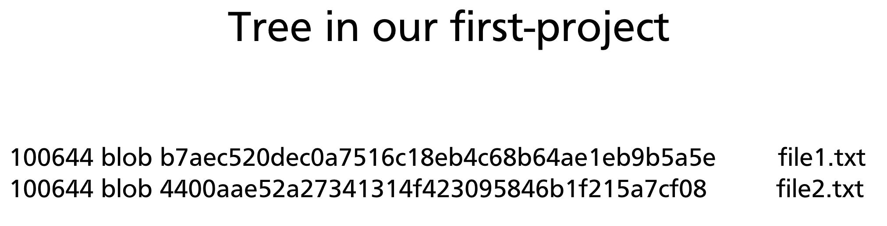

Nested directories are represented by tree entries whose type is `tree`. The entire project tree is a recursive structure of tree and blob objects:

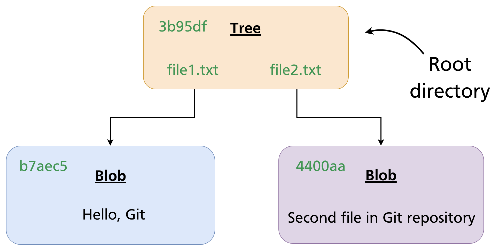

### Creating a tree manually

`git mktree` reads a tree listing from stdin and writes a tree object:

```bash
printf "100644 blob b7aec520    file1.txt\n100644 blob 4400aae5    file2.txt\n" \
  | git mktree
# 3b95df25a1a42f06c6c98e8eedc91b72bfd6ac46
```

---

## Commits — Snapshots

A **commit** object ties everything together. It contains:

- A pointer to the **root tree** — the complete state of the project at this point
- A pointer to the **parent commit** (or two parents for a merge commit, none for the root commit)
- Author name, email, and timestamp
- Committer name, email, and timestamp (may differ from author — e.g. after cherry-pick)
- The commit message

```bash
git cat-file -p HEAD
# tree   3b95df25a1a42f06c6c98e8eedc91b72bfd6ac46
# parent a1b2c3d4e5f6...
# author  Alice <alice@example.com> 1711234567 +1000
# committer Alice <alice@example.com> 1711234567 +1000
#
# Add file1.txt and file2.txt
```

A commit does **not** store a diff. It stores a complete snapshot via the root tree pointer. Git computes diffs on the fly by comparing two tree objects.

### The commit chain

Each commit points to its parent, forming an immutable linked list stretching back to the initial commit. Branches are simply named pointers to commits in this chain (Chapter 11). The chain cannot be modified — changing any commit would change its SHA and break every descendant.

---

## Annotated Tags

An **annotated tag** is a full Git object (unlike lightweight tags, which are just ref files) containing:

- A pointer to the tagged object (usually a commit)
- The tagger's name, email, and timestamp
- A tag message
- An optional GPG signature

```bash
git cat-file -p v1.0.0
# object a3f8c21d4e5b...
# type   commit
# tag    v1.0.0
# tagger Alice <alice@example.com> 1711234567 +1000
#
# Release version 1.0.0
```

Because an annotated tag is an object, it has its own SHA and can be cryptographically signed and verified. Lightweight tags (covered in Chapter 15) are not objects — they are just ref files pointing directly to a commit.

---

## Object Storage Layout

Git stores objects under `.git/objects/`. The first two hex characters of the SHA become the directory name; the remaining 38 become the filename:

```
.git/objects/
├── 8a/
│   └── b686eafeb1f44702738c8b0f24f2567c36da6d
├── 3b/
│   └── 95df25a1a42f06c6c98e8eedc91b72bfd6ac46
├── a3/
│   └── f8c21d4e5b...
└── ...
```

Git uses exactly 256 subdirectories (16 × 16 = one for every two-hex-character combination). This limits the number of entries per directory, keeping filesystem lookups fast even with millions of objects.

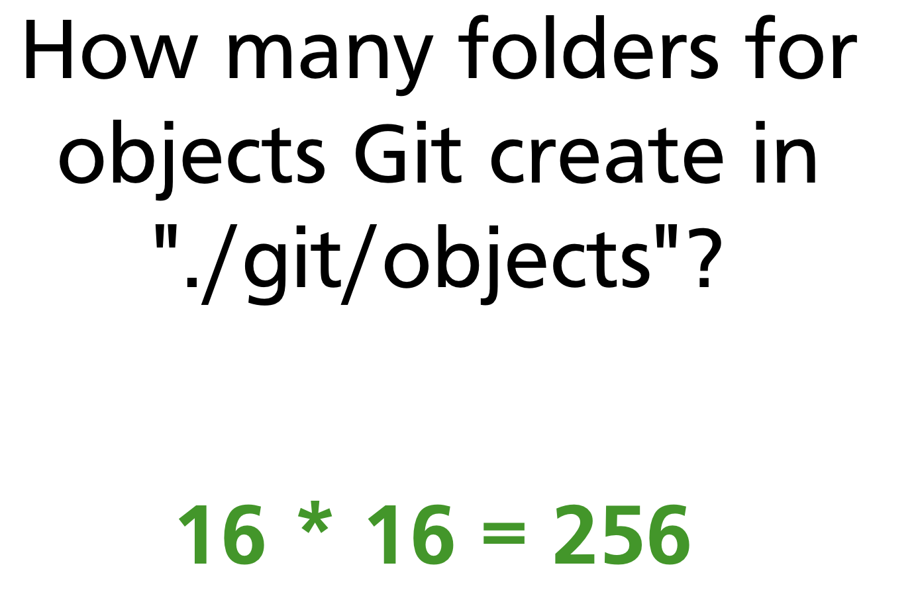

Over time, Git packs individual object files into **packfiles** (`.git/objects/pack/*.pack`) for efficiency. Packfiles use delta compression between similar objects and are created by `git gc` (garbage collection) or during `git push`.

---

## How the Three Areas Map to Objects

Git's three areas (Chapter 5) map directly onto the object model:

| Area | Object involvement |
|---|---|
| **Working directory** | Plain files — not yet objects |
| **Staging area (index)** | Blob SHAs computed and registered; tree not yet written |
| **Repository (`.git/objects/`)** | Blobs, tree, and commit all written |

`git add` computes the blob SHA for each staged file and writes the blob to the object store, recording the SHA in the index. `git commit` then creates the tree object from the index and the commit object from the tree.

---

## Low-Level Commands Reference

These plumbing commands operate directly on the object store, bypassing the porcelain layer:

| Command | What it does |
|---|---|
| `git hash-object -w <file>` | Write a blob and return its SHA |
| `git cat-file -p <sha>` | Print object content |
| `git cat-file -t <sha>` | Print object type |
| `git cat-file -s <sha>` | Print object size |
| `git mktree` | Create a tree from a listing on stdin |
| `git read-tree <sha>` | Load a tree into the staging area |
| `git ls-files -s` | List files currently in the staging area |
| `git checkout-index -a` | Copy staging area to working directory |
| `git write-tree` | Write the current staging area as a tree object |
| `git commit-tree <tree>` | Create a commit object from a tree |

These are the building blocks that high-level commands (`git add`, `git commit`, `git checkout`) compose internally.

---

## Summary

- Git stores everything as one of four immutable object types: **blob** (file content), **tree** (directory), **commit** (snapshot + metadata), **annotated tag** (signed pointer with message).
- Objects are identified by the SHA-1 hash of their content — identical content always produces the same SHA and is never stored twice.
- Blobs store content only — no filename. Filenames and paths live in tree entries.
- A commit points to a root tree (complete snapshot), its parent commit(s), and author metadata. It stores no diff.
- Objects are stored in `.git/objects/<2-hex>/<38-hex>`, in 256 subdirectories. Packfiles compress objects for long-term storage.
- Low-level plumbing commands (`git hash-object`, `git cat-file`, `git mktree`, `git read-tree`) expose the object store directly.

> **Further reading:** [Git Internals — Git Objects (Pro Git)](https://git-scm.com/book/en/v2/Git-Internals-Git-Objects)

---

*Previous: [Chapter 27 — Git Aliases & Productivity Tips](../part6/ch27-aliases-tips.md)* · *Next: [Chapter 29 — SHA-1, Hashing & Object Storage Internals](ch29-hashing-internals.md)*

