# Chapter 29 — SHA-1, Hashing & Object Storage Internals

Every object in Git is identified by a 40-character hexadecimal string. That string is not an arbitrary ID assigned by a counter or a database — it is a **cryptographic hash** of the object's content. Understanding how that hash is computed, what guarantees it provides, and why collision is effectively impossible explains why Git's content-addressable store is both simple and reliable.

---

## What Is a Hash Function?

A **hash function** takes an input of arbitrary length — a single byte, a sentence, a 2 GB file — and produces an output of a fixed, predetermined length. The output is called a **hash**, **digest**, or **checksum**.

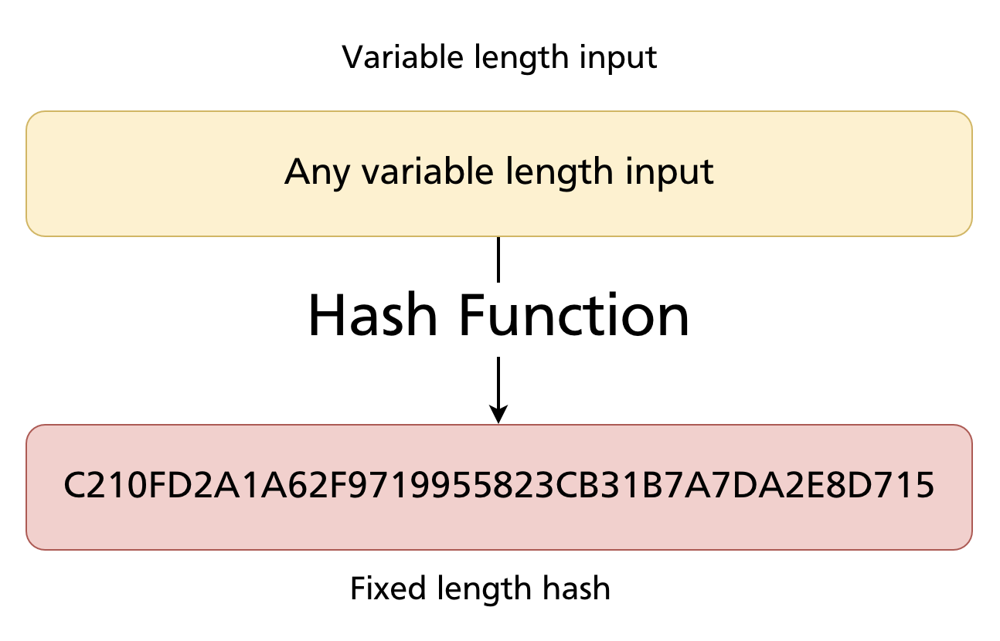

Key properties of a cryptographic hash function:

- **Deterministic:** the same input always produces the same output.
- **Fixed-length output:** regardless of input size, the output is always the same number of bits.
- **Avalanche effect:** a tiny change in the input produces a completely different output — there is no partial similarity.
- **One-way:** you cannot reconstruct the input from the hash.
- **Collision-resistant:** it is computationally infeasible to find two different inputs that produce the same hash.

---

## Hash Algorithms

Several hash algorithms are in common use, differing in output size and therefore in the number of possible unique hashes:

| Algorithm | Output size | Possible unique hashes |
|---|---|---|
| MD5 | 128 bit | 2¹²⁸ ≈ 3.4 × 10³⁸ |
| **SHA-1** | **160 bit** | **2¹⁶⁰ ≈ 1.46 × 10⁴⁸** |
| SHA-256 | 256 bit | 2²⁵⁶ ≈ 1.16 × 10⁷⁷ |
| SHA-384 | 384 bit | 2³⁸⁴ |
| SHA-512 | 512 bit | 2⁵¹² |

Git uses **SHA-1** by default (with SHA-256 available as an opt-in since Git 2.29).

---

## SHA-1 in Detail

SHA-1 produces a **160-bit** hash value, conventionally displayed as a 40-character hexadecimal string:

```
C210FD2A1A62F9719955823CB31B7A7DA2E8D715
```

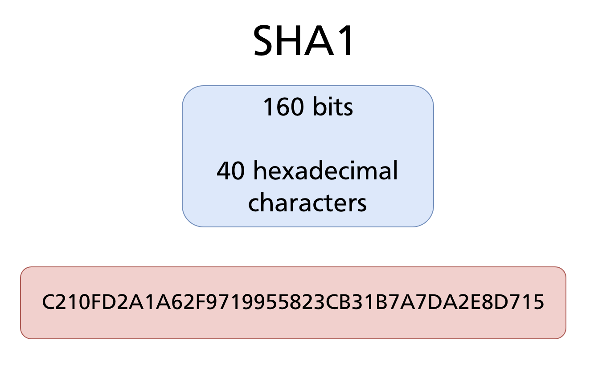

### Hexadecimal representation

Hexadecimal (base 16) uses 16 symbols: `0 1 2 3 4 5 6 7 8 9 A B C D E F`. Each hexadecimal digit represents exactly 4 bits, so 160 bits = 40 hex digits.

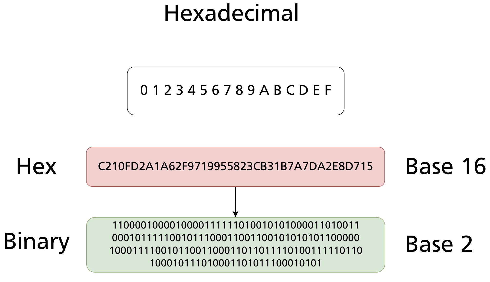

The same hash expressed in binary would be 160 characters of `0`s and `1`s — hexadecimal is simply a more compact human-readable encoding of the same value.

---

## The Avalanche Effect

A defining property of SHA-1 is that even the smallest change to the input produces a completely different hash — there is no relationship between the two outputs:

```
"Hello, Git"  → 0A2B198F595E55060DEC9F0E196C10DE86F2CA1C
"Hello, Git!" → 1D4D7D92F79DC328154DC91424E6E740F8F5A563
```

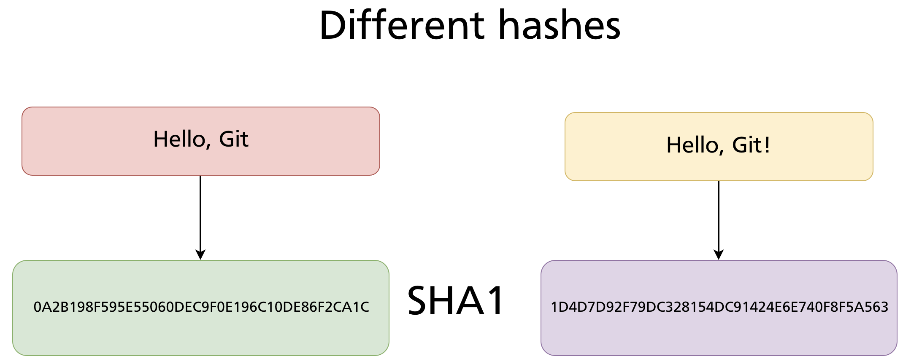

Adding a single `!` changes every character of the 40-digit hash. This is not a coincidence — it is a deliberate property called the **avalanche effect**, and it is what makes hash-based identity reliable. You cannot tell from two hashes whether the underlying files are similar or not.

This also explains Git's immutability guarantee: change one character anywhere in a commit message, author name, timestamp, or file content, and the commit's SHA changes entirely — as does every descendant commit that references it.

---

## How Many Objects Can Git Store?

SHA-1 produces 2¹⁶⁰ possible distinct hashes:

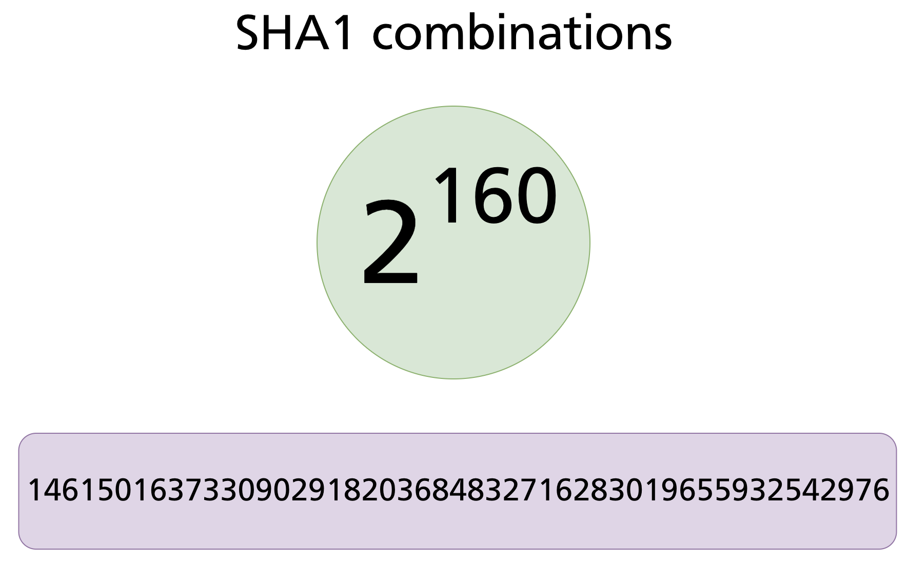

That number — approximately 1.46 × 10⁴⁸ — is orders of magnitude larger than any conceivable repository. For comparison, there are estimated to be around 10⁸⁰ atoms in the observable universe. Git's address space is not infinite, but it is so large that exhausting it is not a practical concern.

---

## Hash Collision Probability

A **hash collision** occurs when two different inputs produce the same hash. If two files in a repository collided, Git would treat them as identical — an incorrect and potentially dangerous result. Three questions arise:

1. How many objects can Git store before collision becomes likely?
2. What is the probability of producing the exact same hash for two specific files?
3. What is the probability of any collision among a set of files?

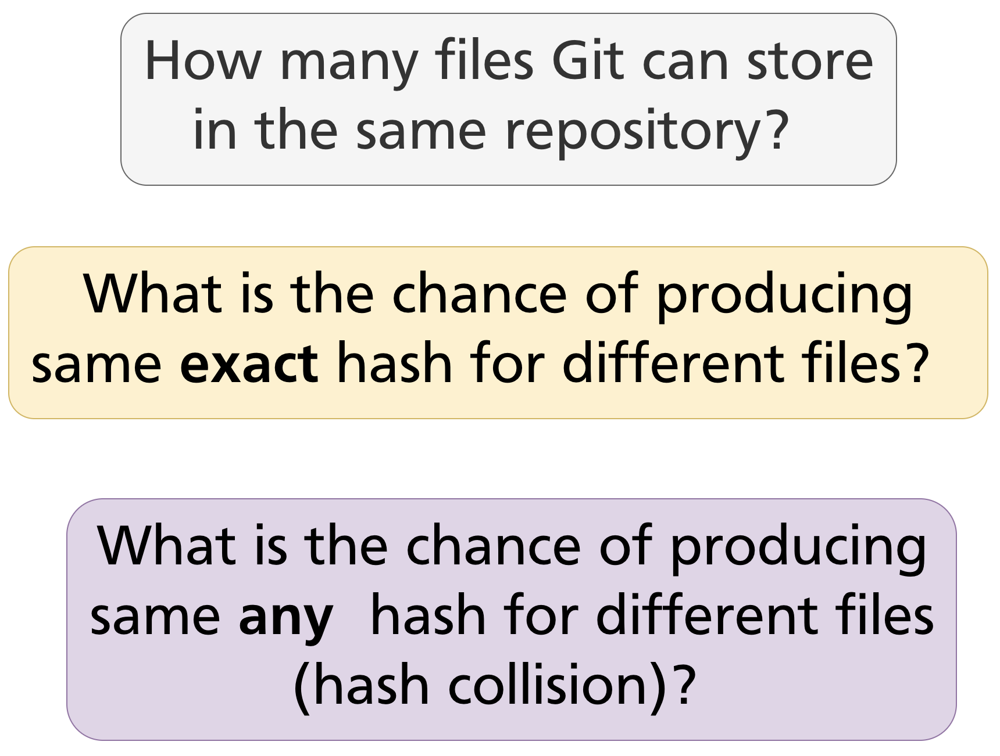

### Probability of a specific collision

The probability that any two specific files happen to produce the same SHA-1 hash is:

```
P(same specific hash) = 1/2¹⁶⁰ × 1/2¹⁶⁰ = 1/2³²⁰
```

2³²⁰ ≈ 2.13 × 10⁹⁶, so the probability is approximately **4.68 × 10⁻⁹⁷** — a decimal with 96 zeros before the first significant digit.

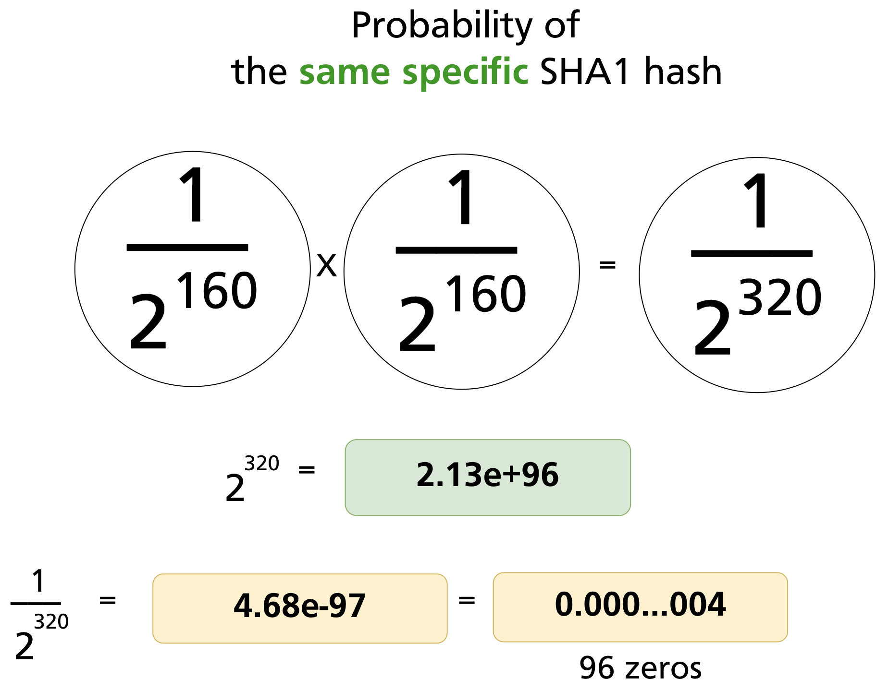

### The birthday problem analogy

The probability of any collision among a set of N files (not two specific files) is higher — this is the **birthday problem**. It is analogous to rolling dice: as you roll more dice, the probability that any two show the same number grows faster than intuition suggests.

With two dice (6 faces each), the probability that both show the same value is 1/6 ≈ 0.17.

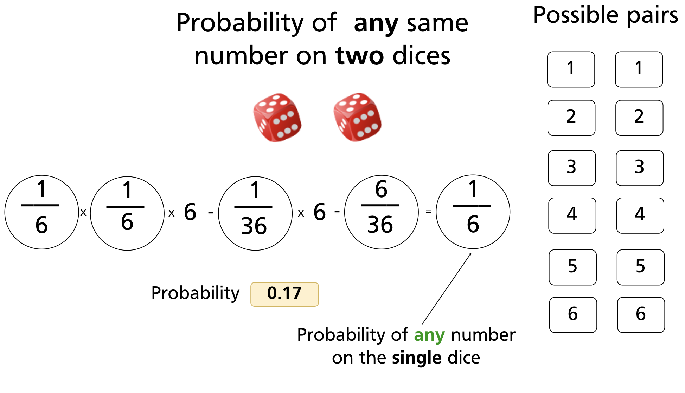

With three dice, the probability of any matching pair drops to 1/36 ≈ 0.03.

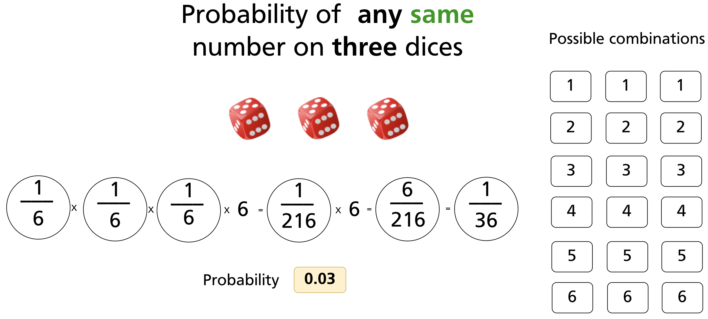

Generalising to N dice:

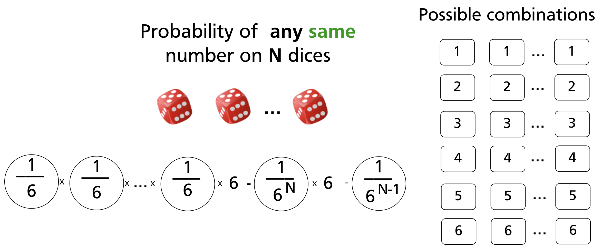

For SHA-1, the "dice" has 2¹⁶⁰ faces. Applying the same logic to N files in a repository:

| N files | Probability of any SHA-1 collision |
|---|---|
| 2 | 6.84 × 10⁻⁴⁹ |
| 3 | 2.05 × 10⁻⁴⁸ |

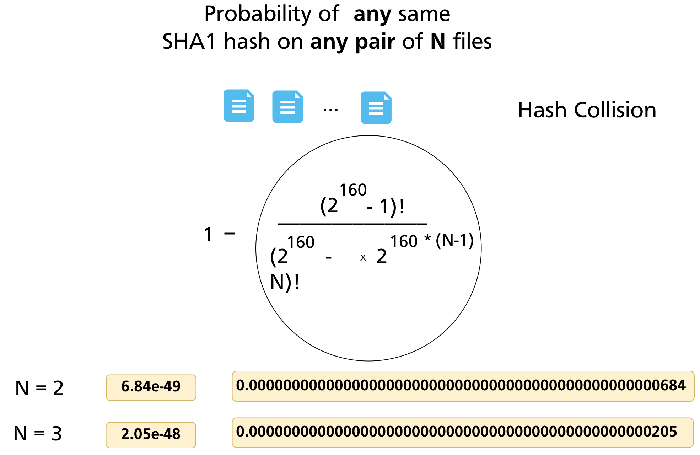

Even the Linux kernel repository — one of the largest Git repositories in existence, with millions of objects accumulated over decades — has a SHA-1 collision probability so close to zero that it is not a practical concern for data integrity. Every object in the store can be treated as uniquely identified by its hash.

---

## SHA-1 and Git: Why It Works

The properties of SHA-1 map directly onto Git's requirements:

| SHA-1 property | Git benefit |
|---|---|
| Same input → same hash | Identical file content → same blob SHA → deduplication |
| Different input → different hash | Any content change → new object; old object preserved |
| Hash embeds type and content | `git cat-file -t` reads type from inside the object |
| Avalanche effect | Tampered objects are immediately detectable |
| Fixed 40-char output | Uniform, efficiently stored object identifiers |

When you run `git add`, Git computes the SHA-1 of `blob <size>\0<content>`, writes the zlib-compressed result to `.git/objects/<2-hex>/<38-hex>`, and stores the SHA in the index. When you later run `git fsck`, it re-computes every SHA and compares — any corruption produces a mismatch.

### Computing SHA-1 directly

You can verify Git's SHA-1 computation yourself using `git hash-object`:

```bash
echo "Hello, Git" | git hash-object --stdin
# 8ab686eafeb1f44702738c8b0f24f2567c36da6d

# Equivalent using sha1sum on the full object format:
printf "blob 11\0Hello, Git" | sha1sum
# 8ab686eafeb1f44702738c8b0f24f2567c36da6d
```

The SHA-1 Git computes is always over the full object content — `<type> <size>\0<data>` — not just the raw file bytes. This is why `git hash-object` and `sha1sum <file>` produce different values for the same file: the object header changes the input.

---

## SHA-256 and the Transition

SHA-1 has a known theoretical weakness: researchers have demonstrated **chosen-prefix collisions** — crafted pairs of different inputs that produce the same SHA-1 hash (the SHAttered attack, 2017). While the attack requires enormous computational resources and the attack surface for Git objects is narrow (the header includes the type and size, constraining what an attacker can manipulate), Git's maintainers decided to begin a gradual transition to SHA-256.

Since Git 2.29 (released 2020), you can initialise a SHA-256 repository:

```bash
git init --object-format=sha256
```

SHA-256 hashes are 64 hexadecimal characters rather than 40. The object model is identical; only the hash algorithm and hash length change. SHA-256 and SHA-1 repositories are currently incompatible — you cannot mix objects or push between them without conversion tooling, which is still under active development.

For all practical purposes in 2024–2025, the vast majority of repositories use SHA-1 and will continue to do so until the migration path matures.

---

## Summary

- A **hash function** maps arbitrary-length input to a fixed-length output deterministically. Small input changes produce completely different outputs (avalanche effect).
- Git uses **SHA-1** by default: 160 bits, expressed as 40 hexadecimal characters.
- Every Git object's identifier is the SHA-1 of `<type> <size>\0<content>` — the header is included in the hash, not just the file bytes.
- The probability of a SHA-1 collision in any real repository is vanishingly small — approximately 6.84 × 10⁻⁴⁹ for any two specific objects.
- SHA-1 enables deduplication (identical content → same SHA), integrity checking (corruption → hash mismatch), and immutability (changing content changes the SHA).
- Git 2.29+ supports SHA-256 repositories (`git init --object-format=sha256`). The transition is ongoing; SHA-1 remains the default.

> **Further reading:** [Git Internals — Git Objects (Pro Git)](https://git-scm.com/book/en/v2/Git-Internals-Git-Objects) · [SHAttered — SHA-1 collision attack (2017)](https://shattered.io/)

---

*Previous: [Chapter 28 — Git Object Model: Blobs, Trees & Commits](ch28-object-model.md)* · *Next: [Appendix A — Git Submodules](../appendix/appA-submodules.md)*
