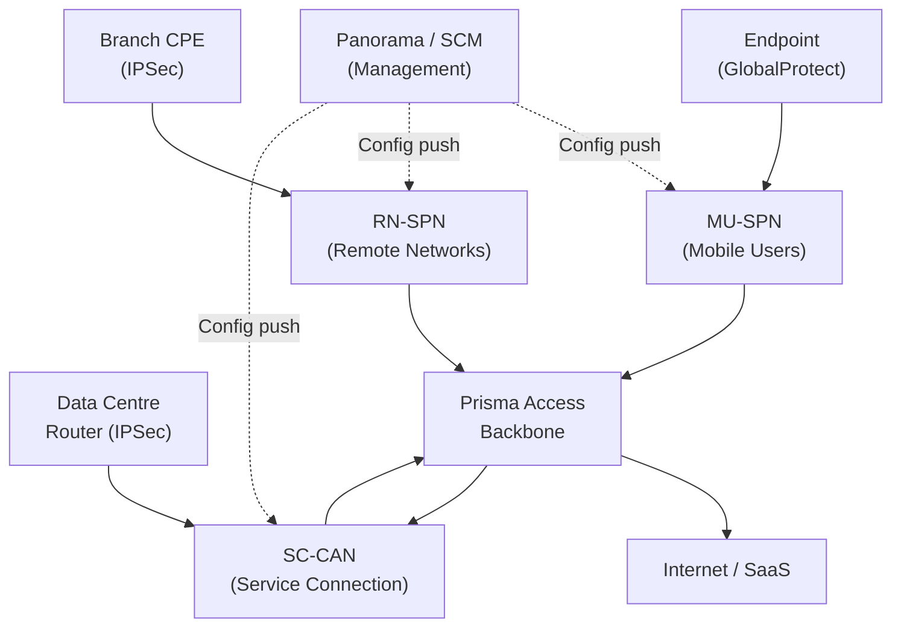
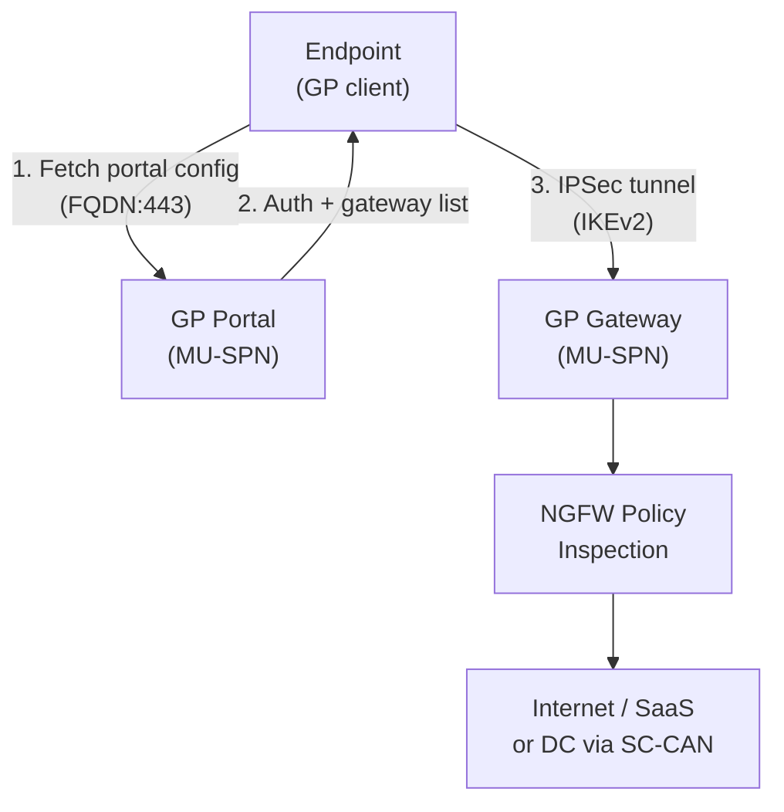
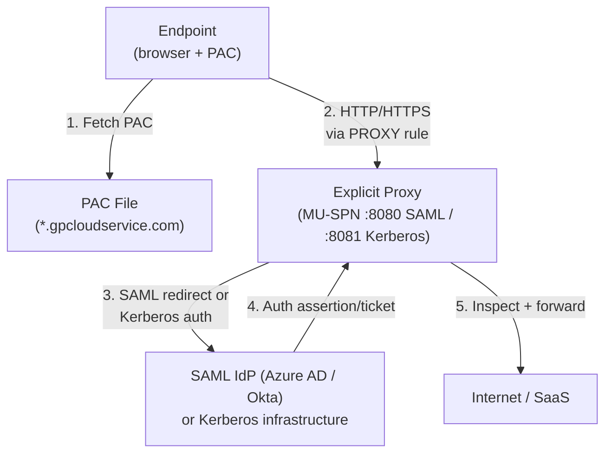
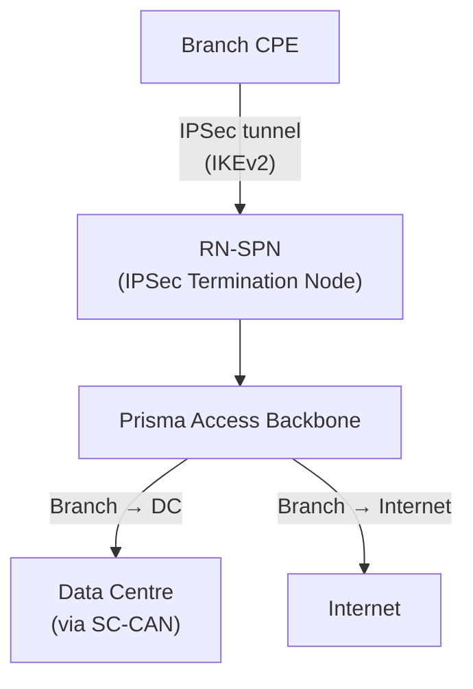
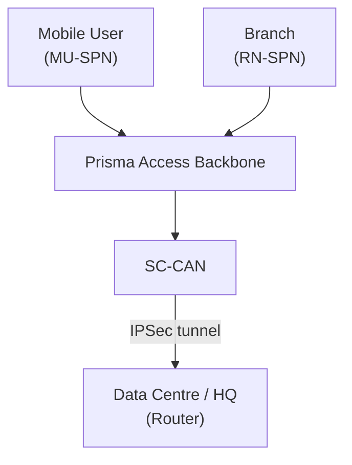
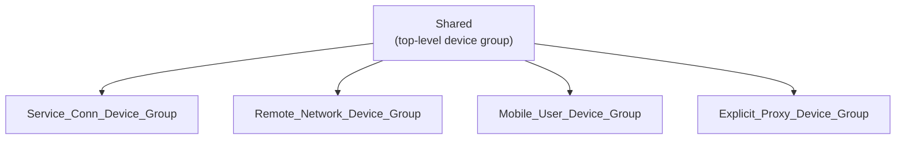

# Appendix C — Architecture Quick-Reference

---

## Prisma Access Component Summary

| Component | Full Name | Role | Connected To |
|---|---|---|---|
| **MU-SPN** | Mobile User — Service Processing Node | Terminates GlobalProtect VPN tunnels and Explicit Proxy connections | Endpoints, internet |
| **RN-SPN** | Remote Network — Service Processing Node | Terminates branch site IPSec tunnels | Branch CPEs |
| **SC-CAN** | Service Connection — Cloud Access Node | Terminates data centre / HQ IPSec tunnels | DC routers |
| **Prisma Access Backbone** | — | Internal high-speed backbone connecting all SPNs and CANs | MU-SPN ↔ RN-SPN ↔ SC-CAN |
| **Panorama** | — | Management plane — pushes config to Prisma Access via templates and device groups | All Prisma Access nodes |
| **SCM** | Strata Cloud Manager | SaaS-based next-gen management — alternative to Panorama | All Prisma Access nodes |
| **Strata Logging Service** | — | Cloud log storage and analytics (formerly Cortex Data Lake) | Prisma Access logging output |

---

## Overall Prisma Access Topology

---

## Mobile User Traffic Flow (GlobalProtect)

**Key numbers:**
- VPN IP pool: sized by *regional deployment scope*, not a flat per-location figure — /23 minimum for 1–2 regions, /19 minimum for 3+ regions, /23 minimum per region if allocating separately *(corrected 2026-07-10 — see ch07/ch10 for the full sizing model)*
- Fallback locations: Hong Kong, Netherlands Central, US Northwest — confirmed for **Panorama-managed** deployments only; not asserted for SCM *(see ch44)*

---

## Explicit Proxy Traffic Flow

**Key constraints:** Port 8080 (SAML) or 8081 (Kerberos) · HTTP/HTTPS only · No private apps *(corrected 2026-07-10 — see ch49/ch51: Kerberos is a current, GA authentication option alongside SAML, not "SAML only")*

---

## Remote Network Traffic Flow

**Single tunnel:** Static routes or BGP · ECMP: up to 4 tunnels, BGP required, Symmetric Return — QoS and static routes are **not supported** once ECMP is enabled, and the tenant scale limits are conditional (they apply only when a Local BGP IP Address is configured) — see ch41 for the full tiered figures and conditions, not repeated here

---

## Service Connection Traffic Flow

**BGP AS:** Prisma Access uses AS 65534 · Supports Hot Potato and Cold Potato routing modes

---

## Panorama Management Object Hierarchy

| Device Group | Service | Template Stack |
|---|---|---|
| `Service_Conn_Device_Group` | Service Connections | `Service_Conn_Template_Stack` |
| `Remote_Network_Device_Group` | Remote Networks | `Remote_Network_Template_Stack` |
| `Mobile_User_Device_Group` | Mobile Users (GP) | `Mobile_User_Template_Stack` |
| `Explicit_Proxy_Device_Group` | Explicit Proxy | `Explicit_Proxy_Template_Stack` |

> This hierarchy is **Panorama-specific**. Strata Cloud Manager uses a genuinely different structure — Folders replace Device Groups and Snippets replace Templates (attachment-order precedence, not a stack) — see ch32/ch33 for the full mapping, not repeated here.

---

## Predefined Templates — What Each Contains

| Template | Zone config | IKE/IPSec profiles | Auth profiles | Routing |
|---|---|---|---|---|
| `Service_Conn_Template` | No | Yes (DC CPE vendor profiles) | No | Static + BGP |
| `Remote_Network_Template` | Yes (create manually) | Yes | No | Static + BGP |
| `Mobile_User_Template` | Yes (create manually) | No | Yes (LDAP/SAML) | N/A |
| `Explicit_Proxy_Template` | No | No | Yes (SAML, Kerberos) | N/A |

---

## Bandwidth and Scale Quick Reference

| Deployment | Per-node capacity | Max per tenant |
|---|---|---|
| Remote Network (single tunnel) | 2 Gbps | 25,000 sites |
| Remote Network (2-link ECMP) | 4 Gbps | 125 sites *(with a Local BGP IP Address configured — see ch41)* |
| Remote Network (4-link ECMP) | 8 Gbps | 62 sites *(with a Local BGP IP Address configured — see ch41)* |
| RN-SPN node | 1,000 Mbps | Auto-scaled |
| Mobile User VPN pool | /23 min. (1–2 regions) / /19 min. (3+ regions) | No fixed limit — see ch07/ch10 |
| Explicit Proxy | Port 8080 (SAML) / 8081 (Kerberos) | One PAC file per tenant |

---

## Key Port Reference

| Protocol / Service | Port | Direction |
|---|---|---|
| IKE (IPSec negotiation) | UDP 500 | Branch/DC ↔ Prisma Access |
| IPSec NAT-T | UDP 4500 | Branch/DC ↔ Prisma Access |
| GlobalProtect portal | TCP 443 | Endpoint → MU-SPN |
| GlobalProtect gateway (IPSec) | UDP 4501 | Endpoint → MU-SPN |
| Explicit Proxy (SAML auth) | TCP 8080 | Endpoint → MU-SPN |
| Explicit Proxy (Kerberos auth) | TCP 8081 | Endpoint → MU-SPN |
| BGP | TCP 179 | CPE ↔ Prisma Access (inside IPSec) |
| Panorama management | TCP 3978 | Panorama → Prisma Access |

---

*Previous: [Appendix B — Key CLI & API Commands Reference](./appB-cli-and-api-commands.md)* · *Next: [Appendix D — Known Documentation Ambiguities](./appD-known-documentation-ambiguities.md)*
