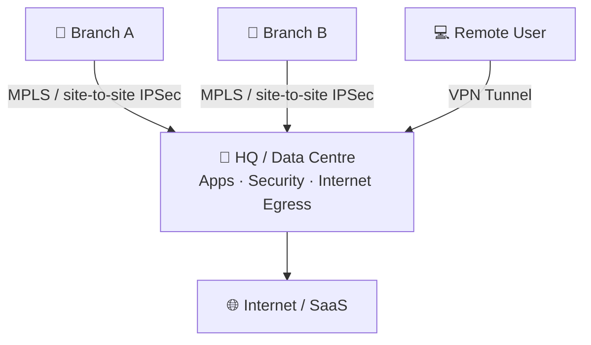
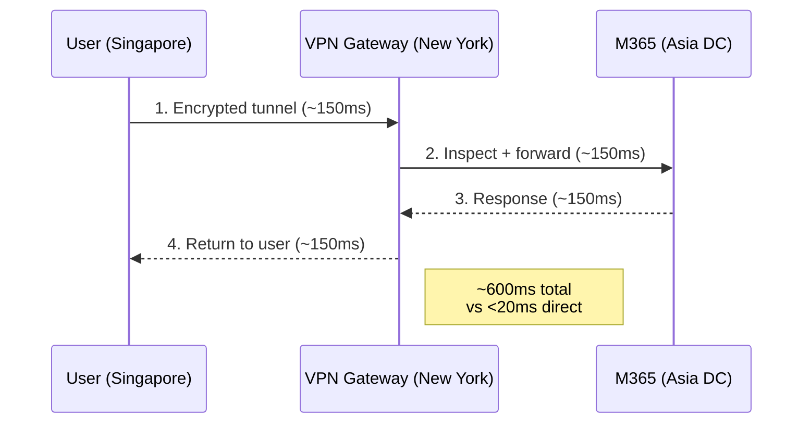
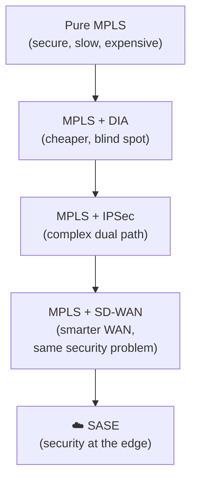

# Chapter 1 — Traditional VPN & Branch Architecture: Problems & Drivers

This chapter traces how enterprise networking evolved from a simple, centralised model to a patchwork of expensive workarounds — and why cloud adoption finally broke it beyond repair.

---

## The Hub-and-Spoke Model

All traffic routes through a central HQ or data centre. Every branch and remote user is a "spoke" that backhauled to the "hub" for both applications and security inspection.

**Why it worked** — when these assumptions held true:
- All applications lived in the data centre
- Users worked mostly in offices on managed devices
- Sensitive data stayed inside the corporate perimeter
- Security could be enforced at a single choke point

---

## Traditional VPN Architecture

Remote users and branches connected via:

- **IPSec VPN / SSL VPN** — user establishes an encrypted tunnel to a VPN concentrator at HQ; traffic is inspected on-premises before forwarding to the app
- **Site-to-site IPSec tunnels** — branch router creates a permanent tunnel to HQ firewalls
- **MPLS circuits** — dedicated private WAN links with managed QoS; expensive but predictable

In all cases, traffic never left the private path until it had passed through the centralised security stack.

---

## Why the Model Broke Down

### 1 — Performance: The Trombone Effect

When the VPN gateway is in New York but the user is in Singapore and the SaaS app is in Asia, every request makes a needless transatlantic round trip.

### 2 — Security: Implicit Trust

- VPN connects users **inside the perimeter** — broad lateral access is granted on authentication
- A compromised credential means an attacker can move freely across internal segments
- Split-tunnelling (introduced to ease the backhaul load) leaves direct internet traffic uninspected

### 3 — Scalability

- VPN concentrators are fixed-capacity hardware appliances
- Doubling the remote workforce (e.g. COVID-19 lockdowns) requires procurement, shipping, and racking of new hardware — weeks, not hours

### 4 — Resiliency

- Single centralised gateway = single point of failure
- Redundancy doubles hardware cost and complexity without eliminating outage risk

### 5 — Cost

- MPLS pricing scales linearly with the number of branches
- Per-megabit cost is 10–50× higher than commodity internet
- Indefensible when branches primarily need SaaS access, not private app access

---

## Branch Architecture Evolution

Enterprises tried several phases to reduce cost and latency while preserving security:

| Phase | Architecture | Problem it Caused |
|---|---|---|
| **Pure MPLS** | All traffic hairpins via HQ | High latency + high cost for SaaS |
| **MPLS + DIA** | Internet breaks out locally; apps via MPLS | Local DIA is unprotected or weakly protected |
| **MPLS offload + IPSec** | Broadband supplements MPLS | Complex dual-path routing; still backhauling |
| **MPLS + SD-WAN** | SD-WAN at branch for intelligent path selection | Security inspection still centralised at HQ |

Each step improved one dimension (cost or performance) while adding complexity — none solved the root problem: **security inspection stayed centralised while users and apps became distributed**.

---

## The Tipping Point: Cloud & SaaS

The final blow to the hub-and-spoke model:

- **SaaS dominance** (M365, Salesforce, Workday) — routing Tokyo → New York → Microsoft Asia for inspection is both slow and wasteful
- **IaaS adoption** (AWS, Azure, GCP) — "the app is in the data centre" is no longer true; apps span multiple cloud regions
- **Remote-first workforces** — the majority of traffic originates outside the office perimeter

> The perimeter ceased to exist as a meaningful security boundary. Gartner coined **SASE** in 2019 to describe the only logical response: move security enforcement to the cloud, as close as possible to users and applications.

---

## Key Takeaways

- Hub-and-spoke worked well when apps, users, and data were centralised — that world is gone
- VPN fails on performance (trombone), security (implicit trust), scale (hardware limits), and cost (MPLS)
- Every branch architecture phase improved economics or QoS without fixing the centralised-inspection problem
- Cloud and SaaS adoption made backhauling traffic architecturally incoherent
- The answer is to move security inspection to where the users and applications actually are — the cloud edge

---

*Next: [Chapter 2 — The Perimeter Is Now Everywhere: SASE Concepts & Key Components](./ch02-sase-concepts-and-components.md)*
