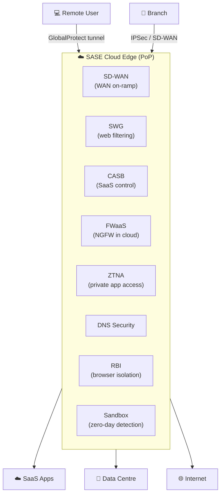

# Chapter 2 — The Perimeter Is Now Everywhere: SASE Concepts & Key Components

In 2019, Gartner coined **SASE (Secure Access Service Edge)** — a framework converging WAN capabilities and network security into a single cloud-delivered service, positioned close to users and applications instead of centralised in a data centre.

---

## The Problem SASE Solves

A typical 2018 enterprise ran these as separate products from separate vendors:

- MPLS / SD-WAN appliances
- IPSec VPN concentrators
- On-premises next-generation firewalls
- Proxy-based Secure Web Gateways (SWG)
- Cloud Access Security Brokers (CASB)
- DLP solutions
- DNS security services
- SIEM platforms aggregating feeds from all of the above

**Result:** inconsistent policy enforcement, blind spots at product joins, latency through multiple inspection hops, and high operational overhead keeping policies synchronised.

---

## What SASE Is

Three defining characteristics distinguish SASE from prior approaches:

- **Cloud-native, cloud-delivered** — not a virtualised appliance, but a multi-tenant service with elastic capacity and distributed PoPs; no customer hardware required
- **Converged WAN + security** — path selection (which link) and policy enforcement (what to allow) happen in the same platform and policy engine
- **Identity-centric, not location-centric** — policy enforced based on user identity, device posture, and application context; a user on hotel Wi-Fi gets the same policy as one on campus

---

## SASE Network Edge: SD-WAN

**SD-WAN** is the WAN on-ramp for SASE:

- Monitors MPLS, broadband, and 4G/5G links continuously for quality metrics
- Steers each application's traffic to the best available path based on policy
- Connects branches to the nearest SASE PoP — security inspection and WAN optimisation share the same policy engine

---

## SASE Security Components

All applied in a **single inspection pass** — not a sequential chain of hops:

| Component | What it Does |
|---|---|
| **SWG** (Secure Web Gateway) | URL filtering, malware detection, SSL/TLS decryption for all web traffic |
| **CASB** (Cloud Access Security Broker) | SaaS visibility, shadow-IT detection, DLP enforcement inside sanctioned apps |
| **FWaaS** (Firewall as a Service) | Stateful inspection, App-ID, IPS, threat prevention — no branch hardware needed |
| **ZTNA** (Zero Trust Network Access) | Least-privilege app access; replaces VPN; eliminates lateral movement risk |
| **DNS Security** | Blocks C2 callbacks and DNS tunnelling at the resolver level |
| **RBI** (Remote Browser Isolation) | Executes browsing in a cloud container; streams only rendered pixels to the endpoint |
| **Network Sandbox** | Detonates suspicious files to detect zero-day and evasive threats inline |

---

## Evaluating a SASE Platform

| Consideration | What to Look For |
|---|---|
| Single-pass inspection | FWaaS, SWG, CASB, IPS in one pass — not chained hops |
| PoP density | Enough locations to minimise latency for your user populations |
| Management unification | Single policy model for network and security — not two consoles bolted together |
| Identity integration | Native SAML/SCIM integration with your IdP |
| SD-WAN integration | WAN optimisation and security from the same platform |
| Device coverage | Agent-based for managed devices; agentless/proxy for BYOD and unmanaged |

---

## SASE and Prisma Access

PaloAlto Networks implements the SASE framework through **Prisma Access** — a cloud-delivered platform providing FWaaS, SWG, CASB, ZTNA, DNS Security, RBI, and network sandbox from a global PoP network. It handles both network connectivity (branches, remote users) and security enforcement (full stack inspection) in one service.

> **Corrected 2026-07-09** — RBI (Remote Browser Isolation) was previously missing from this list despite appearing as one of the seven components in the SASE Security Components table above. Confirmed via Palo Alto's own Prisma Access licensing/apps documentation ("Cheat Sheet: Remote Browser Isolation," listed for both Panorama and Strata Cloud Manager) that RBI is natively integrated into Prisma Access, not a separate, unrelated product — this was a genuine omission, not a deliberate scope choice, so it's added here for internal consistency with the table above.

Chapters 3–5 describe the Prisma Access architecture, network connectivity model, and user access model in detail.

---

*Previous: [Chapter 1 — Traditional VPN & Branch Architecture — Problems & Drivers](./ch01-traditional-network-challenges.md)* · *Next: [Chapter 3 — Prisma Access Architecture — Components, Presence & Services](./ch03-prisma-access-architecture.md)*
