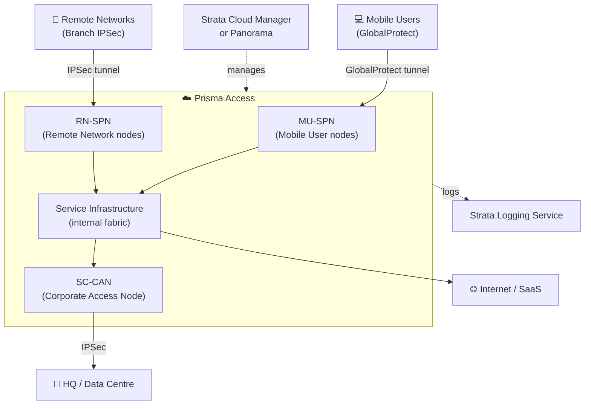

# Chapter 3 — Prisma Access Architecture: Components, Presence & Services

Prisma Access is a multi-tenant, purpose-built cloud service operated by PaloAlto Networks. Customers manage policy; PaloAlto Networks manages the underlying infrastructure. This chapter covers the key components, management options, global footprint, and security services.

> **Updated:** Reflects May 2026 architecture. The source PDF references Cortex Data Lake (now Strata Logging Service) and shows Cloud Services Plugin on Panorama as the primary management path; current docs recommend Strata Cloud Manager.

---

## Architecture Overview

Prisma Access sits between users/branches and their destinations — internet, SaaS, or corporate resources. All traffic is inspected by the full security stack in a single pass.

---

## Security Processing Nodes (SPNs)

SPNs are the compute units where all inspection occurs. They are deployed in PaloAlto-operated cloud infrastructure at PoPs worldwide — not configurable by the customer.

| Node Type | Purpose |
|---|---|
| **MU-SPN** (Mobile User SPN) | Gateway for GlobalProtect users; nearest node selected automatically by location |
| **RN-SPN** (Remote Network SPN) | Gateway for branch IPSec tunnels; inspects all site-bound traffic |

Both node types are multi-tenant with full traffic isolation between customers. Traffic between SPNs and CANs is encrypted end-to-end.

---

## Service Infrastructure & Corporate Access Nodes

- **Service Infrastructure** — private IP fabric connecting MU-SPNs, RN-SPNs, and the customer's network. Subnets are allocated by the customer at onboarding.
- **SC-CAN (Service Connection Corporate Access Node)** — the IPSec tunnel from Prisma Access into the customer's HQ or data centre, enabling mobile users and branches to reach private applications.

---

## Management Options

| Interface | Status | Best For |
|---|---|---|
| **Strata Cloud Manager (SCM)** | Recommended | All new deployments; unified network + security policy, AI-driven recommendations, automated upgrades |
| **Panorama** (Cloud Services Plugin) | Fully supported, with one new-deployment restriction — see note below | Organisations managing large PAN-OS estates who want unified management across Prisma Access and hardware NGFWs |

SCM capabilities:
- Single-pane config for network and security policy
- AI-driven best-practice recommendations
- Automated software upgrade management for Prisma Access nodes
- Direct integration with Strata Logging Service

> **Refined 2026-07-09** — the table previously labeled Panorama "Legacy/supported," which overstates how deprecated it actually is. The precise, current picture: Panorama remains **fully supported** for existing Prisma Access deployments (Panorama-managed or Panorama multi-tenant) — no forced migration, no reduced support. The actual restriction, effective **April 15, 2026**, is narrower than "legacy" implies: Palo Alto no longer offers **Panorama-based Prisma Access multi-tenancy for new (greenfield) deployments** — new multi-tenant deployments must use Strata Cloud Manager's Multitenant Cloud Manager instead. New **single-tenant** Panorama-managed deployments are not affected by this restriction. Palo Alto has also signaled that some features introduced after April 15, 2026 may ship exclusively on SCM going forward, which is the direction "legacy" was gesturing at — but as of this check, that's a forward-looking trend, not a statement that Panorama itself is deprecated today.

> The source training modules focus heavily on Panorama workflows because SCM was less mature when they were produced. This manual updates management references to SCM where applicable and preserves Panorama-specific procedures in Part 5 configuration chapters.

---

## Global Presence

Prisma Access operates from **100+ locations worldwide**:

> **Corrected 2026-07-09** — this previously read "100+ PoPs across 76+ countries." Confirmed via direct fetch of Palo Alto's current Prisma Access Locations documentation: it states "Prisma Access provides over 100 locations worldwide," with no specific country count anywhere in the source. The "76+ countries" figure couldn't be traced to any current authoritative source, so it's been removed rather than repeated as an unconfirmed specific number — softened to what's actually verifiable.

- **Latency** — users connect to the geographically nearest PoP, not a central DC
- **Data sovereignty** — PoP selection can be constrained to specific geographic regions for compliance
- **Redundancy** — each PoP spans multiple cloud availability zones; connections auto-recover if one zone fails

Current PoP locations: `docs.paloaltonetworks.com/prisma/prisma-access` (updated as new locations are added).

---

## Logging and Analytics: Strata Logging Service

All Prisma Access traffic generates log data (connection, threat, URL, DNS). This flows to **Strata Logging Service** (formerly Cortex Data Lake).

Integrations:
- **Prisma Access Insights** — built-in dashboard: traffic trends, user activity, threat summaries, anomaly detection
- **XSIAM / Cortex XDR** — correlated threat investigation for organisations on the PaloAlto XDR platform
- **Third-party SIEM** — Syslog or HTTPS export to Splunk, Microsoft Sentinel, and others

> The Cortex Data Lake → Strata Logging Service change is a branding and capability update. Existing API integrations continue to function.

---

## Security Services

Applied in a **single inspection pass** at every MU-SPN and RN-SPN:

| Service | What it Provides |
|---|---|
| **App-ID** | Application identification by traffic signature, not port/protocol |
| **URL Filtering** | Category-based blocking and logging; SafeSearch enforcement |
| **Threat Prevention** | IPS signatures, anti-spyware, C2 traffic blocking |
| **Malware Prevention (WildFire)** | Cloud sandbox + static analysis for file-based threats |
| **SSL/TLS Decryption** | Encrypted traffic inspection per policy |
| **DNS Security** | DNS tunnelling, C2 callback, and DGA detection |
| **SaaS Visibility & Control** | App-ID extended to SaaS; CASB-like controls for shadow-IT |
| **DLP** | Content inspection to detect and block data exfiltration |

---

## Key Takeaways

- Prisma Access is composed of distributed MU-SPNs (users) and RN-SPNs (networks) connected via an internal service fabric
- SC-CANs provide the path from Prisma Access back to corporate resources
- Strata Cloud Manager is the recommended management interface for new deployments
- 100+ global PoPs ensure inspection happens close to users and branches
- All security services apply in a single pass — no chained inspection hops

---

*Previous: [Chapter 2 — The Perimeter Is Now Everywhere: SASE Concepts & Key Components](./ch02-sase-concepts-and-components.md)* · *Next: [Chapter 4 — Prisma Access for Networks](./ch04-prisma-access-for-networks.md)*
