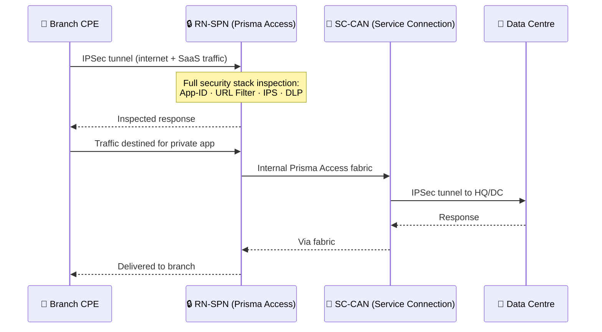

# Chapter 4 — Prisma Access for Networks

"Prisma Access for Networks" connects **fixed locations** — branches, retail sites, data centres — to the Prisma Access security fabric. Every device at a connected site is protected without per-device configuration: the branch router or SD-WAN appliance establishes a single IPSec tunnel; Prisma Access handles the rest.

> **Updated:** ZTNA Connector and current service connection licensing limits reflect May 2026 documentation, re-verified 2026-07-09 against docs current as of July 2026.

---

## Traffic Flow: How a Branch Connects



Two benefits of this model:
- **No branch hardware NGFW** — security is cloud-delivered from the nearest RN-SPN
- **Consistent policy** — same security stack applies to branch traffic and to mobile users

---

## Remote Networks

A **Remote Network** is any branch, retail site, or remote location connecting to Prisma Access via IPSec.

Connection steps:
1. Branch CPE establishes an IPSec tunnel to the nearest **RN-SPN**
2. Branch routing sends desired traffic (default route or specific subnets) into the tunnel
3. Security policy in Prisma Access controls what is allowed, decrypted, and inspected

**Routing options:**

| Method | How it Works | Best Suited For |
|---|---|---|
| **Static Routes** | Fixed entries in both CPE and Prisma Access | Small, stable deployments |
| **BGP (Dynamic)** | BGP session between CPE and Prisma Access; routes exchanged automatically | Larger deployments; required for ECMP |

**ECMP (multiple tunnels per site):** Enables load balancing and automatic failover across tunnels — requires BGP.

---

## Service Connections

A **Service Connection** (Corporate Access Node, or CAN) is the IPSec tunnel from Prisma Access back to the customer's HQ or data centre.

**Why it's needed:**
- Remote Networks handle internet/SaaS traffic; they have no native path to private corporate apps
- Service Connections bridge that gap:

```
Branch → Remote Network (IPSec) → Prisma Access → Service Connection (IPSec) → Data Centre
```

- Mobile users (Chapter 5) also use Service Connections to reach internal applications
- Remote Networks in the same tenant are **fully meshed** with each other automatically
- Mobile User ↔ Remote Network communication routes through the Service Connection (hub-and-spoke)

**Licensing limits:**

| License Type | Max Service Connections |
|---|---|
| ZTNA or Enterprise base | 5 |
| Private Application Add-on | Up to 200 per tenant |
| Multi-tenant Global (1,000+ units) | 5 |
| Multi-tenant Global (200–999 units) | 2 |
| Multi-tenant Local | 2 per tenant |

> ℹ️ **Investigated 2026-07-09 — the "200" figure is confirmed still current, not superseded.** A separate Prisma Access 6.0 "What's New" article was checked for a rumored licensing change ("unlimited" Service Connections/ZTNA Connectors under a Private Apps add-on). Re-fetching the primary Service Connections licensing page directly (last updated **Jul 6, 2026** — just days before this check) confirms "up to 200 service connections per tenant" verbatim, with no unlimited caveat anywhere on the page. A dedicated ZTNA Connector licensing page separately confirms the same 200 figure for ZTNA Connectors under the Private App Add-on (matching Chapter 20's existing table). An "unlimited private apps add-on" claim surfaced repeatedly in aggregated search results, but a direct, verbatim-quote fetch of the actual Prisma Access 6.0 release notes page — the same page the claim was attributed to — did not contain it; this looks like a search-aggregation artifact (the same failure mode flagged earlier for a "SOCKS5 proxy" claim in Chapter 49), not a real documentation change. **What is confirmed as genuinely new:** Prisma Access 6.0 introduces a streamlined ZTNA Connector licensing model — the base Prisma Access license now includes **10 ZTNA Connector licenses at no extra cost**, so ZTNA Connector can be enabled without purchasing the separate ZTNA Connector add-on license at all. This doesn't change the Service Connection table above; it's a separate, additive licensing change specific to ZTNA Connectors.

---

## Bandwidth Allocation

- Each Remote Network site is provisioned with a maximum throughput allocation
- **Aggregate Bandwidth Model:** allocations are drawn from a shared pool — a 500 Mbps pool serving 20 branches, rather than 100 Mbps permanently reserved per branch
- Reduces wasted capacity at low-utilisation sites

> ℹ️ A **Site-Based** bandwidth model (guaranteed per-site rate, Prisma Access 6.0+) also exists alongside Aggregate. Palo Alto's own current documentation is genuinely contradictory about which model is the default for new deployments — this ambiguity is investigated in full in [Chapter 38 — Remote Network Bandwidth Allocation](../part7/ch38-remote-network-bandwidth-allocation.md); not re-investigated here since this chapter's scope is a high-level overview.

---

## SD-WAN Integration

Prisma Access integrates natively with **Prisma SD-WAN** (formerly CloudGenix):

- **ION appliances** deploy at branches, managing path selection across MPLS, broadband, and 4G/5G
- Traffic requiring inspection is steered from the ION appliance to the nearest Prisma Access PoP
- Both WAN performance and security policy are managed from **Strata Cloud Manager** — single pane

Part 3 (Chapters 12–19) covers SD-WAN routing design in depth.

---

## Security at Remote Network Sites

No branch NGFW required. Services applied in the cloud via the RN-SPN:

- **App-ID** — application control by traffic signature, not port/protocol
- **URL Filtering** — category-based blocking and logging for all web traffic
- **Threat Prevention** — IPS signatures, anti-spyware, C2 blocking
- **Malware Prevention (WildFire)** — file analysis for unknown threats
- **DNS Security** — protection against DNS-based C2 and tunnelling
- **SSL/TLS Decryption** — encrypted traffic inspection per policy

---

## ZTNA Connector: Modern Alternative for Private App Access

> This section supplements the source PDF with current PaloAlto documentation.

The **ZTNA Connector** deploys a lightweight software agent inside the corporate environment. It creates an outbound-only automated tunnel to Prisma Access, eliminating the need for inbound firewall rules on the corporate network.

| | Service Connection | ZTNA Connector |
|---|---|---|
| **Direction** | Bidirectional IPSec | Outbound-only automated tunnel |
| **Granularity** | Network segment access | Per-application (targets) access |
| **Setup** | IPSec configuration on CPE | Software agent deployment |
| **Best for** | Branch networking, full HQ connectivity | Private app access, zero trust model |

ZTNA Connector is covered in Part 4 (Chapters 20–25).

---

## Key Takeaways

- Remote Networks connect branches via IPSec to RN-SPNs; static or BGP routing; ECMP for redundancy
- Service Connections provide the return path to corporate resources; required for RN ↔ MU communication
- Private Application Add-on licensing caps Service Connections at up to 200 per tenant — confirmed still current 2026-07-09, not superseded by an "unlimited" tier (that claim did not hold up under direct verification)
- Base Prisma Access license now includes 10 free ZTNA Connector licenses — ZTNA Connector no longer requires its own add-on license to enable
- Bandwidth uses an aggregate pooled model — efficient for mixed-utilisation branch estates, though a Site-Based alternative also exists; see Chapter 38 for an unresolved contradiction in Palo Alto's own docs about which is the default
- Prisma SD-WAN ION appliances extend path intelligence at the branch
- ZTNA Connector offers an application-level, outbound-only alternative to traditional Service Connections — full detail in Part 4 (ch20–25)

---

*Previous: [Chapter 3 — Prisma Access Architecture — Components, Presence & Services](./ch03-prisma-access-architecture.md)* · *Next: [Chapter 5 — Prisma Access for Users & SaaS Design Benefits](./ch05-prisma-access-for-users.md)*
