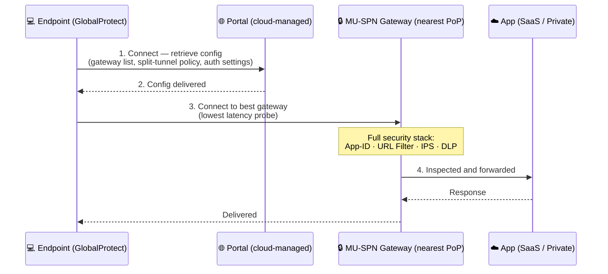

# Chapter 5 — Prisma Access for Users & SaaS Design Benefits

Prisma Access secures individual users through three connectivity models: **GlobalProtect** (agent-based), **Prisma Access Agent** (next-generation agent-based, added 2026-07-09 — see below), and **Explicit Proxy** (agentless via PAC file). All three deliver the same security stack from the PoP nearest to the user. This chapter covers how each model works and closes with the operational benefits of the SaaS delivery model.

---

## GlobalProtect: Agent-Based Connectivity

The GlobalProtect app establishes a secure tunnel to the nearest **MU-SPN** automatically — no user action required after initial configuration.

**Supported platforms:** Windows, macOS, iOS, Android, Chrome OS, Linux.

**For unmanaged/BYOD devices:** Clientless VPN — browser-based access to specific internal web apps, no agent required. **RBI (Remote Browser Isolation)** — confirmed as a core Prisma Access capability in Chapter 2 — is a related, complementary option for the same unmanaged/BYOD scenario: rather than granting direct (if narrow) access to an internal app, RBI executes the browsing session in an isolated cloud container and streams only rendered pixels to the endpoint. See Chapter 2 for the full capability; not elaborated here.

### Authentication Methods

| Method | Description |
|---|---|
| **SAML 2.0** | Federated auth via corporate IdP (Azure AD, Okta, Ping Identity) — enables SSO + MFA |
| **LDAP / Active Directory** | Direct auth against on-premises AD |
| **RADIUS** | For existing RADIUS infrastructure |
| **Client certificate** | Certificate-based — highest assurance scenarios |
| **Kerberos** | **Added 2026-07-09** — confirmed current, supported GlobalProtect Portal authentication method (dedicated setup documentation exists for both Panorama- and SCM-managed Prisma Access) — provides seamless SSO via tickets, without a user-facing login prompt |

SAML with a cloud IdP is the recommended approach for new deployments.

> ℹ️ **Cloud Identity Engine (CIE) — added 2026-07-09.** Rather than configuring SAML/LDAP directly against each IdP, Palo Alto increasingly positions **Cloud Identity Engine** as a centralized identity broker layer in front of these methods — confirmed as the currently-**recommended** path for SAML specifically (see Chapter 43 and Chapter 53 for the detailed findings). CIE isn't a separate authentication method in its own right; it's a broker that sits in front of the methods in the table above. Not elaborated further here — see those chapters for the full picture.

### Split Tunnelling

By default all user traffic goes through the Prisma Access tunnel. Split tunnelling defines exceptions:

- **Access route** — specific IP ranges bypass the tunnel (e.g. M365 service endpoints)
- **Application-based** — defined applications bypass the tunnel
- **Domain-based** — traffic to specific FQDNs bypasses the tunnel

> Split-tunnelled traffic is not inspected — define exceptions carefully to avoid security blind spots.

---

## Prisma Access Agent: The Next-Generation Agent

**Added 2026-07-09 — a genuinely missing third connectivity model, confirmed current and actively developing, not a preview/future capability.** Palo Alto Networks is progressively shifting agent-based connectivity from GlobalProtect toward a newer client: **Prisma Access Agent**. Confirmed via direct fetch of Palo Alto's Prisma Access Agent documentation and cross-checked against multiple independent sources: this is positioned as GlobalProtect's next-generation successor, purpose-built for Prisma Access's cloud-native architecture rather than for connecting to an on-premises or VM-based NGFW. The subscription/licensing itself is also shifting name from "GlobalProtect" to "Prisma Access Agent" going forward — but **GlobalProtect remains fully supported and functional today**; this is a progressive transition, not a deprecation.

**Architecturally, the core connectivity model is the same as GlobalProtect** — an endpoint agent establishes a secure tunnel to the nearest Prisma Access PoP, and the same full security stack (App-ID, URL Filtering, IPS, DLP) applies. What differs is a set of confirmed, genuinely new capabilities:

| Capability | Detail |
|---|---|
| **Local (Endpoint) DLP enforcement** | Confirmed via a dedicated "Prisma Access Agent Endpoint DLP Support" documentation update. Unlike GlobalProtect's cloud-side-only DLP, Endpoint DLP enforces **data-in-motion** policy at the point of file transfer to peripherals (USB, printers, network shares) directly on the endpoint, and runs **data-at-rest** scans locally using an on-device detection engine — this keeps working even when the endpoint is offline, which cloud-side inspection cannot do |
| **Dynamic Privilege Access (DPA)** | Confirmed real, documented feature — grants network access scoped to the **project** a user is currently assigned to (per-project IP pools), so users working across multiple projects don't get accidental access to another project's resources. Enabled as a permanent, tenant-wide setting at activation — cannot be disabled afterward |
| **Anti-tampering protection** | Confirmed (macOS/Windows) — unauthorized users cannot delete/rename Prisma Access Agent files or folders, or stop its services |
| **ADEM support via NGFW** | Confirmed — Autonomous Digital Experience Management (network experience troubleshooting) remains available even when the agent connects through an NGFW rather than Prisma Access directly |
| **IPSec-to-SSL automatic fallback** | Confirmed in detail — the agent attempts IPSec first; if blocked or unsuccessful, it falls back to SSL over TCP port 443 automatically and transparently to the user, and logs the fallback event for admins to monitor |

**Supported platforms (confirmed via direct fetch):** macOS 14+, Windows 10 (2024+ build or later), Android 10+, iOS 16+, and a broader Linux lineup than GlobalProtect traditionally covers — Ubuntu 22.04/24.04, Arch Linux, Fedora 41/42, Debian 13, and RHEL 9.6/10.0. Chrome OS was not found listed for Prisma Access Agent at the time of this check, unlike GlobalProtect's platform list above — don't assume parity there without checking current documentation.

**Deployment models:** Prisma Access (Managed by Strata Cloud Manager), Prisma Access (Managed by Panorama), and NGFW (Managed by Panorama) — so it isn't exclusively a Prisma Access-only client.

**Coexistence and transition (confirmed via real, existing Palo Alto documentation for this exact scenario):**
- Both GlobalProtect and Prisma Access Agent can be **installed on the same endpoint and the same tenant** during the transition period — this requires a Palo Alto account representative to enable a "coexistence-enabled tenant"
- Only **one agent can be actively connected** to Prisma Access at a time — installing Prisma Access Agent automatically disables GlobalProtect if it's already present and enabled
- Switching between the two is supported either from within the app itself, or via **PACli**, a dedicated command-line tool — switching back to GlobalProtect may prompt for an anti-tamper unlock password if the admin configured one during Prisma Access Agent onboarding

Not independently confirmed in this pass: "simplified forwarding profiles" as a specific differentiator — this was raised as a candidate item but no primary-source confirmation was found; not asserted here.

---

## Explicit Proxy: Agentless Web Protection

For environments where deploying the GlobalProtect agent is not feasible, Prisma Access also supports an **Explicit Proxy** (Cloud Secure Web Gateway) model:

- A **PAC file** is pushed to endpoints via DHCP, MDM, or Group Policy
- The PAC file redirects HTTP and HTTPS traffic to a Prisma Access proxy endpoint
- The proxy applies URL filtering, DLP, and threat prevention (with optional SSL decryption)
- No VPN tunnel; no agent installation required

**Best suited for:**
- Chromebook fleets (cannot run the full GlobalProtect agent)
- Environments where a full-tunnel VPN is not desirable
- Supplemental web protection for unmanaged/BYOD devices

### Choosing Between the Models

> **Note added 2026-07-09:** this table compares the two architecturally distinct approaches — agent-based tunneling vs. agentless proxy. Prisma Access Agent (above) shares GlobalProtect's row here architecturally (full-tunnel agent, all ports/protocols) — Palo Alto is progressively positioning it to succeed GlobalProtect specifically for **managed devices**; see the dedicated section above for what actually differs between the two agents. Explicit Proxy's positioning versus both agents is unchanged.

| | GlobalProtect / Prisma Access Agent | Explicit Proxy |
|---|---|---|
| **Traffic coverage** | All ports and protocols | HTTP/HTTPS only |
| **Device requirement** | Agent installation | PAC file or browser config |
| **Split tunnelling** | Granular, policy-controlled | PAC file logic |
| **ZTNA / private app access** | Supported | **Refined 2026-07-09** — no ZTNA-brokered private app access (still accurate as a blanket "no"), but no longer a flat "Not supported": Explicit Proxy has gained real capability since the source PDF — Kerberos authentication for non-browser/headless scenarios and Trusted Source Address for authentication-free allowlisted IPs (both confirmed current, see Chapter 49) extend what it can reach. A SOCKS5 proxy capability for non-web TCP traffic was investigated in Chapter 49 and remains **unconfirmed** — not asserted as fact here either |
| **Best for** | Managed corporate devices | Unmanaged devices, web-only protection |

Most deployments use GlobalProtect (or, increasingly, Prisma Access Agent) for managed devices and Explicit Proxy to supplement specific device types.

---

## Visibility and Monitoring

**Prisma Access Insights** provides real-time and historical views:

- **Current Users** — connected users, gateway location, IP address, session stats
- **Historical view** — traffic patterns, threat events, policy matches
- **Regional Map** — geographic user distribution across PoPs; useful for capacity planning
- **Per-user drill-down** — detailed logs for incident investigation

> **Verified 2026-07-09 — the fixed window is platform-specific, not universal.** For **Panorama-managed** Prisma Access, the historical view is confirmed still a fixed **"Users (Last 90 Days)"** window (see Chapter 45). For **Strata Cloud Manager-managed** Prisma Access, Chapter 45 separately confirmed this fixed 90-day framing does **not** carry over — SCM's `Insights > Activity Insights > Users` view instead uses a generic, configurable **selected time range**, with no hardcoded 90-day window found in current documentation. Don't assume "90 days" applies on SCM without checking your own tenant.

---

## Benefits of the SaaS Delivery Model

| Benefit | Detail |
|---|---|
| **Subscription-based cost** | No upfront hardware capex; no 3–5 year refresh cycles; costs scale with deployment size |
| **Operational simplicity** | PaloAlto manages infrastructure; the security team manages policy only |
| **Auto-scaling and resiliency** | Spans multiple cloud availability zones; auto-recovers from zone failures; scales for peak loads with no pre-provisioning |
| **Lower latency** | Inspection at the nearest PoP — not at a central DC — keeps round-trip time low for SaaS traffic |
| **Built-in compliance** | Threat signatures and URL categories updated automatically; PaloAlto holds SOC 2 Type II, FedRAMP, and ISO 27001 certifications for the service |

---

## Key Takeaways

- GlobalProtect provides full-stack protection for managed devices across all ports and protocols
- **Added 2026-07-09** — Prisma Access Agent is a confirmed, current, actively-developing third connectivity model: GlobalProtect's next-generation successor, with genuinely new capabilities (local Endpoint DLP, Dynamic Privilege Access, anti-tampering, ADEM via NGFW, automatic IPSec-to-SSL fallback) — GlobalProtect remains fully supported today, and both can coexist on the same endpoint/tenant during the transition
- Explicit Proxy provides web-only protection for Chromebooks and unmanaged devices without an agent — **refined 2026-07-09**: it's no longer accurate to call ZTNA/private-app access a flat "Not supported" with no nuance; Kerberos auth and Trusted Source Address extend what it reaches, though true ZTNA-brokered private app access still isn't there
- MU-SPNs select the lowest-latency gateway automatically; data-sovereignty constraints can override this
- Prisma Access Insights' historical window is platform-specific — fixed 90-day on Panorama (confirmed, ch45), configurable time range on SCM (no fixed window, confirmed, ch45) — corrected 2026-07-09 from an unqualified "90-day" claim
- The SaaS model eliminates hardware procurement, enables automatic scaling, and keeps security content current

Part 2 moves from conceptual overview to planning and design — how to architect a Prisma Access deployment before the first configuration step is taken.

---

*Previous: [Chapter 4 — Prisma Access for Networks](./ch04-prisma-access-for-networks.md)* · *Next: [Chapter 6 — Prisma Access Licensing & Management Models](../part2/ch06-licensing-and-management-models.md)*
