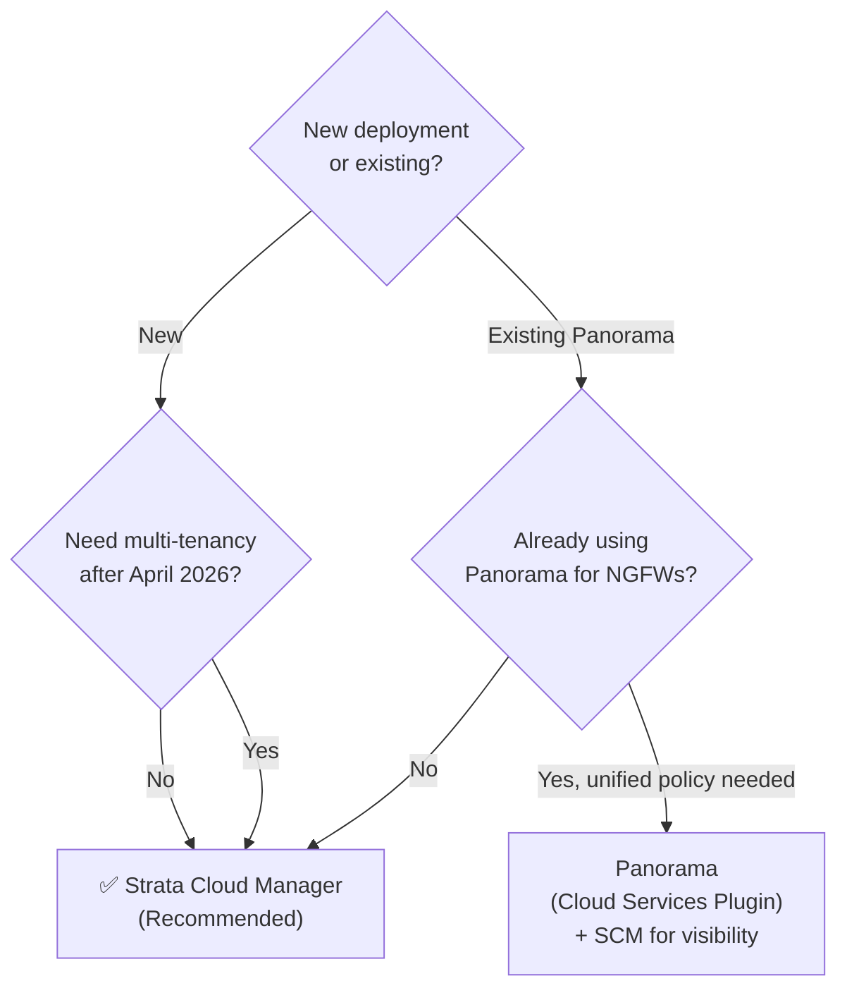

# Chapter 6 — Prisma Access Licensing & Management Models

Before designing a deployment, you must choose the right license edition and management model. This chapter covers the three Prisma Access editions, how licensing units are counted, available add-ons, and the SCM vs Panorama management decision.

---

## License Editions

Prisma Access is sold in three editions, each targeting a different security scope:

| Edition | Also Called | What it Secures |
|---|---|---|
| **Secure Web Gateway** | SWG | Internet-bound traffic — URL filtering, threat prevention, SaaS visibility |
| **ZTNA** | Secure Private Apps | Private application access with zero-trust controls |
| **Enterprise** | Secure All Apps | Full SASE stack — internet, private apps, and advanced security services combined |

> Your edition determines which security services are available. For the complete feature matrix, refer to the [Prisma Access Licensing Guide datasheet](https://docs.paloaltonetworks.com/prisma-access/activation-and-onboarding/your-prisma-access-license).

> 📷 [PaloAlto diagram — License edition comparison](https://docs.paloaltonetworks.com/prisma-access/activation-and-onboarding/your-prisma-access-license)

---

## Licensing Units

Prisma Access uses two different unit types depending on deployment type:

| What is Licensed | Unit Definition |
|---|---|
| **Mobile Users** | 1 unit = 1 unique user (tracked over the last 30 days) |
| **Remote Networks** | 1 unit = 1 Mbps |

- Mobile user licensing supports GlobalProtect, Explicit Proxy, or both connection methods under the same user count
- Remote Network bandwidth is pooled — a 500 Mbps allocation can be distributed across any number of sites up to that total

> **Verified 2026-07-09** — both unit definitions confirmed still current via direct fetch of Palo Alto's licensing documentation, quoted verbatim: "a unit is defined as one mobile user" (30-day unique-user tracking window confirmed) and "a unit is defined as 1 Mbps." One caveat worth carrying over: the source licensing page doesn't specify whether the Mbps unit assumes the Aggregate or Site-Based bandwidth model — Chapter 38 found Palo Alto's own documentation genuinely contradictory about which model is the default for new deployments. That ambiguity is about bandwidth *allocation*, not the licensing *unit* itself (1 unit = 1 Mbps holds regardless of which model applies) — see ch38 for the full picture rather than re-litigating it here.

---

## Required Companion Licenses (SCM-managed)

A Prisma Access deployment managed by Strata Cloud Manager requires or optionally includes:

| Companion | Required? | Notes |
|---|---|---|
| **Strata Cloud Manager Essentials** | Required | Free — included with Prisma Access |
| **Strata Cloud Manager Pro** | Optional | Add-on — AI-driven insights, advanced automation |
| **Strata Logging Service** | Required | Log storage and analytics platform |
| **Cloud Identity Engine** | Optional | Free — centralised identity for policy |

> **Verified 2026-07-09** — all four rows confirmed still current via direct fetch: SCM Essentials is free/included, SCM Pro is a paid add-on, Strata Logging Service is required, and Cloud Identity Engine is free and doesn't require a license to get started. No changes needed.

---

## Available Add-Ons

Premium capabilities purchasable on top of any edition:

- **App Acceleration** — improves application performance over the Prisma Access backbone
- **ADEM** (Autonomous Digital Experience Management) — end-to-end user experience monitoring
- **DLP** (Data Loss Prevention) — inline content inspection and sensitive data controls
- **IoT Security** — device visibility and policy for IoT/OT endpoints
- **SaaS Security Inline** — real-time CASB controls for SaaS traffic
- **ZTNA Connector** — outbound-only private application connector (alternative to Service Connections). **Reconciled 2026-07-09** — no longer purely a paid add-on: Chapter 4 confirmed Prisma Access 6.0 licensing includes **10 free ZTNA Connector licenses with the base license**, so ZTNA Connector is enabled by default with a limited free allocation; the add-on unlocks a higher/unlimited count rather than being required just to use the feature at all — see ch04 rather than re-deriving this here.
- **RBI** (Remote Browser Isolation) — **added 2026-07-09, previously missing from this list.** Confirmed via direct fetch of Palo Alto's licensing documentation: RBI is listed under Prisma Access Add-On Licenses and is **not** bundled with any standard edition — it requires a separate paid license, despite being natively/architecturally integrated into Prisma Access rather than a separate product (see Chapter 2). Native integration and add-on licensing are two different axes here — don't conflate them.

---

## Management Models

Prisma Access can be managed through two interfaces. The choice is **consequential** — migration from Panorama to SCM is supported, but the **reverse is not possible**.

### Strata Cloud Manager (SCM) — Recommended

- Task-driven onboarding workflows — branches and mobile users configurable in minutes
- Predefined internet access and decryption policies based on best practices
- AI-driven recommendations and Policy Optimizer
- Unified visibility and monitoring (used by all deployments, including Panorama-managed ones)
- **Multi-tenancy:** new multi-tenant deployments after April 15, 2026 must use SCM (Strata Multitenant Cloud Manager)

> 📷 [PaloAlto diagram — Strata Cloud Manager overview](https://docs.paloaltonetworks.com/prisma-access/administration/prisma-access-overview/prisma-access-app-features)

### Panorama — Fully Supported, With One New-Deployment Restriction

> **Refined 2026-07-09** — this header previously read "Legacy/Supported," the same overstated framing corrected in Chapter 3; applying the same fix here rather than re-deriving it. Panorama remains **fully supported** for existing deployments and for **new single-tenant** deployments — there is no forced migration and no reduced support. The actual restriction, effective **April 15, 2026**, is narrower: Palo Alto no longer offers **Panorama-based Prisma Access multi-tenancy for new (greenfield) deployments** specifically — this chapter's own Feature Differences table and Key Takeaways were already precise about that multi-tenancy-specific scope; only this header's "Legacy" wording overstated it. See Chapter 3 for the full explanation.

- Managed via the **Cloud Services Plugin** on an existing Panorama server
- Best suited for organisations already managing NGFW fleets in Panorama who need unified security policy across hardware firewalls and Prisma Access
- Requires constant internet connectivity — loss of connectivity causes service failure
- Even Panorama-managed deployments still use SCM for visibility and monitoring features
- One-way migration to SCM is available via an in-product workflow if you later want to switch

### Feature Differences

| Capability | SCM | Panorama |
|---|---|---|
| Rapid task-driven onboarding | Yes | No |
| Templates & Template Stacks | No¹ | Yes |
| Multi-VSYS support | No¹ | Yes |
| AI-driven best practice recommendations | Yes | No |
| Reusable configuration snippets | Yes | No |
| Visibility & monitoring (Prisma Access Insights) | Yes | Yes (uses SCM) |
| Multi-tenancy (new deployments, post-Apr 2026) | Yes | No |

> ¹ **Refined 2026-07-09** — a flat "No" here could read as "SCM has no way to do this at all," which isn't quite right. SCM doesn't have a direct equivalent to Panorama's Templates/Template Stacks or Multi-VSYS as named constructs, but it achieves comparable outcomes through a genuinely different model — **Folders** (which unify what Templates and Device Groups did separately in Panorama) and **Snippets** (attachment-order precedence, the closest analog to a Template) — see Chapter 32 and Chapter 33 for the full mapping. This isn't full feature parity under a different name; it's a different architecture for the same underlying goals, and ch32/33 didn't establish 1:1 equivalence for every Panorama-specific mechanic.

---

## Key Takeaways

- Three editions: SWG (internet only), ZTNA (private apps), Enterprise (full stack)
- Mobile users licensed per unique user (30-day window); Remote Networks licensed per Mbps — both confirmed still current 2026-07-09
- SCM is the recommended management path for all new deployments — especially for multi-tenancy after April 2026
- **Refined 2026-07-09** — Panorama remains fully supported for existing deployments and new single-tenant deployments; the specific restriction (Apr 15, 2026) is on new *multi-tenant* Panorama deployments only, not a blanket "legacy" status — see Chapter 3
- SCM's Templates/Multi-VSYS "No" rows reflect a genuinely different Folders/Snippets architecture (ch32/33), not an absence of capability
- ZTNA Connector now ships with 10 free licenses in the base license (Prisma Access 6.0, per ch04) — the add-on unlocks higher counts, it isn't required to enable the feature at all
- RBI is a separate paid add-on license (added to Available Add-Ons, previously missing) despite being natively integrated into Prisma Access architecturally — licensing and integration are separate questions
- Migration Panorama → SCM is possible; the reverse is not — choose carefully

---

*Previous: [Chapter 5 — Prisma Access for Users & SaaS Design Benefits](../part1/ch05-prisma-access-for-users.md)* · *Next: [Chapter 7 — Service Infrastructure & Subnet Planning](./ch07-service-infrastructure-planning.md)*
