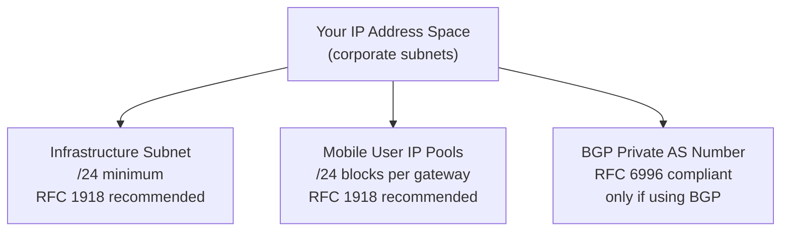

# Chapter 7 — Service Infrastructure & Subnet Planning

The **service infrastructure** is the private IP fabric Prisma Access uses internally to connect MU-SPNs, RN-SPNs, and Service Connection CANs. You provide the IP address ranges; Prisma Access uses them to build the internal mesh. This planning must happen before any deployment step — changing the infrastructure subnet after deployment requires a maintenance window and PaloAlto SRE involvement.

---

## What Needs to Be Planned

Three address allocations are required; a fourth applies if you use dynamic routing:

> 📷 [PaloAlto diagram — Service infrastructure overview](https://docs.paloaltonetworks.com/prisma-access/administration/prisma-access-setup/configure-the-prisma-access-service-infrastructure)

---

## Infrastructure Subnet

This is the most critical IP allocation — it is the backbone of the entire Prisma Access internal network.

**Requirements:**
- Minimum **/24** (e.g. `172.16.55.0/24`) — a larger number of addresses is consumed internally
- RFC 1918 space **strongly recommended** — public IP use is supported but risks conflicts with internet address space
- Must **not overlap** with:
  - Any corporate subnet in use on your network
  - Mobile user IP pools
  - Remote network source subnets

> **Verified 2026-07-09** — the /24 minimum and RFC 1918 recommendation above are confirmed still current, quoted directly from Palo Alto's live documentation: "you must designate a /24 subnetwork (for example, 172.16.55.0/24)," and public IPs are "supported" but "not recommend[ed]... because of possible conflicts with the internet public IP address space."

**Reserved ranges — never use:**
| Reserved Range | Reason |
|---|---|
| `169.254.0.0/16` | Link-local — reserved internally by Prisma Access |
| `100.64.0.0/10` | Shared address space (RFC 6598) — reserved internally by Prisma Access |

> **Verified 2026-07-09** — both reserved ranges confirmed still current, quoted directly: "Do not specify any subnets that overlap with the 169.254.0.0/16 and 100.64.0.0/10 subnet range because Prisma Access reserves those IP addresses and subnets for its internal use."

**Sizing beyond the minimum — added 2026-07-09, genuinely missing guidance, not a correction:** the flat /24 minimum above is the hard floor, but current Palo Alto guidance gives more specific, actionable sizing based on deployment scale:

| Deployment Scale | Recommended Infrastructure Subnet |
|---|---|
| **Small** — fewer than 50 sites and fewer than 2,500 mobile users | `/24` |
| **Medium** — fewer than 100 sites and fewer than 5,000 mobile users | `/23` |
| **Larger** — more than 100 sites, more than 5,000 mobile users, or expected future growth | Contact Palo Alto Networks to evaluate sizing — no fixed upper-bound guidance is published |

This is additive to, not a replacement for, the /24 minimum above — the minimum is the absolute floor; this table tells you when to size beyond it.

> ⚠️ **Changing the infrastructure subnet after deployment** requires contacting your PaloAlto account representative, who will engage the SRE team and schedule a maintenance window. Changing it outside a maintenance window risks a Prisma Access outage and inconsistent feature behaviour. **Get this right before go-live.**

---

## Mobile User IP Address Pools

Mobile users are assigned IP addresses from pools you provide. Prisma Access allocates from these pools in **/24 blocks** per gateway location, adding more blocks as user count grows.

**Requirements:**
- RFC 1918 space recommended
- Avoid the same reserved ranges: `169.254.0.0/16` and `100.64.0.0/10`
- **Allocate at minimum 2× the number of mobile devices expected** — accounts for BYOD policies, device re-registrations, and growth (still a valid capacity-planning heuristic, confirmed independent of the sizing model below)
- Must not overlap with the infrastructure subnet or corporate subnets

**Sizing model — corrected 2026-07-09.** This table previously tied pool size directly to a mobile-user-count tier. Confirmed via direct fetch of Palo Alto's current documentation that the real, documented sizing driver is **regional deployment scope**, not user count directly — the minimum required pool size for a Worldwide address pool depends on how many regions it spans:

| Regional Scope | Minimum Pool Size |
|---|---|
| **1–2 regions** | `/23` (512 addresses) — confirmed as the minimum required for either a Worldwide or a regional pool |
| **3+ regions** | `/19` (8,192 addresses) — as a single pool or spread across multiple pools |
| **Per-region pool** (if allocating separately per region) | `/23` minimum in any individual region |

These two framings aren't contradictory in practice — larger mobile user populations typically correlate with broader regional deployment, so the two considerations tend to compound rather than conflict. But the actual documented requirement Prisma Access enforces (the SCM/Panorama UI validates pool size and will prompt you to increase it) is tied to **regions**, not directly to a headcount threshold — treat regional scope as the real driver, and use the 2× expected-device heuristic above for how large to size *within* whatever regional-scope minimum applies to you.

---

## BGP Private AS Number

Required only if you plan to use **dynamic routing (BGP)** for Remote Networks or Service Connections.

- Must be an **RFC 6996-compliant private AS number**
- Accepted formats:
  - 4-byte AS Plain: `64512`–`65534` or `4200000000`–`4294967294`
  - AS Dot notation: e.g. `0.64512`

Choose an AS number that does not conflict with any existing BGP configuration in your corporate network.

> **Verified 2026-07-09** — the RFC 6996 AS ranges above are confirmed still current, quoted directly: "Accepted formats are 4-Byte AS Plain [64512-65534],[4200000000-4294967294] or AS Dot [0.64512-0.65534]... notation."

**Consistency check (2026-07-09):** this chapter's IP/AS addressing guidance doesn't conflict with anything established in Chapter 38 (Remote Network bandwidth allocation) or Chapter 6 (licensing units) — those cover bandwidth sizing and unit-of-license counting respectively, which are separate concerns from the address-planning guidance here. No cross-reference needed beyond this note.

---

## Planning Checklist

Before starting deployment configuration, confirm:

- [ ] Infrastructure subnet selected (min /24, RFC 1918, no overlaps, no reserved ranges)
- [ ] Mobile user IP pools sized (2× expected devices, /24-aligned, no overlaps)
- [ ] BGP private AS number reserved (if using dynamic routing)
- [ ] Infrastructure subnet documented and communicated to all network teams — changing it later is a major operation

---

## Key Takeaways

- The infrastructure subnet is Prisma Access's internal backbone — choose it carefully; changing it post-deployment requires a maintenance window
- Minimum /24 for the infrastructure subnet; reserve at least 2× expected device count for mobile user pools
- **Added 2026-07-09** — beyond the /24 floor, size the infrastructure subnet by deployment scale: /24 for small (<50 sites, <2,500 mobile users), /23 for medium (<100 sites, <5,000 mobile users), contact Palo Alto for larger
- **Corrected 2026-07-09** — Mobile User IP Pool minimum sizing is driven by **regional deployment scope**, not a flat mobile-user-count tier: /23 minimum for 1–2 regions, /19 minimum for 3+ regions, /23 minimum per region if allocating separately — the 2× expected-devices heuristic still applies within whatever regional minimum applies
- Avoid `169.254.0.0/16` and `100.64.0.0/10` in all Prisma Access allocations
- BGP private AS is required only for deployments using dynamic routing
- Complete all IP planning before touching any Prisma Access configuration screen

---

*Previous: [Chapter 6 — Prisma Access Licensing & Management Models](./ch06-licensing-and-management-models.md)* · *Next: [Chapter 8 — Service Connections Planning](./ch08-service-connections-planning.md)*
