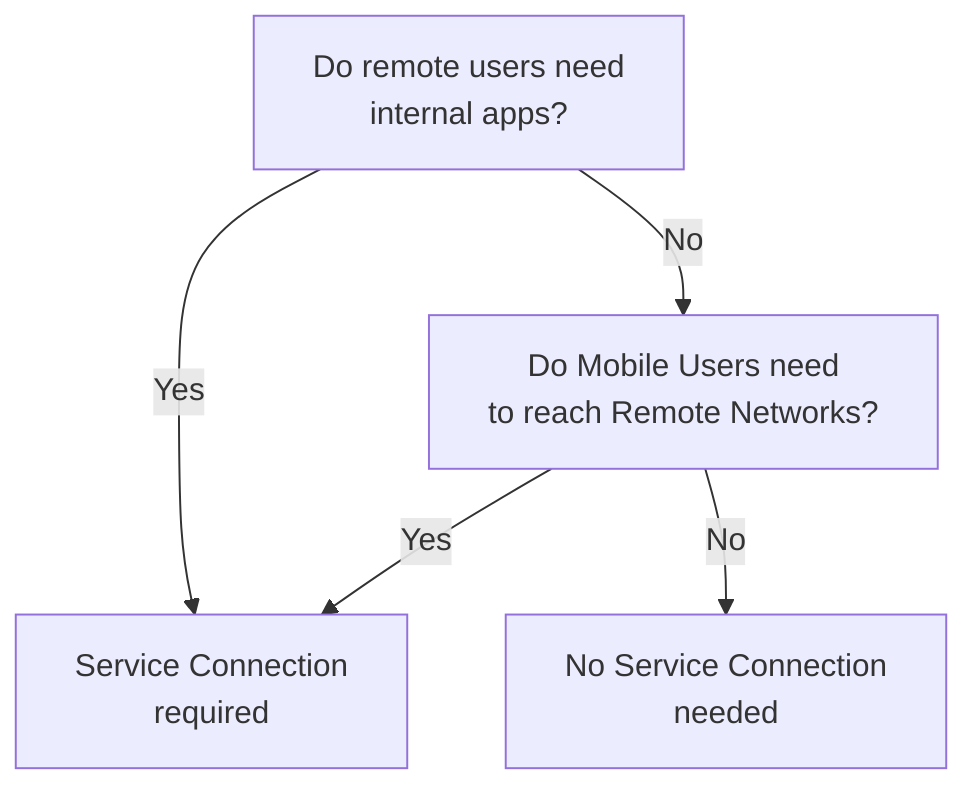
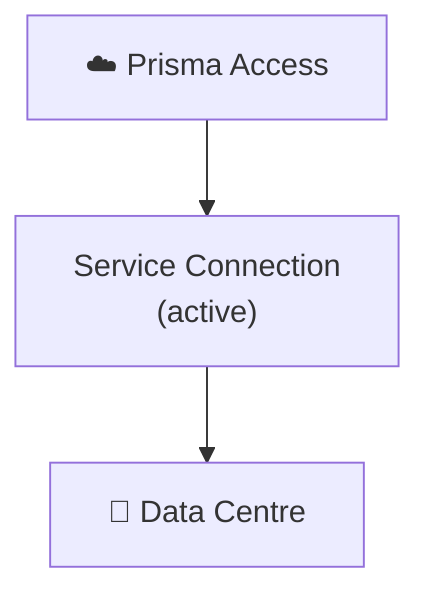
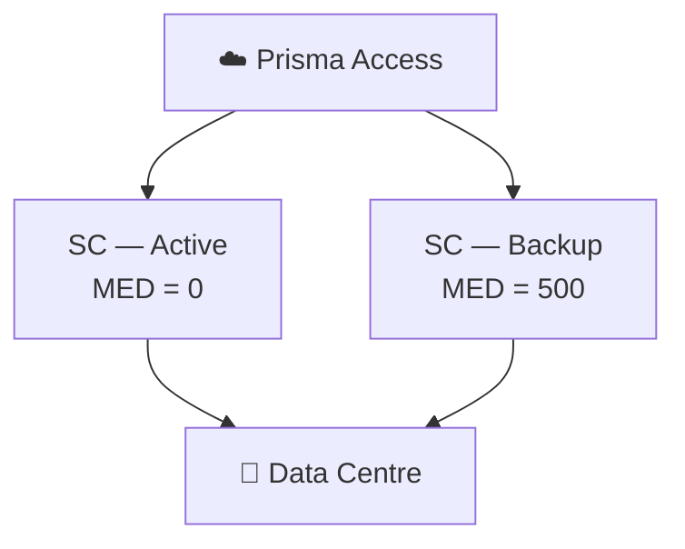
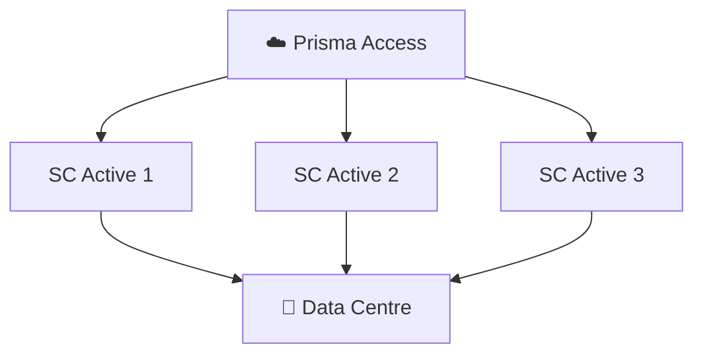
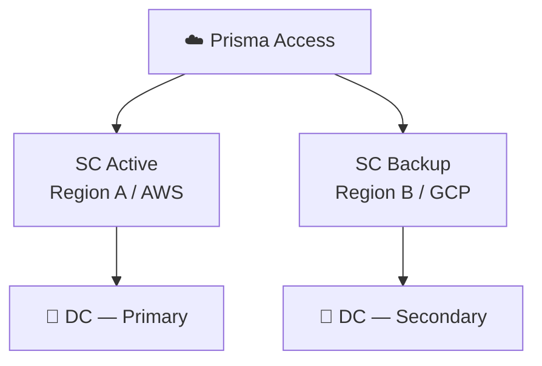

# Chapter 8 — Service Connections Planning

A **Service Connection** is the IPSec tunnel from Prisma Access into your corporate data centre or HQ. This chapter covers when you need one, how many, and how to design for redundancy — all decisions made before any configuration begins.

---

## When You Need a Service Connection

Two distinct use cases drive the need for Service Connections:

- **Corporate resource access** — remote networks and mobile users need to reach HQ/DC applications (ERP, Active Directory, internal DNS)
- **MU ↔ Remote Network communication** — even if there is no HQ, a Service Connection acts as the hub through which mobile users reach branch sites

> If your branches only need internet/SaaS access and mobile users never need to reach branch networks, a Service Connection is optional.

---

## Topology Options

### Single Service Connection (Non-Redundant)

Simplest design — one IPSec tunnel from Prisma Access to one HQ/DC firewall.

- No redundancy — an outage on the CPE or ISP breaks all corporate access
- Suitable for: small deployments where corporate access is non-critical or a backup path exists via the internet

---

### Active + Backup Service Connections

Two tunnels to the same (or different) DC — one active, one backup.

- Prisma Access uses **BGP MED values** to distinguish roles: active = MED 0, backup = MED 500
- If the active SC fails, traffic automatically diverts to the backup SC

> **Cross-reference, 2026-07-09:** Chapter 31 rigorously confirmed this exact mechanism via direct fetch, including an important nuance not spelled out here — this is Prisma Access's own **outbound** MED advertisement to the CPE, used to influence the CPE's route selection back toward Prisma Access. Separately, Prisma Access does **not** honor MED values the CPE advertises **inbound** — the two directions are independent. See Chapter 31 for the full detail; not re-derived here.

---

### Multiple Active Service Connections

Three or more SCs all in active state — provides **N× bandwidth** and automatic load distribution.

- All carry traffic simultaneously — loss of one SC reduces capacity but does not break access
- Three active SCs = approximately 3× the bandwidth of a single connection
- If all actives fail and backup SCs exist, backups activate and load-share

---

### Regional / Multi-Cloud Redundancy

For maximum resilience, deploy active and backup SCs in different cloud providers (AWS, GCP) and/or different geographic regions.

- Protects against cloud provider regional outages
- Recommended for organisations with data residency requirements — both SCs can be within the same country but on different cloud providers

> **Verified 2026-07-09** — confirmed still current via direct fetch, quoted directly: "you can ensure more resilient access to those resources by creating active and backup service connections in different cloud providers. You can specify these active and backup service connections in the same location or at different locations in different geographical regions." The same-country, different-provider pattern for data residency is also confirmed current — accomplished by pairing an in-country **Preferred** location with an in-country **Alternate** location.

> 📷 [PaloAlto diagram — Service Connection multi-cloud redundancy](https://docs.paloaltonetworks.com/prisma-access/administration/prisma-access-advanced-deployments/service-connection-advanced-deployments/service-connection-multi-cloud-redundancy)

---

### Colo-Connect (High-Bandwidth Private App Access)

**Added 2026-07-09 — a genuinely current, distinct topology option, confirmed missing from this chapter.** Alongside the IPSec-tunnel-based topologies above, Prisma Access offers **Colo-Connect**: private, high-bandwidth connectivity to hybrid cloud and on-premises data centres via cloud interconnect technology, rather than an IPSec tunnel over the public internet.

- **Coexists with, doesn't replace, standard Service Connections** — confirmed directly: "Colo-Connect coexists with the existing IPSec tunnel-based service connections," so a single deployment can mix both, using standard SCs for smaller/lower-bandwidth sites and Colo-Connect where multi-gigabit throughput is required
- **Bandwidth:** up to **100 Gbps** per compute region (Prisma Access 6.1+) — versus roughly 1 Gbps per standard Service Connection, a substantial difference
- **Mechanism:** uses **GCP Dedicated or Partner interconnects**, supports multiple VLAN attachments per interconnect link, and supports dynamic BGP routing
- **Regional redundancy:** up to **8 Colo-Connects per region** (confirmed as a Prisma Access 6.2+ addition), protecting against isolated facility outages without a network redesign
- **When to choose it:** existing colocation infrastructure with cloud interconnects already in place, a need for SDN/NaaS provider compatibility (e.g. Equinix, Megaport, PacketFabric), a requirement to avoid internet egress charges via purely private routing, or throughput needs that exceed what standard Service Connections can deliver

This is planning-level context only — full Colo-Connect configuration (interconnect provisioning, VLAN attachment setup) is out of scope for this chapter; see [Palo Alto's Colo-Connect documentation](https://docs.paloaltonetworks.com/prisma-access/administration/colo-connect-in-prisma-access) if this topology fits your requirements.

---

## Bandwidth Sizing

- Each Service Connection handles traffic from both mobile users and remote networks that route through it
- **Multiple active SCs** are the primary bandwidth scaling mechanism — add SCs to increase throughput
- Placement guidance: **put SCs close to the remote networks or users that access corporate resources most frequently** — this minimises latency through the Prisma Access internal fabric

---

## Pre-Configuration Checklist

Gather this information before creating Service Connections in Prisma Access:

| Item | Detail |
|---|---|
| IPSec-capable CPE | Firewall, router, or SD-WAN device model at the corporate site |
| Primary + secondary tunnel settings | IKE version, encryption, hashing, DH group |
| Corporate subnet list | All IP ranges behind the CPE that Prisma Access must reach |
| Internal DNS domains | Domains that require resolution against internal DNS servers |
| Tunnel monitoring IP | An ICMP-reachable address on the corporate side for liveness checks |
| Routing type | Static, BGP, or combination |
| BGP AS (if BGP) | Private AS number for the corporate CPE |

After creating the SC in Prisma Access, you will receive a **Service Endpoint Address** (FQDN or IP) to configure as the peer address on your CPE.

> **Verified 2026-07-09** — every item in this checklist (IPSec-capable CPE, primary/secondary tunnel settings, corporate subnet list, internal DNS domains, tunnel monitoring IP, routing type, BGP AS) is confirmed still current — these are the same underlying fields independently confirmed via direct fetch during this project's Chapters 29–31 configuration walkthroughs, not re-fetched separately here. This checklist is for standard IPSec-based Service Connections; a Colo-Connect deployment (above) would additionally require interconnect/VLAN provisioning details, not covered by this list.

---

## Key Takeaways

- A Service Connection is required whenever mobile users or remote networks need to reach corporate resources, or whenever MU ↔ RN communication is needed
- Active + backup SC uses BGP MED values (0 vs 500) to control failover — this is Prisma Access's own outbound advertisement; it does not honor inbound MED from the CPE (see Chapter 31)
- Multiple active SCs multiply available bandwidth; backup SCs activate only when all actives fail
- Multi-cloud and multi-region SC placement protects against cloud provider or regional outages — confirmed still current 2026-07-09
- **Added 2026-07-09** — Colo-Connect is a genuinely current, distinct topology option for high-bandwidth (up to 100 Gbps/region) private connectivity via GCP cloud interconnect, coexisting with (not replacing) standard IPSec-based Service Connections
- Collect CPE specs, subnet lists, and DNS domains before starting configuration — checklist confirmed still current 2026-07-09

---

*Previous: [Chapter 7 — Service Infrastructure & Subnet Planning](./ch07-service-infrastructure-planning.md)* · *Next: [Chapter 9 — Remote Networks Planning](./ch09-remote-networks-planning.md)*
