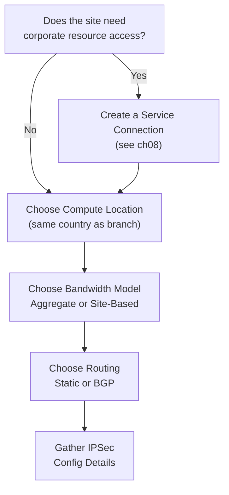

# Chapter 9 — Remote Networks Planning

Before onboarding any branch site, several architectural decisions must be made: which Prisma Access location the site will connect to, how bandwidth will be allocated, what routing protocol will be used, and whether corporate resource access is required. This chapter walks through each decision.

---

## Decision Map

---

## Step 1 — Compute Location Selection

A **compute location** is the Prisma Access region where the RN-SPN that processes your branch traffic is hosted. Choose a location:

- **In the same country** as the branch office — minimises latency and may satisfy data residency requirements
- **Local Zones** are available near major population and industry centres for even lower latency

> After selecting a compute location, all bandwidth for that location is shared across all remote network sites assigned to it.

---

## Step 2 — Bandwidth Model

Two bandwidth models are available:

| Model | How it Works | Available Since |
|---|---|---|
| **Site-Based** | Specify a predefined bandwidth tier per site when onboarding | Prisma Access 6.0+ |
| **Aggregate** | Bandwidth is pooled per compute location; sites dynamically share the pool | All versions |

> **Consistency note, added 2026-07-09:** this table presents the two models as if the choice were fully settled — it isn't, quite. Chapter 38 found that Palo Alto's own current documentation is **genuinely contradictory** about which model is the default for new deployments (one page says Aggregate no longer applies starting at PA 6.0; another says Aggregate remains available for all new deployments). This chapter's planning-level table is still the right starting point for the decision itself, but see Chapter 38 for the full documented ambiguity — confirm the current default directly in your own tenant rather than assuming either framing.

### Aggregate Model — Key Parameters

- **Minimum allocation:** 50 Mbps per compute location
- **Allocation is dynamic** — Prisma Access assigns bandwidth to sites based on demand within the compute location pool
- **Local Zones maximum:** 500 Mbps (1 Gbps requires contacting PaloAlto support) — **verified 2026-07-09**, still current: Local Zone locations cap at 500 Mbps for remote networks, with 1 Gbps support requiring a direct request to Palo Alto Networks support

### IPSec Termination Node Limits

| Limit | Value |
|---|---|
| Max remote sites per termination node | 500 |
| Bandwidth per termination node | 1,000 Mbps (1 Gbps) |
| Max termination nodes per compute location | 200 |
| Total max bandwidth per compute location | 200 Gbps |

> Allocate more than 500 Mbps to a compute location to ensure enough termination node capacity for your remote site count.

> **Cross-reference, 2026-07-09:** this table matches, figure for figure, what Chapter 38 independently confirmed via direct fetch during the earlier SCM-parity pass — no re-fetching needed here, just noting the consistency.

---

## Step 3 — Routing Strategy

| Method | When to Use |
|---|---|
| **Static routes** | Small deployments with stable, non-overlapping subnets; few routing changes expected |
| **BGP (dynamic)** | Larger deployments; required when branches have overlapping subnets; automatic route exchange |
| **Combination** | Both configured; static routes take precedence over BGP-learned routes |

> **Cross-reference, 2026-07-09:** consistent with Chapter 40's finding — static routes take precedence over BGP-learned routes for the same subnet, regardless of management platform. See Chapter 40 for the fuller explanation; not repeated here.

### Overlapping Subnets

Supported with limitations — **verified 2026-07-09, confirmed still current and accurately scoped:**
- Traffic from overlapping-subnet branches can only go to the **internet** — Service Connections cannot route traffic *to* an overlapping-subnet location (the ambiguity means Prisma Access can't determine which site to route to), and mobile users can't reach resources there either
- This restriction is specific to the overlapping-subnet site itself — non-overlapping remote network locations can still reach each other normally; it isn't a blanket internet-only rule across the whole deployment
- If branches need to communicate with each other or reach corporate resources, overlapping subnets must be resolved before onboarding
- **Workaround confirmed available, not previously mentioned here:** source NAT on the on-premises CPE (NGFW, router, or SD-WAN device) terminating the IPSec tunnel can resolve the ambiguity and restore connectivity, if resolving the overlap itself isn't practical (e.g. post-acquisition subnet conflicts, or an intentionally overlapping guest-network design)

---

## Step 4 — IPSec Requirements

Each branch CPE (router, firewall, or SD-WAN appliance) must support:

- **IKEv2** — IKEv1 is supported but IKEv2 is recommended
- Standard crypto: AES-128/256, SHA-256/384/512, DH Group 14 or higher
- The CPE must be publicly reachable for the Prisma Access RN-SPN to establish the tunnel

After creating the remote network in Prisma Access, you receive a **Service Endpoint Address** (FQDN or IP) — configure this as the IKE peer address on the CPE.

---

## Pre-Configuration Checklist

| Item | Detail |
|---|---|
| Compute location selected | Same country as branch; Local Zone if available |
| Bandwidth model chosen | Site-based (PA 6.0+) or Aggregate |
| Bandwidth allocation sized | Min 50 Mbps aggregate; account for site count and termination node limits |
| Routing type decided | Static, BGP, or combination |
| BGP AS number reserved | If using BGP (see ch07) |
| Branch subnet list documented | All RFC routes the branch CPE will advertise into Prisma Access |
| CPE IPSec specs confirmed | IKE version, encryption, hash, DH group |
| Service Connection created | If branch needs corporate resource access |

---

## Key Takeaways

- Choose a compute location in the same country as the branch for lowest latency
- Site-based model (PA 6.0+) simplifies per-site capacity; aggregate model pools bandwidth across all sites at a compute location — **added 2026-07-09:** Palo Alto's own docs genuinely disagree on which model defaults for new deployments; see Chapter 38
- Each termination node supports 500 sites and 1 Gbps — plan allocations accordingly; confirmed consistent with ch38's independently-verified figures
- Static routing suits small stable environments; BGP is required for overlapping subnets and larger deployments; static routes take precedence over BGP for the same subnet (see ch40)
- Overlapping branch subnets limit traffic to internet-only for the overlapping site specifically (not the whole deployment) — resolve before onboarding if RN-to-RN or HQ access is needed, or apply source NAT on the CPE as a workaround (confirmed 2026-07-09, previously not mentioned)

---

*Previous: [Chapter 8 — Service Connections Planning](./ch08-service-connections-planning.md)* · *Next: [Chapter 10 — Mobile User Deployment Planning](./ch10-mobile-user-deployment-planning.md)*
