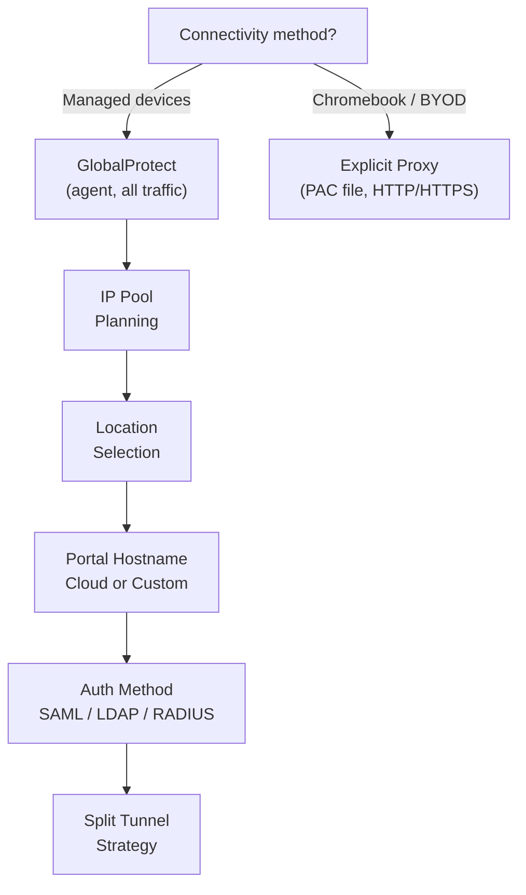
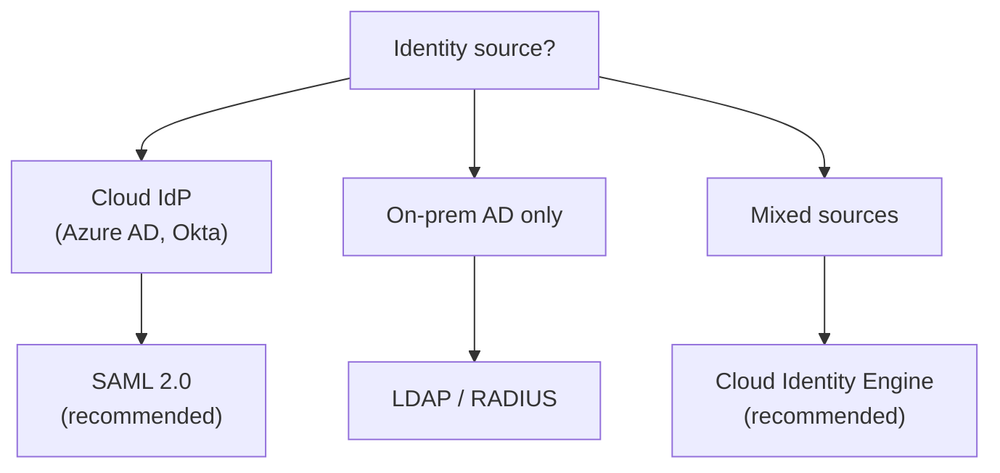

# Chapter 10 — Mobile User Deployment Planning

Mobile user deployment requires planning in five areas before any configuration is started: IP address pools, gateway locations, portal hostname, authentication method, and split-tunnelling strategy. This chapter covers each in sequence.

---

## Deployment Decision Map

---

## Step 1 — IP Address Pool Sizing

Prisma Access assigns IP addresses to connected users from pools you provide. Pools are distributed to gateways in **/24 blocks** as demand grows.

**Requirements:**
- RFC 1918 space recommended
- Avoid: `169.254.0.0/16` and `100.64.0.0/10`
- Must not overlap with the infrastructure subnet, corporate subnets, or remote network subnets

**Sizing rule — corrected 2026-07-09.** This table previously gave its own device-count-tier breakpoints, which **disagreed** with Chapter 7's IP pool table (a genuine cross-chapter inconsistency — the two were never cross-checked against each other, and neither reflected the real documented model). Chapter 7 has since been corrected: the real, documented sizing driver is **regional deployment scope**, not device count directly. Reconciled here to match:

- **Allocate at least 2× the number of mobile devices expected** — accounts for BYOD devices (a user's phone + laptop = 2 devices) and headroom for reconnects/concurrent sessions. This remains a valid, complementary planning heuristic — use it to size *within* whatever regional minimum applies below.

| Regional Scope | Minimum Pool Size |
|---|---|
| **1–2 regions** | `/23` (512 addresses) |
| **3+ regions** | `/19` (8,192 addresses) — single pool or spread across multiple pools |
| **Per-region pool** (if allocating separately per region) | `/23` minimum in any individual region |

See [Chapter 7 — Service Infrastructure & Subnet Planning](./ch07-service-infrastructure-planning.md) for the full explanation and sourcing — not repeated here. Larger mobile user populations typically correlate with broader regional deployment, so the 2× heuristic and the regional minimum tend to compound rather than conflict.

> Prisma Access tracks unique users over a rolling 30-day window for license compliance — not simultaneous connections.

---

## Step 2 — Location Selection

Choose Prisma Access gateway locations that are:

- **Closest to your user populations** — or in the same country for data residency
- **Adequate in count for your license type:**

| License | Max Combined Locations (MU) |
|---|---|
| **Local** | 5 locations by default — **expandable via the Additional Locations add-on**, confirmed 2026-07-09, previously not mentioned here |
| **Worldwide** | No location limit |

> **Verified 2026-07-09** — the 5-location default for Local and unlimited-for-Worldwide framing are both confirmed still current via direct fetch of Palo Alto's licensing documentation, quoted directly: "If you have a local edition license, the default number of locations is 5, and the number available for allocating to your tenants is based on the Additional Locations add-on." The genuinely new detail added here: the 5-location default is not a hard ceiling — it can be increased by purchasing Additional Locations. One thing **not** independently confirmed from a primary Palo Alto source in this pass: whether the 5-location limit is combined across mobile users and remote networks together (as this chapter states) or tracked separately for each — a Palo Alto community thread reports an account SE confirming "combined," consistent with this chapter's existing claim, but this wasn't found stated in the official documentation itself. Left as-is rather than "corrected" on unconfirmed grounds, but flagged here for transparency.

---

## Step 3 — Portal Hostname

The GlobalProtect portal is the entry point that delivers gateway configuration to connecting clients.

| Option | Hostname | Requirements |
|---|---|---|
| **Cloud-hosted** | `<tenant>.gpcloudservice.com` | Nothing — managed by PaloAlto |
| **Custom domain** | Your own FQDN | SSL certificate issued for that domain + DNS CNAME pointing to Prisma Access |

Custom domain is required when branding matters or when existing GlobalProtect configurations reference a specific internal hostname.

> **Terminology note, added 2026-07-09:** if you're configuring this in Strata Cloud Manager, the same two options are labeled **"Default Domain"** and **"Custom Domain"** (confirmed in Chapter 44) — not "Cloud-hosted"/"Custom domain" as named here. Same underlying mechanism, different UI wording depending on where you're clicking.

---

## Step 4 — Authentication Method

| Method | When to Choose |
|---|---|
| **SAML 2.0** (recommended) | Cloud IdP available (Azure AD, Okta, Ping); enables SSO + MFA |
| **Cloud Identity Engine** | PaloAlto's identity broker — recommended when using multiple identity sources |
| **LDAP / Active Directory** | On-premises AD, no cloud IdP |
| **RADIUS** | Existing RADIUS infrastructure |
| **Client certificate** | Highest assurance; certificate lifecycle management required |

---

## Step 5 — Split Tunnelling Strategy

By default all user traffic goes through the Prisma Access tunnel. Decide your exceptions before configuration:

| Strategy | Effect | Risk |
|---|---|---|
| **No split tunnel** | All traffic inspected | Highest latency for trusted SaaS apps |
| **Access-route exceptions** | Specific IP ranges bypass tunnel (e.g. M365 endpoints) | Bypassed traffic not inspected |
| **Application-based exceptions** | Named apps bypass tunnel | Requires App-ID profile |
| **Domain-based exceptions** | Specific FQDNs bypass tunnel | DNS-based; less precise |

> Define exceptions using Microsoft's published M365 endpoint lists to reduce Prisma Access load for latency-sensitive Microsoft services.

---

## Step 6 — Service Connections

Service Connections are **required** if mobile users need to access internal corporate resources (applications, AD, internal DNS). Plan at least one SC before completing mobile user configuration (see Chapter 8).

If no internal resource access is needed, a placeholder Service Connection may still be required to enable Mobile User ↔ Remote Network communication.

> **Consistency check, 2026-07-09:** consistent with Chapter 8's coverage of Service Connection planning — no contradiction found; cross-referenced rather than re-derived.

---

## Additional Pre-Deployment Items

- **IPv6:** Prisma Access recommends sinkholing IPv6 traffic unless your environment has explicit IPv6 support configured
- **Logging:** Decide whether to use Strata Logging Service (integrated) or export to a third-party SIEM (Syslog/HTTPS)
- **Post-install:** After deployment, retrieve the public IPs assigned per gateway location and add them to any corporate allow-lists or firewall rules

---

## Pre-Configuration Checklist

| Item | Status |
|---|---|
| IP pools sized (2× devices, no overlaps, no reserved ranges) | |
| Gateway locations selected (within license limits) | |
| Portal hostname decided (cloud or custom + certs) | |
| Authentication method chosen and IdP integration planned | |
| Split-tunnel exceptions listed | |
| Service Connection planned (if internal access needed) | |
| Strata Logging Service or SIEM export configured | |

---

## Key Takeaways

- **Corrected 2026-07-09** — IP pool minimum sizing is driven by **regional deployment scope**, not a device-count tier: /23 minimum for 1–2 regions, /19 minimum for 3+ regions — reconciled with Chapter 7's corrected version, which previously disagreed with this chapter's now-superseded table. The 2× expected-devices heuristic still applies within whatever regional minimum applies
- Local license defaults to 5 combined locations, **expandable via the Additional Locations add-on** (confirmed 2026-07-09, previously not mentioned); Worldwide has no limit — whether the 5-location default is truly combined (MU + RN) or tracked separately isn't confirmed in official docs, only in a community thread
- SAML with a cloud IdP is the recommended authentication path for new deployments
- Cloud Identity Engine simplifies policy when you have multiple identity sources
- Define split-tunnel exceptions before configuration — particularly for M365 endpoints
- A Service Connection is required if mobile users need to reach internal corporate resources — consistent with ch08, confirmed 2026-07-09

---

*Previous: [Chapter 9 — Remote Networks Planning](./ch09-remote-networks-planning.md)* · *Next: [Chapter 11 — Resiliency & Redundancy Design](./ch11-resiliency-and-redundancy-design.md)*
