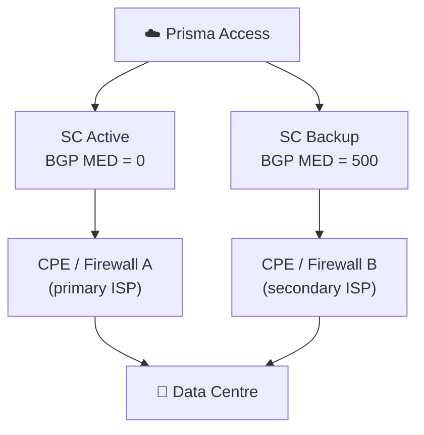
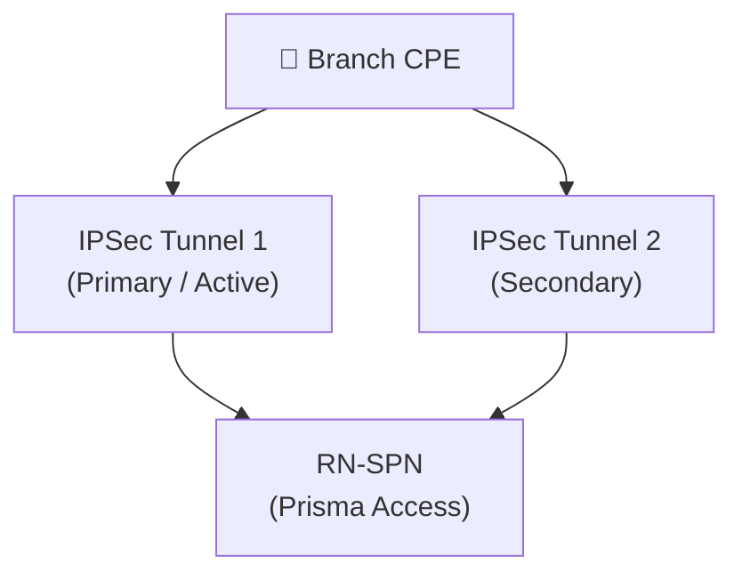

# Chapter 11 — Resiliency & Redundancy Design Considerations

Prisma Access provides substantial built-in resilience at the platform level — you do not manage the cloud infrastructure. However, the redundancy of the **connections into** Prisma Access is your design responsibility. This chapter covers what is automatic, and what requires deliberate design.

---

## Built-In Platform Resilience

These are handled automatically by PaloAlto Networks — no customer configuration required:

- **Multi-AZ PoPs** — each Prisma Access point of presence spans multiple cloud availability zones; a zone failure triggers automatic re-connection to another zone in the same PoP
- **Automatic connection re-establishment** — if an MU-SPN or RN-SPN fails, clients and branches reconnect to an alternative node without manual intervention
- **Security content updates** — threat signatures, URL categories, and WildFire updates are applied without service interruption

---

## Service Connection Redundancy

Service Connections are the component most likely to require deliberate redundancy design — they are the customer-managed IPSec tunnels, and their uptime depends on your CPE and ISP as well as the Prisma Access platform.

### Active + Backup Design

- Prisma Access uses **BGP MED values** to distinguish roles: active connections receive MED 0, backup connections receive MED 500
- If the active SC fails (ISP outage, CPE failure), BGP reconverges and traffic switches to the backup SC automatically

> **Cross-reference, 2026-07-09:** Chapter 31 rigorously confirmed this exact mechanism via direct fetch, including a nuance not spelled out here — this is Prisma Access's own **outbound** MED advertisement to the CPE; it does not honor **inbound** MED the CPE advertises. See Chapter 31 for the full detail; not re-derived here.

### Multi-Cloud Redundancy

Distribute active and backup SCs across different cloud providers (AWS, GCP) and/or different geographic regions:

- Protects against cloud provider regional outages
- Both SCs can remain within the same country (data sovereignty compliance) while using different providers
- When backup SCs are configured, they load-share traffic if all active connections fail

> **Cross-reference, 2026-07-09:** Chapter 8 covers this topology in fuller detail, including **Colo-Connect** — a related, high-bandwidth alternative to IPSec-based Service Connections (up to 100 Gbps/region via GCP cloud interconnect) that coexists with the topologies described here. See Chapter 8 rather than repeating that detail.

> 📷 [PaloAlto diagram — Service Connection multi-cloud redundancy topology](https://docs.paloaltonetworks.com/prisma-access/administration/prisma-access-advanced-deployments/service-connection-advanced-deployments/service-connection-multi-cloud-redundancy)

---

## Remote Network Redundancy

### Primary + Secondary Location

Site-based remote networks (PA 6.0+) support specifying a **Primary** and **Secondary** compute location for each site:

- Primary location handles normal traffic
- If the primary compute location becomes unavailable, traffic fails over to the secondary location automatically
- Choose locations in **different geographic regions** for maximum resilience

> ⚠️ **Flagged, 2026-07-09 — this feature's availability may depend on an unresolved documentation ambiguity.** This section is explicitly scoped to "Site-based remote networks (PA 6.0+)." Chapter 38 found that Palo Alto's own current documentation genuinely contradicts itself on whether Site-Based is the default bandwidth model for new deployments, or whether Aggregate remains available for all new deployments. If your deployment ends up on the Aggregate model, this specific Primary/Secondary redundancy feature's availability isn't guaranteed by what's confirmed in this chapter — see Chapter 38 for the full ambiguity rather than re-litigated here, and confirm directly in your own tenant before planning around this feature.

### IPSec Tunnel Redundancy

For each remote site, two IPSec tunnels can be configured:

| Mode | Behaviour |
|---|---|
| **Active/Active** | Both tunnels carry traffic simultaneously; each carries ~50% of load; ECMP load balancing |
| **Active/Passive** | Primary tunnel carries all traffic; secondary is standby only; failover on primary loss |

> **Cross-reference and light verification, 2026-07-09:** Chapter 41 did a deep investigation into ECMP — full requirements, scale limits, and a corrected conditional scale ceiling (previously miscast as a flat 62-site cap). The "~50% each" framing here is a reasonable simplification for a 2-tunnel scenario and not actively misleading against ch41's fuller picture — ECMP load-balances per-flow across equal-cost paths, which tends toward roughly even distribution over many flows without guaranteeing an exact 50/50 split. One thing worth knowing before choosing Active/Active, not previously mentioned here: ch41 confirmed **QoS and static routes are not supported** once ECMP is enabled — a site must route entirely via BGP. See Chapter 41 for the complete requirements and scale-limit detail; not repeated here.

- **Active/Active** is preferred when maximum throughput and seamless failover are required
- **Active/Passive** is simpler to configure and sufficient for most branch deployments

---

## Mobile User Redundancy

### Automatic Gateway Failover

GlobalProtect clients continuously measure gateway latency. If a gateway becomes unavailable:
- The client automatically reconnects to the next available gateway
- No user intervention required; reconnection is transparent

### Regional Redundancy

> **Investigated 2026-07-09, genuinely new ground for this project — treated as a first-time review, not a light confirmation.** This concept could **not** be independently confirmed as a currently-documented, standalone feature via direct fetch, despite repeated attempts. This chapter's original source link (a legacy, versioned `prisma-access-panorama-admin` URL — a pattern that has been superseded across most of this manual's other sources, and has been removed from this section rather than repeated) redirected to a generic "Prisma Access Overview" page on every direct-fetch attempt, rather than surfacing dedicated Mobile User Regional Redundancy content. WebSearch results describe a plausible, internally-consistent mechanism (redundant paths between the Mobile User dataplane and Service Connections in different compute locations, achieved by onboarding 2+ Service Connections in different compute locations) — but this could not be corroborated against a live, current primary-source page, so it isn't presented here with the same confidence as the rest of this chapter.
>
> What's more likely, based on the pattern found: this content may have been **consolidated into the Service Connection Multi-Cloud/Regional Redundancy documentation** already covered above in this chapter and in full in Chapter 8, rather than remaining a distinct, separately-documented feature — the underlying mechanism described (multiple Service Connections across compute locations providing mobile users a resilient path to corporate resources) is essentially the same thing that section already describes. Don't treat this as a confirmed, separate configuration step from Multi-Cloud Redundancy above without verifying directly in your own tenant.

Mobile user **regional redundancy** — as this manual previously described it — provides redundant network paths between the Mobile User dataplane and Service Connections at different compute locations:

- Believed to be configured at the global mobile user level (not per-user) — not independently re-confirmed in this pass
- Intended to ensure corporate resource access continues if a Service Connection's compute location becomes unavailable
- Traffic would reroute to an SC in the alternate region — functionally the same outcome the Multi-Cloud Redundancy section above already describes from the Service Connection side

If you need this specific capability, verify directly in your Prisma Access tenant (under Mobile User / GlobalProtect settings) rather than relying on this section, whose source link could not be confirmed current.

---

## Redundancy Design Summary

| Component | Built-In (Automatic) | Customer-Designed |
|---|---|---|
| **Platform PoPs** | Multi-AZ, auto-reconnect | — |
| **Service Connections** | BGP reconvergence | Active/backup SC placement, multi-cloud |
| **Remote Networks** | — | Dual tunnels (A/A or A/P), secondary location |
| **Mobile Users** | Gateway failover | Regional redundancy for SC access — **unconfirmed as a standalone feature, 2026-07-09; likely overlaps with Service Connection Multi-Cloud Redundancy above** |

---

## Key Takeaways

- The Prisma Access platform itself is multi-AZ and self-healing — your design effort focuses on the connection layer
- Service Connections use BGP MED to distinguish active (MED 0) from backup (MED 500) — this is Prisma Access's own outbound advertisement (see ch31) — always deploy at least one backup SC in a different cloud provider (see ch08 for the full topology, including Colo-Connect)
- Remote network dual-tunnel Active/Active provides throughput and seamless failover, but disables QoS and static routes (see ch41 for full ECMP requirements and scale limits); Active/Passive is the simpler alternative
- **Flagged 2026-07-09** — the Primary/Secondary compute location redundancy feature is scoped to Site-Based remote networks; its availability may depend on Chapter 38's unresolved Aggregate-vs-Site-Based documentation ambiguity
- Mobile user gateway failover is automatic — **regional redundancy as a standalone Mobile User feature could not be independently confirmed 2026-07-09** (stale source link, no successful direct-fetch confirmation); it likely overlaps with Service Connection Multi-Cloud Redundancy rather than being a distinct configuration step — verify directly in your tenant
- For maximum resilience: multi-cloud SCs + dual-tunnel RN, and confirm the mobile-user-side redundancy mechanism directly in your tenant

---

*Previous: [Chapter 10 — Mobile User Deployment Planning](./ch10-mobile-user-deployment-planning.md)* · *Next: [Chapter 12 — Traffic Flow Scenarios](../part3/ch12-traffic-flow-scenarios.md)*
