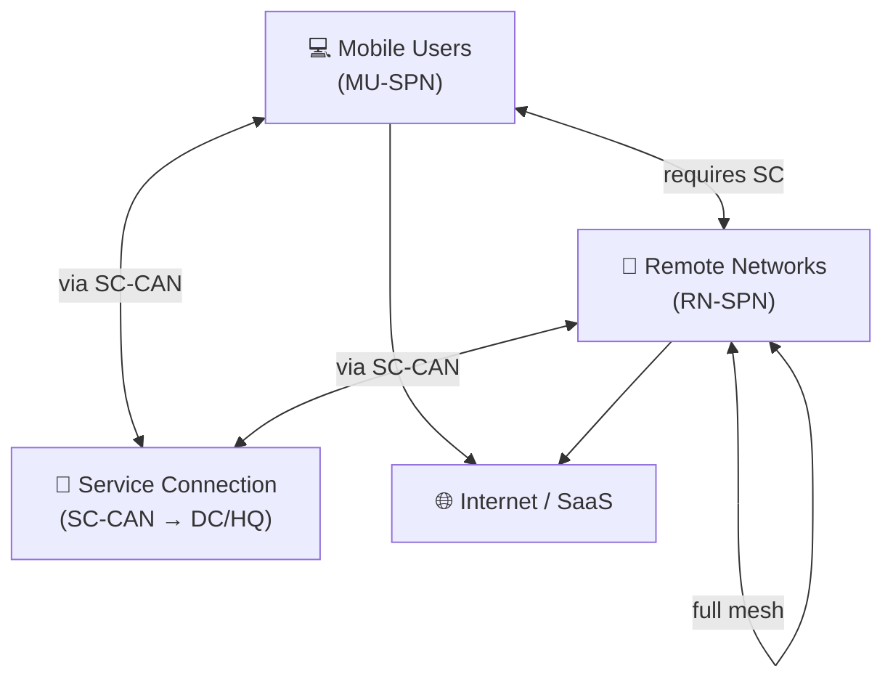

# Chapter 12 — Traffic Flow Scenarios: RN, MU, and SC Permutations

Understanding how traffic flows between the different Prisma Access endpoint types is essential before routing design. This chapter maps all six connectivity permutations — who can reach whom, and what infrastructure is required.

> **Consistency check, 2026-07-09:** this chapter's core claims — full-mesh Remote Networks by default, a Service Connection required for MU↔RN communication and corporate resource access, and RN-SPN/MU-SPN traffic routing through the SC-CAN — are consistent with Chapter 8's Service Connection requirements/redundancy coverage and Chapter 11's resiliency design. Cross-referenced rather than re-verified from scratch.

---

## The Three Endpoint Types

---

## Flow 1 — Remote Network → Internet / SaaS

**Path:** Branch CPE → RN-SPN → Security inspection → Internet

- No Service Connection required
- All outbound internet traffic from the branch is inspected at the RN-SPN using the full security stack
- The most common traffic flow for branch offices

---

## Flow 2 — Remote Network → Corporate Resources (HQ/DC)

**Path:** Branch CPE → RN-SPN → SC-CAN → Corporate CPE → Internal app

- **Requires a Service Connection** (Chapter 8)
- Uses iBGP internally within Prisma Access; uses eBGP to peer with the customer CPE at the DC — **verified 2026-07-09**, confirmed via direct fetch of Palo Alto's current routing documentation, quoted verbatim (appears twice in the source): "Prisma Access uses iBGP for internal routing and eBGP to peer with customer premises equipment at the data center"
- Traffic is inspected at the RN-SPN before forwarding through the SC

---

## Flow 3 — Mobile User → Internet / SaaS

**Path:** Endpoint (GlobalProtect) → MU-SPN → Security inspection → Internet

- No Service Connection required
- The user's nearest MU-SPN is selected automatically based on latency
- Full security stack (App-ID, URL filtering, threat prevention, DLP) applied at the MU-SPN
---

## Flow 4 — Mobile User → Corporate Resources (HQ/DC)

**Path:** Endpoint → MU-SPN → SC-CAN → Corporate CPE → Internal app

- **Requires a Service Connection**
- MU-SPNs form IPSec tunnels with the nearest Service Connection
- Prisma Access uses iBGP internally and eBGP to peer with CPE at the data centre

---

## Flow 5 — Remote Network ↔ Remote Network

**Path:** Branch A → RN-SPN A → Prisma Access backbone → RN-SPN B → Branch B

- Remote Network locations are **fully meshed** by default — no extra configuration needed
- No Service Connection required for RN-to-RN communication
- Traffic is inspected as it traverses the SPNs

---

## Flow 6 — Mobile User ↔ Remote Network

**Path:** Endpoint → MU-SPN → SC-CAN → RN-SPN → Branch

- **Requires a Service Connection** — the SC-CAN acts as the hub for this path
- Mobile users cannot connect to remote networks without a Service Connection, even if no HQ connectivity is needed
- This is the most common reason a Service Connection is deployed even in organisations without on-premises data centres

---

## Summary Table

| Flow | From | To | SC Required? | Path via |
|---|---|---|---|---|
| 1 | Remote Network | Internet/SaaS | No | RN-SPN |
| 2 | Remote Network | Corporate DC | **Yes** | RN-SPN → SC-CAN → DC |
| 3 | Mobile User | Internet/SaaS | No | MU-SPN |
| 4 | Mobile User | Corporate DC | **Yes** | MU-SPN → SC-CAN → DC |
| 5 | Remote Network | Remote Network | No | Full mesh via backbone |
| 6 | Mobile User | Remote Network | **Yes** | MU-SPN → SC-CAN → RN-SPN |

> **Judgement call, added 2026-07-09:** Flows 2 and 4 above assume the standard SC-CAN (IPSec) model. Chapter 8 also covers **Colo-Connect**, a high-bandwidth alternative path (up to 100 Gbps/region via GCP cloud interconnect) for the same corporate-resource-access flows, coexisting with standard Service Connections. Mentioned here only as a one-line pointer — see Chapter 8 for the full topology; not elaborated further, to keep this chapter's six-flow model clean at its intended level of abstraction.

> 📷 [PaloAlto diagram — Traffic flow overview](https://docs.paloaltonetworks.com/prisma/prisma-access/prisma-access-panorama-admin/prisma-access-advanced-deployments/service-connection-advanced-deployments/route-preferences-for-service-connection-traffic/mobile-user-and-remote-network-routing-to-service-connections-overview)

---

## Key Takeaways

- Remote Networks are fully meshed — no SC needed for branch-to-branch communication
- A Service Connection is required any time Mobile Users need to reach Remote Networks or corporate resources — consistent with ch08 and ch11, confirmed 2026-07-09
- Mobile Users and Remote Networks both use iBGP internally and eBGP at the service connection CPE boundary — verified 2026-07-09 via direct fetch, quoted verbatim from current Palo Alto documentation
- All six flows pass through security inspection at the relevant SPN
- Colo-Connect (see ch08) is a high-bandwidth alternative to the standard SC-CAN path assumed by Flows 2 and 4 — mentioned as a pointer only, not elaborated here

---

*Previous: [Chapter 11 — Resiliency & Redundancy Design](../part2/ch11-resiliency-and-redundancy-design.md)* · *Next: [Chapter 13 — Default Routing (Cold Potato)](./ch13-default-routing-and-backbone.md)*
