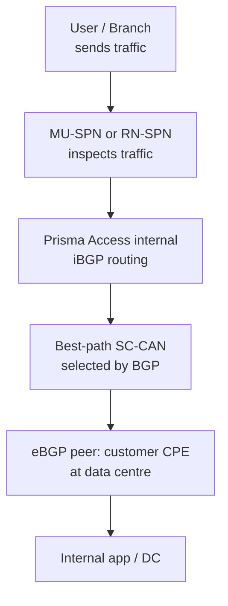
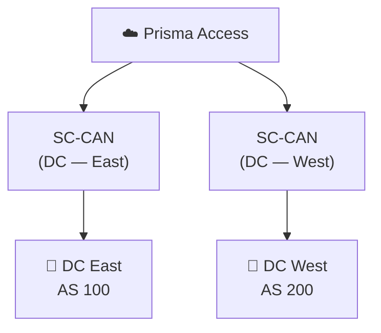
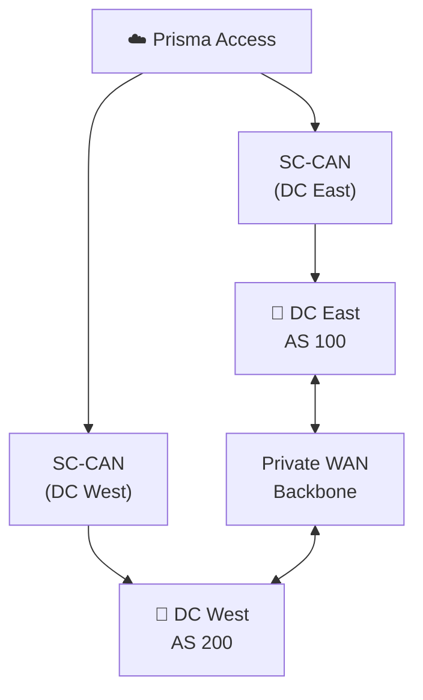

# Chapter 13 — Default Routing (Cold Potato): With & Without Backbone

**Default routing** (also called cold potato) is Prisma Access's baseline routing mode: traffic is kept inside the Prisma Access network as long as possible before being handed off to the customer's network. This chapter explains how it works, its BGP characteristics, and the symmetric routing challenge when multiple service connections are connected by a customer backbone.

---

## How Default Routing Works

**BGP behaviour in default mode:**
- Prisma Access divides mobile user subnets into **/24 blocks** before advertising them to the CPE
- Does **not** modify any default BGP attributes — honours whatever the CPE advertises
- Assigns **AS 65534** to all Service Connections internally
- Adds BGP community values to distinguish service connections from each other

This mode lets the CPE drive routing decisions through standard BGP path-selection (shortest AS-PATH, local preference, MED) without Prisma Access intervening.

---

## Without Backbone

The simplest topology: each Service Connection terminates at a separate, independent data centre with no private WAN link between them.

- Traffic egresses through whichever SC has the BGP best path
- Return traffic from DC East only comes back through DC East — no cross-DC paths exist
- Routing is naturally symmetric

---

## With Backbone

When DC East and DC West are connected by a private WAN (backbone), BGP route exchange between them creates a potential for asymmetric routing.

**The asymmetric routing problem:**
- A user in Asia might send traffic via SC East
- DC East and DC West exchange routes over the backbone
- The CPE at DC West may prefer the eBGP route over the backbone (shorter AS-PATH) for the return traffic — so **outbound goes East, return comes back West through a different SC**
- Prisma Access expects symmetric paths by default; asymmetric flows can cause connection issues

> **Added 2026-07-09 — a genuinely missing detail, cross-referenced rather than explained here since it's Chapter 14's (Hot Potato) territory:** when more than two Service Connections exist, a **Backup Service Connection** can be explicitly designated during onboarding to prevent asymmetric routing issues — but this option is only available in **Hot Potato routing mode**, not the Default (cold potato) routing this chapter covers. See Chapter 14 for the full mechanism; flagged here because this "With Backbone" scenario, with more than two SCs, is exactly the situation where it becomes relevant.

### Backbone Routing Options

**Corrected 2026-07-09** — the table below previously used descriptive labels ("Symmetric," "Asymmetric only," "Asymmetric with load share") that don't match the actual current UI/config option names. Confirmed via direct fetch and updated to the real labels, with CLI-style equivalents noted since they may still be useful for readers working from older documentation or scripts:

| Setting | CLI-style equivalent | Behaviour |
|---|---|---|
| **Disable asymmetric routing for Service Connections** | `no-asymmetric-routing` | Prisma Access requires the same SC for both directions — drops or penalises asymmetric return paths |
| **Allow asymmetric routing for Service Connections** | `asymmetric-routing-only` | Allows asymmetric flows across the backbone — enable if your DC backbone routes return traffic via a different SC |
| **Allow asymmetric routing and load sharing across Service Connections** | `asymmetric-routing-with-load-share` | Allows asymmetric flows and load-balances across multiple SCs — recommended when multiple active SCs exist |

> ⚠️ **Which option is actually the default — investigated 2026-07-09, genuine unresolved contradiction in Palo Alto's own current documentation, not resolved here with a guess.** This chapter previously stated "Symmetric (default)" as settled fact. Two current, live Palo Alto docs pages disagree directly:
> - **"Configure a Service Connection"** states: *"you can take advantage of load balancing in your Prisma Access deployment by selecting Allow asymmetric routing and load sharing across Service Connections **(the default setting)**."* — i.e., **asymmetric-routing-with-load-share** is the default.
> - **"Configure the Prisma Access Service Infrastructure,"** under its own "Backbone Routing" heading, states: *"By default, the Prisma Access backbone requires that you have a symmetric network path for the traffic returning from the data center or headquarters location by way of a service connection."* — i.e., **no-asymmetric-routing** (symmetric) is the default.
>
> Both quotes come from current, live pages fetched directly — this isn't one stale page versus one current page as far as could be determined. Following the same pattern as Chapter 38's Aggregate/Site-Based bandwidth ambiguity: this is reported as a flagged, unresolved contradiction rather than picked one way. **Confirm the actual default directly in your own tenant before assuming either framing.** See [Appendix D — Known Documentation Ambiguities](../appendix/appD-known-documentation-ambiguities.md) for this and other tracked ambiguities in one place.

> ⚠️ **Route summarisation risk — refined 2026-07-09.** If the CPE aggregates (summarises) routes before advertising them to Prisma Access, the /24 granularity Prisma Access needs to choose the correct return SC is lost — this can cause asymmetric routing even in symmetric mode. Use **Hot Potato routing** (Chapter 14) when route summarisation is in use. **Confirmed via direct fetch, more specific guidance than previously stated here:** Palo Alto explicitly does **not** recommend route summarisation on Service Connections at all if the deployment also has Remote Networks — quoted directly: *"If your Prisma Access deployment has Remote Networks, Palo Alto Networks does not recommend the use of route summarization on Service Connections. Route summarization on service connections is for Mobile Users deployments only."* If you do use it in a Mobile-Users-only deployment, Palo Alto's guidance is to pair it with Hot Potato routing and a Backup SC (see below) for deterministic behavior.
>
> **Self-correction, 2026-07-09 — an unverified claim was caught and removed during Chapter 14's review.** This note previously added "...since hot potato with summarization stops AS-PATH prepending" as the reason for pairing with a Backup SC. That specific claim was investigated rigorously while reviewing Chapter 14 (multiple direct, targeted fetches of the exact page it was attributed to, including an exact-phrase search) and could **not** be found anywhere in the actual current documentation, despite appearing in aggregated search-engine summaries. Removed here rather than left standing on an unverified basis — see Chapter 14 for the full investigation. The underlying guidance (pair route summarization with Hot Potato + a Backup SC in Mobile-Users-only deployments) remains from the directly-confirmed source above and is unaffected by this correction.

> 📷 [PaloAlto diagram — Service connection routing preferences](https://docs.paloaltonetworks.com/prisma-access/administration/prisma-access-advanced-deployments/service-connection-advanced-deployments/route-preferences-for-service-connection-traffic)

---

## When to Use Default Routing

Default routing is appropriate when:
- You have a single Service Connection (no backbone)
- You have multiple SCs at independent DCs with no backbone between them
- Your CPE does **not** aggregate or summarise routes before advertising to Prisma Access
- You want standard BGP best-path selection without AS-PATH manipulation

Switch to Hot Potato routing (Chapter 14) when:
- Route summarisation is in use on SCs
- You have multiple DCs connected by a backbone and need deterministic symmetric routing
- You want Prisma Access to egress traffic at the nearest exit point rather than keeping it in the fabric

---

## Key Takeaways

- Default routing honours CPE BGP attributes without modification; AS 65534 is assigned to all SCs
- Works well without a backbone; backbone deployments must address the symmetric routing challenge
- **Corrected 2026-07-09** — three backbone options, real current labels: Disable asymmetric routing (`no-asymmetric-routing`), Allow asymmetric routing (`asymmetric-routing-only`), Allow asymmetric routing and load sharing (`asymmetric-routing-with-load-share`) — which one is actually the default is a **genuine, unresolved contradiction** in Palo Alto's own current documentation; don't trust either framing without confirming in your own tenant
- Route summarisation breaks the /24 granularity Prisma Access relies on for symmetric path selection — use hot potato if CPE summarises routes; **refined 2026-07-09**: Palo Alto explicitly does not recommend route summarisation on Service Connections at all if the deployment has Remote Networks — it's guidance scoped to Mobile-Users-only deployments
- A **Backup Service Connection** can be designated to prevent asymmetric routing when more than two SCs exist — added 2026-07-09, but only available in Hot Potato mode (Chapter 14), not the Default routing this chapter covers

---

*Previous: [Chapter 12 — Traffic Flow Scenarios](./ch12-traffic-flow-scenarios.md)* · *Next: [Chapter 14 — Hot Potato Routing](./ch14-hot-potato-routing.md)*
