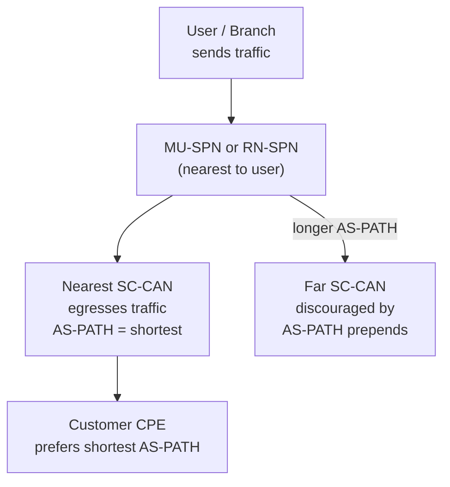
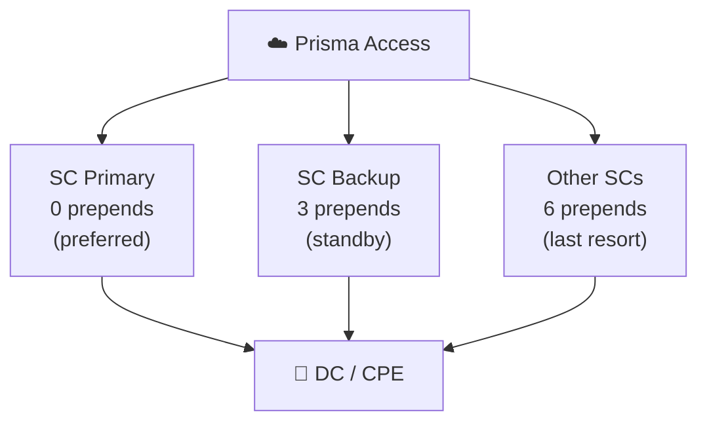

# Chapter 14 — Hot Potato Routing

**Hot potato routing** is an alternative to default routing where Prisma Access egresses traffic to the customer's network as quickly as possible — at the first available exit point — instead of holding it in the Prisma Access fabric to find the optimal SC. It achieves this through **AS-PATH prepending** to influence BGP path selection at the CPE.

---

## The Core Principle

Traffic exits through the SC closest to the source (fewest AS-PATH prepends) — the CPE's BGP best-path selection then naturally prefers the shortest AS-PATH for return traffic, making the path **symmetric**.

---

## AS-PATH Prepend Values

Prisma Access applies different numbers of prepends based on the Service Connection's role and BGP peer relationship:

| SC Role | Same BGP Peer IP | Different BGP Peer IP |
|---|---|---|
| **Primary SC** | 0 prepends | 1 prepend |
| **Backup SC** (designated) | 3 prepends | 4 prepends |
| **Other SCs** | 6 prepends | 7 prepends |

- **0 prepends** = shortest AS-PATH = most preferred by CPE
- **6–7 prepends** = strongly discouraged — only used if primary and backup are both unavailable

This creates a clear preference hierarchy: primary SC → backup SC → all other SCs.

> **Verified 2026-07-09** — all six prepend counts confirmed still current via direct fetch of Palo Alto's current routing documentation: Primary 0/1, Backup 3/4, Other 6/7 (same/different BGP peer IP respectively) — no changes needed.

> 📷 [PaloAlto diagram — Hot potato routing AS-PATH prepending](https://docs.paloaltonetworks.com/prisma-access/administration/prisma-access-advanced-deployments/service-connection-advanced-deployments/route-preferences-for-service-connection-traffic)

---

## Primary and Backup SC Designation

When configuring a Remote Network or Service Connection in hot potato mode, you designate one SC as **primary** and optionally one as **backup**:

- Normal traffic: exits via the primary SC (AS-PATH = shortest)
- Primary fails: CPE now prefers the backup SC (3 prepends become best available)
- All designated SCs fail: remaining SCs activate with 6-prepend AS-PATH

---

## Why Hot Potato Solves Route Summarisation

In default routing, if the CPE summarises routes (e.g. advertises `10.0.0.0/8` instead of individual `/24s`), Prisma Access loses the granularity to determine which SC the return traffic should use — causing asymmetry.

Hot potato avoids this problem because:
- The exit decision is made **outbound** based on AS-PATH, not on the CPE-advertised prefix
- The CPE's return path follows the same BGP preference (shortest AS-PATH) automatically
- Route summarisation does not affect the AS-PATH-driven selection

> ℹ️ **Investigated 2026-07-09 — priority item, resolved as "claim not overturned," not confirmed as fact either.** Research surfaced during Chapter 13's review suggested a directly conflicting claim: that enabling route summarization while using Hot Potato causes Prisma Access to *stop* AS-PATH prepending, potentially reintroducing asymmetric routing. This was investigated rigorously — multiple direct, targeted fetches of the specific current Palo Alto page the claim was attributed to (including an exact-phrase search for "no longer prepends" combined with "hot potato" and "route summarization") found **no such statement anywhere on that page**. This matches a pattern seen repeatedly elsewhere in this project this session: a specific, plausible-sounding claim that traces only to aggregated search-engine summaries, not to any verifiable primary-source text. The claim is **not** applied as a correction here. At the same time, this chapter's own "unaffected by route summarization" framing above is architectural reasoning (AS-PATH prepending is an outbound Prisma-Access-side mechanism, independent of how the CPE aggregates its own inbound-learned routes) rather than a direct docs quote either — it wasn't found explicitly stated as such in the fetched source. Treat it as a reasoned, not contradicted, claim — not a verbatim-confirmed one. If you're relying on this behavior for a production design, verify directly with Palo Alto or in your own tenant rather than trusting either framing at face value.

---

## Default vs Hot Potato — Decision Guide

| Scenario | Recommended Mode |
|---|---|
| Single SC | Either (default is simpler) |
| Multiple SCs, independent DCs, no summarisation | Default |
| Multiple SCs with backbone between DCs | Hot Potato (avoid asymmetric issues) |
| CPE summarises routes on SC advertisements | **Hot Potato required** |
| Deterministic symmetric routing across multiple DCs | Hot Potato |
| Want CPE to fully control routing | Default |

---

## Key Takeaways

- Hot potato egresses traffic at the nearest SC by using AS-PATH prepending to influence CPE BGP preference
- Primary SC = 0 prepends, backup SC = 3 prepends, other SCs = 6 prepends (+ 1 more for different BGP peer IPs) — confirmed still current 2026-07-09
- Symmetric return routing is achieved because the CPE naturally prefers the shortest AS-PATH
- Required when the CPE uses route summarisation — default routing breaks under summarisation
- **Investigated 2026-07-09** — a claim that Hot Potato itself becomes compromised by route summarization (stops AS-PATH prepending) could not be verified against its cited primary source despite rigorous, targeted attempts; not applied as a correction, but this chapter's own "unaffected" claim isn't a directly-quoted fact either — treat both with appropriate caution
- Designate a backup SC to ensure automatic failover with a 3-prepend preference

---

*Previous: [Chapter 13 — Default Routing (Cold Potato)](./ch13-default-routing-and-backbone.md)* · *Next: [Chapter 15 — Prisma SD-WAN Overview & Architecture](./ch15-sd-wan-overview-and-architecture.md)*
