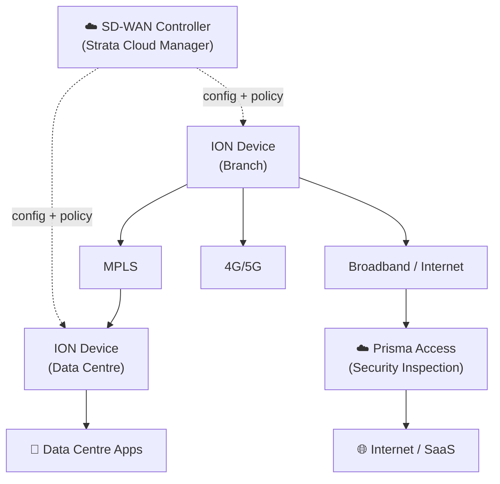
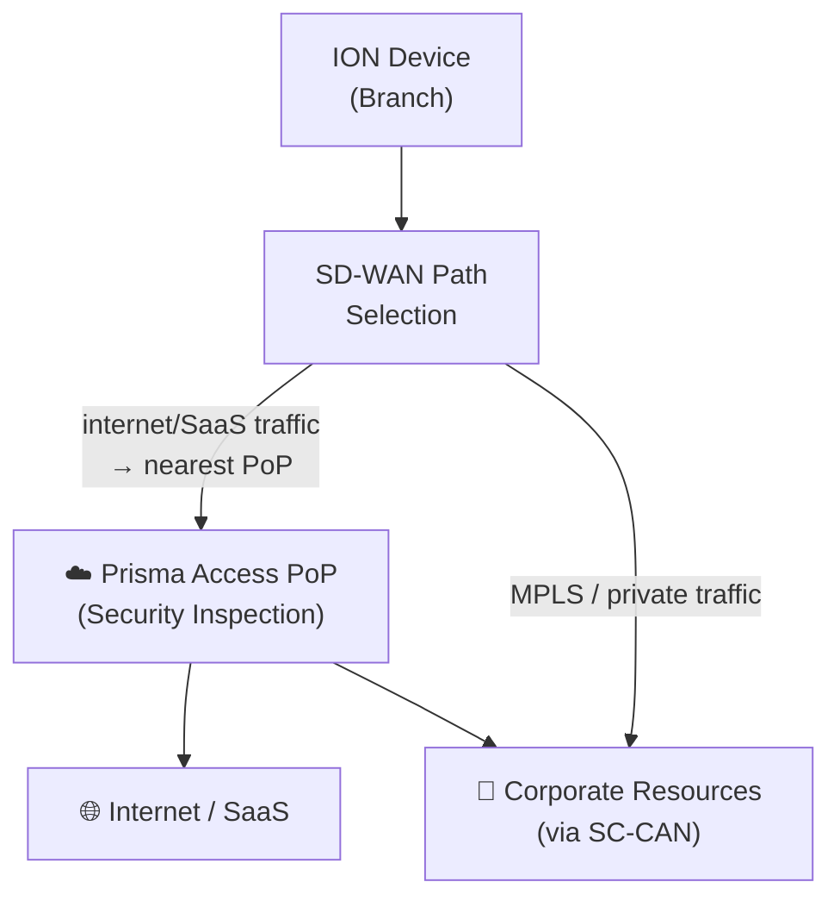

# Chapter 15 — Prisma SD-WAN Overview & Architecture

Prisma SD-WAN (formerly CloudGenix) is PaloAlto Networks' software-defined WAN platform. It sits at branches and data centres as the WAN on-ramp, handling path selection across multiple links, and feeds traffic requiring security inspection to Prisma Access PoPs. This chapter covers the architecture, key components, and integration model.

---

## Architecture Overview

> 📷 [PaloAlto diagram — Prisma SD-WAN key components](https://docs.paloaltonetworks.com/prisma-sd-wan/administration/get-started-with-prisma-sd-wan/prisma-sd-wan-key-components)

---

## Three Core Components

> **Retitled 2026-07-09** — this section previously covered only two components (Controller, ION Devices). **CloudBlades** is a genuinely missing third core component, confirmed via Palo Alto's own architecture materials — added below.

### SD-WAN Controller

Managed through **Strata Cloud Manager** — **confirmed 2026-07-09**, quoted directly: "You can configure policies, resources, CloudBlades, and system settings for Prisma SD-WAN using Strata Cloud Manager" — the controller is the single source of truth for all ION device configuration:

- Centralises routing configuration across all branch and DC sites
- Defines application-level policies (which link carries which app)
- Provides a unified dashboard for WAN performance, path health, and application analytics
- Manages security policy rules in combination with Prisma Access

> **On-Premises Controller — added 2026-07-09, a nuance this chapter's architecture didn't previously account for.** Confirmed as a real, current, production-grade deployment option, not a narrow or legacy case — Palo Alto documents it as "a secure and reliable solution for users who don't want to use Cloud Controller for regulatory or compliance reasons," aimed at "enterprises handling highly sensitive data, such as government and financial institutions," with dedicated installation guides covering single-node and 9-node HA topologies. This chapter's diagram and description otherwise assume a cloud-hosted controller throughout — that remains the default and recommended path, but it isn't the only option. Not elaborated further here; see Palo Alto's On-Premises Controller documentation if this fits your compliance requirements.

### ION Devices

ION (Identity-Oriented Networking) devices are the forwarding elements deployed at branches and data centres:

- Available in **hardware** (physical appliances) and **software** (virtual) form factors
- Two operating modes:
  - **Analytics Mode** — collects and reports traffic details without enforcing path policy
  - **Control Mode** — enforces path selection and QoS policy; full SD-WAN functionality
- Deploy in **zero-touch provisioning** mode — the device calls home to the controller and receives its configuration automatically

### CloudBlades

**Added 2026-07-09 — confirmed as a real, current third core component,** not just an add-on feature. Confirmed via Palo Alto's own materials, quoted directly: *"A CloudBlade is an API-based abstraction layer between the Prisma SD-WAN controller and a third-party offering such as AWS Transit Gateway Connect (TGW), ServiceNow, Prisma Access, and others."*

- **Integration model:** CloudBlades let Prisma SD-WAN integrate with third-party cloud services and platforms without requiring controller or ION software updates — confirmed directly: this abstraction means "if [a third party] changes something, API changes can be made... without any impact to that service," so customers "can use new features without having to update tens, hundreds, or thousands of branch devices"
- **Example integrations, confirmed via existing dedicated Palo Alto documentation pages for each:** AWS Transit Gateway, Azure Virtual WAN, Zscaler Internet Access, and Prisma Access itself (the Prisma Access CloudBlade is how SD-WAN and Prisma Access are wired together at the platform level)
- Enabled and managed from the same Strata Cloud Manager interface as the Controller and ION devices

---

## VPN Fabric

Prisma SD-WAN builds a secure overlay across whatever underlay WAN links are available:

- Supports **MPLS, broadband internet, and 4G/5G** simultaneously
- Automatically establishes encrypted VPN tunnels between ION devices at branches and DCs
- Session keys are **rotated every hour** for VPN security
- Path selection runs continuously — each application's traffic is steered to the best-performing link in real time

> **Confirmed 2026-07-09** — hourly session key rotation verified via direct fetch, quoted directly: "it still maintains the Prisma SD-WAN secure VPNs and rotates the unique session keys for each VPN every hour for up to 72 hours." No correction needed.

---

## Control Plane / Data Plane Separation

A critical design property:

- The control plane (path selection decisions, policy enforcement) runs in the ION device
- The controller manages configuration but is **not** in the forwarding path
- If the ION device **loses connectivity to the controller**, it continues to forward traffic using the last known policy for up to **72 hours** autonomously
- VPN session keys continue to rotate during controller-disconnected operation

> **Confirmed 2026-07-09** — the 72-hour offline autonomy figure verified via the same direct fetch as the session-key rotation figure above (same source quote covers both). No correction needed.

This separation means a controller outage or connectivity loss to the cloud does not take branches offline.

---

## Integration with Prisma Access

Prisma SD-WAN and Prisma Access are designed to work together as a single SASE platform:

- Internet-bound and SaaS traffic is steered from the ION device to the **nearest Prisma Access PoP** via an optimised path
- MPLS or private WAN traffic for corporate applications bypasses Prisma Access and goes directly to the DC ION
- Both WAN performance metrics and security policy are managed from a single interface in Strata Cloud Manager

---

## Key Takeaways

- Prisma SD-WAN consists of a cloud controller (Strata Cloud Manager) and ION devices at branches and DCs — plus **CloudBlades**, a third core component (added 2026-07-09) for API-based third-party integrations without controller/ION software updates
- **Added 2026-07-09** — an On-Premises Controller deployment option exists for regulated/compliance-sensitive organizations, alongside the cloud-hosted controller this chapter otherwise assumes
- ION devices operate in Analytics or Control mode; zero-touch provisioning via controller call-home
- VPN fabric spans MPLS, broadband, and 4G/5G; session keys rotate hourly — confirmed still current 2026-07-09
- Control/data plane separation means ION devices continue forwarding for 72 hours without controller connectivity — confirmed still current 2026-07-09
- Integration with Prisma Access: SD-WAN steers internet/SaaS to the nearest PoP; MPLS/private traffic bypasses Prisma Access

---

*Previous: [Chapter 14 — Hot Potato Routing](./ch14-hot-potato-routing.md)* · *Next: [Chapter 16 — SD-WAN Controllers, ION Communication & Trust Chain](./ch16-sd-wan-controllers-and-ion-security.md)*
