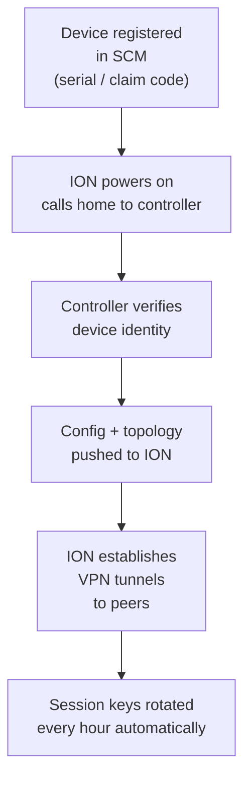

# Chapter 16 — SD-WAN Controllers, ION Communication & Trust Chain

The Prisma SD-WAN controller and ION devices communicate through a secure, cloud-hosted management channel. This chapter covers how that channel works, what happens when it breaks, and how the VPN fabric maintains security without a persistent controller connection.

---

## Controller Architecture

```mermaid
graph TD
    SCM["☁️ Strata Cloud Manager<br/>(SD-WAN Controller)"]
    ION1["ION — Branch A"]
    ION2["ION — Branch B"]
    ION3["ION — Data Centre"]
    VPN["🔒 VPN Fabric<br/>(direct ION-to-ION)"]

    SCM -.->|config + policy<br/>(control channel)| ION1
    SCM -.->|config + policy| ION2
    SCM -.->|config + policy| ION3
    ION1 <-->|encrypted VPN tunnel<br/>(data plane)| VPN
    ION2 <-->|encrypted VPN tunnel| VPN
    ION3 <-->|encrypted VPN tunnel| VPN
```

**Key separation:** The controller manages configuration and policy via the **control channel**. Actual user traffic flows over **direct ION-to-ION VPN tunnels** (**Secure Fabric Links** — see the correction below) — the controller is never in the forwarding path.

> **Added 2026-07-09, confirmed via direct fetch — a meaningful privacy/security detail not previously in this chapter:** customer data traffic itself is **never sent to the controller**. The ION device inspects only metadata for path-selection and telemetry purposes and does not decrypt or forward end-user traffic content to Strata Cloud Manager. What the control channel actually carries back is anonymized network/application metadata — bytes transferred, link capacity, voice MOS score, transaction error rate/time, and event alerts/alarms — not the traffic itself.

---

## Zero-Touch Provisioning

ION devices ship without manual pre-configuration and call home to the controller on first boot:

1. ION device powers on and establishes an outbound connection to the Strata Cloud Manager
2. Controller authenticates the device (based on serial number / claim code registered in SCM)
3. Controller pushes site configuration, policies, and network topology
4. ION device begins establishing VPN tunnels to other ION devices per the received topology

No on-site technician needs to touch a CLI to complete branch deployment.

> 📷 [PaloAlto diagram — Prisma SD-WAN zero-touch provisioning](https://docs.paloaltonetworks.com/prisma-sd-wan/administration/prisma-sd-wan-sites-and-devices/set-up-devices/assign-the-ion)

---

## Trust Chain



- Each ION device's identity is established through registration in Strata Cloud Manager before deployment
- VPN sessions between ION devices use **unique per-session keys**
- Keys are rotated **every hour**, even when the ION is disconnected from the controller

---

## Autonomous Operation (Controller Disconnected)

If the ION device loses its connection to the controller:

| Duration | ION Behaviour |
|---|---|
| **0–72 hours** | Continues forwarding traffic using last-known configuration and policies |
| **0–72 hours** | Continues VPN tunnels; session keys still rotate hourly |
| **After 72 hours** | Behaviour degrades — contact PaloAlto for guidance — **checked 2026-07-09, confirmed this vague framing is genuinely the extent of what's publicly documented**; no more specific post-72-hour behavior was found (searches surfaced only that the ION "cannot learn about new sites or policy updates until controller connectivity is restored" and general support-ticket guidance) — not embellished here with invented specifics |

This resilience means:
- A controller cloud outage does **not** take branches offline
- WAN path selection, QoS, and application steering continue using the cached policy
- VPN security is maintained even without controller connectivity

---

## Control Channel vs Data Plane

| | Control Channel | Data Plane (VPN) |
|---|---|---|
| **Path** | ION → Strata Cloud Manager (cloud) | ION ↔ ION (direct) |
| **Content** | Config updates, policy, telemetry | User traffic |
| **Encryption** | TLS — **confirmed 2026-07-09** (four TLS 1.2 connections: control/Message Routing Layer, logs, flows, stats channels) | **Corrected 2026-07-09** — native ION-to-ION traffic uses **Secure Fabric Links**, not IPsec, with hourly key rotation |
| **Impact if lost** | Policy cannot be updated; forwarding continues | Service interruption |

> ⚠️ **Data Plane encryption corrected 2026-07-09 — a likely factual error, not just a terminology gap.** This table previously stated the Data Plane uses "IPSec with hourly key rotation." Confirmed via direct fetch of Palo Alto's current documentation, quoted verbatim: *"Prisma SD-WAN ION devices can communicate with other Prisma SD-WAN devices through Prisma SD-WAN Secure Fabric Links or communicate with standard VPN endpoints through traditional IPsec or GRE tunnels."* IPsec/GRE ("Standard VPN") is specifically the mechanism for connecting to **non-Prisma-SD-WAN third-party endpoints** (e.g. a Cisco ASA, or a third-party cloud security service) — it is **not** the term for native ION-to-ION data plane traffic, which this chapter is actually describing. Native ION-to-ION traffic uses **Secure Fabric Links** instead. The hourly key rotation figure itself remains accurate and unaffected by this correction.

---

## Key Takeaways

- The controller (Strata Cloud Manager) manages config and policy; it is never in the forwarding path
- Zero-touch provisioning: devices call home, authenticate via serial/claim code, receive config automatically
- VPN session keys rotate every hour — even during controller disconnection
- ION devices operate autonomously for up to 72 hours without controller connectivity — vague post-72-hour framing confirmed 2026-07-09 as the genuine extent of what's publicly documented
- Control plane and data plane are fully separated — controller outage ≠ branch outage
- **Corrected 2026-07-09** — native ION-to-ION data plane traffic uses **Secure Fabric Links**, not IPSec; IPsec/GRE is specifically the "Standard VPN" mechanism for connecting to non-Prisma-SD-WAN third-party endpoints
- **Added 2026-07-09** — customer data traffic is never sent to the controller; only anonymized metadata (bytes transferred, link quality, transaction metrics, alerts) crosses the TLS control channel

---

*Previous: [Chapter 15 — Prisma SD-WAN Overview & Architecture](./ch15-sd-wan-overview-and-architecture.md)* · *Next: [Chapter 17 — ION Device Family & High-Availability Design](./ch17-ion-devices-and-high-availability.md)*
