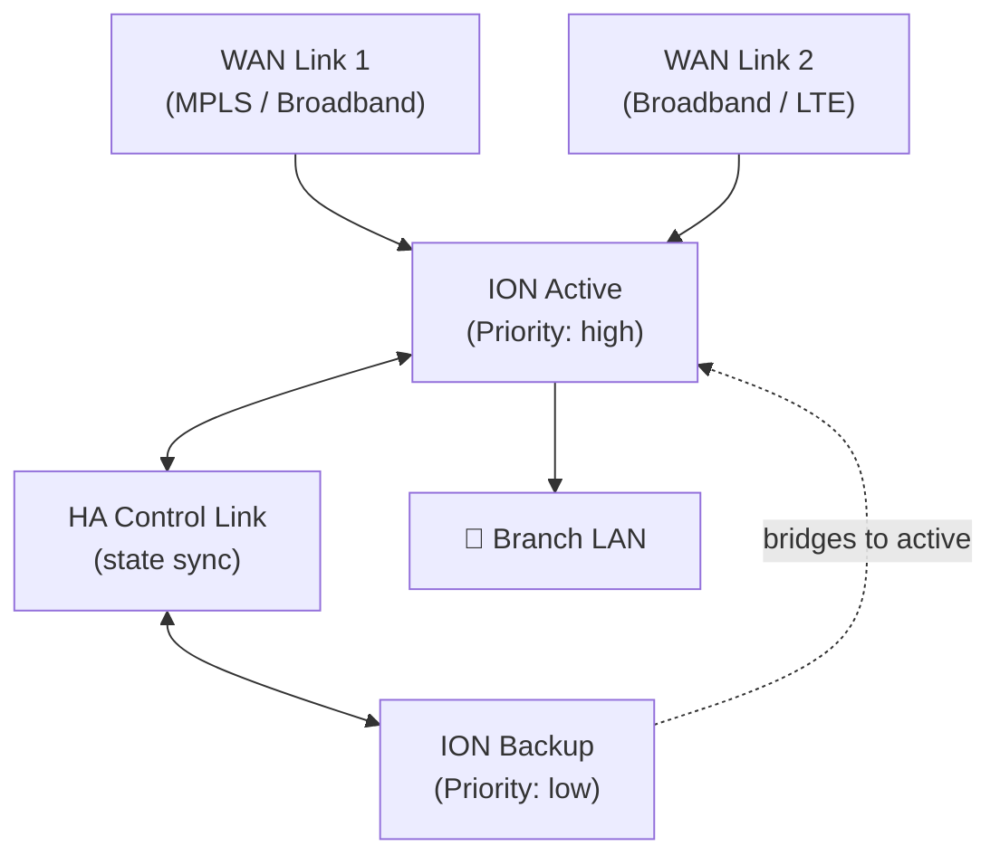

# Chapter 17 — ION Device Family & High-Availability Design

ION devices are the forwarding elements at every Prisma SD-WAN site. This chapter covers the hardware and virtual form factors available, their deployment contexts, operating modes, and how branch HA works.

---

## ION Device Family

### Hardware Appliances

**Corrected 2026-07-09 — a larger correction than a single-model footnote suggested.** This table previously listed all models in each row as if uniformly current. Confirmed directly against Palo Alto's official Hardware End-of-Life Dates page: **five of the seven rows below include at least one end-of-sale model** — not just ION 3000 and ION 9000. Restructured with an explicit Status column so a reader planning a new deployment doesn't accidentally spec a discontinued model:

| Model | Status | Typical Deployment | Current Replacement |
|---|---|---|---|
| ION 1000 | **End-of-sale** (Feb 2024) | Small branch — low-throughput | ION 1200 |
| ION 1200 / 1200-S | Current — **end-of-sale effective Sept 1, 2026** (imminent) | Small branch — optional 4G/5G cellular variants | ION 1200-C5G-WW / 1200-S-C5G-WW |
| ION 2000 | **End-of-sale** (Feb 2024) | Medium branch | ION 1200-S |
| ION 3000 | **End-of-sale** (Mar 2024) | Large branch or small DC | ION 3200 |
| ION 3200 / 3200H | **Current** | Large branch or small DC | — |
| ION 5200 | **Current** | Large branch / regional hub | — |
| ION 7000 | **End-of-sale** (Feb 2022 — longest-EOS model in this table) | Data centre / high-throughput | No replacement listed |
| ION 9000 | **End-of-sale** (Jun 2024) | Large data centre / carrier-grade | ION 9200 |
| ION 9200 | **Current** | Large data centre / carrier-grade | — |

> ⚠️ **For new deployments, spec only the "Current" rows** (1200/1200-S for now, 3200/3200H, 5200, 9200) — everything marked end-of-sale can no longer be newly ordered, though existing deployments remain supported through their listed End-of-Life dates. ION 1200/1200-S specifically are current today but scheduled to end sale on **September 1, 2026** — very close to this chapter's review date — with `-C5G-WW` variants as the documented replacement; if you're planning a deployment now, confirm current orderability directly with Palo Alto before speccing these.

> 📷 [PaloAlto hardware lineup — ION device family](https://docs.paloaltonetworks.com/prisma-sd-wan/administration/prisma-sd-wan-sites-and-devices)
> 

### Virtual (Software) ION

The same ION software runs as a virtual appliance on:

- **Public cloud:** AWS, Azure, GCP, OCI, Alibaba Cloud
- **On-premises virtualisation:** VMware, KVM (NFV)
- **Managed edge:** Megaport Virtual Edge, Dell PowerEdge

Virtual ION is used where rack space is unavailable, for cloud-based branch/DC presence, or for NFV-based deployments in carrier environments.

> **Verified 2026-07-09** — this platform list confirmed still current and complete; no platforms added or deprecated since this chapter was written.

---

## Operating Modes

| Mode | What it Does |
|---|---|
| **Analytics Mode** | Collects and reports traffic details, application performance, and path metrics — no active path enforcement |
| **Control Mode** | Enforces path selection, QoS, and application steering policies — full SD-WAN functionality |

Devices can be deployed initially in Analytics Mode to baseline traffic before switching to Control Mode to enforce policy.

---

## Branch High-Availability Design

HA protects against ION device failure (software, hardware, or network) by pairing two ION devices at a branch site.

### HA Topology

**Constraints:**
- **Maximum one HA group per branch site**
- **Maximum two ION devices per HA group**
- One device is elected active; the other is backup

> **Verified 2026-07-09** — both constraints confirmed still current via direct fetch, quoted verbatim: "At most, one HA group may be created per branch site and up to two devices can be bound to a group."

---

### Active vs Backup Responsibilities

| Function                   | Active Device | Backup Device                     |
| -------------------------- | ------------- | --------------------------------- |
| Traffic forwarding         | Yes           | Bridges to active only            |
| Path selection (SD-WAN)    | Yes           | No                                |
| BGP peering                | Yes           | No                                |
| VPN establishment          | Yes           | Standby (unusable until failover) |
| Route advertising/learning | Yes           | No                                |
| Statistics, alerts, alarms | Full          | Limited                           |

The backup device bridges traffic to the active device — it does **not** independently perform path selection or BGP during normal operation. This ensures a single consistent set of forwarding decisions.

---

### Election and Failover

- **Priority** assigned to each device determines which is elected active — higher priority = preferred active
- Recommended minimum priority gap between active and backup: **40 units** — **confirmed 2026-07-09** via direct fetch, quoted verbatim: "It is recommended to have a minimum difference of at least 40 between the priorities of an active ION device and a backup ION device"
- **Preemption** can be enabled — if a higher-priority device recovers, it reclaims the active role
- Failover triggers: software fault, hardware fault, WAN link failure, loss of required paths

### HA Control Interface

- Synchronises state between active and backup (e.g. DHCP leases, session tables)
- Any Layer 3 interface with a static IP can serve as the HA control interface
- Recommended: use the dedicated **Controller port** when both devices share the same subnet

> 📷 [PaloAlto diagram — Branch HA topology](https://docs.paloaltonetworks.com/prisma-sd-wan/administration/prisma-sd-wan-branch-high-availability)

---

## Key Takeaways

- **Corrected 2026-07-09** — ION hardware ranges from small-branch to carrier-grade DC, but the lineup is **not** uniformly current: ION 1000, 2000, 3000, 7000, and 9000 are all confirmed end-of-sale (ION 7000 since 2022); only ION 1200/1200-S (current but ending sale Sept 2026), 3200/3200H, 5200, and 9200 are fully current for new deployments — confirm current orderability directly with Palo Alto before speccing
- Virtual ION platform list (AWS, Azure, GCP, OCI, Alibaba, VMware, KVM, Megaport Virtual Edge, Dell PowerEdge) confirmed still current and complete, 2026-07-09
- Analytics Mode for traffic baselining; Control Mode for active SD-WAN policy enforcement
- Branch HA: one group per site, two devices maximum; one active, one backup — both constraints confirmed still current 2026-07-09
- Active device owns all path selection, BGP, and VPN; backup bridges traffic only until failover
- Priority gap of 40+ between active and backup is recommended (confirmed still current 2026-07-09); preemption is configurable

---

*Previous: [Chapter 16 — SD-WAN Controllers, ION Communication & Trust Chain](./ch16-sd-wan-controllers-and-ion-security.md)* · *Next: [Chapter 18 — SD-WAN Design Considerations](./ch18-sd-wan-design-considerations.md)*
