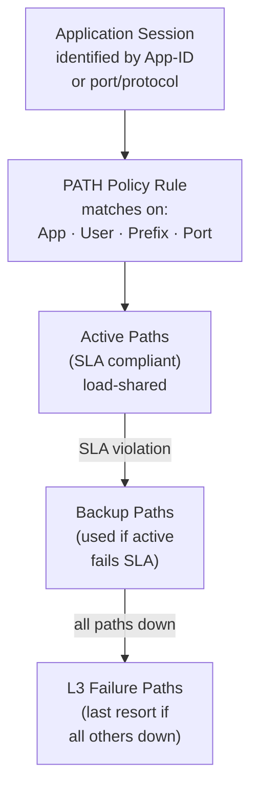

# Chapter 18 — SD-WAN Design Considerations: PATH, QoS, and NAT

Three design areas require deliberate decisions in every Prisma SD-WAN deployment: how to steer application traffic across available WAN paths (PATH policy), how to prioritise traffic on congested links (QoS), and how addressing works for branch-originated traffic (NAT). This chapter covers each.

---

## PATH Policy Design

PATH policies define which WAN link carries which application, and what quality thresholds trigger a path switch.

### How PATH Policy Works

Path selection uses a three-tier fallback:
1. **Active paths** — preferred; load-shared as long as SLA metrics are met
2. **Backup paths** — used when active paths violate SLA thresholds
3. **L3 failure paths** — last resort when all other paths are down

### PATH Rule Match Criteria

| Match Field | Examples |
|---|---|
| Application ID (App-ID) | Microsoft 365, Zoom, SAP |
| Network context | Internet, private WAN (MPLS), SD-WAN fabric |
| Source prefix / destination prefix | Specific subnets |
| Port / protocol | TCP 443, UDP 5060 |
| User / group | AD group membership |
| Device ID | Specific endpoints |

### Link Quality Metrics

The ION device continuously probes all active WAN paths and measures:

| Metric | What It Measures |
|---|---|
| **Latency** | Round-trip time to the remote endpoint |
| **Loss** | Percentage of packets dropped |
| **Jitter** | Variance in packet inter-arrival time |
| **MOS** | Mean Opinion Score — composite voice quality indicator |

Probes are sent over:
- **ICMP** — latency, loss, jitter
- **DNS** — transaction time, failure rate
- **HTTP/S** — transaction time, failure rate
- **TCP/UDP App Metrics** — TCP init failure rate, RTT, TRT

**Real-time voice and video** applications are automatically affected by link quality metrics — when a link degrades below threshold, Prisma SD-WAN seamlessly moves existing and new flows to an alternative path.

> 📷 [PaloAlto diagram — Dynamic path selection overview](https://docs.paloaltonetworks.com/content/dam/techdocs/en_US/supporting/prisma-sd-wan/Prisma-SD-WAN-Dynamic-Path-Selection.pdf)

### Forward Error Correction (FEC)

Where path switching *moves* traffic off a degraded path, FEC is a Performance Policy option for *repairing* traffic on a path in place, without waiting for a full path failover. When Link Quality Monitoring detects loss or latency degradation on a Prisma SD-WAN VPN path, Performance Policy can invoke FEC — sending redundant, error-correcting data alongside the original packets (with packet duplication as a related technique) so the receiving ION can reconstruct lost packets without a retransmission round-trip.

FEC runs in one of two modes:
- **Always ON** — encodes FEC continuously for designated mission-critical applications, regardless of current link performance
- **Adaptive** — activates FEC only when a Prisma SD-WAN VPN path's packet loss exceeds the threshold set in its SLA

Design notes:
- FEC applies only to Prisma SD-WAN VPN paths (ION-to-ION or ION-to-cloud) — it does not apply to direct-internet breakout or MPLS paths
- It is driven by loss/latency Link Quality Monitoring metrics, not application-layer metrics
- Typical fit: real-time voice/video and other loss-sensitive, business-critical apps running over otherwise-marginal links (e.g. broadband or satellite/LEO backup circuits) where an outright path switch would be disruptive
- Each ION platform supports a maximum number of concurrently FEC-encoded VPN paths that scales with hardware tier (entry-level platforms support fewer than the largest ION models) — factor this into sizing if FEC is planned across many sites
- Requires ION device software version 6.3.2 or later

---

## Design Recommendations for PATH Policy

**Prioritise voice and video first:**
- Create explicit PATH rules for UC apps (Teams, Zoom, WebEx) with strict latency/jitter/MOS thresholds
- Assign MPLS or the highest-quality link as the active path; broadband as backup

**Use SLA-based selection for business-critical apps:**
- Define per-application SLA thresholds — the ION switches paths when metrics breach the threshold, not just when links go down

**Let default policy handle bulk traffic:**
- Background traffic (backups, software distribution) can use any available path via a catch-all rule

---

## QoS Design

QoS policies classify and queue traffic on congested WAN links. In Prisma SD-WAN, QoS is applied per-link and stacked with the PATH policy:

- Define traffic classes (e.g. voice, video, business-critical, bulk)
- Assign minimum bandwidth guarantees and maximum burst limits per class
- The same QoS policy applies to both the active ION device and its HA backup
- QoS operates independently per WAN interface — an MPLS link can have different QoS than a broadband link

**Key design principle:** QoS does not replace PATH policy. PATH policy prevents bad-link usage; QoS manages contention *on a link that PATH has already selected*.

---

## NAT Design

NAT considerations vary by the type of traffic leaving the branch:

| Traffic Type | NAT Approach |
|---|---|
| **Internet-bound via Prisma Access** | No branch NAT required — Prisma Access PoP performs NAT for internet egress |
| **Internet-bound direct breakout** | Branch CPE or ION performs source NAT to the ISP-assigned public IP |
| **MPLS to corporate DC** | Usually no NAT — private addressing end-to-end |
| **SD-WAN fabric (ION-to-ION)** | Source NAT not typically applied — VPN overlay preserves original addressing |

**Branch internet breakout (without Prisma Access):** If a PATH policy allows direct internet egress from the ION device (bypassing Prisma Access), ensure the ION or upstream CPE applies source NAT — otherwise traffic leaves with a private source IP and cannot return.

**Recommended:** Route all internet/SaaS traffic through Prisma Access for inspection — this avoids direct-breakout NAT complexity and ensures consistent security policy.

---

## Key Takeaways

- PATH policy uses three-tier fallback: active paths (SLA compliant) → backup → L3 failure
- Match rules on App-ID, network context, prefix, user/group — granular per-application steering
- Link quality metrics (latency, loss, jitter, MOS) drive real-time path switching for voice/video
- FEC (Always ON or Adaptive) repairs loss on a Prisma SD-WAN VPN path in place, as an alternative to a full path switch
- QoS manages congestion on a chosen link — it complements rather than replaces PATH policy
- For internet-bound traffic: route through Prisma Access to avoid branch-side NAT complexity and maintain security coverage

---

*Previous: [Chapter 17 — ION Device Family & High-Availability Design](./ch17-ion-devices-and-high-availability.md)* · *Next: [Chapter 19 — Data Center Scaling Design](./ch19-data-center-scaling-design.md)*
