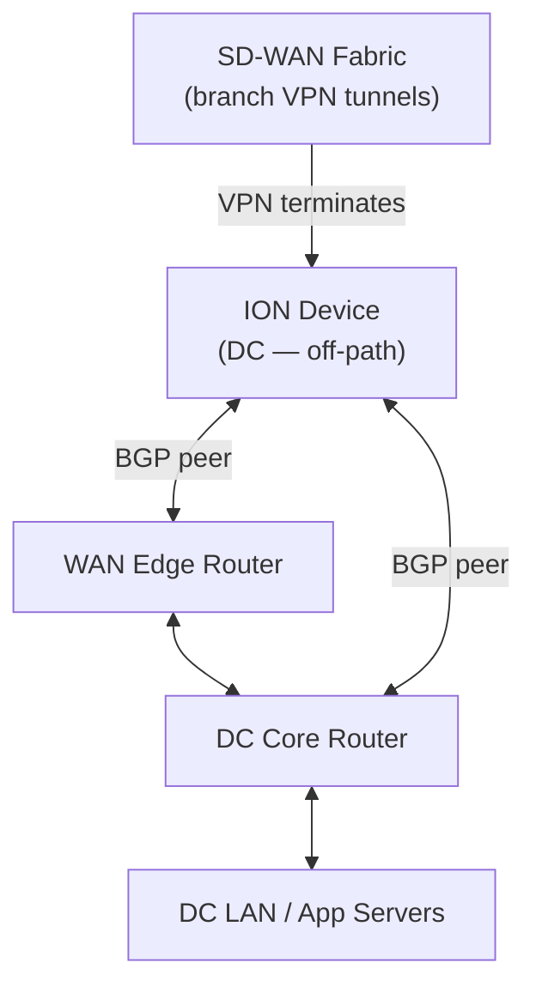
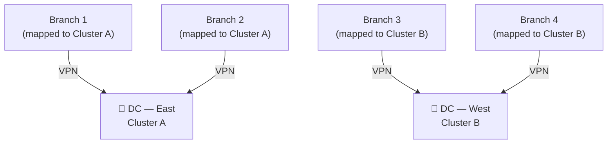
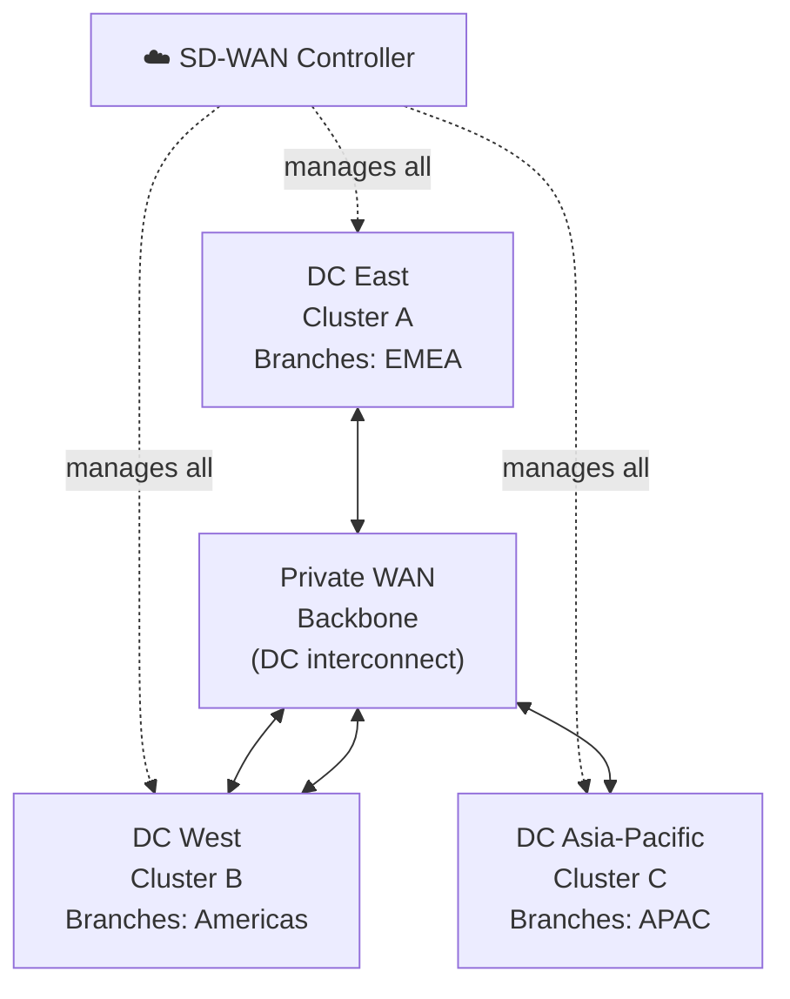

# Chapter 19 — Data Center Scaling Design

As the number of branch sites grows, the DC must be designed to scale — both in terms of ION device capacity and logical topology. This chapter covers DC ION placement, cluster architecture, branch assignment, and how to scale across multiple DC clusters.

---

## DC ION Placement Options

### Off-Path (Recommended Default)

The ION device connects to the DC **core router and WAN edge router** as a side attachment — it is not inline between the routers and does not affect existing traffic flows.

- Existing DC routing is **not disrupted** — the ION is an additional BGP peer
- The ION only attracts traffic for branches where a VPN tunnel is active
- Simplest integration path for environments with mature DC routing

### Inline (L3 DC Mode)

The ION device is placed **between the private WAN routers and the DC core/LAN**. Supported since ION software version 6.4.1 (requires OSPF on LAN in DC mode).

- Provides more granular traffic steering and visibility
- Used when the DC lacks a core router that can peer with the ION via BGP
- More disruptive to deploy in existing environments

> 📷 [PaloAlto diagram — DC ION off-path and inline topologies](https://docs.paloaltonetworks.com/prisma-sd-wan/administration/prisma-sd-wan-branch-and-data-center-routing/prisma-sd-wan-data-center-routing)

---

## DC BGP Peering

DC ION devices use three BGP peer types within a single routing domain:

| Peer Type | Connects To | Purpose |
|---|---|---|
| **Edge peer** | WAN edge router | Exchanges WAN prefixes and branch routes via SD-WAN fabric |
| **Core peer** | DC core router | Distributes branch/SD-WAN routes into the DC LAN |
| **Classic peer** | Any L3 device | Traditional BGP for complex topologies requiring full control |

The ION handles route-map generation, update filtering, and redistribution automatically — manual route-map config is not required for standard deployments.

---

## DC Cluster Architecture

A **DC cluster** is a logical group that associates a set of branch sites with a specific DC site (and its ION devices). All branches in a cluster establish VPN tunnels to the DC ION devices in that cluster.

**Cluster rules:**
- Each DC site gets a **default cluster** automatically on creation
- New branch sites are automatically mapped to the default cluster
- A branch can only belong to **one cluster** at a time
- Branches can be moved between clusters via **Manage branches on cluster**

---

## Scaling Across Multiple Clusters

As the number of branches grows beyond a single DC ION pair's capacity, add clusters:

| Scaling Action | How |
|---|---|
| Add a second DC ION pair | Add a new cluster to the same DC site — branches assigned to new cluster connect to new ION pair |
| Split load across DCs | Create clusters at different DC sites — assign branches geographically or by latency |
| Move branches between clusters | Use "Manage branches on cluster" — affects which DC ION the branch establishes VPN to |
| Monitor cluster capacity | Set soft limits; "Hub Cluster Branch Count Limit Exceeded" alarm fires when exceeded |

**Scaling design principle:** Each cluster represents a DC ION pair's VPN capacity. Size clusters so each ION pair handles the number of branches it can sustain at target bandwidth — then add clusters as branch count grows.

---

## Multi-DC Cluster Design

- Assign branches to the geographically nearest DC cluster for lowest latency
- DC backbone connects clusters for DC-to-DC traffic and route exchange
- Each cluster managed centrally through a single Strata Cloud Manager instance — this holds within one organisation's tenant; MSPs or enterprises with separate legal/billing tenants still see each tenant's SD-WAN fabric managed as its own distinct SCM instance rather than merged into one view (the same multi-tenancy scoping distinction covered for Prisma Access in Chapter 6)

> 📷 [PaloAlto diagram — Multi-cluster SD-WAN topology](https://docs.paloaltonetworks.com/prisma-sd-wan/administration/prisma-sd-wan-sites-and-devices)

---

## Key Takeaways

- Off-path ION placement is the recommended default — non-disruptive BGP peering with existing DC infrastructure
- Inline placement available since ION software 6.4.1 for environments needing in-path steering
- DC BGP uses three peer types: edge, core, and classic — ION handles route-map generation automatically
- Clusters logically group branches to a DC ION pair; branches belong to exactly one cluster
- Scale by adding clusters (more ION pairs) at the same or additional DC sites, then re-assigning branches

---

*Previous: [Chapter 18 — SD-WAN Design Considerations](./ch18-sd-wan-design-considerations.md)* · *Next: [Chapter 20 — ZTNA Connector Overview](../part4/ch20-ztna-connector-overview-and-components.md)*
