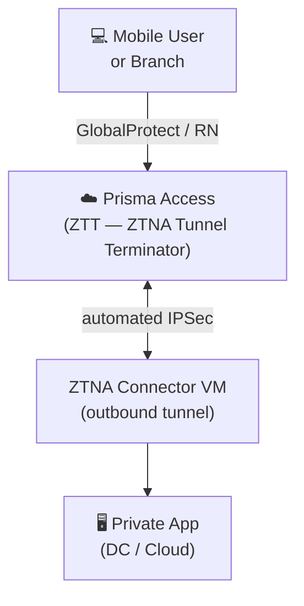
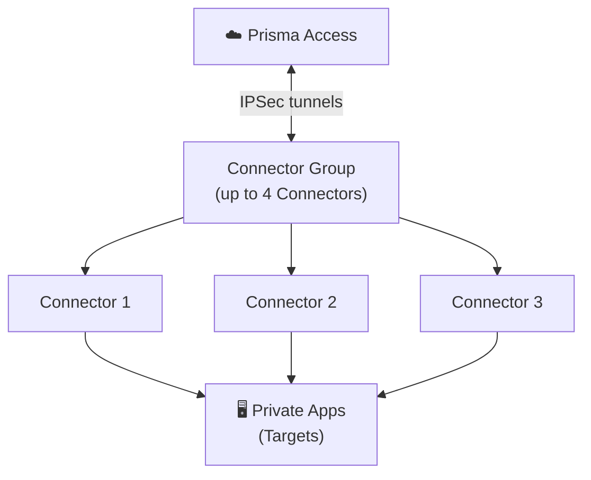

# Chapter 20 — ZTNA Connector Overview & Components

**ZTNA Connector** is a software-based private application access solution included in Prisma Access. It gives mobile users and branch users access to private apps through an automated outbound IPSec tunnel — with no need to configure IPSec or IKE settings manually, and without exposing any ingress firewall rules.

---

## What Problem Does It Solve?

Traditional private-app access via a Service Connection requires:
- A dedicated IPSec tunnel from Prisma Access to the corporate DC
- Full network-layer reachability from the SC to all app servers
- Manual BGP peering and routing configuration

ZTNA Connector replaces that with:
- A lightweight VM deployed **inside** the data centre or cloud, next to the apps
- The Connector **initiates** all tunnels outbound — no inbound firewall rules needed
- App access is granular: only the apps you explicitly onboard become reachable
- Supports **overlapped private networks** (same RFC 1918 address space across DCs) without NAT

- The Connector discovers the **nearest Prisma Access node** (ZTT) automatically
- Access is enforced by standard Prisma Access security policies: User-ID, App-ID, Device-ID

---

## The Three Components

### 1 — Connectors

A **Connector** is a virtual machine deployed in the data centre, cloud, or on-premises virtualisation platform where private apps reside.

- Automates IPSec tunnel establishment to Prisma Access — no manual IKE/IPSec config
- Discovers the nearest Prisma Access location automatically
- Supports one-arm or two-arm network topologies
- Can be deployed on: AWS, GCP, Azure, Oracle Cloud, VMware ESXi, KVM, Hyper-V

**Bandwidth capacity:**

| Unit | Bandwidth |
|---|---|
| Single Connector | up to 2 Gbps |
| Connector Group (4 Connectors) | up to 6 Gbps |

> 📷 [PaloAlto diagram — ZTNA Connector architecture overview](https://docs.paloaltonetworks.com/prisma-access/administration/ztna-connector-in-prisma-access)

---

### 2 — Connector Groups

A **Connector Group** is a logical grouping of up to 4 Connectors associated with a set of application targets.

- Provides **tunnel redundancy** — if one Connector fails, others continue serving traffic
- Provides **bandwidth aggregation** — traffic load-balanced across Connectors in the group
- Each Connector Group has its own **Key and Secret** used to authenticate Connector VMs at deployment time
- Targets are associated with Connector Groups, not individual Connectors

**Scale limits:**

| Resource | Limit |
|---|---|
| Connectors per group | 4 |
| Connectors per tenant (base) | 10 |
| Connectors per tenant (Private App add-on) | 200 |
| Applications per group | 1,000 |
| Concurrent sessions per Connector | 100,000 |
| Concurrent sessions per group | 400,000 |

---

### 3 — Targets

**Targets** are the private applications that ZTNA Connector makes accessible through Prisma Access.

Three target types are supported:

| Target Type | Example | Use Case |
|---|---|---|
| **Wildcard** | `*.example.com` | Auto-discovers all apps matching the pattern |
| **FQDN** | `app1.example.com` | Single application with load-balancing across resolved IPs |
| **IP Subnet** | `10.10.1.0/24` | DC subnets; maximum 16 subnets per rule |

> 📷 [PaloAlto diagram — ZTNA Connector targets and connector groups](https://docs.paloaltonetworks.com/prisma-access/administration/ztna-connector-in-prisma-access/configure-a-ztna-connector)

---

## Licensing

| Tier | Connectors | FQDNs | IP Subnets |
|---|---|---|---|
| Base Prisma Access | 10 | 20,000 | 1,024 |
| Private App add-on | 200 | 20,000 | 1,024 |

Minimum required version: **Prisma Access 5.0**

---

## Key Takeaways

- ZTNA Connector gives granular private-app access without full-network Service Connection tunnels
- Three components: **Connectors** (VMs), **Connector Groups** (logical redundancy/bandwidth units), **Targets** (app definitions)
- Connectors initiate outbound IPSec — no inbound firewall rules required
- Single Connector: 2 Gbps; Connector Group (4 Connectors): 6 Gbps
- Targets defined as wildcard FQDN, exact FQDN, or IP subnet

---

*Previous: [Chapter 19 — Data Center Scaling Design](../part3/ch19-data-center-scaling-design.md)* · *Next: [Chapter 21 — ZTNA Use Cases & Packet Flow](./ch21-ztna-use-cases-and-packet-flow.md)*
