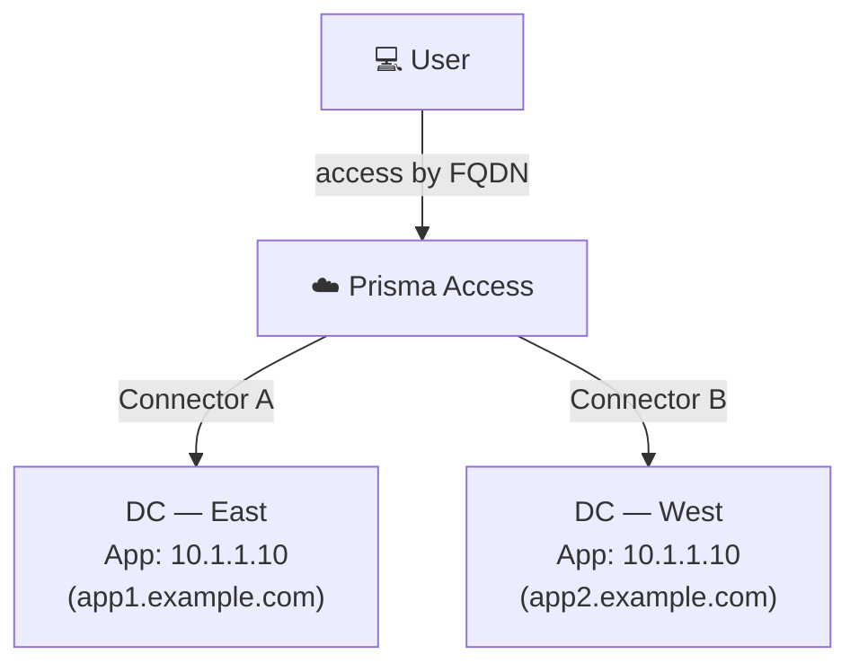
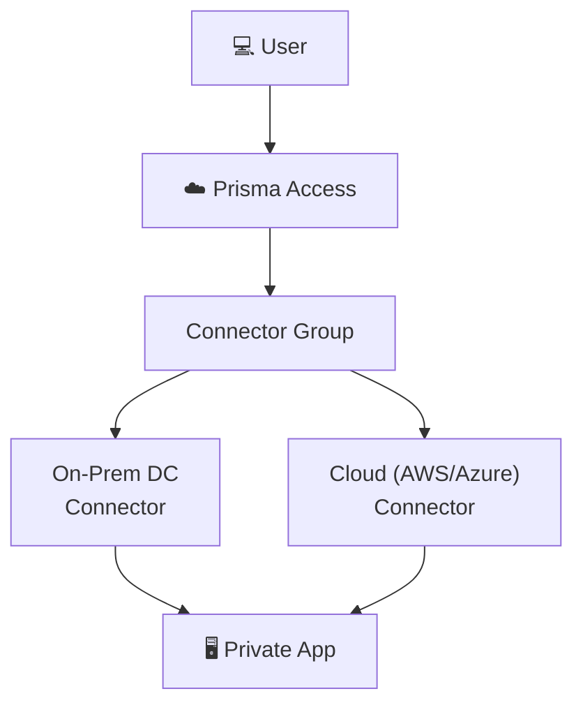
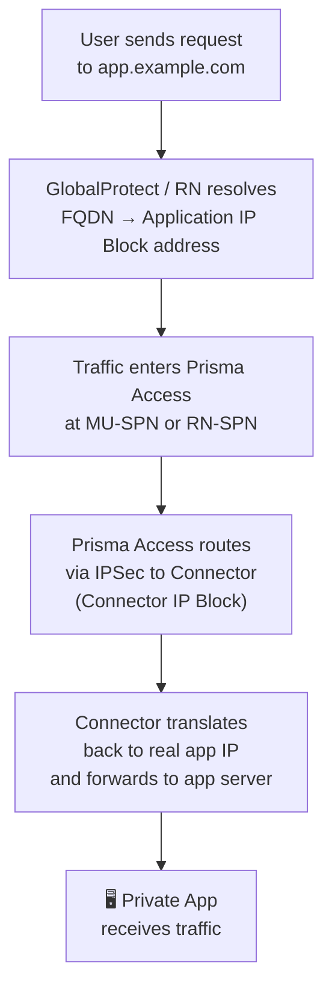

# Chapter 21 — ZTNA Use Cases & Packet Flow

This chapter covers the three primary deployment scenarios for ZTNA Connector and traces the exact packet path from a user device to a private application.

---

## Use Case 1 — Overlapped Private Networks

When multiple data centres or partner networks use the same RFC 1918 address space, traditional routing breaks — each SC would need NAT to disambiguate identical prefixes.

ZTNA Connector solves this because access is **app-based, not network-based**:
- Apps are identified by FQDN or IP subnet, not by routing prefix
- No IP routing configuration needed between DCs
- Overlapping `10.x.x.x` subnets in different DCs can coexist without NAT

- Prisma Access routes to the correct Connector based on the **FQDN target** — the overlapping IP is irrelevant to the user
- Each Connector Group uses its own IP block, preventing collision at the Prisma Access layer

---

## Use Case 2 — Data Centre to Cloud Migration

During a migration, the same application may temporarily exist in both the on-premises DC and a cloud environment.

- Deploy a Connector in the on-premises DC and another in the cloud (AWS, Azure, GCP)
- Both Connectors are added to the same Connector Group
- Traffic is load-balanced or failed-over transparently — users see no change
- Once migration completes, remove the on-premises Connector from the group

---

## Use Case 3 — Partner Network Access

Give partner organisations access to specific applications without establishing a full network-level trust relationship:

- Deploy a Connector in the partner network (or in a DMZ accessible to the partner)
- Define only the required app(s) as Targets in that Connector Group
- Partners access only those apps — no access to other DC resources
- No manual IPSec or routing configuration between the main network and the partner

---

## How ZTNA Connector Works — Packet Flow

Prisma Access uses two internal IP blocks to route traffic through the Connector:

| Block | Purpose |
|---|---|
| **Application IP Block** | Address space used by Prisma Access to represent private apps internally (e.g. `10.64.1.0/24`) |
| **Connector IP Block** | Address space assigned to Connector VMs for their IPSec tunnel interfaces (e.g. `10.64.0.0/24`) |

Both blocks are configured at onboarding time and must not overlap with existing routes.

### Packet Flow — User to Private App

**Key points:**
- The user never has a routable path to the real app IP — all routing is internal to Prisma Access
- The app server sees the request arriving from the Connector's IP (within the App IP Block)
- Supports TCP, UDP, and ICMP
- 

### Server-Initiated Traffic (ZTNA Connector image 6.2.8-ztna-connector-b1+)

Connectors support **bidirectional communication** — the app server can initiate sessions back to GlobalProtect users or remote network hosts. This requires the Connector to run image **6.2.8-ztna-connector-b1** or later; Prisma Access 5.0 is the general baseline for ZTNA Connector itself, but server-initiated traffic is a more recent, separately-gated addition — it isn't listed among Prisma Access 5.0's own ZTNA Connector release notes:

- Connector performs **SNAT** on server-initiated traffic using its IPSec tunnel interface IP (from the /27 Connector IP Block prefix)
- Traffic routes through Prisma Access fabric to the destination
- Destination does **not** need to hold private DC prefixes in its routing table
- Supported routing: **dynamic BGP** (Connector advertises prefixes to DC router) or **static** (manual next-hop config)

---

## Key Takeaways

- Three use cases: overlapped networks, DC-to-cloud migration, partner access — all solved without manual NAT or routing
- Packet flow uses two internal IP blocks: Application IP Block (app addresses) and Connector IP Block (tunnel interfaces)
- Users access apps via FQDN — real app IPs are never exposed in the routing fabric
- Server-initiated (bidirectional) traffic supported via Connector SNAT, requiring Connector image 6.2.8-ztna-connector-b1+ (not a Prisma Access 5.0 feature itself, though PA 5.0 remains the general ZTNA Connector baseline)

---

*Previous: [Chapter 20 — ZTNA Connector Overview & Components](./ch20-ztna-connector-overview-and-components.md)* · *Next: [Chapter 22 — ZTNA Connector vs Service Connections](./ch22-ztna-connector-vs-service-connections.md)*
