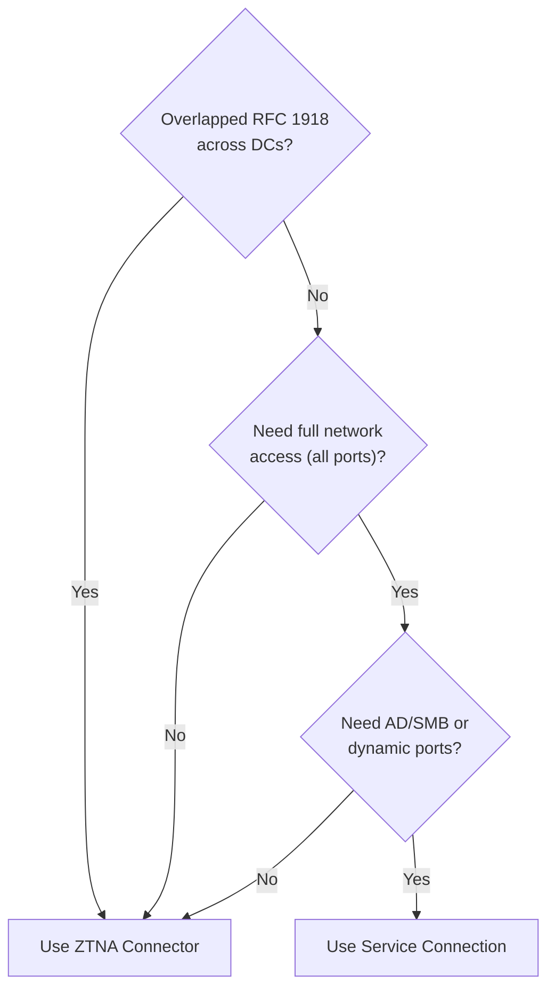

# Chapter 22 — ZTNA Connector vs Service Connections & Hosting Environments

This chapter compares ZTNA Connector and Service Connections to clarify when to use each, and documents the supported platforms and hardware requirements for deploying Connector VMs.

---

## ZTNA Connector vs Service Connections

The two technologies provide private application access through different models. Neither is strictly a replacement for the other — they address different scenarios.

| Capability | Service Connection | ZTNA Connector |
|---|---|---|
| Overlapped private networks (same RFC 1918 space) | No — requires NAT | **Yes** |
| Access to all ports and protocols | **Yes** | Limited — app-specific targets |
| Automatic tunnel establishment to Prisma Access | No — manual IPSec/BGP config | **Yes** |
| Automatic Prisma Access location discovery | No | **Yes** |
| Autoscaling bandwidth (up to 6 Gbps per Connector Group) | No | **Yes** |
| Access via IP address and subnet | Yes | **Yes** (from PA 5.0) |
| Server-initiated traffic (e.g. remote help desk) | **Yes** | Limited (from PA 5.0 with add-on) |
| Unique client IP per session (AD, SMB) | **Yes** | No |
| Dynamic port protocols (FTP active, VoIP) | **Yes** | No |
| Hybrid with on-prem NGFW (User-ID policies) | **Yes** | No |

**Decision guide:**

> 📷 [PaloAlto diagram — ZTNA Connector vs Service Connections comparison](https://docs.paloaltonetworks.com/prisma-access/administration/ztna-connector-in-prisma-access)

| Use Case                                                                                                                              | ZTNA Connector Support | Service Connection Support |
| ------------------------------------------------------------------------------------------------------------------------------------- | ---------------------- | -------------------------- |
| Access to applications in overlapped networks                                                                                         | √                      | —                          |
| Access to all ports and protocols for client-initiated application traffic                                                            | √                      | √                          |
| Automatic tunnel establishment to Prisma Access                                                                                       | √                      | —                          |
| Automatic Prisma Access location discovery                                                                                            | √                      | —                          |
| Access to private apps using IP addresses and subnets                                                                                 | √                      | √                          |
| Server-initiated traffic (such as a remote help desk) reaching out to a managed device (GlobalProtect mobile user or remote network). | √                      | √                          |
| Applications or services that require a unique client IP address                                                                      | √                      | √                          |
| Access to applications with dynamic ports (such as FTP Active mode or VoIP)                                                           | —                      | √                          |

|Hybrid deployments with on-premises next-generation firewalls where policy rules based on User-ID are applied|√|√|
---

## Supported Hosting Environments

Connector VMs can be deployed on:

| Platform | Image Format | Notes |
|---|---|---|
| **Amazon AWS** | Cloud Marketplace or CSP | m5.xlarge per region |
| **Google Cloud Platform** | Cloud Marketplace or CSP | n2-standard-4 per region |
| **Microsoft Azure** | Cloud Marketplace or CSP | Standard_D4_v3 per region |
| **Oracle Cloud (OCI)** | CSP | VM.Standard.E5.Flex |
| **VMware ESXi** | OVA image | Thick Provisioned Lazy Zeroed disk |
| **KVM** | qcow2 image | Two-arm recommended |
| **Microsoft Hyper-V** | VHD image | Two-arm recommended |

---

## Hardware Specifications

All Connector VMs require the same minimum resources regardless of platform:

| Resource | Requirement |
|---|---|
| vCPU | 4 |
| Memory | 16 GB (8 GB acceptable for ESXi/Hyper-V) |
| Disk | 40 GB |

---

## Deployment Topologies

| Topology | Interfaces | Supported On |
|---|---|---|
| **One-arm** | Single interface (WAN + app traffic combined) | AWS, Azure, GCP, OCI, ESXi |
| **Two-arm** | Separate WAN-facing and app-facing interfaces | KVM, Hyper-V (recommended) |

One-arm is simpler; two-arm provides granular separation between internet and DC traffic.

---

## Operational Constraints

- **vMotion, snapshots, and live VM migration** are not supported — Connector VMs must remain static
- **IPv6 connectivity** to the Prisma Access controller is not supported
- **RFC 6598** shared-address space is not supported in a default deployment — requires Palo Alto Networks to activate it (see Chapter 23 for IP planning detail)
- Service Connection subnets must **not overlap** with ZTNA IP blocks (Application IP Block or Connector IP Block)
- Do **not** mix NGFW (Service Connection) and ZTNA Connectors in the same Connector Group
- Limit a single FQDN to **4 Connectors per region**

---

## Key Takeaways

- Service Connection: full network access, unique client IPs, dynamic ports, NGFW integration — but no overlap support and manual tunnel config
- ZTNA Connector: automated tunnels, overlap support, auto-scaling, app-granular — but no dynamic ports or unique client IPs
- Connector VMs run on all major cloud platforms plus on-premises (ESXi, KVM, Hyper-V)
- Hardware minimum: 4 vCPU, 16 GB RAM, 40 GB disk on all platforms
- vMotion and snapshots not supported; ZTNA and SC IP blocks must not overlap

---

*Previous: [Chapter 21 — ZTNA Use Cases & Packet Flow](./ch21-ztna-use-cases-and-packet-flow.md)* · *Next: [Chapter 23 — Network Requirements & Prerequisites](./ch23-ztna-network-requirements-and-prerequisites.md)*
