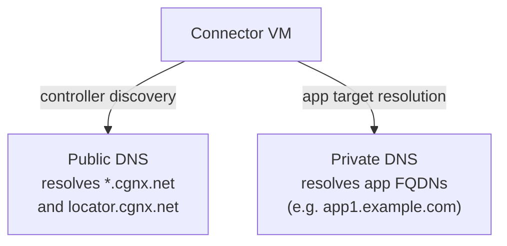

# Chapter 23 — Network Requirements & Prerequisites for ZTNA Connector

Before deploying any Connector VM, the network environment must meet the port, MTU, DNS, and IP planning requirements described in this chapter.

---

## Required Outbound Ports

The Connector VM initiates all connections — no inbound rules are needed on the DC firewall. The following egress rules must be permitted from the Connector VM's WAN interface (Port 1):

| Protocol | Port | Destination | Purpose |
|---|---|---|---|
| TCP | 443 | `*.cgnx.net` | HTTPS to ZTNA Connector Controllers |
| UDP | 500 | Prisma Access ZTT | IKE (IPSec key exchange) |
| UDP | 4500 | Prisma Access ZTT | IPSec NAT traversal |
| IP/50 | — | Prisma Access ZTT | ESP (if public IP used, no NAT) |
| UDP | 123 | NTP servers | Time synchronisation |
| UDP/TCP | 53 | DNS servers | Name resolution |

For app-facing traffic (Port 2 in two-arm deployments):

| Protocol | Port | Destination | Purpose |
|---|---|---|---|
| UDP/TCP | 53 | Private DNS | App FQDN resolution |
| TCP/UDP | app-specific | App servers | Application traffic |
| TCP or ICMP | — | App servers | Health probes |

> 📷 [PaloAlto diagram — ZTNA Connector network requirements](https://docs.paloaltonetworks.com/prisma-access/administration/ztna-connector-in-prisma-access/ztna-connector-requirements-and-guidelines)

---

## MTU Requirement

**Maximum UDP payload: 1,300 bytes (including headers)**

All paths between the Connector VM and the private application server must support this MTU. Exceeding it causes packet fragmentation that breaks IPSec tunnels.

- Configure interface MTU and MSS clamping on the Connector's app-facing port if needed
- This limit applies to the path from Connector → app server, not to the WAN-facing IPSec path

---

## SSL Decryption — Disable for Controller Traffic

SSL decryption must be **disabled** for sessions from the Connector VM to the ZTNA Connector Controllers (`*.cgnx.net`). Inspection of controller traffic will break the Connector's authentication and tunnel establishment.

---

## DNS Requirements

The Connector VM needs two categories of DNS resolution:

**DNS configuration rules:**
- At least one server that resolves **public FQDNs** (including `locator.cgnx.net` for nearest-node discovery)
- At least one server that resolves **private application FQDNs**
- The Connector queries all configured DNS servers **in parallel** — fastest response wins
- CNAME-based load balancing is supported (multiple A records per FQDN)
- All Connectors within a Connector Group must use **identical DNS server configuration**

---

## IP Address Planning

Two internal address blocks must be assigned at onboarding time and cannot overlap with any existing routes:

| Block | Purpose | Minimum Size |
|---|---|---|
| **Application IP Block** | Represents private apps internally within Prisma Access | Depends on app count |
| **Connector IP Block** | Assigned to Connector IPSec tunnel interfaces | /27 per Connector (32 IPs) |

**Planning rules:**
- Reserve **at least a /27 per Connector** in the Connector IP Block
- Use **RFC 1918** (10.0.0.0/8, 172.16.0.0/12, 192.168.0.0/16) or **RFC 6598** (100.64.0.0/10) addresses
- **RFC 6598 is not supported in a default Prisma Access deployment** — it must be activated by your Palo Alto Networks team before it can be used; it isn't simply a self-service "separate pool" toggle
- Once an address pool is set to RFC 1918, it **cannot be changed back to RFC 6598** for Connector IP blocks without deleting all Connectors and Connector Groups first (Application IP blocks are more flexible and can be changed back)
- These blocks must **not overlap** with: existing DC subnets, Service Connection subnets, Remote Network subnets, or Mobile User IP pools
- Configure DNS entries on local interfaces so the Connector can resolve app FQDNs

---

## Firewall Between Connector and App

If a firewall exists between the Connector VM and the private app server, it must allow:
- App-protocol traffic (e.g. TCP 443 for HTTPS apps) from the Connector VM to the app server
- Health probe traffic (TCP or ICMP) from the Connector VM to the app server

The Connector's app-facing IP (from the Connector IP Block /27) is the source address for all such traffic.

---

## Deployment Checklist

| Requirement | Detail |
|---|---|
| Egress TCP 443 to `*.cgnx.net` | Controller connectivity |
| Egress UDP 500/4500 to Prisma Access | IPSec/IKE |
| MTU ≤ 1,300 bytes on app-facing path | Fragmentation prevention |
| SSL decryption disabled for controller traffic | Auth integrity |
| Public + private DNS configured | Controller and app FQDN resolution |
| Application IP Block assigned | No overlap with DC/SC/RN/MU subnets |
| Connector IP Block (/27 per Connector) assigned | No overlap with DC/SC/RN/MU subnets |
| App firewall allows Connector-to-app traffic | Application access |
| Time zone set to UTC (on-premises only) | NTP/log consistency |
| vMotion/snapshots disabled for Connector VMs | Operational stability |

---

## Key Takeaways

- Connector initiates all tunnels outbound — only egress firewall rules required (TCP 443, UDP 500/4500)
- MTU on the app-facing path must not exceed 1,300 bytes
- SSL decryption must be disabled for controller traffic to `*.cgnx.net`
- Two IP blocks required: Application IP Block and Connector IP Block (/27 minimum per Connector)
- All IP blocks must be unique across the entire Prisma Access deployment — no overlap with SC, RN, or MU subnets

---

*Previous: [Chapter 22 — ZTNA Connector vs Service Connections](./ch22-ztna-connector-vs-service-connections.md)* · *Next: [Chapter 24 — Enable & Configure ZTNA Connector](./ch24-enable-and-configure-ztna-connector.md)*
