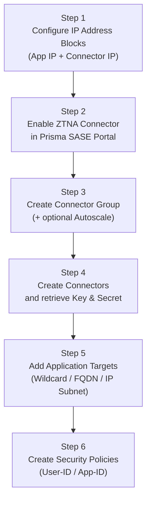

# Chapter 24 — Enable & Configure ZTNA Connector

This chapter walks through the full configuration sequence: enabling ZTNA Connector, setting up the IP address blocks, creating Connector Groups, deploying Connector VMs, and registering application targets.

---

## Configuration Sequence Overview

---

## Step 1 — Configure IP Address Blocks

**Navigation (Panorama-managed):**
`Panorama > Cloud Services > Configuration > Service Setup > Settings > ZTNA Connector tab`

**Navigation (Strata Cloud Manager):**
`Manage > Configuration > ZTNA Connector > Settings`

- Add one or more **Application IP Blocks** — address space used internally to represent private apps
- Add one or more **Connector IP Blocks** — address space for Connector tunnel interfaces (/27 per Connector minimum)
- Optionally enable **"Application IP Blocks Reachable from Remote Networks"** to allow branch users to access the same apps as mobile users via the same Connector
- Commit and push the configuration before proceeding

> 📷 [PaloAlto screenshot — ZTNA Connector IP block configuration](https://docs.paloaltonetworks.com/prisma-access/administration/ztna-connector-in-prisma-access/configure-a-ztna-connector)

---

## Step 2 — Enable ZTNA Connector

**Navigation (Panorama-managed):**
`Panorama > Cloud Services > ZTNA Connector > Settings > Enable ZTNA Connector`

**Navigation (Strata Cloud Manager):**
`Manage > Configuration > ZTNA Connector > Settings` (same screen as Step 1 — enable via the toggle at the top)

When onboarding completes, the **ZTNA Connector Overview** dashboard appears showing:
- Total Connectors and their tunnel status
- Connector Groups with health indicators
- Application target reachability summary

---

## Step 3 — Create a Connector Group

`Settings > ZTNA Connector > Connector Groups > Create Connector Group`

| Field | Value / Notes |
|---|---|
| **Name** | Descriptive name — no special characters (< > ! @ # $ % ^ &) or CJK |
| **Type** | `FQDN/Wildcard` (apps defined by DNS name) or `IP Subnet` (apps defined by IP range) |
| **Preserve User ID** | Enable only if a Palo Alto Networks NGFW sits between the Connector and the app servers — requires additional firewall-side configuration |
| **Autoscale** | Optional — for AWS or Azure deployments; automatically adds/removes Connectors based on load |

- Click **Create** to save
- **Connector Group settings cannot be modified after creation** — double-check Type, Preserve User ID, and Autoscale before clicking Create
- The group is created with no Connectors yet — add them in Step 4

> 📷 [PaloAlto screenshot — Create Connector Group](https://docs.paloaltonetworks.com/prisma-access/administration/ztna-connector-in-prisma-access/configure-a-ztna-connector)

---

## Step 4 — Create Connectors and Retrieve Credentials

`Settings > ZTNA Connector > Connectors > Add Connector`

| Field | Notes |
|---|---|
| **Name** | Unique name for this Connector VM |
| **Connector Group** | Select the group created in Step 3 |

After creating the Connector, retrieve the **Key** and **Secret** tokens:

`Settings > ZTNA Connector > Connectors > [select Connector] > Copy Token`

These credentials are entered into the Connector VM's configuration during deployment (Step 10 of the ESXi flow in Chapter 25). Keep them secure — they authenticate the VM to Prisma Access.

> 📷 [PaloAlto screenshot — Retrieve Connector Key and Secret](https://docs.paloaltonetworks.com/prisma-access/administration/ztna-connector-in-prisma-access/configure-a-ztna-connector)

---

## Step 5 — Add Application Targets

`Settings > ZTNA Connector > Application Targets`

Three target types — choose based on how the app is identified:

### Wildcard Targets
`Application Targets > Wildcard Targets > Create Wildcard Target`

- Pattern: e.g. `*.example.com`
- Automatically discovers and grants access to all matching FQDNs
- Associate with one or more Connector Groups (up to 4 groups from PA 5.0.1)

### FQDN Targets
`Application Targets > FQDN Targets > Create FQDN Target`

- Pattern: e.g. `app1.example.com`
- Single application; Prisma Access resolves the FQDN and load-balances across all returned A records
- Probing options: TCP ping (specify port), ICMP ping, or none

### IP Subnet Targets
`Application Targets > IP Subnet Targets > Create IP Subnet Target`

- Pattern: CIDR (e.g. `10.10.1.0/24`)
- Maximum **16 subnets per rule**
- Used when apps are identified by IP range rather than DNS name

**Port notation:**
- Single port: `443`
- Multiple ports: `80,443,8080`
- Port range: `8000-8099`
- No spaces permitted

> 📷 [PaloAlto screenshot — Application targets configuration](https://docs.paloaltonetworks.com/prisma-access/administration/ztna-connector-in-prisma-access/configure-a-ztna-connector)

---

## Step 6 — Create Security Policies

ZTNA Connector **does not enforce access policy itself** — it only provides the tunnel and app reachability. Access control is applied by Prisma Access security policies.

After targets are configured, create security rules in Prisma Access to allow the relevant users to reach the apps:
- Source: User-ID or group membership
- Destination: App-ID or FQDN/IP target
- Security profiles: threat prevention, URL filtering, DLP as appropriate

**Supported policy dimensions:**

| Dimension | Supported |
|---|---|
| User-ID | Yes |
| Group membership | Yes |
| App-ID | Yes |
| FQDN / IP | Yes |
| Port / Protocol | Yes |
| URL category | Yes |

---

## Verifying the Configuration

Once the Connector VM is deployed and running:

- `Settings > ZTNA Connector > Connectors` — check Connector shows **Tunnel Up**
- `Settings > ZTNA Connector > Discovered Targets` — check app targets show **Up**
  - Status refreshes automatically once per minute; manual refresh button available

---

## Key Takeaways

- Full configuration sequence: IP blocks → enable → Connector Group → Connectors & credentials → targets → security policies
- IP blocks must be configured and committed **before** enabling ZTNA Connector
- Key and Secret tokens retrieved after Connector creation — required for VM deployment
- ZTNA Connector does not enforce policy — all access control is in Prisma Access security rules
- Verify by checking Tunnel Up (Connector) and Up (targets) in the SASE Portal

---

*Previous: [Chapter 23 — Network Requirements & Prerequisites](./ch23-ztna-network-requirements-and-prerequisites.md)* · *Next: [Chapter 25 — Onboard ZTNA Connector in VMware ESXi & Upgrade](./ch25-onboard-ztna-connector-esxi-and-upgrade.md)*
