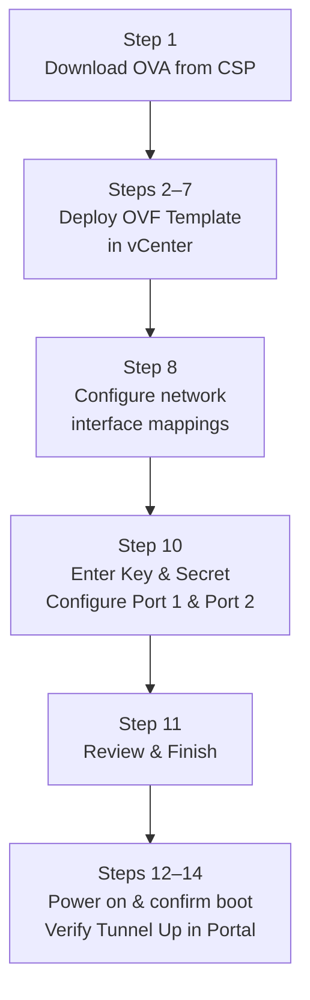

# Chapter 25 — Onboard ZTNA Connector in VMware ESXi & Upgrade

This chapter covers the full ESXi deployment procedure — from OVA download to tunnel verification — and explains how to upgrade Connector software.

---

## ESXi Deployment Overview

The Connector VM is deployed using a standard VMware OVF/OVA workflow. Two interfaces are configured:
- **Port 1 (WAN)** — internet-facing, for IPSec connectivity to Prisma Access
- **Port 2 (App)** — data-centre-facing, for connectivity to private app servers

---

## Step 1 — Download the OVA

Source: **Customer Support Portal (CSP)** — cloud marketplace images (AWS/Azure/GCP) are also available as an alternative for cloud-hosted deployments, but ESXi deployment uses the CSP OVA.

`Updates > Software Updates > Prisma Access ZTNA Connector for VMware`

Download the `.ova` file to a location accessible from vCenter — choose the **1-nic** (one-arm) or **2-nic** (two-arm) image variant matching the topology decided for this deployment.

> 📷 [PaloAlto screenshot — CSP download for ZTNA Connector OVA](https://docs.paloaltonetworks.com/prisma-access/administration/ztna-connector-in-prisma-access/onboard-a-cloud-instance-or-vm-for-the-ztna-connector)

---

## Steps 2–7 — Deploy OVF Template in vCenter

1. Open **VMware vCenter**, right-click the target host → **Deploy OVF Template**
2. Select the OVA location (URL or local file) → **Next**
3. Enter a **VM name** and select a **datacenter location** → **Next**
4. Select the **compute resource** (host or cluster) → **Next**
5. Review the OVA details → **Next**
6. Select **storage**: disk format = **Thick Provision Lazy Zeroed**, datastore = target datastore → **Next**

> 📷 [PaloAlto screenshot — OVF deployment wizard in vCenter](https://docs.paloaltonetworks.com/prisma-access/administration/ztna-connector-in-prisma-access/onboard-a-cloud-instance-or-vm-for-the-ztna-connector)

---

## Step 8 — Configure Network Interface Mappings

Map the OVA's virtual network adapters to the correct port groups:

| OVA Interface | Port Group | Role |
|---|---|---|
| **Port 1** | WAN-facing port group | IPSec to Prisma Access; outbound internet access |
| **Port 2** | App-facing port group | Access to private app servers in DC |

> 📷 [PaloAlto screenshot — Network interface mapping in OVF wizard](https://docs.paloaltonetworks.com/prisma-access/administration/ztna-connector-in-prisma-access/onboard-a-cloud-instance-or-vm-for-the-ztna-connector)

---

## Step 10 — Additional Settings (Licensing + Interface Config)

In the **Customize template / Additional Settings** screen:

**Licensing:**
- Enter the **Key** and **Secret** retrieved from the Prisma SASE Portal in Step 4 of Chapter 24

**Port 1 (WAN Interface):**

| Field | Value |
|---|---|
| Role | Public WAN |
| Port Config | DHCP or Static |
| Static IP | IP address, subnet mask, default gateway (if Static) |
| DNS | At least one public DNS server |

**Port 2 (App Interface):**

| Field | Value |
|---|---|
| Role | Private WAN |
| Port Config | DHCP or Static |
| Static IP | IP address, subnet mask (if Static) |
| DNS | Private DNS server for app FQDN resolution |

> ⚠️ For on-premises deployments, set the time zone to **UTC** — cloud deployments handle this automatically.

> 📷 [PaloAlto screenshot — Additional settings: licensing and interface config](https://docs.paloaltonetworks.com/prisma-access/administration/ztna-connector-in-prisma-access/onboard-a-cloud-instance-or-vm-for-the-ztna-connector)

---

## Steps 11–13 — Finish and Confirm VM Boot

- Review the configuration summary → **Finish** (Step 11)
- After the OVA deploys, **power on the VM** (Step 12)
- Confirm the VM is running in vCenter — check the console for boot completion (Step 13)

---

## Step 14 — Verify Tunnel Status in the Portal

`Settings > ZTNA Connector > Connectors`

The Connector registered with the Key and Secret should appear. Confirm status = **Tunnel Up**.

If the status remains **Tunnel Down**:
- Check that TCP 443 egress to `*.cgnx.net` is permitted
- Check UDP 500/4500 egress to Prisma Access is permitted
- Confirm the Key and Secret match the Connector created in the portal
- Confirm DNS resolves `locator.cgnx.net` from the Connector VM

> 📷 [PaloAlto screenshot — Connector tunnel status verification](https://docs.paloaltonetworks.com/prisma-access/administration/ztna-connector-in-prisma-access/onboard-a-cloud-instance-or-vm-for-the-ztna-connector)

---

## Upgrading ZTNA Connector

Upgrades are managed at the **Connector Group** level, not per individual Connector.

**Navigation:**
`Settings > ZTNA Connector > Connector Groups`

Click the **green arrow** (upgrade icon) next to the Connector Group.

Two scheduling options:

| Option | Behaviour |
|---|---|
| **Install Now** | Upgrades all Connectors in the group immediately |
| **Schedule** | Provide a date and time for the upgrade window |

**Notes:**
- A scheduled upgrade can be cancelled up to **5 minutes** before it begins
- Schedule upgrades during a **planned maintenance window** or network outage
- All Connectors in a group upgrade together — mixed-version groups are not supported

> 📷 [PaloAlto screenshot — Connector Group upgrade scheduling](https://docs.paloaltonetworks.com/prisma-access/administration/ztna-connector-in-prisma-access/upgrade-the-ztna-connector)

---

## Key Takeaways

- ESXi deployment: download OVA from CSP → Deploy OVF Template → map Port 1 (WAN) and Port 2 (App) → enter Key & Secret → power on → verify Tunnel Up
- Disk format must be **Thick Provision Lazy Zeroed** for ESXi
- Key and Secret from the SASE Portal authenticate the VM — double-check these if Tunnel Down persists
- On-premises time zone must be set to **UTC**
- Upgrades are group-level, not per-Connector; cancel is possible up to 5 minutes before the scheduled time

---

*Previous: [Chapter 24 — Enable & Configure ZTNA Connector](./ch24-enable-and-configure-ztna-connector.md)* · *Next: [Chapter 26 — Prisma Access Activation Planning Checklist](../part5/ch26-activation-planning-checklist.md)*
