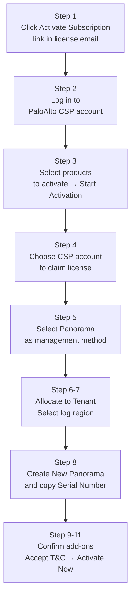

# Chapter 26 — Prisma Access Activation Planning Checklist

Before touching the activation portal, confirm every item on this checklist. Incomplete preparation at this stage leads to activation failures, re-work, or Panorama HA complications.

---

## Pre-Activation Checklist

### Licensing & Account

| # | Item | Notes |
|---|---|---|
| 1 | Activation email received from Palo Alto Networks | Contains the "Activate Subscription" link |
| 2 | Customer Support Portal (CSP) account created | Required to claim the license and manage the tenant |
| 3 | Management platform decision made | **Strata Cloud Manager** (recommended for new deployments) or **Panorama** |

---

### Panorama Prerequisites (Panorama-managed only)

| # | Item | Notes |
|---|---|---|
| 4 | Panorama is running the minimum supported version for the Cloud Services plugin | Check PaloAlto compatibility matrix |
| 5 | DNS server configured on Panorama | `Panorama > Setup > Services` — required for Cloud Services plugin Verify step |
| 6 | NTP server configured on Panorama | `Panorama > Setup > Services` |
| 7 | Panorama HA configured (if planned) | Recommended to configure HA **before** activation — simpler than doing it after |

---

### Tenant & Infrastructure Planning

| # | Item | Notes |
|---|---|---|
| 8 | Tenant name and log storage region selected | Choose the region nearest to where log data should reside (Strata Logging Service) |
| 9 | Panorama serial number available | Required to link the Panorama instance to the Prisma Access tenant |
| 10 | Infrastructure subnet planned | /24 minimum, RFC 1918, no overlap with corporate or user subnets (see Chapter 7) |

---

## Activation Steps (Panorama-managed)

**Step 6 — Allocate to Tenant:**
- Click **+** to create a new tenant if one does not yet exist
- Tenant is the administrative boundary for your Prisma Access deployment

**Step 7 — Log Region (Strata Logging Service):**
- Select the region nearest to where log data should be stored
- This determines which Strata Logging Service instance receives your traffic logs
- Cannot be changed after activation without a full re-onboarding

**Step 8 — Panorama Serial Number:**
- Select **Create New** from the Panorama drop-down
- Copy the displayed **Panorama Serial Number** — needed when registering the Panorama appliance

**Steps 9–11:**
- Add-ons are pre-enabled based on your contract — review before proceeding
- Accept the Terms and Conditions
- Click **Activate Now**

> 📷 [PaloAlto screenshot — Prisma Access activation portal steps](https://docs.paloaltonetworks.com/prisma-access/activation-and-onboarding/activate-your-prisma-access-license)

---

## Activation Steps (Strata Cloud Manager)

When using SCM, the activation process is simplified:

1. Receive activation email → click the link
2. Log in to (or create) your Palo Alto Networks account
3. Claim the license and create your SCM tenant
4. Select log region for Strata Logging Service
5. SCM is accessible immediately at `stratacloudmanager.paloaltonetworks.com`

No Panorama serial number or Cloud Services plugin installation is required for SCM-managed deployments.

---

## Key Takeaways

- Prepare DNS, NTP, and Panorama HA **before** activation to avoid post-activation rework
- Choose management platform (SCM or Panorama) before activating — the activation flow differs
- Log region selection is permanent — choose the region that satisfies data residency requirements
- The Panorama serial number generated during activation links your physical/virtual Panorama to the tenant

---

*Previous: [Chapter 25 — Onboard ZTNA Connector in VMware ESXi & Upgrade](../part4/ch25-onboard-ztna-connector-esxi-and-upgrade.md)* · *Next: [Chapter 27 — Integrating Panorama with Prisma Access](./ch27-integrating-panorama-with-prisma-access.md)*
