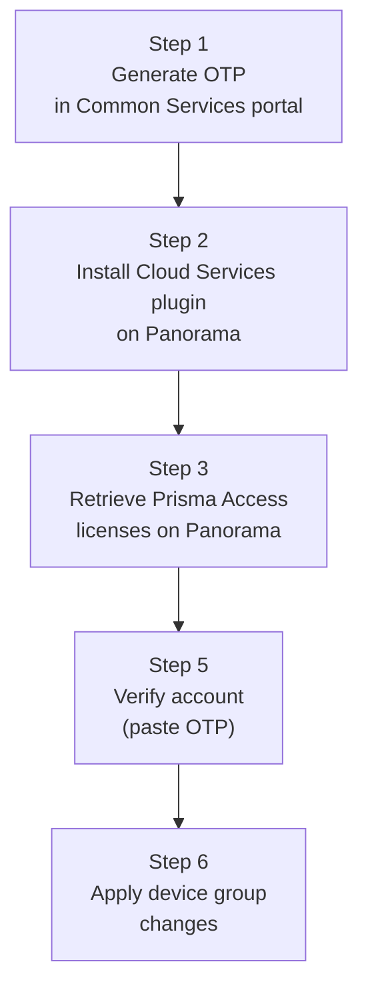

# Chapter 27 — Integrating Panorama with Prisma Access

After activating the license, a Panorama-managed deployment requires a one-time integration process to link the Panorama instance to the Prisma Access tenant. This is done through a **One-Time Password (OTP)** and the **Cloud Services plugin**.

---

## Integration Sequence

---

## Step 1 — Generate the One-Time Password (OTP)

**Navigation (Common Services portal):**
`Common Services > Tenant Management > [Tenant Name] > Generate OTP for setting up Panorama`

- The OTP expires — copy it immediately and use it in Step 5 without delay
- The OTP links this specific Panorama instance to the tenant

> 📷 [PaloAlto screenshot — OTP generation in Common Services](https://docs.paloaltonetworks.com/prisma-access/administration/prisma-access-setup/set-up-prisma-access)

---

## Step 2 — Install the Cloud Services Plugin

**Navigation:**
`Panorama > Plugins > Check Now`

- Click **Check Now** to display available Cloud Services plugin versions
- Download the latest compatible version
- Install the plugin — Panorama will prompt for a commit after installation

> 📷 [PaloAlto screenshot — Panorama Plugins — Cloud Services plugin installation](https://docs.paloaltonetworks.com/prisma-access/administration/prisma-access-setup/set-up-prisma-access)

The Cloud Services plugin adds the `Panorama > Cloud Services` menu, which is the primary interface for all Prisma Access configuration in Panorama-managed deployments.

---

## Step 3 — Retrieve Prisma Access Licenses

**Navigation:**
`Panorama > Licenses > Retrieve license keys from license server`

- Panorama contacts the Palo Alto license server and downloads all licenses associated with the tenant
- Verify that licenses appear for each Prisma Access component you plan to use:
  - Mobile Users (GlobalProtect)
  - Remote Networks
  - Service Connections
  - ZTNA Connector (if purchased)

> 📷 [PaloAlto screenshot — License retrieval on Panorama](https://docs.paloaltonetworks.com/prisma-access/administration/prisma-access-setup/set-up-prisma-access)

---

## Step 5 — Verify the Account (Paste OTP)

**Navigation:**
`Panorama > Cloud Services > Configuration > Verify`

- If **Verify** is greyed out, check that DNS and NTP are configured under `Panorama > Setup > Services`
- Paste the OTP copied in Step 1 and click **OK**

This step completes the trust relationship between Panorama and the Prisma Access tenant.

---

## Step 6 — Apply Device Group Changes

**Navigation:**
`Panorama > Cloud Services > Configuration > Service Setup > Settings`

Verify and confirm:

| Field | Required Value |
|---|---|
| **Device Group Name** | `Service_Conn_Device_Group` |
| **Parent Device Group** | `Shared` |

- Click **OK** to save
- This ensures Prisma Access service configuration inherits the correct device group hierarchy

> 📷 [PaloAlto screenshot — Service Setup device group configuration](https://docs.paloaltonetworks.com/prisma-access/administration/prisma-access-setup/set-up-prisma-access)

---

## Result: Cloud Services Menu Structure

After successful integration, the `Panorama > Cloud Services` menu provides access to:

| Menu Item | Purpose |
|---|---|
| **Configuration > Service Setup** | Infrastructure subnet, BGP AS, DNS, logging, advanced routing |
| **Configuration > Service Connection** | IPSec tunnels to corporate DCs |
| **Configuration > Remote Networks** | Branch IPSec onboarding |
| **Configuration > Mobile Users** | GlobalProtect and Explicit Proxy config |
| **Configuration > ZTNA Connector** | Connector Groups and targets |
| **Status** | Tunnel health, logging service status |

---

## Key Takeaways

- OTP links a specific Panorama instance to the Prisma Access tenant — generate it immediately before use
- Cloud Services plugin install adds the full `Cloud Services` menu to Panorama
- If the **Verify** button is disabled, the root cause is always missing DNS or NTP on Panorama
- Device group must be set to `Service_Conn_Device_Group` with parent `Shared` before proceeding to infrastructure configuration

---

*Previous: [Chapter 26 — Prisma Access Activation Planning Checklist](./ch26-activation-planning-checklist.md)* · *Next: [Chapter 28 — Configuring the Service Infrastructure](./ch28-configuring-service-infrastructure.md)*
