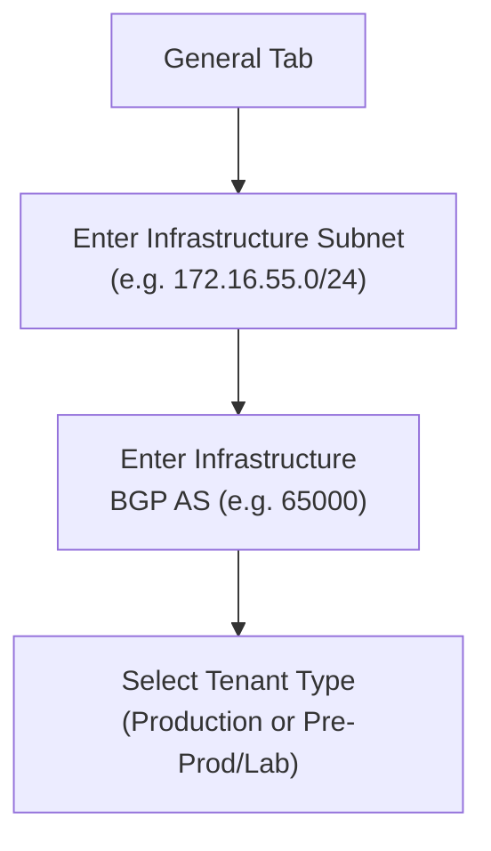

# Chapter 28 — Configuring the Service Infrastructure

The **service infrastructure** is the internal routing fabric that Prisma Access uses to interconnect its own components (SPNs, CANs, Connectors). Configuring it correctly is a one-time foundational step — changing the infrastructure subnet after deployment requires a maintenance window coordinated with PaloAlto's SRE team.

---

## Infrastructure Settings Overview

| Setting | Purpose | Notes |
|---|---|---|
| **Infrastructure Subnet** | Internal IP space for Prisma Access fabric routing | /24 minimum; RFC 1918 preferred |
| **Infrastructure BGP AS** | AS number for Prisma Access internal BGP | RFC 6996 private AS (64512–65534) |
| **Internal Domain List** | DNS servers and domain names for private FQDN resolution | Enables Prisma Access to resolve corporate FQDNs |
| **Logging (Strata Logging Service)** | Log storage region and tenant association | Was "Cortex Data Lake" in older UI |
| **Advanced Settings** | Routing preferences, symmetric path options, HIP redistribution | Optional — see Chapter 13 for routing modes |

---

## Infrastructure Subnet Sizing

| Deployment Scale | Users / Sites | Recommended Subnet |
|---|---|---|
| Small | < 2,500 users / < 50 sites | /24 |
| Medium | < 5,000 users / < 100 sites | /23 |
| Large | More than above | Contact PaloAlto for sizing |

**Constraints:**
- Must be **RFC 1918** (10.0.0.0/8, 172.16.0.0/12, 192.168.0.0/16) — public IPs supported but not recommended
- Must **not** use `169.254.0.0/16` (APIPA) or `100.64.0.0/10` (CGNAT — reserved internally by Prisma Access)
- Must **not** overlap with: corporate DC subnets, mobile user IP pools, remote network subnets, or Service Connection subnets

> ⚠️ **Changing the infrastructure subnet after deployment requires scheduling a maintenance window with PaloAlto's Site Reliability Engineering team. Unscheduled changes cause service outages and inconsistent behaviour.**

---

## Configuration — Strata Cloud Manager

**Navigation:**
`Configuration > NGFW and Prisma Access > [Configuration Scope] > Prisma Access Infrastructure > Infrastructure Settings`

Steps:
1. Enter the **Infrastructure Subnet** (e.g. `172.16.55.0/24`)
2. Enter the **Infrastructure BGP AS** (optional — e.g. `65000`)
3. Add **Internal Domain Names** and their DNS servers under the Internal Domain List tab
4. Configure the **Egress IP API Key** if you need source IP allowlisting
5. Enable **Pre-production / Lab** if this is a non-production tenant
6. Push the configuration

---

## Configuration — Panorama Managed

**Navigation:**
`Panorama > Cloud Services > Configuration > Service Setup > gear icon > Edit Settings`

### General Tab

### Internal Domain List Tab

- Click **+** to add entries
- For each entry: add **Domain Name** (e.g. `corp.example.com`), **Primary DNS**, and **Secondary DNS** server
- Prisma Access uses these servers to resolve FQDNs in the listed domains — traffic to internal apps routes through the correct SC

> 📷 [PaloAlto screenshot — Service Setup General and Internal DNS tabs](https://docs.paloaltonetworks.com/prisma-access/administration/prisma-access-setup/configure-the-prisma-access-service-infrastructure)

### Strata Logging Service Tab

- Select the **Logging Service Theater** (region) for log forwarding
- This must match the region selected during activation

### Miscellaneous Tab

Optional settings:
- **Source NAT** for mobile user traffic through service connections
- **Tunnel monitoring** defaults

### Advanced Settings Tab (Optional)

- **Routing preferences** for service connections (see Chapter 13 — Default/Hot Potato routing)
- **Symmetric network path** enforcement options
- **HIP redistribution** for device posture sharing across SCs

> 📷 [PaloAlto screenshot — Service Setup Advanced Settings](https://docs.paloaltonetworks.com/prisma-access/administration/prisma-access-setup/configure-the-prisma-access-service-infrastructure)

---

## Commit & Push (Panorama)

After completing all tabs, the configuration must be pushed to Prisma Access:

1. `Commit > Commit and Push`
2. **Edit Selections** in the Push Scope
3. Select **Prisma Access**, then select **Service Setup**
4. Click **OK** to save the Push Scope
5. Click **Commit and Push**

> 📷 [PaloAlto screenshot — Commit and Push workflow for service setup](https://docs.paloaltonetworks.com/prisma-access/administration/prisma-access-setup/configure-the-prisma-access-service-infrastructure)

### Verify Logging Service Connectivity

After the commit completes:

`Panorama > Cloud Services > Status > Status > Strata Logging Service`

Confirm **Status = OK**. If not, check the logging region matches the activation region and re-verify account credentials.

---

## Key Takeaways

- Infrastructure subnet: /24 minimum, RFC 1918, never overlap with any other subnet in the deployment
- Changing the subnet post-deployment requires SRE-coordinated maintenance — plan carefully before first commit
- Internal Domain List tells Prisma Access which DNS servers to use for private app FQDN resolution
- Always verify Strata Logging Service status after the initial infrastructure push

---

*Previous: [Chapter 27 — Integrating Panorama with Prisma Access](./ch27-integrating-panorama-with-prisma-access.md)* · *Next: [Chapter 29 — IPSec Tunnel Configuration for Service Connections](./ch29-ipsec-tunnel-configuration.md)*
