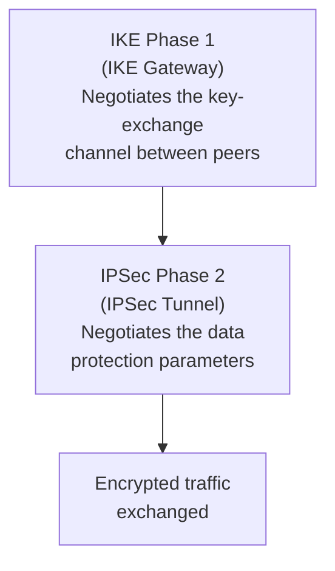

# Chapter 29 — IPSec Tunnel Configuration for Service Connections

Every Service Connection requires an IPSec tunnel between Prisma Access and the corporate CPE. This chapter covers IKE Phase 1 and Phase 2 configuration, the predefined templates for third-party devices, and the critical settings that must match on both sides.

---

## IPSec Tunnel Structure

A Service Connection IPSec tunnel has two phases:

Both phases must have **identical settings on both sides** (Prisma Access and the CPE). A mismatch in any parameter causes tunnel negotiation failure.

---

## IKE Phase 1 — IKE Gateway Parameters

**Navigation (Panorama):**
`Network > IPSec Tunnels > Add`

**Navigation (Strata Cloud Manager):**
Configured inline as part of Service Connection creation — no separate IPSec Tunnels menu. See the "Configuring the IPSec Tunnel (Strata Cloud Manager)" section below.

| Parameter | Recommended | Notes |
|---|---|---|
| **IKE Version** | IKEv2 | IKEv1 supported but deprecated |
| **Encryption** | AES-256-GCM or AES-256-CBC | AES-GCM requires "non-auth" authentication |
| **Authentication** | SHA-256 (minimum) | SHA-384 or SHA-512 preferred; avoid SHA-1, MD5 |
| **DH Group** | Group 14 (2048-bit) or higher | Groups 19/20 (ECC) for strongest security |
| **Key Lifetime** | 8 hours (default) | Range: 3 minutes to 365 days |

**DH Group reference:**

| Group | Bit Length | Type | Availability |
|---|---|---|---|
| Group 2 | 1024-bit | MODP | All versions (avoid — weak) |
| Group 5 | 1536-bit | MODP | All versions |
| Group 14 | 2048-bit | MODP | All versions (minimum recommended) |
| Group 19 | 256-bit | ECC | All versions |
| Group 20 | 384-bit | ECC | All versions |
| Groups 15, 16, 21 | — | MODP/ECC | PAN-OS 10.2.0+, IKEv2 only |

---

## IPSec Phase 2 — Tunnel Parameters

| Parameter | Recommended | Notes |
|---|---|---|
| **Protocol** | ESP | AH provides auth only, no encryption |
| **Encryption** | AES-256-GCM or AES-256-CBC | AES-GCM preferred for performance |
| **Authentication** | SHA-256 (minimum) | "non-auth" with AES-GCM; avoid SHA-1, MD5 |
| **PFS (DH Group)** | Group 14 or higher | **Must match CPE** — mismatch causes tunnel failure at first rekey |
| **Key Lifetime** | 1 hour (default) | Shorter lifetime = more frequent rekey = stronger security |

> ⚠️ **PFS mismatch is the most common cause of tunnel failure at rekey.** The tunnel may establish successfully but fail when the first IPSec SA expires and PFS is renegotiated. Always confirm PFS settings match on both sides.

> 📷 [PaloAlto screenshot — IPSec tunnel configuration in Panorama](https://docs.paloaltonetworks.com/network-security/ipsec-vpn/administration/set-up-site-to-site-vpn/define-cryptographic-profiles/define-ipsec-crypto-profiles)

---

## Configuring the IPSec Tunnel (Panorama)

**Step 1 — Create the IPSec Tunnel:**

`Network > IPSec Tunnels > Add`

| Field | Value |
|---|---|
| **Name** | e.g. `IPSec-SC-To-DC` |
| **IKE Gateway** | Select or create IKE gateway (e.g. `SC-IKE-GW`) |
| **IPSec Crypto Profile** | Select or create Phase 2 profile |
| **Tunnel Interface** | Pre-configured tunnel interface |

**Step 2 — IKE Gateway settings:**

- **Peer IP Address** — public IP of the corporate CPE
- **Pre-Shared Key** — must match the CPE configuration exactly
- **IKE Crypto Profile** — Phase 1 parameters

**Step 3 — IPSec Crypto Profile:**

- **Protocol** — ESP
- **Encryption/Authentication** — as per Phase 2 table above
- **DH Group (PFS)** — must match CPE

> 📷 [PaloAlto screenshot — IPSec tunnel parameters configuration](https://docs.paloaltonetworks.com/prisma-access/administration/prisma-access-service-connections/configure-a-service-connection)

---

## Configuring the IPSec Tunnel (Strata Cloud Manager)

**Navigation:**
`Configuration > NGFW and Prisma Access > [Configuration Scope] > Prisma Access > Service Connections > Add Service Connection`

Unlike Panorama, SCM has no separate `Network > IPSec Tunnels` menu. The IKE Gateway and IPSec Tunnel are configured **inline**, as part of creating the Service Connection itself — this is a structural difference, not just a different menu path.

**Steps (inline within Service Connection creation):**

1. If a primary (or secondary) IPSec Tunnel has not yet been set up for this Service Connection, click **Set Up** and configure it as follows
2. Select the **Branch Device Type** — the IPSec/SD-WAN device or firewall platform at the HQ/data centre end of the tunnel. Prisma Access automatically applies a default IKE Crypto Profile based on the selected type — this is the SCM equivalent of the "Predefined IPSec Templates for Third-Party Devices" section below; the two are cross-referenced rather than duplicated here
3. Set the **Branch Device IP Address** to **Static** or **Dynamic**
   - If **Dynamic**, also configure an **IKE ID** — either **IKE Local Identification** (for the HQ/DC device) or **IKE Peer Identification** (for Prisma Access)
4. To customise crypto settings instead of accepting the Branch Device Type default, use **IKE Advanced Options** to add a custom IKE Crypto Profile and **IPSec Advanced Options** to add a custom IPSec Crypto Profile — parameters follow the same tables above

> ⚠️ **Behavioural difference from Panorama, not just a UI difference:** for Prisma Access managed by Strata Cloud Manager, **"Withdraw Static Routes if Service Connection or Remote Network IPSec tunnel is down" is enabled by default.** Static routes are automatically withdrawn if the primary tunnel fails with no secondary configured, or if both primary and secondary tunnels are down. Confirm this matches your routing failover expectations before go-live — Panorama-managed deployments do not enable this by default.

---

## Predefined IPSec Templates for Third-Party Devices

Prisma Access provides pre-configured IPSec and IKE templates for common third-party IPSec and SD-WAN devices. These eliminate the need to manually match crypto parameters.

| Template Type | Purpose |
|---|---|
| **Predefined IPSec Tunnels** | Pre-configured tunnel objects for common device types |
| **Predefined IKE Gateways** | Pre-configured IKE gateway objects with vendor-compatible settings |
| **Predefined IPSec Crypto Profiles** | Phase 2 profiles matched to third-party vendor defaults |

**Using predefined templates:**

1. Go to the predefined template for the target device type
2. Customise any site-specific values (peer IP, pre-shared key)
3. Reference the template in the Service Connection configuration

> 📷 [PaloAlto screenshot — Predefined IPSec tunnel and IKE gateway templates](https://docs.paloaltonetworks.com/prisma-access/administration/prisma-access-service-connections)

Predefined templates are available for popular SD-WAN vendors (e.g. Cisco, Viptela, VMware SD-WAN, Palo Alto Prisma SD-WAN) and CPE firewall platforms.

> In Strata Cloud Manager, this same concept is surfaced as the **Branch Device Type** field during Service Connection creation — see the "Configuring the IPSec Tunnel (Strata Cloud Manager)" section above.

---

## Primary and Secondary Tunnels

| State | Behaviour |
|---|---|
| Both tunnels up | Primary tunnel carries all traffic |
| Primary fails | Automatic failover to secondary tunnel |
| Primary recovers | Automatic fallback to primary |

- First configured tunnel = **primary**
- Second tunnel (if added) = **secondary / backup**
- No manual intervention required for failover or fallback

---

## Key Takeaways

- IKE Phase 1 negotiates the key-exchange channel; IPSec Phase 2 negotiates data encryption — both must match the CPE exactly
- Minimum recommended: AES-256-CBC, SHA-256, DH Group 14 for both phases
- AES-256-GCM is preferred for performance — requires "non-auth" authentication setting
- PFS DH group mismatch is silent at tunnel setup but causes failure at the first rekey — always verify
- Use predefined templates for third-party and SD-WAN devices to avoid manual parameter matching
- In Strata Cloud Manager, the tunnel is configured inline during Service Connection creation (no separate IPSec Tunnels menu); Branch Device Type supplies the default crypto profile, matching Panorama's predefined templates
- SCM-managed deployments enable "Withdraw Static Routes if Service Connection or Remote Network IPSec tunnel is down" by default — a real behavioural difference from Panorama, not just a UI one

---

*Previous: [Chapter 28 — Configuring the Service Infrastructure](./ch28-configuring-service-infrastructure.md)* · *Next: [Chapter 30 — Service Connection with Static Routes](./ch30-service-connection-static-routes.md)*
