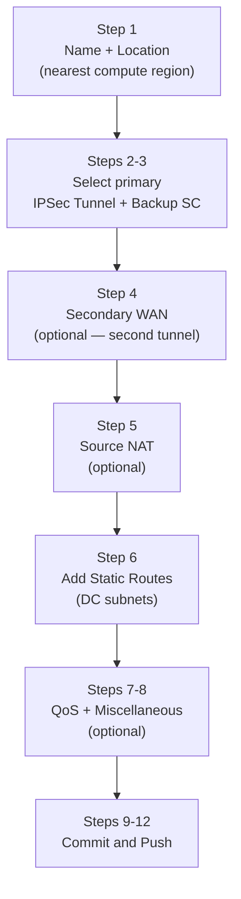

# Chapter 30 — Configure Service Connection — Static Routes

A **Service Connection with static routes** is the simpler of the two routing options — you manually declare which DC subnets are reachable through each SC, and Prisma Access installs those as static entries in its routing table. No BGP peering with the CPE is required.

---

## When to Use Static Routes

| Scenario | Use Static Routes |
|---|---|
| Simple DC topology — a few stable subnets | Yes |
| CPE does not support BGP | Yes |
| Subnet prefixes are stable and change infrequently | Yes |
| Many subnets that change dynamically | Use BGP (Chapter 31) |
| Need full subnet summarisation control from CPE | Use BGP |

---

## Configuration Steps (Panorama)

**Navigation:**
`Panorama > Cloud Services > Configuration > Service Connection > Add`

---

### Step 1 — Name and Location

| Field | Notes |
|---|---|
| **Name** | Descriptive name for the SC (e.g. `SC-To-US-DC`) |
| **Location** | Select the Prisma Access compute location nearest to the CPE site (e.g. `US Northwest`) |

> 📷 [PaloAlto screenshot — Service Connection name and location](https://docs.paloaltonetworks.com/prisma-access/administration/prisma-access-service-connections/configure-a-service-connection)

---

### Steps 2–3 — IPSec Tunnel and Backup SC

- **IPSec Tunnel** — select or create the primary IPSec tunnel (configured in Chapter 29)
- **Backup SC** — optionally designate another Service Connection as the backup (used for BGP MED failover — see Chapter 8)

---

### Step 4 — Secondary WAN (Optional)

If the CPE has two WAN links, enable **Secondary WAN** and select or create a second IPSec tunnel:
- Provides link-level redundancy at the same SC
- Both tunnels terminate at the same CPE — different from a Backup SC which terminates at a different site

---

### Step 5 — Source NAT (Optional)

Three source NAT options are available:

| NAT Option | What Gets NATted |
|---|---|
| Mobile User GlobalProtect IP pool | User endpoint IPs replaced with SC infrastructure IP |
| Infrastructure subnet addresses | Internal Prisma Access IPs replaced before entering DC |
| Both | Combined — all Prisma Access-sourced traffic appears as the SC IP |

Enable source NAT when the DC firewall does not have routes back to mobile user IP pools or the Prisma Access infrastructure subnet.

---

### Step 6 — Add Static Routes

Click **Add** to enter each DC subnet that should be reachable through this Service Connection:

| Example | Value |
|---|---|
| DC app server subnet | `10.10.10.0/24` |
| DC management subnet | `10.10.20.0/24` |
| AD / DNS subnet | `10.10.30.0/24` |

- Routes are advertised to all MU-SPNs and RN-SPNs — any Prisma Access endpoint can reach these subnets
- Add all subnets that users or branches need to reach at this DC site

> 📷 [PaloAlto screenshot — Static routes configuration in Service Connection](https://docs.paloaltonetworks.com/prisma-access/administration/prisma-access-service-connections/configure-a-service-connection)

---

### Steps 7–8 — QoS and Miscellaneous (Optional)

**QoS:**
- Enable Quality of Service for the SC and select or create a QoS profile
- Recommended when the SC is shared between latency-sensitive (voice/video) and bulk traffic

**Miscellaneous:**
- Tunnel monitoring: configure a destination IP inside the DC for ICMP keepalives
- Monitoring ensures Prisma Access detects tunnel failure even when no user traffic is flowing
- **Disable Traffic Logging on Service Connections** — turns off logging for this SC's traffic. Relevant when the majority of this SC's traffic flows are asymmetric, since logging asymmetric flows consumes Strata Logging Service storage without providing a complete session record

---

### Steps 9–12 — Commit and Push

1. `Commit > Commit and Push`
2. **Edit Selections** in the Push Scope
3. Select **Prisma Access**, then select **Service Setup**
4. Click **OK**, then **Commit and Push**

---

## Configuration Steps (Strata Cloud Manager)

**Navigation:**
`Configuration > NGFW and Prisma Access > Configuration Scope > Prisma Access > Service Connections > Add Service Connection`

SCM presents the same underlying fields as Panorama in a single wizard-style form rather than separate tabs. The concepts from Steps 1–8 above carry over directly; the differences worth calling out are below.

**Name and Location:**
- **Name** — a descriptive name for the Service Connection, same as Panorama
- **Location** — the Prisma Access Location where your HQ or data centre is located (equivalent to Panorama's compute location field)

**Source NAT:**
SCM splits source NAT into two named options rather than Panorama's single three-option table:
- **Data Traffic source NAT** — NATs Mobile Users—GlobalProtect IP pool addresses
- **Infrastructure Traffic source NAT** — NATs addresses in the Infrastructure subnet
- Enabling both together is equivalent to Panorama's "Both" option
- **Source NAT Pool** — the NAT pool must be a private (RFC 1918) subnet sized between **/25 and /32**

The underlying concept is identical to Panorama's Step 5 — only the field split and the pool-sizing constraint are SCM-specific additions.

**Static Routes:**
Under **Configure static routes**, add the IP subnets or addresses at the HQ/data centre that should be reachable through this Service Connection — same purpose as Panorama's Step 6. If the DC-side subnets change later, they must be updated manually here; SCM does not auto-discover route changes.

**QoS:**
An optional **Configure QoS** step lets you add a QoS Profile with **Egress Max** and **Egress Guaranteed** throughput values (Mbps), supporting up to **eight QoS classes**. Conceptually the same option as Panorama's Step 7, just reached through the same wizard rather than a separate tab.

**Backbone Routing (Advanced Settings, SCM-specific):**
SCM exposes a **Backbone Routing** setting under Advanced Settings that Panorama does not surface as a per-SC option:
- **Disable asymmetric routing for Service Connections** — requires symmetric return paths
- **Allow asymmetric routing for Service Connections**
- **Allow asymmetric routing and load sharing across Service Connections** — default

This controls whether Prisma Access requires a symmetric network path for DC return traffic — the same underlying routing behaviour covered in [Chapter 13 — Default Routing (Cold Potato)](../part3/ch13-default-routing-and-backbone.md) and [Chapter 14 — Hot Potato Routing](../part3/ch14-hot-potato-routing.md). See those chapters for the routing implications; this section only documents where the toggle lives in SCM.

**Withdraw Static Routes on tunnel-down:**
SCM-managed deployments enable "Withdraw Static Routes if Service Connection or Remote Network IPSec tunnel is down" by default — see Chapter 29's "Configuring the IPSec Tunnel (Strata Cloud Manager)" section for the full explanation; it applies to Service Connections generally, not just the IPSec tunnel itself.

**Push:**
Commit is replaced with **Push Config**. After pushing, the **Config Status** column in the Service Connections list (under Configuration, not the Insights dashboard) changes to **In sync** — see the "Verifying the Service Connection" section below.

---

## Verifying the Service Connection

### Panorama

After the push completes:

`Panorama > Cloud Services > Status`

- Confirm **Tunnel Status = Up** for the SC
- Test connectivity: generate traffic from a mobile user or branch to a static-routed subnet

### Strata Cloud Manager

`Insights > Prisma SASE > Data Centers > Service Connections`

This is a monitoring/health dashboard rather than a config-adjacent status page — it shows trends and bandwidth consumption alongside live status. Key fields per site:

| Field | Values / Meaning |
|---|---|
| **Site Status** | Up / Down / Warning / Unknown |
| **Transport Type** | IPSec or Colo-Connect |
| **Remote IP** | The CPE's remote IP address |
| **BGP Status** | Up / Down / Unknown |
| **Tunnels Status** | Count of tunnels at the site and how many are up |
| **Service Connection Endpoint IP** | The SC's endpoint IP address |
| **Service Status** | Up / Down / Unknown — status of the instance/firewall the site connects to |

Also shows Average and Peak Bandwidth Consumption (Kbps) per site.

> ℹ️ **Config Status (In sync / Out of sync)** is a separate, configuration-side indicator — it appears in the **Service Connections list under Configuration**, not in this Insights dashboard. It shows whether a local change has been pushed yet: **In sync** once the push completes, **Out of sync** if there are unpushed changes. There is no directly equivalent single-glance indicator in Panorama's status page.

Test connectivity the same way as Panorama — generate traffic from a mobile user or branch to a static-routed subnet.

---

## Key Takeaways

- Static routes are the simpler SC routing option — manually declare DC subnets per SC
- Location selection determines which Prisma Access compute node terminates the SC tunnel — choose closest to the CPE
- Source NAT eliminates the need for back-routes to mobile user or infrastructure IPs at the DC
- Add a monitoring IP so Prisma Access can detect tunnel failure without waiting for user traffic
- Commit and Push scope must include **Service Setup** — not just a standard Panorama commit
- Disable Traffic Logging on Service Connections whose traffic is mostly asymmetric, to avoid burning Strata Logging Service storage on incomplete session records
- SCM's Backbone Routing setting controls symmetric-path enforcement for DC return traffic (default: asymmetric routing + load sharing allowed) — see Chapters 13–14 for the routing implications
- SCM verification is a health/trends dashboard (Insights), not a status page — Config Status (In sync/Out of sync) lives separately, under Configuration

---

*Previous: [Chapter 29 — IPSec Tunnel Configuration](./ch29-ipsec-tunnel-configuration.md)* · *Next: [Chapter 31 — Service Connection with BGP](./ch31-service-connection-bgp.md)*
