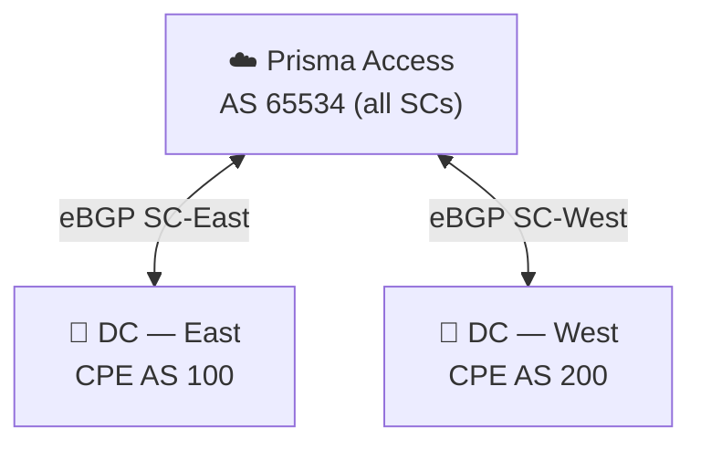

# Chapter 31 — Configure Service Connection — BGP

A **Service Connection with BGP** enables dynamic route exchange between Prisma Access and the corporate CPE. Instead of manually declaring subnets as static routes, the CPE advertises them via BGP and Prisma Access learns them automatically — useful for large or frequently changing DC topologies.

---

## When to Use BGP

| Scenario | Use BGP |
|---|---|
| Many DC subnets that change over time | Yes |
| CPE supports eBGP peering | Yes |
| Need automatic failover between primary and backup SC | Yes |
| Route summarisation at the CPE (see note below) | With Hot Potato routing (Chapter 14) |
| Simple topology with a few stable subnets | Use Static Routes (Chapter 30) |
| CPE does not support BGP | Use Static Routes |

> ⚠️ If the CPE summarises routes before advertising them to Prisma Access, use **Hot Potato routing** (Chapter 14) — default routing loses path granularity when routes are summarised.

---

## BGP in the Prisma Access Model

- Prisma Access uses **AS 65534** for all Service Connections (fixed — not configurable)
- The CPE uses its own private AS (RFC 6996: 64512–65534)
- **Outbound:** Prisma Access advertises its own MED values to the CPE to distinguish active from backup SCs — MED 0 for the active SC, MED 500 for the backup SC (see Chapter 8). This is Prisma Access's own outbound advertisement, used to influence the CPE's route selection back toward Prisma Access.
- **Inbound:** Prisma Access does **not** honor MED attributes the CPE advertises inbound — MED values sent by the CPE have no effect on how Prisma Access selects between its own SCs or BGP peers. The two directions are independent; only the outbound MED 0/500 behavior above is something Prisma Access itself controls.

---

## Configuration Steps (Panorama)

**Navigation:**
`Panorama > Cloud Services > Configuration > Service Connection > Add`

Steps 1–8 are identical to the static route workflow (Chapter 30). Step 9 adds BGP:

---

### Step 1–8 — Same as Static Routes

Complete the same fields:
- Name and Location
- Primary IPSec Tunnel + Backup SC selection
- Secondary WAN (optional)
- Source NAT (optional)
- **Static Routes** — leave empty if using BGP only, or add both for hybrid routing

---

### Step 9 — Enable BGP

Toggle **Enable BGP** on the Service Connection configuration screen.

BGP peer settings:

| Field | Notes |
|---|---|
| **Peer IP Address** | IP of the CPE's BGP-peering interface (inside the tunnel) — documented as the Router ID of the eBGP router at the HQ/DC |
| **Peer AS** | CPE's BGP AS number (e.g. `65100`) — must be RFC 6996-compliant private AS |
| **Local IP** | Prisma Access SC-CAN IP (auto-populated from tunnel config) |
| **Local AS** | Always `65534` (Prisma Access internal — not editable) |
| **Secret / Password** | Optional BGP MD5 authentication — must match CPE |
| **MRAI** (Minimum Route Advertisement Interval) | Default **30 seconds**, configurable range **1–600 seconds** — rate-limits how often a route advertisement is sent per destination, affecting convergence speed. Applies to both Panorama-managed and SCM-managed Service Connections. |

> 📷 [PaloAlto screenshot — Service Connection BGP configuration](https://docs.paloaltonetworks.com/prisma-access/administration/prisma-access-service-connections/configure-a-service-connection)

---

### Steps 10–11 — QoS and Miscellaneous (Optional)

Same as static routes — see Chapter 30.

---

### Steps 12–16 — Commit and Push

1. `Commit > Commit and Push`
2. **Edit Selections** in Push Scope
3. Select **Prisma Access** → **Service Setup**
4. Click **OK** → **Commit and Push**

---

## Configuration Steps (Strata Cloud Manager)

**Navigation:**
`Configuration > NGFW and Prisma Access > Configuration Scope > Prisma Access > Service Connections > Add Service Connection`

Same base flow as Chapter 30 — Name, Location, IPSec Tunnel, Source NAT, Static Routes, QoS, and Advanced Settings are all configured inline in the same wizard. BGP is enabled as part of that same Service Connection creation flow, not a separate menu item.

**BGP peer fields:** the same fields apply as the Panorama table above — Peer IP Address, Peer AS, Local IP Address, Secret, and MRAI. Two small differences worth knowing:
- **Local IP Address** in SCM is documented as optional, required only if the peer device mandates it — slightly more explicit than Panorama's "auto-populated" behavior, but functionally the same field
- SCM asks for the Secret twice — **Secret** and **Confirm Secret** — as a re-entry check; Panorama does not have a separate confirmation field

Beyond those two points, this is the same fields in a different wizard, not a redesigned workflow — see the Panorama table above for the full field list rather than repeating it here.

---

## Advanced: BGP Filtering (Panorama and Strata Cloud Manager)

Prisma Access supports BGP Filter Groups to control which prefixes are permitted or denied on inbound and outbound BGP advertisements for a Service Connection. This is available on **both** management platforms, with different navigation:

- **Strata Cloud Manager:** `Configuration > NGFW and Prisma Access > Configuration Scope > Prisma Access > Objects > BGP Filter > BGP Filters`
- **Panorama:** `Panorama > Cloud Services > Configuration > Service Connection tab > BGP Filtering section > Edit`

Filter rules support **IPv4 or IPv6**, **Permit or Deny** actions, and prefix matching (with an optional **Prefix Exact Match** to compare both prefix and prefix length). Rules can also apply the well-known BGP communities **No-Export** (advertise only to iBGP neighbors, not outside the AS) and **No-Advertise** (accept the route but don't re-advertise it to any neighbor).

Each Service Connection can attach one **Inbound Filter Group** and one **Outbound Filter Group**, each built from one or more BGP filter rules. This is a genuine configuration capability, not just a menu difference — readers who need to actually build filter rules should follow the platform-specific navigation above; this chapter only summarises what the feature does.

---

## What BGP Advertises and Learns

| Direction | What Is Exchanged |
|---|---|
| **Prisma Access → CPE** | Mobile user IP pools (/24 blocks), infrastructure subnet prefixes |
| **CPE → Prisma Access** | DC application subnets, corporate network prefixes |

Prisma Access splits mobile user subnets into **/24 blocks** before advertising them to the CPE — this is the granularity required for symmetric routing (see Chapter 13).

---

## Routing Preferences with BGP

Two routing modes apply when multiple SCs are in use:

| Mode | Behaviour with BGP |
|---|---|
| **Default (cold potato)** | Prisma Access uses standard BGP best-path; CPE drives return routing via its advertised AS-PATH |
| **Hot potato** | Prisma Access prepends AS-PATH on outbound advertisements to steer CPE return traffic to the nearest exit SC (see Chapter 14) |

The routing preference is set globally in `Service Setup > Advanced Settings`, not per SC.

---

## Static Routes + BGP Combined

Both can be enabled simultaneously on the same SC:

- Static routes provide reachability for subnets the CPE does **not** advertise via BGP (e.g. management subnets)
- BGP handles dynamic subnet distribution for application subnets
- There is no conflict — Prisma Access installs both route sources

---

## Verifying BGP

### Panorama

After the push completes, verify BGP peering status:

`Panorama > Cloud Services > Status`

- Confirm **Tunnel Status = Up** and **BGP Status = Established**
- If BGP stays in **Active** or **Connect** state, verify: peer IP, peer AS, and pre-shared key match on both sides

### Strata Cloud Manager

Use the same Insights dashboard covered in Chapter 30 (`Insights > Prisma SASE > Data Centers > Service Connections`) — see that chapter for the full field breakdown. **BGP Status** does appear in that view, but the terminology does **not** map 1:1 to Panorama's states above: SCM's Insights dashboard reports BGP Status as **Up / Down / Unknown**, not the **Established / Active / Connect** session states Panorama shows. Both describe the same underlying BGP session health, just at different granularity — treat "Down" or "Unknown" in SCM as the signal to go check peer IP, peer AS, and pre-shared key, the same triggers Panorama's "Active"/"Connect" states indicate above.

---

## Key Takeaways

- Prisma Access always uses AS 65534 for all Service Connections — the CPE uses its own private AS
- BGP peer IP, peer AS, and optional MD5 password must match the CPE configuration exactly
- Mobile user subnets are advertised as /24 blocks — required for symmetric routing in default mode
- Use Hot Potato routing when the CPE summarises routes before advertising to Prisma Access
- Static routes and BGP can coexist on the same SC for hybrid scenarios
- MED is directional: Prisma Access advertises MED 0/500 outbound to distinguish active/backup SCs, but does not honor MED values the CPE advertises inbound — the two are independent
- MRAI (default 30s, range 1–600s) rate-limits route advertisements and applies to both Panorama and SCM
- BGP Filtering (Inbound/Outbound Filter Groups, IPv4/IPv6, permit/deny, No-Export/No-Advertise) is available on both Panorama and SCM, via different navigation
- SCM's Insights BGP Status (Up/Down/Unknown) does not use the same terminology as Panorama's (Established/Active/Connect) — same underlying health signal, different labels

---

*Previous: [Chapter 30 — Service Connection with Static Routes](./ch30-service-connection-static-routes.md)* · *Next: [Chapter 32 — Templates & Template Stacks](../part6/ch32-templates-and-template-stacks.md)*
