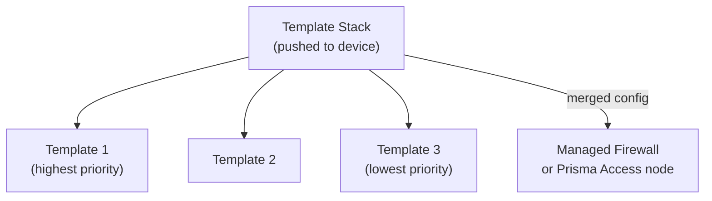
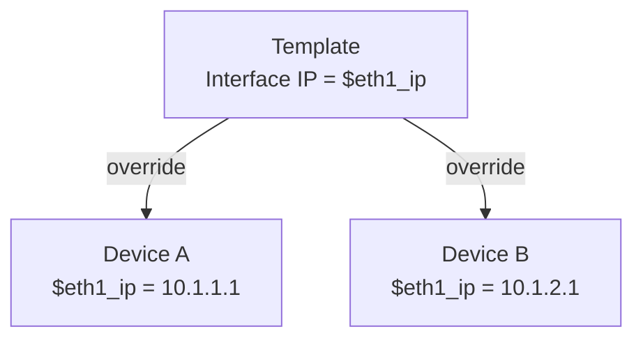

# Chapter 32 — Templates & Template Stacks

**Templates** are Panorama's mechanism for centrally managing firewall network and device settings. Instead of configuring each managed device individually, you define settings once in a template and push them to any number of devices. Prisma Access relies on a set of **predefined templates** that are created automatically at onboarding — understanding how templates work is prerequisite knowledge for managing any Prisma Access component through Panorama.

---

## What Templates Configure

Templates cover the **Network** and **Device** tabs in Panorama — the infrastructure-level settings that make a firewall operational on the network:

| Tab | Examples |
|---|---|
| **Network** | Interfaces, zones, routing (static routes, BGP), VPN (IKE/IPSec tunnels), virtual routers, VLAN, QoS |
| **Device** | System settings, management interface, DNS/NTP servers, logging/syslog profiles, certificate profiles |

Templates do **not** cover security policies or policy objects — those belong in Device Groups (Chapter 33).

---

## Templates vs Template Stacks

| Concept | Description |
|---|---|
| **Template** | A single configuration container (Network + Device tab settings) |
| **Template Stack** | An ordered collection of templates merged together before being pushed to a device |
| **Priority** | Templates higher in the stack take precedence over lower ones for any conflicting settings |

**Scale limits:**
- Up to **1,024 template stacks** per Panorama instance
- Up to **8 templates** per template stack

---

## Variable Overrides

Templates support **variables** — placeholders for values that differ per device (e.g. interface IP address, hostname). Variables are defined once in the template and overridden per device or per stack, allowing a single template to serve devices with different IP configurations.

This avoids duplicating templates just to accommodate per-device IP differences.

---

## Prisma Access Predefined Templates

When Prisma Access is activated and onboarded, Panorama automatically creates a set of predefined templates and stacks — one pair per purchased component:

| Template | Template Stack | Component |
|---|---|---|
| `Mobile_User_Template` | `Mobile_User_Template_Stack` | GlobalProtect mobile users |
| `Remote_Network_Template` | `Remote_Network_Template_Stack` | Branch / remote network IPSec |
| `Service_Conn_Template` | `Service_Conn_Template_Stack` | Service Connections to DC |
| `Explicit_Proxy_Template` | `Explicit_Proxy_Template_Stack` | Explicit Proxy (Cloud SWG) |

> 📷 [PaloAlto diagram — Prisma Access predefined templates and template stacks](https://docs.paloaltonetworks.com/prisma-access/administration/prisma-access-setup/predefined-templates-onboard-a-service-connection-or-remote-network)

**Rules for predefined templates:**
- Do **not** modify or delete the predefined templates — Prisma Access manages them
- Add custom settings by creating your **own** template and inserting it into the predefined stack (below the predefined template)
- The predefined templates include the IKE gateways, IPSec tunnels, and crypto profiles needed for each component

---

## How This Maps in Strata Cloud Manager

SCM does not have Templates, Template Stacks, or Device Groups as separate concepts — "create a Template Stack" isn't a task an SCM user ever performs, so there's no step-by-step SCM equivalent to walk through here. Instead, SCM organises configuration around a different set of building blocks:

**Folders replace both Templates and Device Groups.** A Folder holds network configuration *and* security policy together in one place — there is no split between "Network/Device settings live in Templates" and "policy lives in Device Groups" the way Panorama works. Folder hierarchies nest up to **4 levels below the root `All Firewalls` folder**.

**Snippets are the closest analog to a Template** — reusable blocks of configuration attached to a folder, deployment, or device. The precedence model is genuinely different from Template Stacks, not just renamed: snippets don't layer in a fixed stack order. Precedence follows **attachment order** instead — when two attached snippets set conflicting values for the same object, the value from the *first*-attached snippet wins. Don't treat a Snippet as "a Template with a new name" — how conflicts resolve is a different mechanism.

**Variables** exist in SCM too, serving the same purpose as Panorama's template variables — per-device value substitution. *(Unconfirmed: whether SCM variables can also be referenced inside security policy rules, not just network/device settings — the fetched documentation did not state this explicitly either way, so this is flagged rather than asserted.)*

**For Prisma Access specifically**, SCM provides a folder structure that — like Panorama's predefined templates — is fixed and **cannot be restructured, only extended via snippets**:

| SCM Folder | Nesting | Component(s) |
|---|---|---|
| `Prisma Access` | Root folder for all Prisma Access components | Settings common to GlobalProtect, Explicit Proxy, Remote Networks, and Service Connections |
| `Mobile Users Container` | Nested under `Prisma Access` | **GlobalProtect and Explicit Proxy together** — both share this one container |
| `Remote Networks` | Nested under `Prisma Access` | Branch / remote network sites |
| `Service Connections` | Nested under `Prisma Access` | Service Connections to DC |

This is a real structural difference from the table above, not just a naming difference: Panorama gives Explicit Proxy its own parallel `Explicit_Proxy_Template`/`Explicit_Proxy_Template_Stack` pair, sitting alongside `Mobile_User_Template`. In SCM, Explicit Proxy is **nested inside** the Mobile Users Container alongside GlobalProtect — not a sibling folder.

**Migrating from Panorama:** if moving an existing Panorama-managed deployment to SCM, Panorama Device Groups map to SCM Folders and Panorama Templates/Template Stacks map to SCM Snippets, via an automated, assisted migration workflow — not manual field-by-field re-entry. This chapter isn't a migration guide; see Palo Alto's migration documentation for the mechanics.

---

## Key Takeaways

- Templates configure **Network** and **Device** tabs only — security policy belongs in Device Groups
- Template Stacks layer multiple templates; higher position = higher priority; up to 8 templates per stack
- Variables allow a single template to serve devices with different interface IPs or hostnames
- Prisma Access creates 4 predefined template/stack pairs at onboarding — do not modify or delete them
- Strata Cloud Manager has no equivalent of Templates/Template Stacks/Device Groups — Folders unify network and policy config, and Snippets (attachment-order precedence, not a fixed stack) are the closest analog to a Template

---

*Previous: [Chapter 31 — Service Connection with BGP](../part5/ch31-service-connection-bgp.md)* · *Next: [Chapter 33 — Device Groups — Concepts, Components & Hierarchy](./ch33-device-groups-concepts-and-hierarchy.md)*
